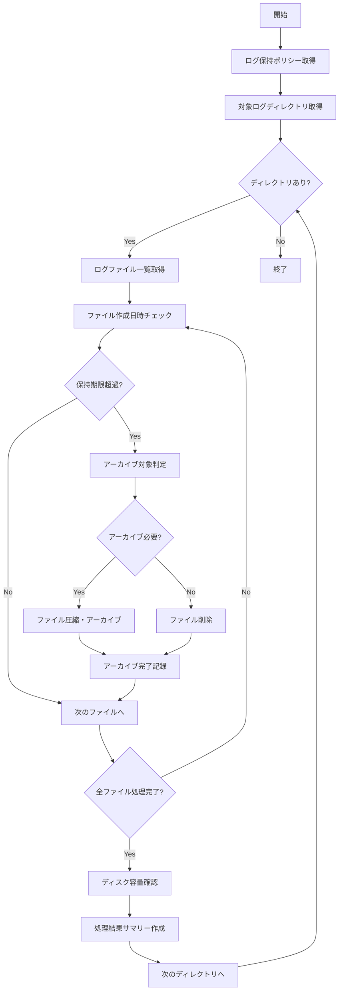

# バッチ定義書：ログクリーンアップバッチ

| 項目                | 内容                                                                                |
|---------------------|------------------------------------------------------------------------------------|
| **バッチID**        | BATCH-002                                                                          |
| **バッチ名称**      | ログクリーンアップバッチ                                                            |
| **機能カテゴリ**    | 基盤・システム管理                                                                  |
| **概要・目的**      | 古いログファイルの削除・アーカイブによりディスク容量を最適化する                    |
| **バッチ種別**      | 定期バッチ                                                                          |
| **実行スケジュール**| 日次（03:00）                                                                       |
| **入出力対象**      | ログファイル、アーカイブストレージ、ログ管理テーブル                                |
| **優先度**          | 高                                                                                  |
| **備考**            | マルチテナント対応、ログ保持ポリシー準拠                                            |

## 1. 処理概要

ログクリーンアップバッチは、システム全体で生成される各種ログファイルを定期的に整理し、保持ポリシーに従って古いログの削除・アーカイブを実行するバッチ処理です。ディスク容量の最適化とログ管理の自動化により、システムの安定稼働を支援します。

## 2. 処理フロー



## 3. 入力データ

### 3.1 対象ログファイル

| ログ種別            | ディレクトリ                    | 保持期間 | アーカイブ |
|---------------------|--------------------------------|----------|------------|
| アプリケーションログ | /var/log/app/                  | 30日     | 90日       |
| アクセスログ        | /var/log/nginx/                | 7日      | 30日       |
| エラーログ          | /var/log/error/                | 90日     | 365日      |
| バッチ実行ログ      | /var/log/batch/                | 30日     | 90日       |
| 監査ログ            | /var/log/audit/                | 365日    | 2555日     |
| デバッグログ        | /var/log/debug/                | 3日      | なし       |
| セキュリティログ    | /var/log/security/             | 180日    | 1095日     |

### 3.2 ログ保持ポリシー設定

| 設定項目                | データ型 | デフォルト値 | 説明                                 |
|-------------------------|----------|--------------|--------------------------------------|
| retention_days          | Integer  | 30           | ログファイル保持日数                 |
| archive_days            | Integer  | 90           | アーカイブ保持日数                   |
| compression_enabled     | Boolean  | true         | 圧縮アーカイブ有効/無効              |
| compression_level       | Integer  | 6            | 圧縮レベル（1-9）                    |
| max_file_size_mb        | Integer  | 100          | 単一ファイル最大サイズ（MB）         |
| parallel_processing     | Boolean  | true         | 並列処理有効/無効                    |

## 4. 出力データ

### 4.1 ログクリーンアップ履歴テーブル（新規作成）

| フィールド名      | データ型 | 説明                                           |
|-------------------|----------|------------------------------------------------|
| cleanup_id        | String   | クリーンアップ実行ID（主キー）                 |
| execution_date    | DateTime | 実行日時                                       |
| log_type          | String   | ログ種別                                       |
| directory_path    | String   | 対象ディレクトリパス                           |
| files_processed   | Integer  | 処理対象ファイル数                             |
| files_deleted     | Integer  | 削除ファイル数                                 |
| files_archived    | Integer  | アーカイブファイル数                           |
| space_freed_mb    | Integer  | 解放ディスク容量（MB）                         |
| archive_size_mb   | Integer  | アーカイブサイズ（MB）                         |
| execution_time    | Integer  | 実行時間（秒）                                 |
| status            | String   | 実行ステータス（SUCCESS/FAILED/PARTIAL）       |
| error_message     | String   | エラーメッセージ                               |

### 4.2 アーカイブファイル管理テーブル（新規作成）

| フィールド名      | データ型 | 説明                                           |
|-------------------|----------|------------------------------------------------|
| archive_id        | String   | アーカイブID（主キー）                         |
| original_path     | String   | 元ファイルパス                                 |
| archive_path      | String   | アーカイブファイルパス                         |
| original_size_mb  | Integer  | 元ファイルサイズ（MB）                         |
| compressed_size_mb| Integer  | 圧縮後サイズ（MB）                             |
| compression_ratio | Float    | 圧縮率                                         |
| archived_at       | DateTime | アーカイブ作成日時                             |
| expires_at        | DateTime | アーカイブ有効期限                             |
| checksum          | String   | ファイルチェックサム                           |
| status            | String   | ステータス（ACTIVE/EXPIRED/DELETED）           |

### 4.3 処理結果レポート

```typescript
interface CleanupReport {
  executionId: string;
  executionDate: Date;
  summary: {
    totalDirectories: number;
    totalFilesProcessed: number;
    totalFilesDeleted: number;
    totalFilesArchived: number;
    totalSpaceFreedMB: number;
    totalArchiveSizeMB: number;
    executionTimeSeconds: number;
  };
  directoryResults: {
    path: string;
    logType: string;
    filesProcessed: number;
    filesDeleted: number;
    filesArchived: number;
    spaceFreedMB: number;
    status: string;
  }[];
  errors: {
    path: string;
    error: string;
    timestamp: Date;
  }[];
}
```

## 5. 処理仕様

### 5.1 ファイル削除処理

```typescript
async deleteLogFile(filePath: string): Promise<DeleteResult> {
  try {
    const stats = await fs.stat(filePath);
    const fileSizeMB = stats.size / (1024 * 1024);
    
    await fs.unlink(filePath);
    
    return {
      success: true,
      filePath,
      sizeMB: fileSizeMB,
      deletedAt: new Date()
    };
  } catch (error) {
    return {
      success: false,
      filePath,
      error: error.message,
      deletedAt: new Date()
    };
  }
}
```

### 5.2 ファイルアーカイブ処理

```typescript
async archiveLogFile(filePath: string, archivePath: string): Promise<ArchiveResult> {
  try {
    const stats = await fs.stat(filePath);
    const originalSizeMB = stats.size / (1024 * 1024);
    
    // ファイル圧縮
    const compressedData = await this.compressFile(filePath);
    await fs.writeFile(archivePath, compressedData);
    
    const compressedStats = await fs.stat(archivePath);
    const compressedSizeMB = compressedStats.size / (1024 * 1024);
    const compressionRatio = compressedSizeMB / originalSizeMB;
    
    // チェックサム計算
    const checksum = await this.calculateChecksum(archivePath);
    
    // 元ファイル削除
    await fs.unlink(filePath);
    
    return {
      success: true,
      originalPath: filePath,
      archivePath,
      originalSizeMB,
      compressedSizeMB,
      compressionRatio,
      checksum,
      archivedAt: new Date()
    };
  } catch (error) {
    return {
      success: false,
      originalPath: filePath,
      error: error.message,
      archivedAt: new Date()
    };
  }
}
```

### 5.3 保持期限判定

```typescript
class RetentionPolicyChecker {
  isExpired(filePath: string, retentionDays: number): boolean {
    const stats = fs.statSync(filePath);
    const fileAge = Date.now() - stats.mtime.getTime();
    const retentionPeriod = retentionDays * 24 * 60 * 60 * 1000;
    
    return fileAge > retentionPeriod;
  }
  
  shouldArchive(filePath: string, logType: string): boolean {
    const archivePolicy = this.getArchivePolicy(logType);
    if (!archivePolicy.enabled) {
      return false;
    }
    
    const stats = fs.statSync(filePath);
    const fileAge = Date.now() - stats.mtime.getTime();
    const archivePeriod = archivePolicy.archiveDays * 24 * 60 * 60 * 1000;
    
    return fileAge <= archivePeriod;
  }
  
  private getArchivePolicy(logType: string): ArchivePolicy {
    const policies = {
      'application': { enabled: true, archiveDays: 90 },
      'access': { enabled: true, archiveDays: 30 },
      'error': { enabled: true, archiveDays: 365 },
      'batch': { enabled: true, archiveDays: 90 },
      'audit': { enabled: true, archiveDays: 2555 },
      'debug': { enabled: false, archiveDays: 0 },
      'security': { enabled: true, archiveDays: 1095 }
    };
    
    return policies[logType] || { enabled: false, archiveDays: 0 };
  }
}
```

## 6. エラー処理

| エラーケース                      | 対応方法                                                                 |
|-----------------------------------|--------------------------------------------------------------------------|
| ファイル削除権限不足              | エラーログ記録、管理者通知、処理継続                                     |
| ディスク容量不足                  | アーカイブ処理一時停止、容量確保後再開                                   |
| 圧縮処理失敗                      | 非圧縮でアーカイブ、警告ログ出力                                         |
| アーカイブストレージ接続失敗      | ローカル一時保存、接続復旧後転送                                         |
| ファイルロック中                  | 一定時間待機後リトライ、最終的にスキップ                                 |

## 7. 並列処理最適化

### 7.1 ディレクトリ別並列処理

```typescript
class ParallelLogCleanup {
  async executeCleanup(): Promise<CleanupReport> {
    const directories = await this.getTargetDirectories();
    const concurrency = Math.min(directories.length, 4);
    
    const results = await Promise.allSettled(
      directories.map(dir => this.cleanupDirectory(dir))
    );
    
    return this.aggregateResults(results);
  }
  
  private async cleanupDirectory(directory: LogDirectory): Promise<DirectoryCleanupResult> {
    const files = await this.getLogFiles(directory.path);
    const batchSize = 10;
    const results: FileCleanupResult[] = [];
    
    for (let i = 0; i < files.length; i += batchSize) {
      const batch = files.slice(i, i + batchSize);
      const batchResults = await Promise.allSettled(
        batch.map(file => this.processLogFile(file, directory.policy))
      );
      
      results.push(...batchResults.map(r => 
        r.status === 'fulfilled' ? r.value : { success: false, error: r.reason }
      ));
    }
    
    return {
      directory: directory.path,
      results,
      summary: this.summarizeResults(results)
    };
  }
}
```

### 7.2 メモリ効率的な大容量ファイル処理

```typescript
class StreamingFileProcessor {
  async compressLargeFile(inputPath: string, outputPath: string): Promise<void> {
    return new Promise((resolve, reject) => {
      const readStream = fs.createReadStream(inputPath);
      const writeStream = fs.createWriteStream(outputPath);
      const gzipStream = zlib.createGzip({ level: 6 });
      
      readStream
        .pipe(gzipStream)
        .pipe(writeStream)
        .on('finish', resolve)
        .on('error', reject);
    });
  }
  
  async calculateChecksumStream(filePath: string): Promise<string> {
    return new Promise((resolve, reject) => {
      const hash = crypto.createHash('sha256');
      const stream = fs.createReadStream(filePath);
      
      stream.on('data', data => hash.update(data));
      stream.on('end', () => resolve(hash.digest('hex')));
      stream.on('error', reject);
    });
  }
}
```

## 8. 依存関係

- ファイルシステム（読み書き権限）
- アーカイブストレージ（S3、GCS等）
- 圧縮ライブラリ（zlib、gzip）
- ログ管理システム
- 監視・アラートシステム

## 9. 実行パラメータ

| パラメータ名        | 必須 | デフォルト値 | 説明                                           |
|---------------------|------|--------------|------------------------------------------------|
| --log-type          | No   | all          | 特定ログ種別のみ処理                           |
| --directory         | No   | all          | 特定ディレクトリのみ処理                       |
| --dry-run           | No   | false        | 削除・アーカイブを実行せず結果のみ表示         |
| --force-delete      | No   | false        | アーカイブ失敗時も強制削除                     |
| --compression-level | No   | 6            | 圧縮レベル（1-9）                              |
| --parallel          | No   | true         | 並列処理有効/無効                              |

## 10. 実行例

```bash
# 通常実行
npm run batch:log-cleanup

# 特定ログ種別のみ
npm run batch:log-cleanup -- --log-type=application

# 特定ディレクトリのみ
npm run batch:log-cleanup -- --directory=/var/log/nginx

# ドライラン
npm run batch:log-cleanup -- --dry-run

# 高圧縮率
npm run batch:log-cleanup -- --compression-level=9

# TypeScript直接実行
npx tsx src/batch/log-cleanup.ts
```

## 11. 運用上の注意点

- ログクリーンアップ実行前に重要なログのバックアップを確認してください。
- ディスク容量が逼迫している場合は、手動での緊急クリーンアップを検討してください。
- アーカイブファイルの整合性を定期的に検証してください。
- 法的要件や監査要件に応じて保持ポリシーを調整してください。

## 12. 監視・アラート

### 12.1 監視項目

| 監視項目            | 閾値                | アラート条件        | 対応方法             |
|---------------------|---------------------|---------------------|----------------------|
| 処理時間            | 60分                | 超過時              | 処理見直し           |
| 削除ファイル数      | 期待値±50%          | 大幅乖離時          | 設定確認             |
| エラー率            | 5%                  | 超過時              | 原因調査             |
| ディスク容量削減率  | 10%以下             | 効果不十分時        | ポリシー見直し       |

### 12.2 アラート通知

```typescript
interface CleanupAlert {
  level: 'INFO' | 'WARNING' | 'ERROR';
  message: string;
  details: {
    executionId: string;
    affectedDirectories: string[];
    errorCount: number;
    spaceFreedMB: number;
    executionTime: number;
  };
  timestamp: Date;
}
```

## 13. 改訂履歴

| 改訂日     | 改訂者 | 改訂内容                                         |
|------------|--------|--------------------------------------------------|
| 2025/05/31 | 初版   | 初版作成                                         |
