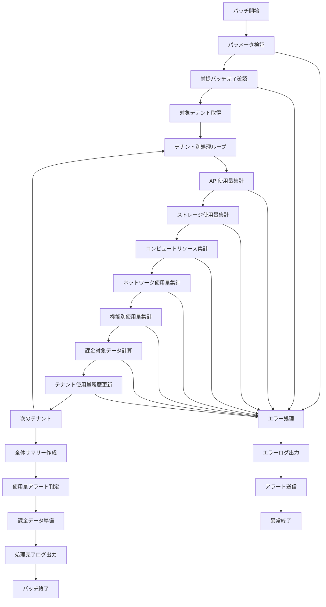

# バッチ定義書：テナント使用量集計バッチ (BATCH-301)

## 1. 基本情報

| 項目 | 内容 |
|------|------|
| **バッチID** | BATCH-301 |
| **バッチ名** | テナント使用量集計バッチ |
| **実行スケジュール** | 日次 01:45 |
| **優先度** | 高 |
| **ステータス** | 設計完了 |
| **作成日** | 2025/05/31 |
| **最終更新日** | 2025/05/31 |

## 2. バッチ概要

### 2.1 概要・目的
各テナントのリソース使用量を詳細に集計し、課金計算、リソース管理、利用状況分析の基礎データを提供するバッチ処理です。マルチテナント環境における公平な課金とリソース配分を実現します。

### 2.2 関連テーブル
- [TBL-001_テナント管理](../database/tables/テーブル定義書_TBL-001.md)
- [TBL-015_使用量統計](../database/tables/テーブル定義書_TBL-015.md)
- [TBL-022_テナント使用量履歴](../database/tables/テーブル定義書_TBL-022.md)
- [TBL-023_リソース使用量](../database/tables/テーブル定義書_TBL-023.md)
- [TBL-024_課金データ](../database/tables/テーブル定義書_TBL-024.md)

### 2.3 関連API
- [API-305_テナント使用量取得API](../api/specs/API定義書_API-305.md)
- [API-306_リソース使用量API](../api/specs/API定義書_API-306.md)

## 3. 実行仕様

### 3.1 実行スケジュール
| 項目 | 設定値 | 備考 |
|------|--------|------|
| 実行頻度 | 日次 | cron: 45 1 * * * |
| 実行時間 | 01:45 | 深夜バッチ |
| タイムアウト | 90分 | 最大実行時間 |
| リトライ回数 | 3回 | 失敗時の再実行 |

### 3.2 実行条件
| 条件 | 内容 | 備考 |
|------|------|------|
| 前提条件 | BATCH-204完了後 | 使用量集計バッチ依存 |
| 実行可能時間 | 01:30-04:00 | メンテナンス時間外 |
| 排他制御 | 同一バッチの重複実行禁止 | ロックファイル使用 |

### 3.3 実行パラメータ
| パラメータ名 | データ型 | 必須 | デフォルト値 | 説明 |
|--------------|----------|------|--------------|------|
| target_date | date | × | 前日 | 集計対象日 |
| tenant_id | string | × | all | 対象テナントID |
| resource_type | string | × | all | リソース種別指定 |
| dry_run | boolean | × | false | テスト実行フラグ |

## 4. 処理仕様

### 4.1 処理フロー


### 4.2 詳細処理

#### 4.2.1 API使用量集計
```sql
SELECT 
  tenant_id,
  COUNT(*) as total_api_calls,
  COUNT(DISTINCT user_id) as unique_api_users,
  SUM(CASE WHEN response_status = 200 THEN 1 ELSE 0 END) as successful_calls,
  SUM(CASE WHEN response_status >= 400 THEN 1 ELSE 0 END) as error_calls,
  AVG(response_time) as avg_response_time,
  MAX(response_time) as max_response_time,
  SUM(request_size_bytes) as total_request_bytes,
  SUM(response_size_bytes) as total_response_bytes
FROM api_call_logs 
WHERE DATE(created_at) = :target_date 
  AND tenant_id = :tenant_id
GROUP BY tenant_id
```

#### 4.2.2 ストレージ使用量集計
```sql
SELECT 
  tenant_id,
  SUM(file_size) as total_storage_bytes,
  COUNT(*) as total_files,
  COUNT(DISTINCT user_id) as storage_users,
  SUM(CASE WHEN file_type = 'document' THEN file_size ELSE 0 END) as document_storage,
  SUM(CASE WHEN file_type = 'image' THEN file_size ELSE 0 END) as image_storage,
  SUM(CASE WHEN file_type = 'other' THEN file_size ELSE 0 END) as other_storage,
  MAX(created_at) as last_upload_time
FROM file_storage 
WHERE DATE(created_at) <= :target_date 
  AND tenant_id = :tenant_id
  AND deleted_at IS NULL
GROUP BY tenant_id
```

#### 4.2.3 コンピュートリソース集計
```sql
SELECT 
  tenant_id,
  SUM(cpu_usage_seconds) as total_cpu_seconds,
  AVG(cpu_usage_percent) as avg_cpu_percent,
  MAX(cpu_usage_percent) as peak_cpu_percent,
  SUM(memory_usage_mb * duration_seconds) as total_memory_mb_seconds,
  AVG(memory_usage_mb) as avg_memory_mb,
  MAX(memory_usage_mb) as peak_memory_mb,
  COUNT(DISTINCT process_id) as active_processes
FROM compute_usage_logs 
WHERE DATE(recorded_at) = :target_date 
  AND tenant_id = :tenant_id
GROUP BY tenant_id
```

#### 4.2.4 ネットワーク使用量集計
```sql
SELECT 
  tenant_id,
  SUM(bytes_in) as total_bytes_in,
  SUM(bytes_out) as total_bytes_out,
  SUM(bytes_in + bytes_out) as total_bandwidth,
  COUNT(*) as total_connections,
  AVG(connection_duration) as avg_connection_duration,
  MAX(peak_bandwidth) as peak_bandwidth
FROM network_usage_logs 
WHERE DATE(recorded_at) = :target_date 
  AND tenant_id = :tenant_id
GROUP BY tenant_id
```

#### 4.2.5 機能別使用量集計
```sql
SELECT 
  tenant_id,
  feature_name,
  COUNT(*) as usage_count,
  COUNT(DISTINCT user_id) as feature_users,
  SUM(duration_seconds) as total_duration,
  AVG(duration_seconds) as avg_duration
FROM feature_usage_logs 
WHERE DATE(used_at) = :target_date 
  AND tenant_id = :tenant_id
GROUP BY tenant_id, feature_name
```

#### 4.2.6 課金対象データ計算
```typescript
interface BillingCalculation {
  tenantId: string;
  usageDate: Date;
  
  // API使用量課金
  apiCallsCharge: number;
  apiDataTransferCharge: number;
  
  // ストレージ課金
  storageCharge: number;
  storageOverageCharge: number;
  
  // コンピュート課金
  cpuCharge: number;
  memoryCharge: number;
  
  // ネットワーク課金
  bandwidthCharge: number;
  
  // 機能別課金
  featureCharges: FeatureCharge[];
  
  // 合計
  totalCharge: number;
}

class BillingCalculator {
  calculateTenantBilling(tenantId: string, usage: TenantUsage): BillingCalculation {
    const plan = this.getTenantPlan(tenantId);
    
    return {
      tenantId,
      usageDate: usage.usageDate,
      
      // API課金計算
      apiCallsCharge: this.calculateApiCallsCharge(usage.apiCalls, plan.apiCallsIncluded, plan.apiCallRate),
      apiDataTransferCharge: this.calculateDataTransferCharge(usage.totalDataTransfer, plan.dataTransferIncluded, plan.dataTransferRate),
      
      // ストレージ課金計算
      storageCharge: this.calculateStorageCharge(usage.storageUsed, plan.storageIncluded, plan.storageRate),
      storageOverageCharge: this.calculateStorageOverage(usage.storageUsed, plan.storageLimit, plan.overageRate),
      
      // コンピュート課金計算
      cpuCharge: this.calculateCpuCharge(usage.cpuUsage, plan.cpuIncluded, plan.cpuRate),
      memoryCharge: this.calculateMemoryCharge(usage.memoryUsage, plan.memoryIncluded, plan.memoryRate),
      
      // ネットワーク課金計算
      bandwidthCharge: this.calculateBandwidthCharge(usage.bandwidth, plan.bandwidthIncluded, plan.bandwidthRate),
      
      // 機能別課金計算
      featureCharges: this.calculateFeatureCharges(usage.featureUsage, plan.featurePricing),
      
      totalCharge: this.calculateTotalCharge()
    };
  }
}
```

## 5. データ仕様

### 5.1 入力データ
| データ名 | 形式 | 取得元 | 説明 |
|----------|------|--------|------|
| API呼び出し履歴 | DB | api_call_logs | API使用状況データ |
| ストレージ使用量 | DB | file_storage | ファイル保存状況データ |
| コンピュート使用量 | DB | compute_usage_logs | CPU・メモリ使用状況 |
| ネットワーク使用量 | DB | network_usage_logs | ネットワーク使用状況 |
| 機能使用履歴 | DB | feature_usage_logs | 機能別使用状況 |
| テナント情報 | DB | tenants | テナント基本情報・プラン |

### 5.2 出力データ
| データ名 | 形式 | 出力先 | 説明 |
|----------|------|--------|------|
| テナント使用量履歴 | DB | tenant_usage_history | 詳細使用量データ |
| 課金データ | DB | billing_data | 課金計算結果 |
| 使用量アラート | DB | usage_alerts | 使用量超過アラート |
| 実行ログ | LOG | /logs/batch/ | 実行履歴ログ |
| 使用量レポート | JSON | /data/output/ | テナント別使用量サマリー |

### 5.3 データ量見積もり
| 項目 | 件数 | 備考 |
|------|------|------|
| 対象テナント数 | 100テナント | 平均値 |
| API呼び出し履歴 | 1,000,000件/日 | 全テナント合計 |
| ストレージファイル数 | 50,000件 | 累積 |
| 処理時間 | 60分 | 平均実行時間 |

## 6. 使用量アラート

### 6.1 アラート条件
| アラート種別 | 条件 | 通知先 | 説明 |
|--------------|------|--------|------|
| ストレージ使用量警告 | 契約容量の80%超過 | テナント管理者 | 容量不足警告 |
| ストレージ使用量危険 | 契約容量の95%超過 | テナント管理者・運用チーム | 容量不足危険 |
| API使用量警告 | 月間制限の80%超過 | テナント管理者 | API制限警告 |
| API使用量危険 | 月間制限の95%超過 | テナント管理者・運用チーム | API制限危険 |
| 課金額異常 | 前月比200%超過 | テナント管理者・営業担当 | 課金額急増 |

### 6.2 アラート通知
```typescript
interface UsageAlert {
  tenantId: string;
  alertType: 'storage_warning' | 'storage_critical' | 'api_warning' | 'api_critical' | 'billing_anomaly';
  severity: 'warning' | 'critical';
  currentUsage: number;
  limit: number;
  usagePercentage: number;
  message: string;
  recommendedAction: string;
}

class UsageAlertService {
  async checkUsageAlerts(tenantId: string, usage: TenantUsage): Promise<UsageAlert[]> {
    const alerts: UsageAlert[] = [];
    const tenant = await this.getTenant(tenantId);
    const plan = tenant.plan;
    
    // ストレージ使用量チェック
    const storagePercentage = (usage.storageUsed / plan.storageLimit) * 100;
    if (storagePercentage >= 95) {
      alerts.push({
        tenantId,
        alertType: 'storage_critical',
        severity: 'critical',
        currentUsage: usage.storageUsed,
        limit: plan.storageLimit,
        usagePercentage: storagePercentage,
        message: `ストレージ使用量が危険レベル（${storagePercentage.toFixed(1)}%）に達しています`,
        recommendedAction: 'プランのアップグレードまたは不要ファイルの削除を検討してください'
      });
    } else if (storagePercentage >= 80) {
      alerts.push({
        tenantId,
        alertType: 'storage_warning',
        severity: 'warning',
        currentUsage: usage.storageUsed,
        limit: plan.storageLimit,
        usagePercentage: storagePercentage,
        message: `ストレージ使用量が警告レベル（${storagePercentage.toFixed(1)}%）に達しています`,
        recommendedAction: 'ストレージ使用量の確認とクリーンアップを推奨します'
      });
    }
    
    // API使用量チェック（月間）
    const monthlyApiUsage = await this.getMonthlyApiUsage(tenantId);
    const apiPercentage = (monthlyApiUsage / plan.monthlyApiLimit) * 100;
    if (apiPercentage >= 95) {
      alerts.push({
        tenantId,
        alertType: 'api_critical',
        severity: 'critical',
        currentUsage: monthlyApiUsage,
        limit: plan.monthlyApiLimit,
        usagePercentage: apiPercentage,
        message: `月間API使用量が危険レベル（${apiPercentage.toFixed(1)}%）に達しています`,
        recommendedAction: 'API使用量の最適化またはプランのアップグレードを検討してください'
      });
    } else if (apiPercentage >= 80) {
      alerts.push({
        tenantId,
        alertType: 'api_warning',
        severity: 'warning',
        currentUsage: monthlyApiUsage,
        limit: plan.monthlyApiLimit,
        usagePercentage: apiPercentage,
        message: `月間API使用量が警告レベル（${apiPercentage.toFixed(1)}%）に達しています`,
        recommendedAction: 'API使用パターンの確認と最適化を推奨します'
      });
    }
    
    return alerts;
  }
}
```

## 7. エラーハンドリング

### 7.1 エラー分類
| エラー種別 | 対応方法 | 通知要否 | 備考 |
|------------|----------|----------|------|
| 前提バッチ未完了 | 待機・リトライ | ○ | 依存関係エラー |
| テナントデータ不整合 | エラーログ出力・継続 | △ | 個別テナント失敗 |
| 課金計算エラー | デフォルト値使用・継続 | ○ | 課金影響あり |
| ストレージアクセスエラー | リトライ・継続 | × | 一時的エラー |

### 7.2 リトライ仕様
| 条件 | リトライ回数 | 間隔 | 備考 |
|------|--------------|------|------|
| 前提バッチ待機 | 10回 | 3分 | 最大30分待機 |
| DB接続エラー | 3回 | 5分 | 指数バックオフ |
| ストレージアクセスエラー | 5回 | 1分 | 指数バックオフ |

## 8. 監視・運用

### 8.1 監視項目
| 監視項目 | 閾値 | アラート条件 | 対応方法 |
|----------|------|--------------|----------|
| 実行時間 | 90分 | 超過時 | 処理見直し |
| テナント処理失敗率 | 5% | 超過時 | 原因調査 |
| 課金計算エラー率 | 1% | 超過時 | 緊急対応 |
| メモリ使用量 | 4GB | 超過時 | リソース調整 |

### 8.2 ログ出力
| ログ種別 | 出力レベル | 出力内容 | 保存期間 |
|----------|------------|----------|----------|
| 実行ログ | INFO | 処理開始・終了・進捗 | 3ヶ月 |
| 使用量ログ | INFO | テナント別使用量詳細 | 1年 |
| 課金ログ | INFO | 課金計算結果 | 3年 |
| エラーログ | ERROR | エラー詳細・スタックトレース | 1年 |

### 8.3 アラート通知
| 通知条件 | 通知先 | 通知方法 | 備考 |
|----------|--------|----------|------|
| 異常終了 | 運用チーム | メール・Slack | 即座に通知 |
| 課金計算エラー | 運用チーム・経理担当 | メール | 緊急対応 |
| 使用量超過 | テナント管理者 | メール | 自動通知 |

## 9. 非機能要件

### 9.1 パフォーマンス
- 処理時間：90分以内
- メモリ使用量：4GB以内
- CPU使用率：70%以内
- 並列処理：テナント単位で並列実行可能

### 9.2 可用性
- 成功率：99.5%以上
- リトライ機能による自動復旧
- 部分実行・再開機能
- 障害時の手動実行機能

### 9.3 セキュリティ
- 実行権限の制限
- テナントデータの分離保証
- 課金データの暗号化

## 10. 実装メモ

### 10.1 技術仕様
- 言語：Node.js (TypeScript)
- フレームワーク：なし（Pure Node.js）
- DB接続：Prisma
- ログ出力：Winston
- 並列処理：Worker Threads

### 10.2 注意事項
- マルチテナント対応必須
- 課金計算の精度保証
- 大量データ処理時のメモリ管理
- テナント間のデータ分離保証

---

**改訂履歴**

| バージョン | 日付 | 変更者 | 変更内容 |
|------------|------|--------|----------|
| 1.0 | 2025/05/31 | システムアーキテクト | 初版作成 |
