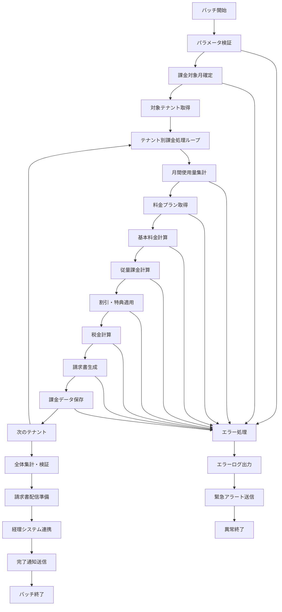

# バッチ定義書：テナント課金計算バッチ (BATCH-302)

## 1. 基本情報

| 項目 | 内容 |
|------|------|
| **バッチID** | BATCH-302 |
| **バッチ名** | テナント課金計算バッチ |
| **実行スケジュール** | 月次 1日 02:00 |
| **優先度** | 最高 |
| **ステータス** | 設計完了 |
| **作成日** | 2025/05/31 |
| **最終更新日** | 2025/05/31 |

## 2. バッチ概要

### 2.1 概要・目的
各テナントの月間使用量に基づいて課金額を計算し、請求書を生成するバッチ処理です。マルチテナントSaaSビジネスの収益管理における最重要バッチです。

### 2.2 関連テーブル
- [TBL-001_テナント管理](../database/tables/テーブル定義書_TBL-001.md)
- [TBL-022_テナント使用量履歴](../database/tables/テーブル定義書_TBL-022.md)
- [TBL-024_課金データ](../database/tables/テーブル定義書_TBL-024.md)
- [TBL-025_請求書](../database/tables/テーブル定義書_TBL-025.md)
- [TBL-026_料金プラン](../database/tables/テーブル定義書_TBL-026.md)

### 2.3 関連API
- [API-307_課金情報取得API](../api/specs/API定義書_API-307.md)
- [API-308_請求書生成API](../api/specs/API定義書_API-308.md)

## 3. 実行仕様

### 3.1 実行スケジュール
| 項目 | 設定値 | 備考 |
|------|--------|------|
| 実行頻度 | 月次 | cron: 0 2 1 * * |
| 実行時間 | 毎月1日 02:00 | 月初深夜 |
| タイムアウト | 180分 | 最大実行時間 |
| リトライ回数 | 5回 | 失敗時の再実行 |

### 3.2 実行条件
| 条件 | 内容 | 備考 |
|------|------|------|
| 前提条件 | BATCH-301完了後 | テナント使用量集計依存 |
| 実行可能時間 | 01:00-06:00 | 深夜メンテナンス時間 |
| 排他制御 | 同一バッチの重複実行禁止 | 課金処理の重複防止 |

### 3.3 実行パラメータ
| パラメータ名 | データ型 | 必須 | デフォルト値 | 説明 |
|--------------|----------|------|--------------|------|
| billing_month | string | × | 前月 | 課金対象月（YYYY-MM） |
| tenant_id | string | × | all | 対象テナントID |
| force_recalc | boolean | × | false | 強制再計算フラグ |
| dry_run | boolean | × | false | テスト実行フラグ |

## 4. 処理仕様

### 4.1 処理フロー


### 4.2 詳細処理

#### 4.2.1 月間使用量集計
```sql
SELECT 
  tenant_id,
  SUM(api_calls_count) as monthly_api_calls,
  SUM(storage_used_bytes) as monthly_storage_bytes,
  SUM(cpu_usage_seconds) as monthly_cpu_seconds,
  SUM(memory_usage_mb_seconds) as monthly_memory_mb_seconds,
  SUM(bandwidth_bytes) as monthly_bandwidth_bytes,
  COUNT(DISTINCT usage_date) as active_days
FROM tenant_usage_history 
WHERE DATE_FORMAT(usage_date, '%Y-%m') = :billing_month
  AND tenant_id = :tenant_id
GROUP BY tenant_id
```

#### 4.2.2 基本料金計算
```typescript
interface PricingPlan {
  planId: string;
  planName: string;
  monthlyBaseFee: number;
  includedQuotas: {
    apiCalls: number;
    storageGB: number;
    cpuHours: number;
    memoryGBHours: number;
    bandwidthGB: number;
  };
  overage: {
    apiCallRate: number;      // per 1000 calls
    storageRate: number;      // per GB
    cpuRate: number;          // per hour
    memoryRate: number;       // per GB-hour
    bandwidthRate: number;    // per GB
  };
  discounts: Discount[];
}

class BillingCalculator {
  calculateBaseFee(tenant: Tenant, billingMonth: string): number {
    const plan = this.getPricingPlan(tenant.planId);
    const daysInMonth = this.getDaysInMonth(billingMonth);
    const activeDays = this.getActiveDays(tenant.id, billingMonth);
    
    // 日割り計算
    return (plan.monthlyBaseFee * activeDays) / daysInMonth;
  }
  
  calculateOverageCharges(usage: MonthlyUsage, plan: PricingPlan): OverageCharges {
    return {
      apiCallsOverage: this.calculateApiOverage(usage.apiCalls, plan.includedQuotas.apiCalls, plan.overage.apiCallRate),
      storageOverage: this.calculateStorageOverage(usage.storageBytes, plan.includedQuotas.storageGB * 1024 * 1024 * 1024, plan.overage.storageRate),
      cpuOverage: this.calculateCpuOverage(usage.cpuSeconds, plan.includedQuotas.cpuHours * 3600, plan.overage.cpuRate),
      memoryOverage: this.calculateMemoryOverage(usage.memoryMbSeconds, plan.includedQuotas.memoryGBHours * 1024 * 3600, plan.overage.memoryRate),
      bandwidthOverage: this.calculateBandwidthOverage(usage.bandwidthBytes, plan.includedQuotas.bandwidthGB * 1024 * 1024 * 1024, plan.overage.bandwidthRate)
    };
  }
  
  private calculateApiOverage(used: number, included: number, rate: number): number {
    if (used <= included) return 0;
    const overage = used - included;
    return Math.ceil(overage / 1000) * rate;
  }
}
```

#### 4.2.3 割引・特典適用
```typescript
interface Discount {
  discountId: string;
  discountType: 'percentage' | 'fixed_amount' | 'free_quota';
  value: number;
  applicableItems: string[];
  validFrom: Date;
  validTo: Date;
  conditions: DiscountCondition[];
}

class DiscountCalculator {
  applyDiscounts(billing: BillingCalculation, tenant: Tenant): BillingCalculation {
    const applicableDiscounts = this.getApplicableDiscounts(tenant);
    let discountedBilling = { ...billing };
    
    for (const discount of applicableDiscounts) {
      discountedBilling = this.applyDiscount(discountedBilling, discount);
    }
    
    return discountedBilling;
  }
  
  private applyDiscount(billing: BillingCalculation, discount: Discount): BillingCalculation {
    switch (discount.discountType) {
      case 'percentage':
        return this.applyPercentageDiscount(billing, discount);
      case 'fixed_amount':
        return this.applyFixedAmountDiscount(billing, discount);
      case 'free_quota':
        return this.applyFreeQuotaDiscount(billing, discount);
      default:
        return billing;
    }
  }
}
```

#### 4.2.4 税金計算
```typescript
interface TaxCalculation {
  subtotal: number;
  taxRate: number;
  taxAmount: number;
  total: number;
  taxType: 'consumption_tax' | 'sales_tax' | 'vat';
  taxRegion: string;
}

class TaxCalculator {
  calculateTax(subtotal: number, tenant: Tenant): TaxCalculation {
    const taxRate = this.getTaxRate(tenant.billingAddress.country, tenant.billingAddress.region);
    const taxAmount = subtotal * taxRate;
    
    return {
      subtotal,
      taxRate,
      taxAmount,
      total: subtotal + taxAmount,
      taxType: this.getTaxType(tenant.billingAddress.country),
      taxRegion: tenant.billingAddress.country
    };
  }
  
  private getTaxRate(country: string, region: string): number {
    // 国・地域別の税率を取得
    const taxRates = {
      'JP': 0.10,  // 日本: 消費税10%
      'US': this.getUSTaxRate(region),  // アメリカ: 州別
      'EU': 0.20,  // EU: VAT 20% (簡略化)
    };
    
    return taxRates[country] || 0;
  }
}
```

#### 4.2.5 請求書生成
```typescript
interface Invoice {
  invoiceId: string;
  tenantId: string;
  billingMonth: string;
  issueDate: Date;
  dueDate: Date;
  
  // 基本情報
  baseFee: number;
  usageCharges: UsageCharges;
  discounts: DiscountItem[];
  subtotal: number;
  
  // 税金
  taxCalculation: TaxCalculation;
  
  // 合計
  totalAmount: number;
  currency: string;
  
  // 支払い情報
  paymentMethod: string;
  paymentStatus: 'pending' | 'paid' | 'overdue' | 'cancelled';
  
  // 詳細
  lineItems: InvoiceLineItem[];
  notes: string;
}

class InvoiceGenerator {
  async generateInvoice(tenant: Tenant, billing: BillingCalculation): Promise<Invoice> {
    const invoiceId = this.generateInvoiceId(tenant.id, billing.billingMonth);
    const issueDate = new Date();
    const dueDate = this.calculateDueDate(issueDate, tenant.paymentTerms);
    
    const invoice: Invoice = {
      invoiceId,
      tenantId: tenant.id,
      billingMonth: billing.billingMonth,
      issueDate,
      dueDate,
      
      baseFee: billing.baseFee,
      usageCharges: billing.usageCharges,
      discounts: billing.discounts,
      subtotal: billing.subtotal,
      
      taxCalculation: billing.taxCalculation,
      
      totalAmount: billing.totalAmount,
      currency: tenant.currency,
      
      paymentMethod: tenant.defaultPaymentMethod,
      paymentStatus: 'pending',
      
      lineItems: this.generateLineItems(billing),
      notes: this.generateInvoiceNotes(tenant, billing)
    };
    
    // PDF生成
    await this.generateInvoicePDF(invoice);
    
    return invoice;
  }
}
```

## 5. データ仕様

### 5.1 入力データ
| データ名 | 形式 | 取得元 | 説明 |
|----------|------|--------|------|
| テナント使用量履歴 | DB | tenant_usage_history | 月間使用量データ |
| テナント情報 | DB | tenants | テナント基本情報 |
| 料金プラン | DB | pricing_plans | プラン別料金設定 |
| 割引情報 | DB | discounts | 適用可能割引 |
| 税率マスタ | DB | tax_rates | 地域別税率 |

### 5.2 出力データ
| データ名 | 形式 | 出力先 | 説明 |
|----------|------|--------|------|
| 課金データ | DB | billing_data | 課金計算結果 |
| 請求書 | DB | invoices | 請求書情報 |
| 請求書PDF | File | /invoices/pdf/ | PDF形式請求書 |
| 経理連携データ | CSV | /data/accounting/ | 経理システム連携用 |
| 実行ログ | LOG | /logs/batch/ | 実行履歴ログ |

### 5.3 データ量見積もり
| 項目 | 件数 | 備考 |
|------|------|------|
| 対象テナント数 | 100テナント | 平均値 |
| 請求書生成数 | 100件/月 | テナント数と同数 |
| 処理時間 | 120分 | 平均実行時間 |

## 6. エラーハンドリング

### 6.1 エラー分類
| エラー種別 | 対応方法 | 通知要否 | 備考 |
|------------|----------|----------|------|
| 使用量データ不足 | 前月データで補完・継続 | ○ | 課金影響あり |
| 料金プラン不整合 | デフォルトプラン適用・継続 | ○ | 緊急対応必要 |
| 税率取得エラー | デフォルト税率適用・継続 | ○ | 法的影響あり |
| PDF生成エラー | 再試行・継続 | △ | 後で手動対応可 |
| 経理連携エラー | リトライ・継続 | ○ | 経理業務影響 |

### 6.2 リトライ仕様
| 条件 | リトライ回数 | 間隔 | 備考 |
|------|--------------|------|------|
| DB接続エラー | 5回 | 10分 | 指数バックオフ |
| PDF生成エラー | 3回 | 5分 | 固定間隔 |
| 経理連携エラー | 5回 | 15分 | 指数バックオフ |

## 7. 監視・運用

### 7.1 監視項目
| 監視項目 | 閾値 | アラート条件 | 対応方法 |
|----------|------|--------------|----------|
| 実行時間 | 180分 | 超過時 | 緊急対応 |
| 課金計算エラー率 | 1% | 超過時 | 即座に対応 |
| 請求書生成失敗率 | 2% | 超過時 | 緊急対応 |
| 総課金額異常 | 前月比±50% | 乖離時 | 検証・確認 |

### 7.2 ログ出力
| ログ種別 | 出力レベル | 出力内容 | 保存期間 |
|----------|------------|----------|----------|
| 実行ログ | INFO | 処理開始・終了・進捗 | 3年 |
| 課金ログ | INFO | テナント別課金詳細 | 7年 |
| エラーログ | ERROR | エラー詳細・スタックトレース | 7年 |
| 監査ログ | AUDIT | 課金計算・請求書生成履歴 | 10年 |

### 7.3 アラート通知
| 通知条件 | 通知先 | 通知方法 | 備考 |
|----------|--------|----------|------|
| 異常終了 | 運用チーム・経理担当・経営陣 | メール・電話 | 最高優先度 |
| 課金計算エラー | 運用チーム・経理担当 | メール・Slack | 緊急対応 |
| 請求書生成失敗 | 運用チーム | Slack | 即座に対応 |

## 8. 非機能要件

### 8.1 パフォーマンス
- 処理時間：180分以内
- メモリ使用量：6GB以内
- CPU使用率：80%以内
- 並列処理：テナント単位で並列実行可能

### 8.2 可用性
- 成功率：99.9%以上
- リトライ機能による自動復旧
- 障害時の手動実行機能
- 部分実行・再開機能

### 8.3 セキュリティ
- 実行権限の厳格な制限
- 課金データの暗号化
- 監査ログの改ざん防止
- 請求書データのアクセス制御

## 9. 実装メモ

### 10.1 技術仕様
- 言語：Node.js (TypeScript)
- フレームワーク：なし（Pure Node.js）
- DB接続：Prisma
- PDF生成：Puppeteer
- ログ出力：Winston
- 暗号化：crypto

### 10.2 注意事項
- 課金計算の精度保証が最重要
- 法的要件（税法、会計基準）への準拠
- 監査証跡の完全性確保
- 個人情報保護法への準拠

---

**改訂履歴**

| バージョン | 日付 | 変更者 | 変更内容 |
|------------|------|--------|----------|
| 1.0 | 2025/05/31 | システムアーキテクト | 初版作成 |
