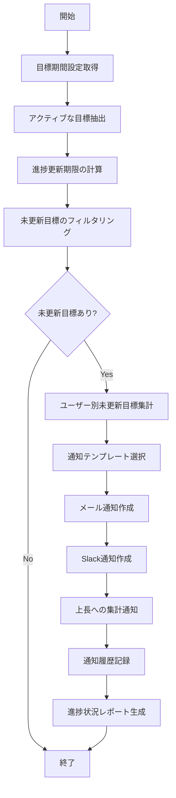

# バッチ定義書：目標進捗リマインダーバッチ

| 項目                | 内容                                                                                |
|---------------------|------------------------------------------------------------------------------------|
| **バッチID**        | BATCH-302                                                                          |
| **バッチ名称**      | 目標進捗リマインダーバッチ                                                          |
| **機能カテゴリ**    | 目標・キャリア管理                                                                  |
| **概要・目的**      | 目標進捗未入力者へのリマインド通知を送信し、定期的な進捗更新を促進する               |
| **バッチ種別**      | 定期バッチ                                                                          |
| **実行スケジュール**| 毎週月曜朝（8:00）                                                                  |
| **入出力対象**      | GoalProgress                                                                        |
| **優先度**          | 中                                                                                  |
| **備考**            | Slack/メール連携                                                                    |

## 1. 処理概要

目標進捗リマインダーバッチは、社員の目標管理における進捗状況の定期的な更新を促進するためのバッチ処理です。設定された期間内に進捗更新が行われていないユーザーを特定し、リマインド通知を自動送信します。通知はメールおよびSlackなどの社内コミュニケーションツールを通じて行われ、目標達成に向けた継続的な取り組みを支援します。また、上長や管理者にも部下の進捗状況をまとめて通知することで、チーム全体の目標管理を効率化します。

## 2. 処理フロー



## 3. 入力データ

### 3.1 GoalSettingテーブル

| フィールド名      | データ型 | 説明                                           |
|-------------------|----------|------------------------------------------------|
| goal_id           | String   | 目標ID（主キー）                               |
| emp_no            | String   | 社員番号（外部キー）                           |
| goal_type         | String   | 目標タイプ（"PERSONAL"/"TEAM"/"DEPARTMENT"）   |
| goal_category     | String   | 目標カテゴリ（"SKILL"/"PROJECT"/"CAREER"など） |
| goal_title        | String   | 目標タイトル                                   |
| goal_description  | Text     | 目標詳細                                       |
| start_date        | Date     | 開始日                                         |
| end_date          | Date     | 終了日                                         |
| target_value      | Double   | 目標値（数値目標の場合）                       |
| status            | String   | ステータス（"ACTIVE"/"COMPLETED"/"CANCELLED"） |
| priority          | Integer  | 優先度（1-5）                                  |
| created_at        | DateTime | 作成日時                                       |
| created_by        | String   | 作成者                                         |
| last_modified_at  | DateTime | 最終更新日時                                   |
| last_modified_by  | String   | 最終更新者                                     |

### 3.2 GoalProgressテーブル

| フィールド名      | データ型 | 説明                                           |
|-------------------|----------|------------------------------------------------|
| progress_id       | String   | 進捗ID（主キー）                               |
| goal_id           | String   | 目標ID（外部キー）                             |
| progress_date     | Date     | 進捗記録日                                     |
| progress_value    | Double   | 進捗値（数値目標の場合）                       |
| progress_rate     | Double   | 進捗率（0.0-1.0）                              |
| progress_status   | String   | 進捗状況（"ON_TRACK"/"AT_RISK"/"DELAYED"）     |
| comment           | Text     | コメント                                       |
| created_at        | DateTime | 作成日時                                       |
| created_by        | String   | 作成者                                         |

### 3.3 Employeeテーブル

| フィールド名      | データ型 | 説明                                           |
|-------------------|----------|------------------------------------------------|
| emp_no            | String   | 社員番号（主キー）                             |
| name              | String   | 氏名                                           |
| dept_id           | String   | 所属部署ID（外部キー）                         |
| group_id          | String   | 所属グループID（外部キー）                     |
| position_id       | String   | 役職ID（外部キー）                             |
| email             | String   | メールアドレス                                 |
| slack_id          | String   | Slack ID                                       |
| manager_emp_no    | String   | 上長社員番号                                   |
| status            | String   | ステータス（"ACTIVE"/"INACTIVE"）              |

### 3.4 システム設定

| 設定項目                    | データ型 | デフォルト値 | 説明                                 |
|-----------------------------|----------|--------------|--------------------------------------|
| goal_update_frequency_days  | Integer  | 7            | 目標進捗更新推奨頻度（日数）         |
| reminder_threshold_days     | Integer  | 3            | リマインド通知閾値（未更新日数）     |
| escalation_threshold_days   | Integer  | 14           | エスカレーション閾値（未更新日数）   |
| notify_via_email            | Boolean  | true         | メール通知有効/無効                  |
| notify_via_slack            | Boolean  | true         | Slack通知有効/無効                   |
| notify_manager              | Boolean  | true         | 上長への通知有効/無効                |
| reminder_template_path      | String   | "/templates/goal_reminder" | 通知テンプレートパス    |

## 4. 出力データ

### 4.1 NotificationHistoryテーブル（追加）

| フィールド名      | データ型 | 説明                                           |
|-------------------|----------|------------------------------------------------|
| notification_id   | String   | 通知ID（主キー）                               |
| notification_type | String   | 通知タイプ（"GOAL_REMINDER"）                  |
| emp_no            | String   | 社員番号（外部キー）                           |
| goal_id           | String   | 目標ID（外部キー）                             |
| notification_level| String   | 通知レベル（"NORMAL"/"URGENT"/"ESCALATION"）   |
| days_without_update| Integer  | 未更新日数                                     |
| sent_at           | DateTime | 送信日時                                       |
| sent_via          | String   | 送信方法（"EMAIL"/"SLACK"/"BOTH"）             |
| message           | Text     | 通知メッセージ                                 |
| status            | String   | ステータス（"SENT"/"FAILED"）                  |

### 4.2 メール通知

**対象者**: 進捗未更新ユーザー

**テンプレート例**:
```
件名: 【リマインド】目標進捗の更新をお願いします

{氏名}様

以下の目標について、{未更新日数}日間進捗の更新がありません。
目標の進捗状況を更新してください。

■目標: {目標タイトル}
■期間: {開始日} 〜 {終了日}
■最終更新日: {最終更新日}
■現在の進捗率: {進捗率}%

目標の進捗を更新するには、以下のリンクをクリックしてください。
{進捗更新リンク}

※定期的な進捗の更新は、目標達成に向けた重要なステップです。
※このメールはシステムより自動送信されています。
```

### 4.3 Slack通知

**対象者**: 進捗未更新ユーザー

**通知内容例**:
```
【目標進捗リマインド】
{目標タイトル}の進捗更新が{未更新日数}日間ありません。
現在の進捗率: {進捗率}%
更新はこちら: {進捗更新リンク}
```

### 4.4 上長への集計通知

**対象者**: 部下を持つ管理者

**テンプレート例**:
```
件名: 【目標進捗状況】部下の目標進捗状況（{日付}）

{管理者氏名}様

あなたの部下で以下の目標について進捗の更新が滞っています。

■1週間以上未更新
{社員名1}: {目標タイトル1} ({未更新日数1}日間未更新)
{社員名2}: {目標タイトル2} ({未更新日数2}日間未更新)

■2週間以上未更新（要フォロー）
{社員名3}: {目標タイトル3} ({未更新日数3}日間未更新)
{社員名4}: {目標タイトル4} ({未更新日数4}日間未更新)

詳細はシステムの管理画面からご確認ください。
{管理画面リンク}

※このメールはシステムより自動送信されています。
```

### 4.5 進捗状況レポート

以下の内容でCSVファイルを生成：

- ファイル名：`goal_progress_status_YYYYMMDD.csv`
- 内容：
  - レポート生成日
  - 部署別・グループ別の進捗更新状況
  - 未更新目標リスト（社員名、目標タイトル、未更新日数）
  - 進捗率の低い目標リスト
  - 期限切れ間近の目標リスト

## 5. エラー処理

| エラーケース                      | 対応方法                                                                 |
|-----------------------------------|--------------------------------------------------------------------------|
| 目標データ不足                    | 警告ログを記録し、利用可能なデータのみで処理を継続。                     |
| メール送信エラー                  | エラーログを記録し、Slack通知のみ送信。再試行スケジュールを設定。        |
| Slack通知エラー                   | エラーログを記録し、メール通知のみ送信。                                 |
| 上長情報取得エラー                | 警告ログを記録し、本人への通知のみ実施。上長通知はスキップ。             |
| 通知履歴記録エラー                | エラーログを記録。通知自体は送信済みの状態で処理を継続。                 |
| レポート生成エラー                | エラーログを記録し、管理者に通知。通知処理は完了させる。                 |
| 設定値不正                        | デフォルト値を使用し、警告ログを記録。                                   |

## 6. 依存関係

- GoalSettingテーブル
- GoalProgressテーブル
- Employeeテーブル
- NotificationHistoryテーブル
- メール送信サービス
- Slack通知サービス
- レポート生成サービス

## 7. 実行パラメータ

| パラメータ名        | 必須 | デフォルト値 | 説明                                           |
|---------------------|------|--------------|------------------------------------------------|
| --threshold-override| No   | 設定値       | リマインド通知閾値を上書き（日数）             |
| --email-only        | No   | false        | メール通知のみ実施（Slack通知なし）            |
| --slack-only        | No   | false        | Slack通知のみ実施（メール通知なし）            |
| --skip-manager      | No   | false        | 上長への通知をスキップ                         |
| --dept-id           | No   | null         | 特定部署のみを対象とする場合に指定             |
| --emp-no            | No   | null         | 特定社員のみを対象とする場合に指定             |
| --goal-category     | No   | null         | 特定目標カテゴリのみを対象とする場合に指定     |

## 8. 実行例

```bash
# 通常実行
npm run batch:skill-reminder

# TypeScript直接実行
npx tsx src/batch/skillReminder.ts

# 閾値を変更して実行（5日間未更新でリマインド）
npm run batch:skill-reminder -- --threshold-override=5

# メール通知のみ実施
npm run batch:skill-reminder -- --email-only

# 特定部署のみ通知
npm run batch:skill-reminder -- --dept-id=D001

# 特定社員のみ通知（テスト用）
npm run batch:skill-reminder -- --emp-no=E10023
```

## 9. 運用上の注意点

- 本バッチは毎週月曜朝に実行され、前週までの進捗更新状況を確認します。
- 祝日や休業日には通知が不要な場合があるため、カレンダー設定と連携することが推奨されます。
- 通知頻度が高すぎると無視される傾向があるため、`goal_update_frequency_days` の設定は組織の状況に合わせて調整してください。
- 長期休暇中の社員には通知が不要な場合があるため、休暇情報との連携も検討してください。
- Slack通知を有効にする場合は、事前にSlack APIの設定とトークンの取得が必要です。
- 上長への集計通知は、部下の数が多い場合に情報過多になる可能性があります。その場合は、重要度や緊急度でフィルタリングすることを検討してください。
- 目標の重要度や優先度に応じて通知の頻度や内容を変えることで、効果的なリマインドが可能になります。

## 10. 改訂履歴

| 改訂日     | 改訂者 | 改訂内容                                         |
|------------|--------|--------------------------------------------------|
| 2025/05/29 | 初版   | 初版作成                                         |
