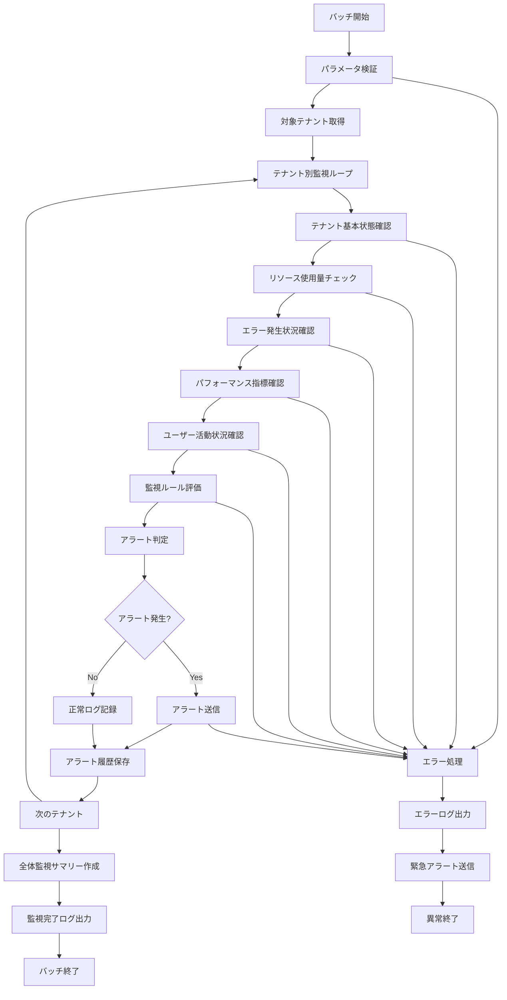

# バッチ定義書：テナント状態監視バッチ (BATCH-303)

## 1. 基本情報

| 項目 | 内容 |
|------|------|
| **バッチID** | BATCH-303 |
| **バッチ名** | テナント状態監視バッチ |
| **実行スケジュール** | 時間毎 毎時30分 |
| **優先度** | 高 |
| **ステータス** | 設計完了 |
| **作成日** | 2025/05/31 |
| **最終更新日** | 2025/05/31 |

## 2. バッチ概要

### 2.1 概要・目的
各テナントの稼働状況・異常検知を時間毎に実行するバッチ処理です。テナント別のシステム利用状況、パフォーマンス指標、エラー発生状況を監視し、問題の早期発見・対応を支援します。

### 2.2 関連テーブル
- [TBL-001_テナント管理](../database/tables/テーブル定義書_TBL-001.md)
- [TBL-015_使用量統計](../database/tables/テーブル定義書_TBL-015.md)
- [TBL-018_エラー統計](../database/tables/テーブル定義書_TBL-018.md)
- [TBL-029_テナント監視設定](../database/tables/テーブル定義書_TBL-029.md)
- [TBL-030_監視アラート履歴](../database/tables/テーブル定義書_TBL-030.md)

### 2.3 関連API
- [API-401_テナント状態取得API](../api/specs/API定義書_API-401.md)
- [API-402_監視アラート送信API](../api/specs/API定義書_API-402.md)

## 3. 実行仕様

### 3.1 実行スケジュール
| 項目 | 設定値 | 備考 |
|------|--------|------|
| 実行頻度 | 時間毎 | cron: 30 * * * * |
| 実行時間 | 毎時30分 | 定期監視 |
| タイムアウト | 15分 | 最大実行時間 |
| リトライ回数 | 2回 | 失敗時の再実行 |

### 3.2 実行条件
| 条件 | 内容 | 備考 |
|------|------|------|
| 前提条件 | なし | 独立実行可能 |
| 実行可能時間 | 24時間 | 常時監視 |
| 排他制御 | 同一バッチの重複実行禁止 | ロックファイル使用 |

### 3.3 実行パラメータ
| パラメータ名 | データ型 | 必須 | デフォルト値 | 説明 |
|--------------|----------|------|--------------|------|
| tenant_id | string | × | all | 対象テナントID |
| check_type | string | × | all | 監視種別指定 |
| alert_level | string | × | warning | アラートレベル |
| dry_run | boolean | × | false | テスト実行フラグ |

## 4. 処理仕様

### 4.1 処理フロー


### 4.2 詳細処理

#### 4.2.1 テナント基本状態確認
```sql
-- テナント基本状態取得
SELECT 
  t.id,
  t.name,
  t.status,
  t.plan_type,
  t.contract_status,
  t.last_activity_at,
  TIMESTAMPDIFF(HOUR, t.last_activity_at, NOW()) as hours_since_last_activity
FROM tenants t
WHERE t.status = 'active'
  AND (:tenant_id = 'all' OR t.id = :tenant_id);

-- 最近のAPI呼び出し状況
SELECT 
  tenant_id,
  COUNT(*) as api_calls_last_hour,
  AVG(response_time_ms) as avg_response_time,
  COUNT(CASE WHEN status_code >= 400 THEN 1 END) as error_count,
  (COUNT(CASE WHEN status_code >= 400 THEN 1 END) * 100.0 / COUNT(*)) as error_rate
FROM api_call_logs
WHERE created_at >= DATE_SUB(NOW(), INTERVAL 1 HOUR)
  AND tenant_id = :tenant_id
GROUP BY tenant_id;
```

#### 4.2.2 リソース使用量チェック
```typescript
interface TenantResourceUsage {
  tenantId: string;
  timestamp: Date;
  
  // CPU・メモリ使用量
  cpuUsage: number;
  memoryUsage: number;
  
  // ストレージ使用量
  storageUsedGB: number;
  storageQuotaGB: number;
  storageUsageRate: number;
  
  // API使用量
  apiCallsPerHour: number;
  apiQuotaPerHour: number;
  apiUsageRate: number;
  
  // ユーザー数
  activeUsers: number;
  userQuota: number;
  userUsageRate: number;
}

class TenantResourceMonitor {
  async checkResourceUsage(tenantId: string): Promise<TenantResourceUsage> {
    const [storageUsage, apiUsage, userUsage] = await Promise.all([
      this.getStorageUsage(tenantId),
      this.getApiUsage(tenantId),
      this.getUserUsage(tenantId)
    ]);
    
    const tenant = await this.getTenant(tenantId);
    const quotas = await this.getTenantQuotas(tenantId);
    
    return {
      tenantId,
      timestamp: new Date(),
      cpuUsage: await this.getCpuUsage(tenantId),
      memoryUsage: await this.getMemoryUsage(tenantId),
      storageUsedGB: storageUsage.used,
      storageQuotaGB: quotas.storage,
      storageUsageRate: (storageUsage.used / quotas.storage) * 100,
      apiCallsPerHour: apiUsage.callsLastHour,
      apiQuotaPerHour: quotas.apiCallsPerHour,
      apiUsageRate: (apiUsage.callsLastHour / quotas.apiCallsPerHour) * 100,
      activeUsers: userUsage.activeUsers,
      userQuota: quotas.maxUsers,
      userUsageRate: (userUsage.activeUsers / quotas.maxUsers) * 100
    };
  }
  
  private async getStorageUsage(tenantId: string): Promise<StorageUsage> {
    const result = await prisma.$queryRaw`
      SELECT 
        SUM(file_size_bytes) / (1024 * 1024 * 1024) as used_gb
      FROM uploaded_files 
      WHERE tenant_id = ${tenantId}
        AND deleted_at IS NULL
    `;
    
    return {
      used: result[0]?.used_gb || 0
    };
  }
  
  private async getApiUsage(tenantId: string): Promise<ApiUsage> {
    const result = await prisma.apiCallLogs.aggregate({
      where: {
        tenantId,
        createdAt: {
          gte: new Date(Date.now() - 60 * 60 * 1000) // 1時間前
        }
      },
      _count: {
        id: true
      },
      _avg: {
        responseTimeMs: true
      }
    });
    
    return {
      callsLastHour: result._count.id || 0,
      avgResponseTime: result._avg.responseTimeMs || 0
    };
  }
}
```

#### 4.2.3 監視ルール評価
```typescript
interface MonitoringRule {
  id: string;
  tenantId: string;
  ruleType: 'resource' | 'performance' | 'error' | 'activity';
  metric: string;
  operator: '>' | '<' | '>=' | '<=' | '==' | '!=';
  threshold: number;
  severity: 'low' | 'medium' | 'high' | 'critical';
  enabled: boolean;
}

interface AlertResult {
  ruleId: string;
  tenantId: string;
  severity: string;
  metric: string;
  currentValue: number;
  threshold: number;
  message: string;
  timestamp: Date;
}

class MonitoringRuleEngine {
  async evaluateRules(tenantId: string, resourceUsage: TenantResourceUsage): Promise<AlertResult[]> {
    const rules = await this.getMonitoringRules(tenantId);
    const alerts: AlertResult[] = [];
    
    for (const rule of rules) {
      if (!rule.enabled) continue;
      
      const currentValue = this.extractMetricValue(resourceUsage, rule.metric);
      const isTriggered = this.evaluateCondition(currentValue, rule.operator, rule.threshold);
      
      if (isTriggered) {
        alerts.push({
          ruleId: rule.id,
          tenantId: rule.tenantId,
          severity: rule.severity,
          metric: rule.metric,
          currentValue,
          threshold: rule.threshold,
          message: this.generateAlertMessage(rule, currentValue),
          timestamp: new Date()
        });
      }
    }
    
    return alerts;
  }
  
  private extractMetricValue(usage: TenantResourceUsage, metric: string): number {
    switch (metric) {
      case 'storage_usage_rate':
        return usage.storageUsageRate;
      case 'api_usage_rate':
        return usage.apiUsageRate;
      case 'user_usage_rate':
        return usage.userUsageRate;
      case 'cpu_usage':
        return usage.cpuUsage;
      case 'memory_usage':
        return usage.memoryUsage;
      default:
        return 0;
    }
  }
  
  private evaluateCondition(value: number, operator: string, threshold: number): boolean {
    switch (operator) {
      case '>':
        return value > threshold;
      case '<':
        return value < threshold;
      case '>=':
        return value >= threshold;
      case '<=':
        return value <= threshold;
      case '==':
        return value === threshold;
      case '!=':
        return value !== threshold;
      default:
        return false;
    }
  }
  
  private generateAlertMessage(rule: MonitoringRule, currentValue: number): string {
    const metricNames = {
      'storage_usage_rate': 'ストレージ使用率',
      'api_usage_rate': 'API使用率',
      'user_usage_rate': 'ユーザー使用率',
      'cpu_usage': 'CPU使用率',
      'memory_usage': 'メモリ使用率'
    };
    
    const metricName = metricNames[rule.metric] || rule.metric;
    
    return `${metricName}が閾値を超過しました: ${currentValue.toFixed(2)}% (閾値: ${rule.threshold}%)`;
  }
}
```

#### 4.2.4 アラート送信処理
```typescript
class TenantAlertService {
  async sendAlert(tenant: Tenant, alert: AlertResult): Promise<void> {
    const alertConfig = await this.getAlertConfig(tenant.id);
    
    // 重複アラート抑制チェック
    if (await this.isDuplicateAlert(alert)) {
      return;
    }
    
    // アラート履歴保存
    await this.saveAlertHistory(alert);
    
    // 通知送信
    await Promise.all([
      this.sendEmailAlert(alertConfig.email, alert),
      this.sendSlackAlert(alertConfig.slack, alert),
      this.sendTeamsAlert(alertConfig.teams, alert)
    ]);
  }
  
  private async isDuplicateAlert(alert: AlertResult): Promise<boolean> {
    const recentAlert = await prisma.alertHistory.findFirst({
      where: {
        tenantId: alert.tenantId,
        ruleId: alert.ruleId,
        createdAt: {
          gte: new Date(Date.now() - 30 * 60 * 1000) // 30分以内
        }
      }
    });
    
    return !!recentAlert;
  }
  
  private async sendSlackAlert(config: SlackConfig, alert: AlertResult): Promise<void> {
    if (!config.enabled) return;
    
    const color = this.getSeverityColor(alert.severity);
    const message = {
      channel: config.channel,
      attachments: [{
        color,
        title: `🚨 テナント監視アラート - ${alert.severity.toUpperCase()}`,
        fields: [
          {
            title: 'テナント',
            value: alert.tenantId,
            short: true
          },
          {
            title: 'メトリック',
            value: alert.metric,
            short: true
          },
          {
            title: '現在値',
            value: `${alert.currentValue.toFixed(2)}`,
            short: true
          },
          {
            title: '閾値',
            value: `${alert.threshold}`,
            short: true
          },
          {
            title: 'メッセージ',
            value: alert.message,
            short: false
          }
        ],
        timestamp: Math.floor(alert.timestamp.getTime() / 1000)
      }]
    };
    
    await this.slackService.send(message);
  }
  
  private getSeverityColor(severity: string): string {
    switch (severity) {
      case 'critical':
        return '#ff0000';
      case 'high':
        return '#ff6600';
      case 'medium':
        return '#ffcc00';
      case 'low':
        return '#00cc00';
      default:
        return '#cccccc';
    }
  }
}
```

## 5. データ仕様

### 5.1 入力データ
| データ名 | 形式 | 取得元 | 説明 |
|----------|------|--------|------|
| テナント情報 | DB | tenants | テナント基本情報 |
| API呼び出しログ | DB | api_call_logs | API使用状況 |
| リソース使用量 | DB | usage_statistics | リソース利用データ |
| 監視設定 | DB | monitoring_rules | 監視ルール設定 |
| エラーログ | DB | error_logs | エラー発生状況 |

### 5.2 出力データ
| データ名 | 形式 | 出力先 | 説明 |
|----------|------|--------|------|
| アラート履歴 | DB | alert_history | アラート発生履歴 |
| 監視結果 | DB | monitoring_results | 監視実行結果 |
| 通知ログ | DB | notification_logs | 通知送信ログ |
| 実行ログ | LOG | /logs/batch/ | 実行履歴ログ |

### 5.3 データ量見積もり
| 項目 | 件数 | 備考 |
|------|------|------|
| 対象テナント数 | 100テナント | 平均値 |
| 監視ルール数 | 500ルール | 全テナント合計 |
| 処理時間 | 10分 | 平均実行時間 |

## 6. エラーハンドリング

### 6.1 エラー分類
| エラー種別 | 対応方法 | 通知要否 | 備考 |
|------------|----------|----------|------|
| テナント接続エラー | スキップ・継続 | ○ | 個別テナント問題 |
| 監視ルール評価エラー | ログ出力・継続 | △ | ルール設定問題 |
| アラート送信エラー | リトライ・継続 | ○ | 通知失敗 |
| DB接続エラー | リトライ・継続 | ○ | システム問題 |

### 6.2 リトライ仕様
| 条件 | リトライ回数 | 間隔 | 備考 |
|------|--------------|------|------|
| アラート送信エラー | 3回 | 2分 | 指数バックオフ |
| DB接続エラー | 2回 | 1分 | 固定間隔 |
| API呼び出しエラー | 2回 | 30秒 | 固定間隔 |

## 7. 監視・運用

### 7.1 監視項目
| 監視項目 | 閾値 | アラート条件 | 対応方法 |
|----------|------|--------------|----------|
| 実行時間 | 15分 | 超過時 | 処理見直し |
| アラート送信失敗率 | 10% | 超過時 | 通知設定確認 |
| 監視対象テナント数 | 100% | 未達時 | 接続問題調査 |
| メモリ使用量 | 1GB | 超過時 | リソース調整 |

### 7.2 ログ出力
| ログ種別 | 出力レベル | 出力内容 | 保存期間 |
|----------|------------|----------|----------|
| 実行ログ | INFO | 処理開始・終了・進捗 | 1ヶ月 |
| 監視ログ | INFO | 監視結果詳細 | 3ヶ月 |
| アラートログ | WARN | アラート発生詳細 | 6ヶ月 |
| エラーログ | ERROR | エラー詳細・スタックトレース | 1年 |

### 7.3 アラート通知
| 通知条件 | 通知先 | 通知方法 | 備考 |
|----------|--------|----------|------|
| 異常終了 | 運用チーム | メール・Slack | 即座に通知 |
| 大量アラート発生 | 運用チーム | Slack | 閾値超過時 |
| 監視失敗 | 運用チーム | メール | 監視機能停止時 |

## 8. 非機能要件

### 8.1 パフォーマンス
- 処理時間：15分以内
- メモリ使用量：1GB以内
- CPU使用率：30%以内
- 並列処理：テナント単位で並列実行可能

### 8.2 可用性
- 成功率：99%以上
- リトライ機能による自動復旧
- 部分実行・継続機能
- 障害時の緊急通知機能

### 8.3 セキュリティ
- 実行権限の制限
- 監視データの暗号化
- アラート通知の認証・認可

## 9. 実装メモ

### 9.1 技術仕様
- 言語：Node.js (TypeScript)
- DB接続：Prisma
- 通知送信：Slack API, Teams API, Nodemailer
- ログ出力：Winston

### 9.2 注意事項
- 時間毎実行による高頻度監視
- アラート重複抑制の実装
- 監視ルールの柔軟な設定
- 緊急度に応じた通知方法の使い分け

---

**改訂履歴**

| バージョン | 日付 | 変更者 | 変更内容 |
|------------|------|--------|----------|
| 1.0 | 2025/05/31 | システムアーキテクト | 初版作成 |
