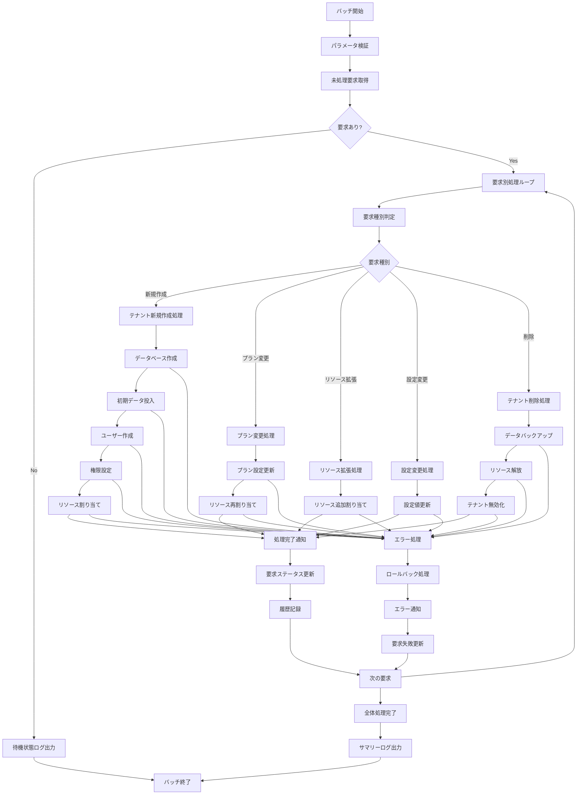

# バッチ定義書：テナント自動プロビジョニングバッチ (BATCH-304)

## 1. 基本情報

| 項目 | 内容 |
|------|------|
| **バッチID** | BATCH-304 |
| **バッチ名** | テナント自動プロビジョニングバッチ |
| **実行スケジュール** | 5分毎 |
| **優先度** | 最高 |
| **ステータス** | 設計完了 |
| **作成日** | 2025/05/31 |
| **最終更新日** | 2025/05/31 |

## 2. バッチ概要

### 2.1 概要・目的
新規テナントの自動プロビジョニング・既存テナントの設定変更を処理するバッチです。テナント作成要求、プラン変更、リソース拡張などの処理を自動化し、迅速なサービス提供を実現します。

### 2.2 関連テーブル
- [TBL-001_テナント管理](../database/tables/テーブル定義書_TBL-001.md)
- [TBL-031_プロビジョニング要求](../database/tables/テーブル定義書_TBL-031.md)
- [TBL-032_テナント設定](../database/tables/テーブル定義書_TBL-032.md)
- [TBL-033_リソース割り当て](../database/tables/テーブル定義書_TBL-033.md)
- [TBL-034_プロビジョニング履歴](../database/tables/テーブル定義書_TBL-034.md)

### 2.3 関連API
- [API-501_テナント作成API](../api/specs/API定義書_API-501.md)
- [API-502_テナント設定更新API](../api/specs/API定義書_API-502.md)

## 3. 実行仕様

### 3.1 実行スケジュール
| 項目 | 設定値 | 備考 |
|------|--------|------|
| 実行頻度 | 5分毎 | cron: */5 * * * * |
| 実行時間 | 常時 | 高頻度実行 |
| タイムアウト | 10分 | 最大実行時間 |
| リトライ回数 | 3回 | 失敗時の再実行 |

### 3.2 実行条件
| 条件 | 内容 | 備考 |
|------|------|------|
| 前提条件 | なし | 独立実行可能 |
| 実行可能時間 | 24時間 | 常時実行 |
| 排他制御 | 同一バッチの重複実行禁止 | ロックファイル使用 |

### 3.3 実行パラメータ
| パラメータ名 | データ型 | 必須 | デフォルト値 | 説明 |
|--------------|----------|------|--------------|------|
| request_id | string | × | all | 対象要求ID |
| request_type | string | × | all | 要求種別指定 |
| priority | string | × | normal | 処理優先度 |
| dry_run | boolean | × | false | テスト実行フラグ |

## 4. 処理仕様

### 4.1 処理フロー


### 4.2 詳細処理

#### 4.2.1 未処理要求取得
```sql
-- 未処理プロビジョニング要求取得
SELECT 
  pr.id,
  pr.tenant_id,
  pr.request_type,
  pr.priority,
  pr.request_data,
  pr.created_at,
  pr.requested_by
FROM provisioning_requests pr
WHERE pr.status = 'pending'
  AND pr.scheduled_at <= NOW()
  AND (:request_id = 'all' OR pr.id = :request_id)
  AND (:request_type = 'all' OR pr.request_type = :request_type)
ORDER BY 
  CASE pr.priority 
    WHEN 'urgent' THEN 1
    WHEN 'high' THEN 2
    WHEN 'normal' THEN 3
    WHEN 'low' THEN 4
  END,
  pr.created_at ASC
LIMIT 50;
```

#### 4.2.2 テナント新規作成処理
```typescript
interface TenantCreationRequest {
  tenantId: string;
  tenantName: string;
  planType: string;
  adminUser: {
    email: string;
    name: string;
    password: string;
  };
  settings: TenantSettings;
  resources: ResourceAllocation;
}

class TenantProvisioningService {
  async createNewTenant(request: TenantCreationRequest): Promise<ProvisioningResult> {
    const transaction = await prisma.$transaction(async (tx) => {
      // 1. テナント基本情報作成
      const tenant = await tx.tenants.create({
        data: {
          id: request.tenantId,
          name: request.tenantName,
          planType: request.planType,
          status: 'provisioning',
          contractStatus: 'active',
          createdAt: new Date()
        }
      });
      
      // 2. データベーススキーマ作成
      await this.createTenantDatabase(request.tenantId);
      
      // 3. 初期データ投入
      await this.seedInitialData(request.tenantId, request.settings);
      
      // 4. 管理者ユーザー作成
      const adminUser = await this.createAdminUser(request.tenantId, request.adminUser);
      
      // 5. リソース割り当て
      await this.allocateResources(request.tenantId, request.resources);
      
      // 6. 設定値適用
      await this.applyTenantSettings(request.tenantId, request.settings);
      
      // 7. テナント状態を有効化
      await tx.tenants.update({
        where: { id: request.tenantId },
        data: { status: 'active' }
      });
      
      return {
        tenantId: request.tenantId,
        status: 'success',
        adminUserId: adminUser.id,
        createdAt: new Date()
      };
    });
    
    return transaction;
  }
  
  private async createTenantDatabase(tenantId: string): Promise<void> {
    // テナント専用データベース作成
    const dbName = `tenant_${tenantId}`;
    
    await prisma.$executeRawUnsafe(`CREATE DATABASE IF NOT EXISTS \`${dbName}\``);
    
    // 基本テーブル作成
    const tables = [
      'users', 'skills', 'assessments', 'reports', 
      'notifications', 'settings', 'audit_logs'
    ];
    
    for (const table of tables) {
      await this.createTenantTable(dbName, table);
    }
  }
  
  private async seedInitialData(tenantId: string, settings: TenantSettings): Promise<void> {
    // 初期設定データ投入
    await prisma.tenantSettings.createMany({
      data: [
        {
          tenantId,
          key: 'system.timezone',
          value: settings.timezone || 'Asia/Tokyo'
        },
        {
          tenantId,
          key: 'system.language',
          value: settings.language || 'ja'
        },
        {
          tenantId,
          key: 'features.skill_assessment',
          value: settings.features?.skillAssessment ? 'enabled' : 'disabled'
        },
        {
          tenantId,
          key: 'features.reporting',
          value: settings.features?.reporting ? 'enabled' : 'disabled'
        }
      ]
    });
    
    // 初期スキルカテゴリ作成
    if (settings.initialSkillCategories) {
      await this.createInitialSkillCategories(tenantId, settings.initialSkillCategories);
    }
  }
  
  private async createAdminUser(tenantId: string, adminData: AdminUserData): Promise<User> {
    const hashedPassword = await bcrypt.hash(adminData.password, 10);
    
    const user = await prisma.users.create({
      data: {
        tenantId,
        email: adminData.email,
        name: adminData.name,
        passwordHash: hashedPassword,
        role: 'admin',
        status: 'active',
        emailVerified: true,
        createdAt: new Date()
      }
    });
    
    // 管理者権限付与
    await prisma.userRoles.create({
      data: {
        userId: user.id,
        role: 'tenant_admin',
        grantedBy: 'system',
        grantedAt: new Date()
      }
    });
    
    return user;
  }
  
  private async allocateResources(tenantId: string, resources: ResourceAllocation): Promise<void> {
    await prisma.resourceAllocations.create({
      data: {
        tenantId,
        storageQuotaGB: resources.storageQuotaGB,
        apiCallsPerHour: resources.apiCallsPerHour,
        maxUsers: resources.maxUsers,
        maxSkills: resources.maxSkills,
        maxAssessments: resources.maxAssessments,
        allocatedAt: new Date()
      }
    });
  }
}
```

#### 4.2.3 プラン変更処理
```typescript
interface PlanChangeRequest {
  tenantId: string;
  newPlanType: string;
  newResources: ResourceAllocation;
  effectiveDate: Date;
}

class PlanChangeService {
  async changeTenantPlan(request: PlanChangeRequest): Promise<ProvisioningResult> {
    const transaction = await prisma.$transaction(async (tx) => {
      // 現在のプラン情報取得
      const currentTenant = await tx.tenants.findUnique({
        where: { id: request.tenantId },
        include: { resourceAllocations: true }
      });
      
      if (!currentTenant) {
        throw new Error(`Tenant not found: ${request.tenantId}`);
      }
      
      // プラン変更履歴記録
      await tx.planChangeHistory.create({
        data: {
          tenantId: request.tenantId,
          fromPlan: currentTenant.planType,
          toPlan: request.newPlanType,
          changedAt: new Date(),
          effectiveDate: request.effectiveDate
        }
      });
      
      // テナント情報更新
      await tx.tenants.update({
        where: { id: request.tenantId },
        data: {
          planType: request.newPlanType,
          updatedAt: new Date()
        }
      });
      
      // リソース割り当て更新
      await tx.resourceAllocations.update({
        where: { tenantId: request.tenantId },
        data: {
          storageQuotaGB: request.newResources.storageQuotaGB,
          apiCallsPerHour: request.newResources.apiCallsPerHour,
          maxUsers: request.newResources.maxUsers,
          maxSkills: request.newResources.maxSkills,
          maxAssessments: request.newResources.maxAssessments,
          updatedAt: new Date()
        }
      });
      
      // プラン固有機能の有効化/無効化
      await this.updatePlanFeatures(request.tenantId, request.newPlanType);
      
      return {
        tenantId: request.tenantId,
        status: 'success',
        fromPlan: currentTenant.planType,
        toPlan: request.newPlanType,
        changedAt: new Date()
      };
    });
    
    return transaction;
  }
  
  private async updatePlanFeatures(tenantId: string, planType: string): Promise<void> {
    const planFeatures = this.getPlanFeatures(planType);
    
    for (const [feature, enabled] of Object.entries(planFeatures)) {
      await prisma.tenantSettings.upsert({
        where: {
          tenantId_key: {
            tenantId,
            key: `features.${feature}`
          }
        },
        update: {
          value: enabled ? 'enabled' : 'disabled',
          updatedAt: new Date()
        },
        create: {
          tenantId,
          key: `features.${feature}`,
          value: enabled ? 'enabled' : 'disabled',
          createdAt: new Date()
        }
      });
    }
  }
  
  private getPlanFeatures(planType: string): Record<string, boolean> {
    const planFeatureMap = {
      'basic': {
        'skill_assessment': true,
        'basic_reporting': true,
        'advanced_analytics': false,
        'api_access': false,
        'custom_branding': false
      },
      'standard': {
        'skill_assessment': true,
        'basic_reporting': true,
        'advanced_analytics': true,
        'api_access': true,
        'custom_branding': false
      },
      'premium': {
        'skill_assessment': true,
        'basic_reporting': true,
        'advanced_analytics': true,
        'api_access': true,
        'custom_branding': true
      }
    };
    
    return planFeatureMap[planType] || planFeatureMap['basic'];
  }
}
```

#### 4.2.4 通知・完了処理
```typescript
class ProvisioningNotificationService {
  async sendProvisioningNotification(result: ProvisioningResult, request: ProvisioningRequest): Promise<void> {
    const tenant = await prisma.tenants.findUnique({
      where: { id: result.tenantId }
    });
    
    if (!tenant) return;
    
    switch (request.requestType) {
      case 'create':
        await this.sendTenantCreationNotification(tenant, result);
        break;
      case 'plan_change':
        await this.sendPlanChangeNotification(tenant, result);
        break;
      case 'resource_expansion':
        await this.sendResourceExpansionNotification(tenant, result);
        break;
      case 'delete':
        await this.sendTenantDeletionNotification(tenant, result);
        break;
    }
  }
  
  private async sendTenantCreationNotification(tenant: Tenant, result: ProvisioningResult): Promise<void> {
    const adminUser = await prisma.users.findFirst({
      where: {
        tenantId: tenant.id,
        role: 'admin'
      }
    });
    
    if (!adminUser) return;
    
    // 管理者へのウェルカムメール送信
    await this.emailService.send({
      to: adminUser.email,
      subject: 'スキルレポートシステムへようこそ',
      template: 'tenant-welcome',
      data: {
        tenantName: tenant.name,
        adminName: adminUser.name,
        loginUrl: `${process.env.APP_URL}/login`,
        tenantId: tenant.id
      }
    });
    
    // 運用チームへの通知
    await this.slackService.send({
      channel: '#provisioning',
      text: `🎉 新規テナント作成完了: ${tenant.name} (${tenant.id})`
    });
  }
  
  private async sendPlanChangeNotification(tenant: Tenant, result: ProvisioningResult): Promise<void> {
    const adminUsers = await prisma.users.findMany({
      where: {
        tenantId: tenant.id,
        role: 'admin'
      }
    });
    
    for (const admin of adminUsers) {
      await this.emailService.send({
        to: admin.email,
        subject: 'プラン変更完了のお知らせ',
        template: 'plan-change-notification',
        data: {
          tenantName: tenant.name,
          adminName: admin.name,
          fromPlan: result.fromPlan,
          toPlan: result.toPlan,
          changedAt: result.changedAt
        }
      });
    }
  }
}
```

## 5. データ仕様

### 5.1 入力データ
| データ名 | 形式 | 取得元 | 説明 |
|----------|------|--------|------|
| プロビジョニング要求 | DB | provisioning_requests | 処理対象要求 |
| テナント情報 | DB | tenants | 既存テナント情報 |
| プラン設定 | DB | plan_configurations | プラン別設定 |
| リソース設定 | DB | resource_templates | リソース割り当てテンプレート |

### 5.2 出力データ
| データ名 | 形式 | 出力先 | 説明 |
|----------|------|--------|------|
| テナント情報 | DB | tenants | 新規・更新テナント |
| リソース割り当て | DB | resource_allocations | リソース設定 |
| プロビジョニング履歴 | DB | provisioning_history | 処理履歴 |
| 通知ログ | DB | notification_logs | 通知送信ログ |
| 実行ログ | LOG | /logs/batch/ | 実行履歴ログ |

### 5.3 データ量見積もり
| 項目 | 件数 | 備考 |
|------|------|------|
| 処理要求数 | 10件/日 | 平均値 |
| 新規テナント数 | 5件/日 | 平均値 |
| 処理時間 | 5分 | 平均実行時間 |

## 6. エラーハンドリング

### 6.1 エラー分類
| エラー種別 | 対応方法 | 通知要否 | 備考 |
|------------|----------|----------|------|
| データベース作成エラー | ロールバック・要求失敗 | ○ | 重大エラー |
| ユーザー作成エラー | ロールバック・要求失敗 | ○ | 重大エラー |
| リソース割り当てエラー | ロールバック・要求失敗 | ○ | 重大エラー |
| 通知送信エラー | ログ出力・継続 | △ | 軽微エラー |

### 6.2 リトライ仕様
| 条件 | リトライ回数 | 間隔 | 備考 |
|------|--------------|------|------|
| DB接続エラー | 3回 | 2分 | 指数バックオフ |
| 外部API呼び出しエラー | 2回 | 1分 | 固定間隔 |
| 通知送信エラー | 3回 | 30秒 | 固定間隔 |

## 7. 監視・運用

### 7.1 監視項目
| 監視項目 | 閾値 | アラート条件 | 対応方法 |
|----------|------|--------------|----------|
| 実行時間 | 10分 | 超過時 | 処理見直し |
| 処理失敗率 | 5% | 超過時 | 原因調査 |
| 要求処理遅延 | 30分 | 超過時 | 処理能力確認 |
| メモリ使用量 | 2GB | 超過時 | リソース調整 |

### 7.2 ログ出力
| ログ種別 | 出力レベル | 出力内容 | 保存期間 |
|----------|------------|----------|----------|
| 実行ログ | INFO | 処理開始・終了・進捗 | 3ヶ月 |
| プロビジョニングログ | INFO | プロビジョニング詳細 | 1年 |
| エラーログ | ERROR | エラー詳細・スタックトレース | 1年 |

### 7.3 アラート通知
| 通知条件 | 通知先 | 通知方法 | 備考 |
|----------|--------|----------|------|
| 異常終了 | 運用チーム | メール・Slack | 即座に通知 |
| プロビジョニング失敗 | 運用チーム | Slack | 即座に通知 |
| 処理遅延 | 運用チーム | Slack | 30分遅延時 |

## 8. 非機能要件

### 8.1 パフォーマンス
- 処理時間：10分以内
- メモリ使用量：2GB以内
- CPU使用率：50%以内
- 並列処理：要求単位で並列実行可能

### 8.2 可用性
- 成功率：99%以上
- リトライ機能による自動復旧
- ロールバック機能による整合性保証
- 障害時の手動実行機能

### 8.3 セキュリティ
- 実行権限の制限
- プロビジョニングデータの暗号化
- 管理者権限の適切な付与

## 9. 実装メモ

### 9.1 技術仕様
- 言語：Node.js (TypeScript)
- DB接続：Prisma
- パスワードハッシュ：bcrypt
- メール送信：Nodemailer
- ログ出力：Winston

### 9.2 注意事項
- 高頻度実行による迅速な処理
- トランザクション処理による整合性保証
- ロールバック機能の確実な実装
- セキュリティを考慮した権限設定

---

**改訂履歴**

| バージョン | 日付 | 変更者 | 変更内容 |
|------------|------|--------|----------|
| 1.0 | 2025/05/31 | システムアーキテクト | 初版作成 |
