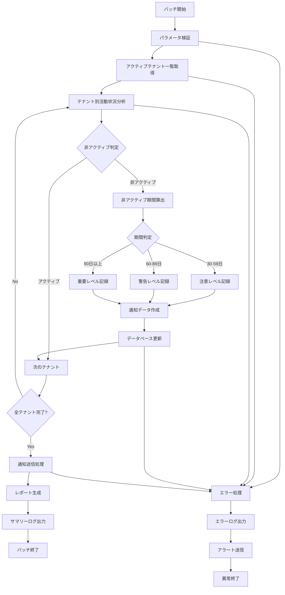

# バッチ定義書：非アクティブテナント検知バッチ (BATCH-304)

## 1. 基本情報

| 項目 | 内容 |
|------|------|
| **バッチID** | BATCH-304 |
| **バッチ名** | 非アクティブテナント検知バッチ |
| **実行スケジュール** | 日次 04:00 |
| **優先度** | 中 |
| **ステータス** | 設計完了 |
| **作成日** | 2025/05/31 |
| **最終更新日** | 2025/05/31 |

## 2. バッチ概要

### 2.1 概要・目的
長期間未使用のテナントを検知し、運用チームに通知するバッチです。テナントの最終ログイン日、データ更新日、API利用状況を分析して、非アクティブなテナントを特定し、適切な対応を促します。

### 2.2 関連テーブル
- [TBL-001_テナント管理](../database/tables/テーブル定義書_TBL-001.md)
- [TBL-002_ユーザー管理](../database/tables/テーブル定義書_TBL-002.md)
- [TBL-015_ログイン履歴](../database/tables/テーブル定義書_TBL-015.md)
- [TBL-016_API利用履歴](../database/tables/テーブル定義書_TBL-016.md)
- [TBL-017_データ更新履歴](../database/tables/テーブル定義書_TBL-017.md)

### 2.3 関連API
- [API-501_テナント情報取得API](../api/specs/API定義書_API-501.md)
- [API-201_通知送信API](../api/specs/API定義書_API-201.md)

## 3. 実行仕様

### 3.1 実行スケジュール
| 項目 | 設定値 | 備考 |
|------|--------|------|
| 実行頻度 | 日次 | cron: 0 4 * * * |
| 実行時間 | 04:00 | 深夜バッチ |
| タイムアウト | 30分 | 最大実行時間 |
| リトライ回数 | 3回 | 失敗時の再実行 |

### 3.2 実行条件
| 条件 | 内容 | 備考 |
|------|------|------|
| 前提条件 | データベース稼働中 | 依存システムチェック |
| 実行可能時間 | 04:00-05:00 | メンテナンス時間外 |
| 排他制御 | 同一バッチの重複実行禁止 | ロックファイル使用 |

### 3.3 実行パラメータ
| パラメータ名 | データ型 | 必須 | デフォルト値 | 説明 |
|--------------|----------|------|--------------|------|
| inactive_days | number | × | 30 | 非アクティブ判定日数 |
| warning_days | number | × | 60 | 警告通知日数 |
| critical_days | number | × | 90 | 重要通知日数 |
| dry_run | boolean | × | false | テスト実行フラグ |

## 4. 処理仕様

### 4.1 処理フロー


### 4.2 詳細処理

#### 4.2.1 アクティブテナント一覧取得
```sql
-- アクティブテナント取得
SELECT 
  t.id,
  t.name,
  t.plan_type,
  t.contract_status,
  t.created_at,
  t.last_accessed_at
FROM tenants t
WHERE t.status = 'active'
  AND t.contract_status = 'active'
ORDER BY t.created_at DESC;
```

#### 4.2.2 テナント活動状況分析
```typescript
interface TenantActivityAnalysis {
  tenantId: string;
  lastLoginDate: Date | null;
  lastDataUpdateDate: Date | null;
  lastApiCallDate: Date | null;
  activeUserCount: number;
  totalApiCalls: number;
  dataUpdateCount: number;
}

class InactiveTenantDetectionService {
  async analyzeTenantActivity(tenantId: string): Promise<TenantActivityAnalysis> {
    const [lastLogin, lastDataUpdate, lastApiCall, activeUsers, apiStats, dataStats] = await Promise.all([
      this.getLastLoginDate(tenantId),
      this.getLastDataUpdateDate(tenantId),
      this.getLastApiCallDate(tenantId),
      this.getActiveUserCount(tenantId),
      this.getApiCallStats(tenantId),
      this.getDataUpdateStats(tenantId)
    ]);

    return {
      tenantId,
      lastLoginDate: lastLogin,
      lastDataUpdateDate: lastDataUpdate,
      lastApiCallDate: lastApiCall,
      activeUserCount: activeUsers,
      totalApiCalls: apiStats.total,
      dataUpdateCount: dataStats.total
    };
  }

  private async getLastLoginDate(tenantId: string): Promise<Date | null> {
    const result = await prisma.loginHistory.findFirst({
      where: { 
        user: { tenantId },
        status: 'success'
      },
      orderBy: { loginAt: 'desc' },
      select: { loginAt: true }
    });
    
    return result?.loginAt || null;
  }

  private async getLastDataUpdateDate(tenantId: string): Promise<Date | null> {
    const result = await prisma.dataUpdateHistory.findFirst({
      where: { tenantId },
      orderBy: { updatedAt: 'desc' },
      select: { updatedAt: true }
    });
    
    return result?.updatedAt || null;
  }

  private async getLastApiCallDate(tenantId: string): Promise<Date | null> {
    const result = await prisma.apiUsageHistory.findFirst({
      where: { tenantId },
      orderBy: { calledAt: 'desc' },
      select: { calledAt: true }
    });
    
    return result?.calledAt || null;
  }

  private async getActiveUserCount(tenantId: string): Promise<number> {
    const thirtyDaysAgo = new Date();
    thirtyDaysAgo.setDate(thirtyDaysAgo.getDate() - 30);

    return await prisma.users.count({
      where: {
        tenantId,
        status: 'active',
        lastLoginAt: {
          gte: thirtyDaysAgo
        }
      }
    });
  }

  private async getApiCallStats(tenantId: string): Promise<{ total: number }> {
    const thirtyDaysAgo = new Date();
    thirtyDaysAgo.setDate(thirtyDaysAgo.getDate() - 30);

    const result = await prisma.apiUsageHistory.aggregate({
      where: {
        tenantId,
        calledAt: {
          gte: thirtyDaysAgo
        }
      },
      _count: { id: true }
    });

    return { total: result._count.id };
  }

  private async getDataUpdateStats(tenantId: string): Promise<{ total: number }> {
    const thirtyDaysAgo = new Date();
    thirtyDaysAgo.setDate(thirtyDaysAgo.getDate() - 30);

    const result = await prisma.dataUpdateHistory.aggregate({
      where: {
        tenantId,
        updatedAt: {
          gte: thirtyDaysAgo
        }
      },
      _count: { id: true }
    });

    return { total: result._count.id };
  }
}
```

#### 4.2.3 非アクティブ判定ロジック
```typescript
interface InactivityLevel {
  level: 'active' | 'attention' | 'warning' | 'critical';
  inactiveDays: number;
  reason: string[];
}

class InactivityAnalyzer {
  analyzeInactivity(
    activity: TenantActivityAnalysis, 
    thresholds: { attention: number; warning: number; critical: number }
  ): InactivityLevel {
    const now = new Date();
    const reasons: string[] = [];
    
    // 最後の活動日を特定
    const lastActivities = [
      activity.lastLoginDate,
      activity.lastDataUpdateDate,
      activity.lastApiCallDate
    ].filter(date => date !== null) as Date[];
    
    if (lastActivities.length === 0) {
      return {
        level: 'critical',
        inactiveDays: 999,
        reason: ['活動履歴が存在しません']
      };
    }
    
    const lastActivityDate = new Date(Math.max(...lastActivities.map(d => d.getTime())));
    const inactiveDays = Math.floor((now.getTime() - lastActivityDate.getTime()) / (1000 * 60 * 60 * 24));
    
    // 非アクティブ要因の分析
    if (!activity.lastLoginDate || this.daysSince(activity.lastLoginDate) > thresholds.attention) {
      reasons.push(`最終ログイン: ${activity.lastLoginDate ? this.daysSince(activity.lastLoginDate) : '不明'}日前`);
    }
    
    if (!activity.lastDataUpdateDate || this.daysSince(activity.lastDataUpdateDate) > thresholds.attention) {
      reasons.push(`最終データ更新: ${activity.lastDataUpdateDate ? this.daysSince(activity.lastDataUpdateDate) : '不明'}日前`);
    }
    
    if (activity.activeUserCount === 0) {
      reasons.push('アクティブユーザー数: 0人');
    }
    
    if (activity.totalApiCalls === 0) {
      reasons.push('API利用: なし（30日間）');
    }
    
    // レベル判定
    let level: InactivityLevel['level'] = 'active';
    if (inactiveDays >= thresholds.critical) {
      level = 'critical';
    } else if (inactiveDays >= thresholds.warning) {
      level = 'warning';
    } else if (inactiveDays >= thresholds.attention) {
      level = 'attention';
    }
    
    return {
      level,
      inactiveDays,
      reason: reasons
    };
  }
  
  private daysSince(date: Date): number {
    const now = new Date();
    return Math.floor((now.getTime() - date.getTime()) / (1000 * 60 * 60 * 24));
  }
}
```

#### 4.2.4 通知・レポート生成
```typescript
interface InactiveTenantReport {
  reportDate: Date;
  totalTenants: number;
  activeTenants: number;
  inactiveTenants: {
    attention: InactiveTenantInfo[];
    warning: InactiveTenantInfo[];
    critical: InactiveTenantInfo[];
  };
  summary: {
    attentionCount: number;
    warningCount: number;
    criticalCount: number;
  };
}

interface InactiveTenantInfo {
  tenantId: string;
  tenantName: string;
  planType: string;
  inactiveDays: number;
  lastActivityDate: Date | null;
  reasons: string[];
  contactEmail: string;
}

class InactiveTenantNotificationService {
  async generateReport(inactiveTenants: Map<string, InactivityLevel>): Promise<InactiveTenantReport> {
    const report: InactiveTenantReport = {
      reportDate: new Date(),
      totalTenants: 0,
      activeTenants: 0,
      inactiveTenants: {
        attention: [],
        warning: [],
        critical: []
      },
      summary: {
        attentionCount: 0,
        warningCount: 0,
        criticalCount: 0
      }
    };

    for (const [tenantId, inactivity] of inactiveTenants) {
      if (inactivity.level === 'active') {
        report.activeTenants++;
        continue;
      }

      const tenant = await this.getTenantInfo(tenantId);
      const tenantInfo: InactiveTenantInfo = {
        tenantId,
        tenantName: tenant.name,
        planType: tenant.planType,
        inactiveDays: inactivity.inactiveDays,
        lastActivityDate: tenant.lastAccessedAt,
        reasons: inactivity.reason,
        contactEmail: tenant.contactEmail
      };

      switch (inactivity.level) {
        case 'attention':
          report.inactiveTenants.attention.push(tenantInfo);
          report.summary.attentionCount++;
          break;
        case 'warning':
          report.inactiveTenants.warning.push(tenantInfo);
          report.summary.warningCount++;
          break;
        case 'critical':
          report.inactiveTenants.critical.push(tenantInfo);
          report.summary.criticalCount++;
          break;
      }
    }

    report.totalTenants = report.activeTenants + 
                         report.summary.attentionCount + 
                         report.summary.warningCount + 
                         report.summary.criticalCount;

    return report;
  }

  async sendNotifications(report: InactiveTenantReport): Promise<void> {
    // 運用チームへの通知
    await this.sendOperationTeamNotification(report);
    
    // 重要レベルのテナントには個別通知
    for (const tenant of report.inactiveTenants.critical) {
      await this.sendTenantNotification(tenant);
    }
    
    // 警告レベルのテナントには軽微な通知
    for (const tenant of report.inactiveTenants.warning) {
      await this.sendTenantWarning(tenant);
    }
  }

  private async sendOperationTeamNotification(report: InactiveTenantReport): Promise<void> {
    const message = this.buildOperationMessage(report);
    
    // Slack通知
    await this.slackService.send({
      channel: '#tenant-monitoring',
      text: '📊 非アクティブテナント検知レポート',
      attachments: [{
        color: report.summary.criticalCount > 0 ? 'danger' : 
               report.summary.warningCount > 0 ? 'warning' : 'good',
        fields: [
          {
            title: '総テナント数',
            value: report.totalTenants.toString(),
            short: true
          },
          {
            title: 'アクティブ',
            value: report.activeTenants.toString(),
            short: true
          },
          {
            title: '注意レベル',
            value: report.summary.attentionCount.toString(),
            short: true
          },
          {
            title: '警告レベル',
            value: report.summary.warningCount.toString(),
            short: true
          },
          {
            title: '重要レベル',
            value: report.summary.criticalCount.toString(),
            short: true
          }
        ]
      }]
    });

    // メール通知（重要レベルがある場合）
    if (report.summary.criticalCount > 0) {
      await this.emailService.send({
        to: 'operations@company.com',
        subject: `【重要】非アクティブテナント検知: ${report.summary.criticalCount}件`,
        template: 'inactive-tenant-critical',
        data: { report }
      });
    }
  }

  private async sendTenantNotification(tenant: InactiveTenantInfo): Promise<void> {
    await this.emailService.send({
      to: tenant.contactEmail,
      subject: 'アカウント利用状況のご確認',
      template: 'tenant-inactive-notice',
      data: {
        tenantName: tenant.tenantName,
        inactiveDays: tenant.inactiveDays,
        reasons: tenant.reasons,
        supportUrl: `${process.env.APP_URL}/support`
      }
    });
  }

  private buildOperationMessage(report: InactiveTenantReport): string {
    let message = `📊 非アクティブテナント検知レポート (${report.reportDate.toLocaleDateString()})\n\n`;
    message += `📈 総テナント数: ${report.totalTenants}\n`;
    message += `✅ アクティブ: ${report.activeTenants}\n`;
    message += `⚠️ 注意レベル: ${report.summary.attentionCount}\n`;
    message += `🚨 警告レベル: ${report.summary.warningCount}\n`;
    message += `🔥 重要レベル: ${report.summary.criticalCount}\n\n`;

    if (report.summary.criticalCount > 0) {
      message += `🔥 重要レベルテナント:\n`;
      for (const tenant of report.inactiveTenants.critical) {
        message += `- ${tenant.tenantName} (${tenant.inactiveDays}日間非アクティブ)\n`;
      }
    }

    return message;
  }
}
```

## 5. データ仕様

### 5.1 入力データ
| データ名 | 形式 | 取得元 | 説明 |
|----------|------|--------|------|
| テナント情報 | DB | tenants | アクティブテナント一覧 |
| ログイン履歴 | DB | login_history | ユーザーログイン記録 |
| API利用履歴 | DB | api_usage_history | API呼び出し記録 |
| データ更新履歴 | DB | data_update_history | データ変更記録 |

### 5.2 出力データ
| データ名 | 形式 | 出力先 | 説明 |
|----------|------|--------|------|
| 非アクティブテナント記録 | DB | inactive_tenant_logs | 検知結果記録 |
| 通知ログ | DB | notification_logs | 通知送信履歴 |
| 実行ログ | LOG | /logs/batch/ | バッチ実行ログ |
| レポートファイル | JSON | /data/reports/ | 詳細レポート |

### 5.3 データ量見積もり
| 項目 | 件数 | 備考 |
|------|------|------|
| 対象テナント数 | 500件 | 全アクティブテナント |
| 非アクティブ検知数 | 50件/日 | 平均値 |
| 処理時間 | 15分 | 平均実行時間 |

## 6. エラーハンドリング

### 6.1 エラー分類
| エラー種別 | 対応方法 | 通知要否 | 備考 |
|------------|----------|----------|------|
| DB接続エラー | リトライ・異常終了 | ○ | システムエラー |
| テナントデータ不整合 | ログ出力・継続 | △ | データエラー |
| 通知送信エラー | ログ出力・継続 | △ | 軽微エラー |

### 6.2 リトライ仕様
| 条件 | リトライ回数 | 間隔 | 備考 |
|------|--------------|------|------|
| DB接続エラー | 3回 | 2分 | 指数バックオフ |
| 外部API呼び出しエラー | 2回 | 1分 | 固定間隔 |
| 通知送信エラー | 3回 | 30秒 | 固定間隔 |

## 7. 監視・運用

### 7.1 監視項目
| 監視項目 | 閾値 | アラート条件 | 対応方法 |
|----------|------|--------------|----------|
| 実行時間 | 30分 | 超過時 | 処理見直し |
| 検知テナント数 | 100件 | 超過時 | 原因調査 |
| 重要レベル検知数 | 10件 | 超過時 | 緊急対応 |

### 7.2 ログ出力
| ログ種別 | 出力レベル | 出力内容 | 保存期間 |
|----------|------------|----------|----------|
| 実行ログ | INFO | 処理開始・終了・進捗 | 3ヶ月 |
| 検知ログ | INFO | 非アクティブテナント詳細 | 1年 |
| エラーログ | ERROR | エラー詳細・スタックトレース | 1年 |

### 7.3 アラート通知
| 通知条件 | 通知先 | 通知方法 | 備考 |
|----------|--------|----------|------|
| 異常終了 | 運用チーム | メール・Slack | 即座に通知 |
| 重要レベル検知 | 運用チーム | Slack | 即座に通知 |
| 処理時間超過 | 開発チーム | Slack | 業務時間内のみ |

## 8. 非機能要件

### 8.1 パフォーマンス
- 処理時間：30分以内
- メモリ使用量：1GB以内
- CPU使用率：50%以内

### 8.2 可用性
- 成功率：99%以上
- リトライ機能による自動復旧
- 障害時の手動実行機能

### 8.3 セキュリティ
- 実行権限の制限
- テナント情報の適切な取り扱い
- 通知内容の機密性保護

## 9. 実装メモ

### 9.1 技術仕様
- 言語：Node.js (TypeScript)
- DB接続：Prisma
- 通知：Nodemailer, Slack API
- ログ出力：Winston

### 9.2 注意事項
- マルチテナント環境での適切な分離
- 大量テナント処理時のメモリ管理
- 通知頻度の制御（スパム防止）

---

**改訂履歴**

| バージョン | 日付 | 変更者 | 変更内容 |
|------------|------|--------|----------|
| 1.0 | 2025/05/31 | システムアーキテクト | 初版作成 |
