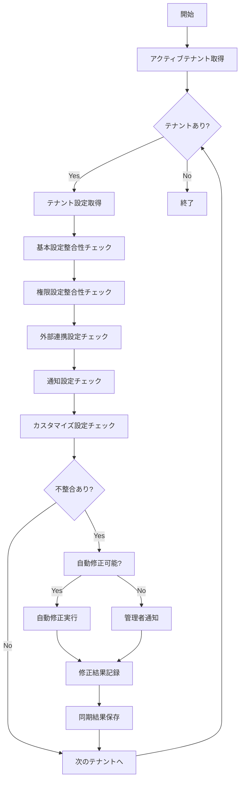

# バッチ定義書：テナント設定同期バッチ

| 項目                | 内容                                                                                |
|---------------------|------------------------------------------------------------------------------------|
| **バッチID**        | BATCH-305                                                                          |
| **バッチ名称**      | テナント設定同期バッチ                                                              |
| **機能カテゴリ**    | テナント管理                                                                        |
| **概要・目的**      | テナント間の設定整合性を確認し、不整合があれば自動修正または管理者に通知する         |
| **バッチ種別**      | 定期バッチ                                                                          |
| **実行スケジュール**| 毎日深夜（3:30）                                                                    |
| **入出力対象**      | テナント設定テーブル、同期結果テーブル                                              |
| **優先度**          | 高                                                                                  |
| **備考**            | マルチテナント運用の要、設定不整合の早期発見・修正                                  |

## 1. 処理概要

テナント設定同期バッチは、マルチテナント環境において各テナントの設定情報の整合性を定期的に検証し、設定の不整合や矛盾を検出・修正するバッチ処理です。テナント固有設定、共通設定、外部連携設定などを包括的にチェックし、問題があれば自動修正または管理者に通知します。

## 2. 処理フロー



## 3. 入力データ

### 3.1 テナント基本設定

| フィールド名      | データ型 | 説明                                           |
|-------------------|----------|------------------------------------------------|
| tenant_id         | String   | テナントID                                     |
| tenant_name       | String   | テナント名                                     |
| status            | String   | ステータス（ACTIVE/INACTIVE/SUSPENDED）        |
| plan_type         | String   | 契約プラン                                     |
| user_limit        | Integer  | ユーザー数上限                                 |
| storage_limit_gb  | Integer  | ストレージ容量上限                             |
| api_rate_limit    | Integer  | API呼び出し制限                                |
| timezone          | String   | タイムゾーン                                   |
| locale            | String   | ロケール                                       |

### 3.2 テナント権限設定

| フィールド名      | データ型 | 説明                                           |
|-------------------|----------|------------------------------------------------|
| tenant_id         | String   | テナントID                                     |
| feature_name      | String   | 機能名                                         |
| permission_level  | String   | 権限レベル（FULL/LIMITED/NONE）                |
| custom_settings   | JSON     | カスタム設定                                   |
| enabled           | Boolean  | 有効/無効                                      |
| updated_at        | DateTime | 最終更新日時                                   |

### 3.3 外部連携設定

| フィールド名      | データ型 | 説明                                           |
|-------------------|----------|------------------------------------------------|
| tenant_id         | String   | テナントID                                     |
| service_type      | String   | 連携サービス種別（SLACK/TEAMS/LINE_WORKS等）   |
| connection_status | String   | 接続状態（CONNECTED/DISCONNECTED/ERROR）       |
| api_endpoint      | String   | APIエンドポイント                              |
| auth_token        | String   | 認証トークン（暗号化）                         |
| webhook_url       | String   | Webhook URL                                    |
| last_sync_at      | DateTime | 最終同期日時                                   |

### 3.4 通知設定

| フィールド名      | データ型 | 説明                                           |
|-------------------|----------|------------------------------------------------|
| tenant_id         | String   | テナントID                                     |
| notification_type | String   | 通知種別                                       |
| enabled           | Boolean  | 有効/無効                                      |
| recipients        | JSON     | 受信者リスト                                   |
| schedule          | String   | 送信スケジュール                               |
| template_id       | String   | テンプレートID                                 |

## 4. 出力データ

### 4.1 設定同期結果テーブル（新規作成）

| フィールド名      | データ型 | 説明                                           |
|-------------------|----------|------------------------------------------------|
| sync_id           | String   | 同期ID（主キー）                               |
| tenant_id         | String   | テナントID                                     |
| sync_date         | Date     | 同期実行日                                     |
| setting_category  | String   | 設定カテゴリ                                   |
| check_type        | String   | チェック種別                                   |
| status            | String   | 結果（SUCCESS/WARNING/ERROR）                  |
| issues_found      | Integer  | 発見された問題数                               |
| auto_fixed        | Integer  | 自動修正された問題数                           |
| manual_required   | Integer  | 手動対応が必要な問題数                         |
| details           | JSON     | 詳細情報                                       |
| created_at        | DateTime | 作成日時                                       |

### 4.2 設定不整合ログテーブル（新規作成）

| フィールド名      | データ型 | 説明                                           |
|-------------------|----------|------------------------------------------------|
| inconsistency_id  | String   | 不整合ID（主キー）                             |
| tenant_id         | String   | テナントID                                     |
| setting_name      | String   | 設定項目名                                     |
| expected_value    | String   | 期待値                                         |
| actual_value      | String   | 実際の値                                       |
| severity          | String   | 重要度（CRITICAL/HIGH/MEDIUM/LOW）             |
| auto_fixable      | Boolean  | 自動修正可能フラグ                             |
| fix_action        | String   | 修正アクション                                 |
| status            | String   | 状態（DETECTED/FIXED/IGNORED/PENDING）         |
| detected_at       | DateTime | 検出日時                                       |
| fixed_at          | DateTime | 修正日時                                       |

### 4.3 設定変更履歴テーブル（新規作成）

| フィールド名      | データ型 | 説明                                           |
|-------------------|----------|------------------------------------------------|
| change_id         | String   | 変更ID（主キー）                               |
| tenant_id         | String   | テナントID                                     |
| setting_name      | String   | 設定項目名                                     |
| old_value         | String   | 変更前の値                                     |
| new_value         | String   | 変更後の値                                     |
| change_type       | String   | 変更種別（AUTO_FIX/MANUAL/SYSTEM）             |
| changed_by        | String   | 変更者（BATCH_SYSTEM/USER_ID）                 |
| reason            | String   | 変更理由                                       |
| changed_at        | DateTime | 変更日時                                       |

## 5. チェック仕様

### 5.1 基本設定整合性チェック

```sql
-- プラン制限チェック
SELECT 
    t.tenant_id,
    t.plan_type,
    t.user_limit,
    COUNT(u.id) as actual_users
FROM tenants t
LEFT JOIN users u ON t.tenant_id = u.tenant_id AND u.status = 'ACTIVE'
GROUP BY t.tenant_id, t.plan_type, t.user_limit
HAVING COUNT(u.id) > t.user_limit;
```

### 5.2 権限設定整合性チェック

```sql
-- 無効なプランでの機能有効化チェック
SELECT 
    tp.tenant_id,
    tp.feature_name,
    tp.permission_level,
    t.plan_type
FROM tenant_permissions tp
JOIN tenants t ON tp.tenant_id = t.tenant_id
JOIN plan_features pf ON t.plan_type = pf.plan_type AND tp.feature_name = pf.feature_name
WHERE tp.enabled = true 
    AND pf.available = false;
```

### 5.3 外部連携設定チェック

```sql
-- 期限切れトークンチェック
SELECT 
    tenant_id,
    service_type,
    connection_status,
    last_sync_at
FROM external_integrations
WHERE connection_status = 'CONNECTED'
    AND last_sync_at < NOW() - INTERVAL '7 days';
```

### 5.4 通知設定チェック

```sql
-- 無効な受信者チェック
SELECT 
    ns.tenant_id,
    ns.notification_type,
    ns.recipients
FROM notification_settings ns
WHERE ns.enabled = true
    AND NOT EXISTS (
        SELECT 1 FROM users u 
        WHERE u.tenant_id = ns.tenant_id 
            AND u.email = ANY(SELECT jsonb_array_elements_text(ns.recipients))
            AND u.status = 'ACTIVE'
    );
```

## 6. 自動修正機能

### 6.1 自動修正可能な問題

| 問題種別                | 修正内容                                           |
|-------------------------|---------------------------------------------------|
| 無効ユーザーの通知設定  | 受信者リストから無効ユーザーを削除                |
| 期限切れ外部連携        | 接続状態をDISCONNECTEDに更新                      |
| 重複設定                | 最新の設定を残して重複を削除                      |
| 無効な権限設定          | プランに応じた適切な権限レベルに修正              |
| タイムゾーン不整合      | デフォルトタイムゾーンに修正                      |

### 6.2 手動対応が必要な問題

| 問題種別                | 理由                                               |
|-------------------------|---------------------------------------------------|
| ユーザー数上限超過      | ビジネス判断が必要                                |
| 重要な機能の無効化      | 業務影響の確認が必要                              |
| 外部連携認証エラー      | 再認証が必要                                      |
| カスタム設定の矛盾      | 要件確認が必要                                    |

## 7. エラー処理

| エラーケース                      | 対応方法                                                                 |
|-----------------------------------|--------------------------------------------------------------------------|
| 設定データアクセスエラー          | エラーログを記録し、該当テナントをスキップして継続処理                   |
| 自動修正処理失敗                  | 修正をロールバックし、手動対応として記録                                 |
| 外部API呼び出しエラー             | リトライ後、失敗した場合は接続状態をERRORに更新                          |
| 設定値検証エラー                  | 警告ログを記録し、検証スキップして継続                                   |

## 8. 通知・アラート

### 8.1 重要度別通知

| 重要度    | 通知条件                                           | 通知先           |
|-----------|---------------------------------------------------|------------------|
| CRITICAL  | ユーザー数上限超過、重要機能の無効化              | 即座に管理者     |
| HIGH      | 外部連携エラー、権限設定不整合                    | 1時間以内        |
| MEDIUM    | 通知設定の軽微な問題                              | 日次レポート     |
| LOW       | 自動修正された軽微な問題                          | 週次レポート     |

### 8.2 通知内容

```typescript
interface SyncAlert {
  tenantId: string;
  tenantName: string;
  severity: 'CRITICAL' | 'HIGH' | 'MEDIUM' | 'LOW';
  category: string;
  issueCount: number;
  autoFixedCount: number;
  manualRequiredCount: number;
  details: {
    settingName: string;
    issue: string;
    recommendedAction: string;
  }[];
}
```

## 9. パフォーマンス最適化

### 9.1 インデックス要件

```sql
-- テナント設定チェック用インデックス
CREATE INDEX idx_tenants_status_plan ON tenants(status, plan_type);
CREATE INDEX idx_tenant_permissions_tenant_feature ON tenant_permissions(tenant_id, feature_name);
CREATE INDEX idx_external_integrations_tenant_status ON external_integrations(tenant_id, connection_status);
CREATE INDEX idx_notification_settings_tenant_enabled ON notification_settings(tenant_id, enabled);

-- 履歴検索用インデックス
CREATE INDEX idx_sync_results_tenant_date ON tenant_sync_results(tenant_id, sync_date);
CREATE INDEX idx_inconsistency_log_tenant_status ON setting_inconsistency_log(tenant_id, status);
```

### 9.2 バッチ処理最適化

| テナント数      | 並列度 | バッチサイズ | 推定処理時間 |
|-----------------|--------|--------------|--------------|
| ～100テナント   | 2      | 20テナント   | 10分         |
| 101～500テナント| 4      | 50テナント   | 15分         |
| 501テナント～   | 8      | 100テナント  | 25分         |

## 10. 依存関係

- テナント管理テーブル
- ユーザー管理テーブル
- 権限設定テーブル
- 外部連携設定テーブル
- 通知設定テーブル
- プラン・機能マスタテーブル

## 11. 実行パラメータ

| パラメータ名        | 必須 | デフォルト値 | 説明                                           |
|---------------------|------|--------------|------------------------------------------------|
| --tenant-id         | No   | all          | 特定テナントのみ同期                           |
| --check-category    | No   | all          | 特定カテゴリのみチェック                       |
| --auto-fix          | No   | true         | 自動修正機能の有効/無効                        |
| --dry-run           | No   | false        | チェックのみ実行、修正なし                     |
| --skip-notifications| No   | false        | 通知送信をスキップ                             |
| --parallel-count    | No   | 4            | 並列処理数                                     |

## 12. 実行例

```bash
# 通常実行
npm run batch:tenant-settings-sync

# 特定テナントのみ同期
npm run batch:tenant-settings-sync -- --tenant-id=tenant_001

# 権限設定のみチェック
npm run batch:tenant-settings-sync -- --check-category=permissions

# 自動修正無効
npm run batch:tenant-settings-sync -- --auto-fix=false

# ドライラン
npm run batch:tenant-settings-sync -- --dry-run

# TypeScript直接実行
npx tsx src/batch/tenant-settings-sync.ts

# パラメータ付きTypeScript実行
npx tsx src/batch/tenant-settings-sync.ts --tenant-id=tenant_001 --auto-fix=true
```

## 13. 運用上の注意点

- 本バッチは他のテナント管理バッチの実行前に実行し、設定の整合性を確保してください。
- 自動修正機能は慎重に使用し、重要な設定については必ず管理者の確認を経てください。
- 外部連携の認証情報は定期的に更新し、セキュリティを維持してください。
- 大量のテナントがある場合、処理時間を考慮して並列処理数を調整してください。

## 14. セキュリティ考慮事項

### 14.1 機密情報の取り扱い

- 認証トークンは暗号化して保存
- ログには機密情報を出力しない
- 設定変更履歴の適切な保持期間設定

### 14.2 アクセス制御

- バッチ実行権限の制限
- 設定変更権限の分離
- 監査ログの記録

## 15. 改訂履歴

| 改訂日     | 改訂者 | 改訂内容                                         |
|------------|--------|--------------------------------------------------|
| 2025/05/31 | 初版   | 初版作成                                         |
