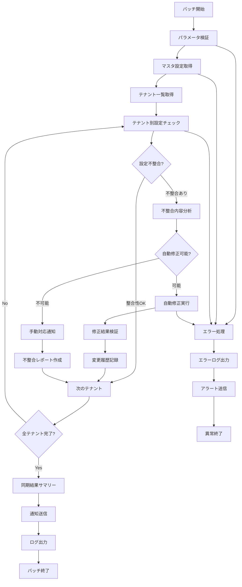

# バッチ定義書：テナント設定同期バッチ (BATCH-305)

## 1. 基本情報

| 項目 | 内容 |
|------|------|
| **バッチID** | BATCH-305 |
| **バッチ名** | テナント設定同期バッチ |
| **実行スケジュール** | 日次 03:30 |
| **優先度** | 中 |
| **ステータス** | 設計完了 |
| **作成日** | 2025/05/31 |
| **最終更新日** | 2025/05/31 |

## 2. バッチ概要

### 2.1 概要・目的
テナント間の設定整合性を確認し、不整合がある場合は自動修正または通知を行うバッチです。マスタ設定の変更、プラン変更に伴う設定更新、システム設定の同期を自動化し、テナント運用の安定性を確保します。

### 2.2 関連テーブル
- [TBL-001_テナント管理](../database/tables/テーブル定義書_TBL-001.md)
- [TBL-032_テナント設定](../database/tables/テーブル定義書_TBL-032.md)
- [TBL-033_リソース割り当て](../database/tables/テーブル定義書_TBL-033.md)
- [TBL-035_設定変更履歴](../database/tables/テーブル定義書_TBL-035.md)
- [TBL-036_システム設定マスタ](../database/tables/テーブル定義書_TBL-036.md)

### 2.3 関連API
- [API-502_テナント設定更新API](../api/specs/API定義書_API-502.md)
- [API-503_設定同期API](../api/specs/API定義書_API-503.md)

## 3. 実行仕様

### 3.1 実行スケジュール
| 項目 | 設定値 | 備考 |
|------|--------|------|
| 実行頻度 | 日次 | cron: 30 3 * * * |
| 実行時間 | 03:30 | 深夜バッチ |
| タイムアウト | 45分 | 最大実行時間 |
| リトライ回数 | 3回 | 失敗時の再実行 |

### 3.2 実行条件
| 条件 | 内容 | 備考 |
|------|------|------|
| 前提条件 | データベース稼働中 | 依存システムチェック |
| 実行可能時間 | 03:30-04:30 | メンテナンス時間外 |
| 排他制御 | 同一バッチの重複実行禁止 | ロックファイル使用 |

### 3.3 実行パラメータ
| パラメータ名 | データ型 | 必須 | デフォルト値 | 説明 |
|--------------|----------|------|--------------|------|
| tenant_id | string | × | all | 対象テナントID |
| sync_type | string | × | all | 同期種別（plan/system/custom） |
| auto_fix | boolean | × | true | 自動修正フラグ |
| dry_run | boolean | × | false | テスト実行フラグ |

## 4. 処理仕様

### 4.1 処理フロー


### 4.2 詳細処理

#### 4.2.1 マスタ設定取得
```typescript
interface SystemMasterSettings {
  planSettings: Map<string, PlanConfiguration>;
  systemDefaults: SystemDefaultSettings;
  featureFlags: Map<string, boolean>;
  resourceLimits: Map<string, ResourceLimit>;
}

interface PlanConfiguration {
  planType: string;
  features: Record<string, boolean>;
  limits: Record<string, number>;
  settings: Record<string, any>;
}

class TenantSettingSyncService {
  async getMasterSettings(): Promise<SystemMasterSettings> {
    const [planConfigs, systemDefaults, featureFlags, resourceLimits] = await Promise.all([
      this.getPlanConfigurations(),
      this.getSystemDefaultSettings(),
      this.getFeatureFlags(),
      this.getResourceLimits()
    ]);

    return {
      planSettings: new Map(planConfigs.map(p => [p.planType, p])),
      systemDefaults,
      featureFlags: new Map(featureFlags.map(f => [f.key, f.enabled])),
      resourceLimits: new Map(resourceLimits.map(r => [r.planType, r]))
    };
  }

  private async getPlanConfigurations(): Promise<PlanConfiguration[]> {
    return await prisma.planConfigurations.findMany({
      where: { status: 'active' },
      include: {
        features: true,
        limits: true,
        settings: true
      }
    });
  }

  private async getSystemDefaultSettings(): Promise<SystemDefaultSettings> {
    const settings = await prisma.systemSettings.findMany({
      where: { category: 'default' }
    });

    return settings.reduce((acc, setting) => {
      acc[setting.key] = setting.value;
      return acc;
    }, {} as SystemDefaultSettings);
  }
}
```

#### 4.2.2 テナント設定整合性チェック
```typescript
interface SettingInconsistency {
  tenantId: string;
  category: 'plan' | 'system' | 'resource' | 'feature';
  key: string;
  currentValue: any;
  expectedValue: any;
  severity: 'low' | 'medium' | 'high' | 'critical';
  autoFixable: boolean;
  reason: string;
}

class SettingConsistencyChecker {
  async checkTenantSettings(
    tenantId: string, 
    masterSettings: SystemMasterSettings
  ): Promise<SettingInconsistency[]> {
    const tenant = await this.getTenantWithSettings(tenantId);
    const inconsistencies: SettingInconsistency[] = [];

    // プラン設定チェック
    const planInconsistencies = await this.checkPlanSettings(tenant, masterSettings);
    inconsistencies.push(...planInconsistencies);

    // システム設定チェック
    const systemInconsistencies = await this.checkSystemSettings(tenant, masterSettings);
    inconsistencies.push(...systemInconsistencies);

    // リソース制限チェック
    const resourceInconsistencies = await this.checkResourceLimits(tenant, masterSettings);
    inconsistencies.push(...resourceInconsistencies);

    // 機能フラグチェック
    const featureInconsistencies = await this.checkFeatureFlags(tenant, masterSettings);
    inconsistencies.push(...featureInconsistencies);

    return inconsistencies;
  }

  private async checkPlanSettings(
    tenant: TenantWithSettings, 
    masterSettings: SystemMasterSettings
  ): Promise<SettingInconsistency[]> {
    const inconsistencies: SettingInconsistency[] = [];
    const planConfig = masterSettings.planSettings.get(tenant.planType);

    if (!planConfig) {
      inconsistencies.push({
        tenantId: tenant.id,
        category: 'plan',
        key: 'plan_type',
        currentValue: tenant.planType,
        expectedValue: 'valid_plan',
        severity: 'critical',
        autoFixable: false,
        reason: '無効なプランタイプが設定されています'
      });
      return inconsistencies;
    }

    // プラン固有設定の確認
    for (const [key, expectedValue] of Object.entries(planConfig.settings)) {
      const currentSetting = tenant.settings.find(s => s.key === key);
      const currentValue = currentSetting?.value;

      if (currentValue !== expectedValue) {
        inconsistencies.push({
          tenantId: tenant.id,
          category: 'plan',
          key,
          currentValue,
          expectedValue,
          severity: this.determineSeverity(key, currentValue, expectedValue),
          autoFixable: this.isAutoFixable(key),
          reason: `プラン設定が期待値と異なります: ${key}`
        });
      }
    }

    return inconsistencies;
  }

  private async checkResourceLimits(
    tenant: TenantWithSettings, 
    masterSettings: SystemMasterSettings
  ): Promise<SettingInconsistency[]> {
    const inconsistencies: SettingInconsistency[] = [];
    const expectedLimits = masterSettings.resourceLimits.get(tenant.planType);

    if (!expectedLimits) return inconsistencies;

    const currentAllocation = await prisma.resourceAllocations.findUnique({
      where: { tenantId: tenant.id }
    });

    if (!currentAllocation) {
      inconsistencies.push({
        tenantId: tenant.id,
        category: 'resource',
        key: 'resource_allocation',
        currentValue: null,
        expectedValue: expectedLimits,
        severity: 'critical',
        autoFixable: true,
        reason: 'リソース割り当てが設定されていません'
      });
      return inconsistencies;
    }

    // 各リソース制限の確認
    const resourceChecks = [
      { key: 'storageQuotaGB', current: currentAllocation.storageQuotaGB, expected: expectedLimits.storageQuotaGB },
      { key: 'maxUsers', current: currentAllocation.maxUsers, expected: expectedLimits.maxUsers },
      { key: 'apiCallsPerHour', current: currentAllocation.apiCallsPerHour, expected: expectedLimits.apiCallsPerHour }
    ];

    for (const check of resourceChecks) {
      if (check.current !== check.expected) {
        inconsistencies.push({
          tenantId: tenant.id,
          category: 'resource',
          key: check.key,
          currentValue: check.current,
          expectedValue: check.expected,
          severity: 'medium',
          autoFixable: true,
          reason: `リソース制限が期待値と異なります: ${check.key}`
        });
      }
    }

    return inconsistencies;
  }

  private async checkFeatureFlags(
    tenant: TenantWithSettings, 
    masterSettings: SystemMasterSettings
  ): Promise<SettingInconsistency[]> {
    const inconsistencies: SettingInconsistency[] = [];
    const planConfig = masterSettings.planSettings.get(tenant.planType);

    if (!planConfig) return inconsistencies;

    // プラン別機能フラグの確認
    for (const [featureKey, expectedEnabled] of Object.entries(planConfig.features)) {
      const currentSetting = tenant.settings.find(s => s.key === `features.${featureKey}`);
      const currentEnabled = currentSetting?.value === 'enabled';

      if (currentEnabled !== expectedEnabled) {
        inconsistencies.push({
          tenantId: tenant.id,
          category: 'feature',
          key: featureKey,
          currentValue: currentEnabled,
          expectedValue: expectedEnabled,
          severity: 'low',
          autoFixable: true,
          reason: `機能フラグが期待値と異なります: ${featureKey}`
        });
      }
    }

    return inconsistencies;
  }

  private determineSeverity(key: string, current: any, expected: any): SettingInconsistency['severity'] {
    // セキュリティ関連設定
    if (key.includes('security') || key.includes('auth')) return 'high';
    
    // 課金関連設定
    if (key.includes('billing') || key.includes('payment')) return 'high';
    
    // 機能制限関連
    if (key.includes('limit') || key.includes('quota')) return 'medium';
    
    // UI/UX関連
    if (key.includes('theme') || key.includes('display')) return 'low';
    
    return 'medium';
  }

  private isAutoFixable(key: string): boolean {
    // セキュリティ設定は手動対応
    if (key.includes('security') || key.includes('password')) return false;
    
    // 課金設定は手動対応
    if (key.includes('billing') || key.includes('payment')) return false;
    
    // その他は自動修正可能
    return true;
  }
}
```

#### 4.2.3 自動修正処理
```typescript
interface SyncResult {
  tenantId: string;
  fixedInconsistencies: SettingInconsistency[];
  manualInconsistencies: SettingInconsistency[];
  errors: string[];
}

class SettingAutoFixer {
  async fixInconsistencies(
    inconsistencies: SettingInconsistency[],
    autoFix: boolean = true
  ): Promise<SyncResult> {
    const result: SyncResult = {
      tenantId: inconsistencies[0]?.tenantId || '',
      fixedInconsistencies: [],
      manualInconsistencies: [],
      errors: []
    };

    for (const inconsistency of inconsistencies) {
      try {
        if (autoFix && inconsistency.autoFixable) {
          await this.applyFix(inconsistency);
          result.fixedInconsistencies.push(inconsistency);
        } else {
          result.manualInconsistencies.push(inconsistency);
        }
      } catch (error) {
        result.errors.push(`${inconsistency.key}: ${error.message}`);
      }
    }

    return result;
  }

  private async applyFix(inconsistency: SettingInconsistency): Promise<void> {
    switch (inconsistency.category) {
      case 'plan':
        await this.fixPlanSetting(inconsistency);
        break;
      case 'system':
        await this.fixSystemSetting(inconsistency);
        break;
      case 'resource':
        await this.fixResourceSetting(inconsistency);
        break;
      case 'feature':
        await this.fixFeatureSetting(inconsistency);
        break;
    }

    // 変更履歴記録
    await this.recordSettingChange(inconsistency);
  }

  private async fixPlanSetting(inconsistency: SettingInconsistency): Promise<void> {
    await prisma.tenantSettings.upsert({
      where: {
        tenantId_key: {
          tenantId: inconsistency.tenantId,
          key: inconsistency.key
        }
      },
      update: {
        value: inconsistency.expectedValue,
        updatedAt: new Date(),
        updatedBy: 'system_sync'
      },
      create: {
        tenantId: inconsistency.tenantId,
        key: inconsistency.key,
        value: inconsistency.expectedValue,
        createdAt: new Date(),
        createdBy: 'system_sync'
      }
    });
  }

  private async fixResourceSetting(inconsistency: SettingInconsistency): Promise<void> {
    if (inconsistency.key === 'resource_allocation') {
      // 新規リソース割り当て作成
      await prisma.resourceAllocations.create({
        data: {
          tenantId: inconsistency.tenantId,
          ...inconsistency.expectedValue,
          allocatedAt: new Date(),
          allocatedBy: 'system_sync'
        }
      });
    } else {
      // 既存リソース割り当て更新
      await prisma.resourceAllocations.update({
        where: { tenantId: inconsistency.tenantId },
        data: {
          [inconsistency.key]: inconsistency.expectedValue,
          updatedAt: new Date(),
          updatedBy: 'system_sync'
        }
      });
    }
  }

  private async fixFeatureSetting(inconsistency: SettingInconsistency): Promise<void> {
    const settingKey = `features.${inconsistency.key}`;
    const settingValue = inconsistency.expectedValue ? 'enabled' : 'disabled';

    await prisma.tenantSettings.upsert({
      where: {
        tenantId_key: {
          tenantId: inconsistency.tenantId,
          key: settingKey
        }
      },
      update: {
        value: settingValue,
        updatedAt: new Date(),
        updatedBy: 'system_sync'
      },
      create: {
        tenantId: inconsistency.tenantId,
        key: settingKey,
        value: settingValue,
        createdAt: new Date(),
        createdBy: 'system_sync'
      }
    });
  }

  private async recordSettingChange(inconsistency: SettingInconsistency): Promise<void> {
    await prisma.settingChangeHistory.create({
      data: {
        tenantId: inconsistency.tenantId,
        category: inconsistency.category,
        key: inconsistency.key,
        oldValue: inconsistency.currentValue,
        newValue: inconsistency.expectedValue,
        changeReason: 'automatic_sync',
        changedBy: 'system_sync',
        changedAt: new Date()
      }
    });
  }
}
```

#### 4.2.4 通知・レポート生成
```typescript
interface SyncReport {
  reportDate: Date;
  totalTenants: number;
  checkedTenants: number;
  tenantsWithInconsistencies: number;
  autoFixedCount: number;
  manualActionRequired: number;
  summary: {
    planInconsistencies: number;
    systemInconsistencies: number;
    resourceInconsistencies: number;
    featureInconsistencies: number;
  };
  details: TenantSyncDetail[];
}

interface TenantSyncDetail {
  tenantId: string;
  tenantName: string;
  planType: string;
  inconsistencyCount: number;
  autoFixedCount: number;
  manualActionCount: number;
  criticalIssues: SettingInconsistency[];
}

class SettingSyncNotificationService {
  async generateSyncReport(syncResults: Map<string, SyncResult>): Promise<SyncReport> {
    const report: SyncReport = {
      reportDate: new Date(),
      totalTenants: syncResults.size,
      checkedTenants: syncResults.size,
      tenantsWithInconsistencies: 0,
      autoFixedCount: 0,
      manualActionRequired: 0,
      summary: {
        planInconsistencies: 0,
        systemInconsistencies: 0,
        resourceInconsistencies: 0,
        featureInconsistencies: 0
      },
      details: []
    };

    for (const [tenantId, result] of syncResults) {
      const tenant = await this.getTenantInfo(tenantId);
      const totalInconsistencies = result.fixedInconsistencies.length + result.manualInconsistencies.length;
      
      if (totalInconsistencies > 0) {
        report.tenantsWithInconsistencies++;
      }

      report.autoFixedCount += result.fixedInconsistencies.length;
      report.manualActionRequired += result.manualInconsistencies.length;

      // カテゴリ別集計
      [...result.fixedInconsistencies, ...result.manualInconsistencies].forEach(inc => {
        switch (inc.category) {
          case 'plan': report.summary.planInconsistencies++; break;
          case 'system': report.summary.systemInconsistencies++; break;
          case 'resource': report.summary.resourceInconsistencies++; break;
          case 'feature': report.summary.featureInconsistencies++; break;
        }
      });

      // 詳細情報
      report.details.push({
        tenantId,
        tenantName: tenant.name,
        planType: tenant.planType,
        inconsistencyCount: totalInconsistencies,
        autoFixedCount: result.fixedInconsistencies.length,
        manualActionCount: result.manualInconsistencies.length,
        criticalIssues: result.manualInconsistencies.filter(inc => inc.severity === 'critical')
      });
    }

    return report;
  }

  async sendNotifications(report: SyncReport): Promise<void> {
    // 運用チームへの通知
    await this.sendOperationTeamNotification(report);
    
    // 重要な不整合がある場合は緊急通知
    const criticalIssues = report.details.flatMap(d => d.criticalIssues);
    if (criticalIssues.length > 0) {
      await this.sendCriticalIssueAlert(criticalIssues);
    }
  }

  private async sendOperationTeamNotification(report: SyncReport): Promise<void> {
    // Slack通知
    await this.slackService.send({
      channel: '#tenant-operations',
      text: '🔄 テナント設定同期レポート',
      attachments: [{
        color: report.manualActionRequired > 0 ? 'warning' : 'good',
        fields: [
          {
            title: '対象テナント数',
            value: report.totalTenants.toString(),
            short: true
          },
          {
            title: '不整合検知',
            value: report.tenantsWithInconsistencies.toString(),
            short: true
          },
          {
            title: '自動修正',
            value: report.autoFixedCount.toString(),
            short: true
          },
          {
            title: '手動対応要',
            value: report.manualActionRequired.toString(),
            short: true
          }
        ]
      }]
    });

    // 手動対応が必要な場合はメール通知
    if (report.manualActionRequired > 0) {
      await this.emailService.send({
        to: 'operations@company.com',
        subject: `テナント設定同期: ${report.manualActionRequired}件の手動対応が必要`,
        template: 'tenant-setting-sync-report',
        data: { report }
      });
    }
  }
}
```

## 5. データ仕様

### 5.1 入力データ
| データ名 | 形式 | 取得元 | 説明 |
|----------|------|--------|------|
| テナント情報 | DB | tenants | 全アクティブテナント |
| テナント設定 | DB | tenant_settings | テナント固有設定 |
| プラン設定マスタ | DB | plan_configurations | プラン別設定テンプレート |
| システム設定マスタ | DB | system_settings | システムデフォルト設定 |

### 5.2 出力データ
| データ名 | 形式 | 出力先 | 説明 |
|----------|------|--------|------|
| 設定変更履歴 | DB | setting_change_history | 自動修正履歴 |
| 同期結果ログ | DB | sync_result_logs | 同期処理結果 |
| 実行ログ | LOG | /logs/batch/ | バッチ実行ログ |
| 不整合レポート | JSON | /data/reports/ | 手動対応要件レポート |

### 5.3 データ量見積もり
| 項目 | 件数 | 備考 |
|------|------|------|
| 対象テナント数 | 500件 | 全アクティブテナント |
| 設定項目数 | 50項目/テナント | 平均設定数 |
| 不整合検知数 | 20件/日 | 平均値 |
| 処理時間 | 20分 | 平均実行時間 |

## 6. エラーハンドリング

### 6.1 エラー分類
| エラー種別 | 対応方法 | 通知要否 | 備考 |
|------------|----------|----------|------|
| DB接続エラー | リトライ・異常終了 | ○ | システムエラー |
| 設定値不正 | ログ出力・継続 | △ | データエラー |
| 自動修正失敗 | 手動対応通知 | ○ | 業務エラー |

### 6.2 リトライ仕様
| 条件 | リトライ回数 | 間隔 | 備考 |
|------|--------------|------|------|
| DB接続エラー | 3回 | 2分 | 指数バックオフ |
| 設定更新エラー | 2回 | 1分 | 固定間隔 |
| 通知送信エラー | 3回 | 30秒 | 固定間隔 |

## 7. 監視・運用

### 7.1 監視項目
| 監視項目 | 閾値 | アラート条件 | 対応方法 |
|----------|------|--------------|----------|
| 実行時間 | 45分 | 超過時 | 処理見直し |
| 不整合検知数 | 100件 | 超過時 | 原因調査 |
| 自動修正失敗率 | 10% | 超過時 | ロジック見直し |

### 7.2 ログ出力
| ログ種別 | 出力レベル | 出力内容 | 保存期間 |
|----------|------------|----------|----------|
| 実行ログ | INFO | 処理開始・終了・進捗 | 3ヶ月 |
| 同期ログ | INFO | 設定同期詳細 | 1年 |
| エラーログ | ERROR | エラー詳細・スタックトレース | 1年 |

### 7.3 アラート通知
| 通知条件 | 通知先 | 通知方法 | 備考 |
|----------|--------|----------|------|
| 異常終了 | 運用チーム | メール・Slack | 即座に通知 |
| 重要不整合検知 | 運用チーム | Slack | 即座に通知 |
| 手動対応要 | 運用チーム | メール | 日次サマリー |

## 8. 非機能要件

### 8.1 パフォーマンス
- 処理時間：45分以内
- メモリ使用量：1.5GB以内
- CPU使用率：60%以内

### 8.2 可用性
- 成功率：99%以上
- リトライ機能による自動復旧
- 障害時の手動実行機能

### 8.3 セキュリティ
- 実行権限の制限
- 設定変更の監査ログ
- 機密設定の暗号化

## 9. 実装メモ

### 9.1 技術仕様
- 言語：Node.js (TypeScript)
- DB接続：Prisma
- 設定管理：JSON Schema
- ログ出力：Winston

### 9.2 注意事項
- マルチテナント環境での設定分離
- 設定変更の影響範囲確認
- ロールバック機能の実装

---

**改訂履歴**

| バージョン | 日付 | 変更者 | 変更内容 |
|------------|------|--------|----------|
| 1.0 | 2025/05/31 | システムアーキテクト | 初版作成 |
