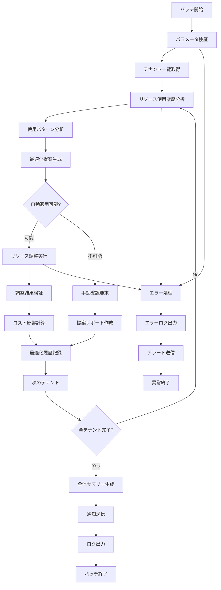

# バッチ定義書：テナントリソース最適化バッチ (BATCH-306)

## 1. 基本情報

| 項目 | 内容 |
|------|------|
| **バッチID** | BATCH-306 |
| **バッチ名** | テナントリソース最適化バッチ |
| **実行スケジュール** | 週次 土曜 02:00 |
| **優先度** | 中 |
| **ステータス** | 設計完了 |
| **作成日** | 2025/05/31 |
| **最終更新日** | 2025/05/31 |

## 2. バッチ概要

### 2.1 概要・目的
テナント別のリソース使用状況を分析し、最適なリソース配分を提案・実行するバッチです。使用量実績に基づいてリソース制限の調整、未使用リソースの回収、コスト最適化を自動実行し、システム全体の効率性を向上させます。

### 2.2 関連テーブル
- [TBL-001_テナント管理](../database/tables/テーブル定義書_TBL-001.md)
- [TBL-033_リソース割り当て](../database/tables/テーブル定義書_TBL-033.md)
- [TBL-037_リソース使用履歴](../database/tables/テーブル定義書_TBL-037.md)
- [TBL-038_最適化提案](../database/tables/テーブル定義書_TBL-038.md)
- [TBL-039_コスト分析](../database/tables/テーブル定義書_TBL-039.md)

### 2.3 関連API
- [API-504_リソース最適化API](../api/specs/API定義書_API-504.md)
- [API-505_リソース調整API](../api/specs/API定義書_API-505.md)

## 3. 実行仕様

### 3.1 実行スケジュール
| 項目 | 設定値 | 備考 |
|------|--------|------|
| 実行頻度 | 週次 | cron: 0 2 * * 6 |
| 実行時間 | 土曜 02:00 | 週末バッチ |
| タイムアウト | 120分 | 最大実行時間 |
| リトライ回数 | 2回 | 失敗時の再実行 |

### 3.2 実行条件
| 条件 | 内容 | 備考 |
|------|------|------|
| 前提条件 | データベース稼働中 | 依存システムチェック |
| 実行可能時間 | 02:00-05:00 | メンテナンス時間 |
| 排他制御 | 同一バッチの重複実行禁止 | ロックファイル使用 |

### 3.3 実行パラメータ
| パラメータ名 | データ型 | 必須 | デフォルト値 | 説明 |
|--------------|----------|------|--------------|------|
| tenant_id | string | × | all | 対象テナントID |
| analysis_period | number | × | 30 | 分析期間（日数） |
| auto_apply | boolean | × | false | 自動適用フラグ |
| optimization_level | string | × | standard | 最適化レベル（conservative/standard/aggressive） |

## 4. 処理仕様

### 4.1 処理フロー


### 4.2 詳細処理

#### 4.2.1 リソース使用履歴分析
```typescript
interface ResourceUsageAnalysis {
  tenantId: string;
  analysisPeriod: number;
  storageAnalysis: StorageUsageAnalysis;
  computeAnalysis: ComputeUsageAnalysis;
  networkAnalysis: NetworkUsageAnalysis;
  userAnalysis: UserUsageAnalysis;
  costAnalysis: CostAnalysis;
}

interface StorageUsageAnalysis {
  currentAllocation: number;
  averageUsage: number;
  peakUsage: number;
  utilizationRate: number;
  growthTrend: number;
  wastePercentage: number;
}

class ResourceOptimizationService {
  async analyzeResourceUsage(tenantId: string, analysisPeriod: number): Promise<ResourceUsageAnalysis> {
    const [storage, compute, network, users, costs] = await Promise.all([
      this.analyzeStorageUsage(tenantId, analysisPeriod),
      this.analyzeComputeUsage(tenantId, analysisPeriod),
      this.analyzeNetworkUsage(tenantId, analysisPeriod),
      this.analyzeUserUsage(tenantId, analysisPeriod),
      this.analyzeCosts(tenantId, analysisPeriod)
    ]);

    return {
      tenantId,
      analysisPeriod,
      storageAnalysis: storage,
      computeAnalysis: compute,
      networkAnalysis: network,
      userAnalysis: users,
      costAnalysis: costs
    };
  }

  private async analyzeStorageUsage(tenantId: string, days: number): Promise<StorageUsageAnalysis> {
    const endDate = new Date();
    const startDate = new Date(endDate.getTime() - days * 24 * 60 * 60 * 1000);

    const usageHistory = await prisma.resourceUsageHistory.findMany({
      where: {
        tenantId,
        resourceType: 'storage',
        recordedAt: {
          gte: startDate,
          lte: endDate
        }
      },
      orderBy: { recordedAt: 'asc' }
    });

    const currentAllocation = await this.getCurrentStorageAllocation(tenantId);
    const usageValues = usageHistory.map(h => h.usageValue);
    
    const averageUsage = usageValues.reduce((sum, val) => sum + val, 0) / usageValues.length;
    const peakUsage = Math.max(...usageValues);
    const utilizationRate = averageUsage / currentAllocation;
    const growthTrend = this.calculateGrowthTrend(usageHistory);
    const wastePercentage = Math.max(0, (currentAllocation - peakUsage) / currentAllocation);

    return {
      currentAllocation,
      averageUsage,
      peakUsage,
      utilizationRate,
      growthTrend,
      wastePercentage
    };
  }

  private async analyzeComputeUsage(tenantId: string, days: number): Promise<ComputeUsageAnalysis> {
    const usageHistory = await this.getComputeUsageHistory(tenantId, days);
    
    return {
      cpuUtilization: this.calculateAverageUtilization(usageHistory, 'cpu'),
      memoryUtilization: this.calculateAverageUtilization(usageHistory, 'memory'),
      peakCpuUsage: this.calculatePeakUsage(usageHistory, 'cpu'),
      peakMemoryUsage: this.calculatePeakUsage(usageHistory, 'memory'),
      idleTime: this.calculateIdleTime(usageHistory),
      scalingEvents: this.countScalingEvents(usageHistory)
    };
  }

  private calculateGrowthTrend(usageHistory: any[]): number {
    if (usageHistory.length < 2) return 0;
    
    const firstWeek = usageHistory.slice(0, 7);
    const lastWeek = usageHistory.slice(-7);
    
    const firstWeekAvg = firstWeek.reduce((sum, h) => sum + h.usageValue, 0) / firstWeek.length;
    const lastWeekAvg = lastWeek.reduce((sum, h) => sum + h.usageValue, 0) / lastWeek.length;
    
    return (lastWeekAvg - firstWeekAvg) / firstWeekAvg;
  }
}
```

#### 4.2.2 最適化提案生成
```typescript
interface OptimizationProposal {
  tenantId: string;
  proposalType: 'scale_down' | 'scale_up' | 'rebalance' | 'no_change';
  resourceType: 'storage' | 'compute' | 'network' | 'users';
  currentValue: number;
  proposedValue: number;
  expectedSavings: number;
  riskLevel: 'low' | 'medium' | 'high';
  confidence: number;
  reasoning: string[];
  autoApplicable: boolean;
}

class OptimizationProposalGenerator {
  async generateProposals(
    analysis: ResourceUsageAnalysis,
    optimizationLevel: 'conservative' | 'standard' | 'aggressive'
  ): Promise<OptimizationProposal[]> {
    const proposals: OptimizationProposal[] = [];

    // ストレージ最適化提案
    const storageProposal = this.generateStorageProposal(analysis.storageAnalysis, optimizationLevel);
    if (storageProposal) proposals.push(storageProposal);

    // コンピュート最適化提案
    const computeProposal = this.generateComputeProposal(analysis.computeAnalysis, optimizationLevel);
    if (computeProposal) proposals.push(computeProposal);

    // ネットワーク最適化提案
    const networkProposal = this.generateNetworkProposal(analysis.networkAnalysis, optimizationLevel);
    if (networkProposal) proposals.push(networkProposal);

    // ユーザー制限最適化提案
    const userProposal = this.generateUserProposal(analysis.userAnalysis, optimizationLevel);
    if (userProposal) proposals.push(userProposal);

    return proposals;
  }

  private generateStorageProposal(
    storageAnalysis: StorageUsageAnalysis,
    level: string
  ): OptimizationProposal | null {
    const { currentAllocation, peakUsage, utilizationRate, wastePercentage, growthTrend } = storageAnalysis;

    // 閾値設定（最適化レベル別）
    const thresholds = {
      conservative: { wasteThreshold: 0.4, utilizationThreshold: 0.3 },
      standard: { wasteThreshold: 0.3, utilizationThreshold: 0.4 },
      aggressive: { wasteThreshold: 0.2, utilizationThreshold: 0.5 }
    };

    const threshold = thresholds[level];

    // 無駄が多い場合はスケールダウン提案
    if (wastePercentage > threshold.wasteThreshold && utilizationRate < threshold.utilizationThreshold) {
      const safetyMargin = level === 'aggressive' ? 1.2 : level === 'standard' ? 1.3 : 1.5;
      const proposedValue = Math.ceil(peakUsage * safetyMargin);
      const savings = (currentAllocation - proposedValue) * this.getStorageCostPerGB();

      return {
        tenantId: storageAnalysis.tenantId,
        proposalType: 'scale_down',
        resourceType: 'storage',
        currentValue: currentAllocation,
        proposedValue,
        expectedSavings: savings,
        riskLevel: level === 'aggressive' ? 'medium' : 'low',
        confidence: this.calculateConfidence(utilizationRate, growthTrend),
        reasoning: [
          `現在の使用率: ${(utilizationRate * 100).toFixed(1)}%`,
          `無駄な容量: ${(wastePercentage * 100).toFixed(1)}%`,
          `成長トレンド: ${(growthTrend * 100).toFixed(1)}%/月`
        ],
        autoApplicable: level !== 'aggressive' && growthTrend < 0.1
      };
    }

    // 使用率が高く成長傾向がある場合はスケールアップ提案
    if (utilizationRate > 0.8 && growthTrend > 0.1) {
      const growthFactor = 1 + (growthTrend * 3); // 3ヶ月分の成長を考慮
      const proposedValue = Math.ceil(currentAllocation * growthFactor);
      const additionalCost = (proposedValue - currentAllocation) * this.getStorageCostPerGB();

      return {
        tenantId: storageAnalysis.tenantId,
        proposalType: 'scale_up',
        resourceType: 'storage',
        currentValue: currentAllocation,
        proposedValue,
        expectedSavings: -additionalCost, // コスト増加
        riskLevel: 'low',
        confidence: this.calculateConfidence(utilizationRate, growthTrend),
        reasoning: [
          `現在の使用率: ${(utilizationRate * 100).toFixed(1)}%`,
          `成長トレンド: ${(growthTrend * 100).toFixed(1)}%/月`,
          '容量不足のリスクあり'
        ],
        autoApplicable: true
      };
    }

    return null;
  }

  private calculateConfidence(utilizationRate: number, growthTrend: number): number {
    // 使用率が安定していて、成長トレンドが予測可能な場合は信頼度が高い
    const utilizationScore = Math.min(1, utilizationRate * 2); // 50%以上で満点
    const trendScore = Math.max(0, 1 - Math.abs(growthTrend) * 5); // 変動が少ないほど高得点
    
    return Math.min(1, (utilizationScore + trendScore) / 2);
  }
}
```

#### 4.2.3 自動リソース調整
```typescript
interface ResourceAdjustmentResult {
  tenantId: string;
  adjustmentType: 'applied' | 'scheduled' | 'rejected';
  proposal: OptimizationProposal;
  actualSavings?: number;
  error?: string;
  rollbackPlan?: RollbackPlan;
}

class AutoResourceAdjuster {
  async applyOptimizations(
    proposals: OptimizationProposal[],
    autoApply: boolean
  ): Promise<ResourceAdjustmentResult[]> {
    const results: ResourceAdjustmentResult[] = [];

    for (const proposal of proposals) {
      try {
        if (autoApply && proposal.autoApplicable && proposal.riskLevel === 'low') {
          const result = await this.applyAdjustment(proposal);
          results.push(result);
        } else {
          const result = await this.scheduleManualReview(proposal);
          results.push(result);
        }
      } catch (error) {
        results.push({
          tenantId: proposal.tenantId,
          adjustmentType: 'rejected',
          proposal,
          error: error.message
        });
      }
    }

    return results;
  }

  private async applyAdjustment(proposal: OptimizationProposal): Promise<ResourceAdjustmentResult> {
    // ロールバック計画作成
    const rollbackPlan = await this.createRollbackPlan(proposal);

    try {
      // リソース調整実行
      await this.executeResourceAdjustment(proposal);

      // 調整後の検証
      await this.verifyAdjustment(proposal);

      // 実際の節約額計算
      const actualSavings = await this.calculateActualSavings(proposal);

      // 調整履歴記録
      await this.recordAdjustmentHistory(proposal, 'applied', actualSavings);

      return {
        tenantId: proposal.tenantId,
        adjustmentType: 'applied',
        proposal,
        actualSavings,
        rollbackPlan
      };
    } catch (error) {
      // 失敗時はロールバック実行
      await this.executeRollback(rollbackPlan);
      throw error;
    }
  }

  private async executeResourceAdjustment(proposal: OptimizationProposal): Promise<void> {
    switch (proposal.resourceType) {
      case 'storage':
        await this.adjustStorageAllocation(proposal.tenantId, proposal.proposedValue);
        break;
      case 'compute':
        await this.adjustComputeAllocation(proposal.tenantId, proposal.proposedValue);
        break;
      case 'network':
        await this.adjustNetworkAllocation(proposal.tenantId, proposal.proposedValue);
        break;
      case 'users':
        await this.adjustUserLimit(proposal.tenantId, proposal.proposedValue);
        break;
    }
  }

  private async adjustStorageAllocation(tenantId: string, newAllocation: number): Promise<void> {
    await prisma.resourceAllocations.update({
      where: { tenantId },
      data: {
        storageQuotaGB: newAllocation,
        updatedAt: new Date(),
        updatedBy: 'system_optimization'
      }
    });

    // クラウドプロバイダーのリソース調整
    await this.cloudProvider.adjustStorageQuota(tenantId, newAllocation);
  }

  private async verifyAdjustment(proposal: OptimizationProposal): Promise<void> {
    // 調整後の状態確認
    await new Promise(resolve => setTimeout(resolve, 5000)); // 5秒待機

    const currentAllocation = await this.getCurrentAllocation(proposal.tenantId, proposal.resourceType);
    
    if (currentAllocation !== proposal.proposedValue) {
      throw new Error(`リソース調整が正しく適用されませんでした。期待値: ${proposal.proposedValue}, 実際: ${currentAllocation}`);
    }

    // テナントの動作確認
    const healthCheck = await this.performTenantHealthCheck(proposal.tenantId);
    if (!healthCheck.healthy) {
      throw new Error(`リソース調整後にテナントの動作に問題が発生しました: ${healthCheck.issues.join(', ')}`);
    }
  }

  private async createRollbackPlan(proposal: OptimizationProposal): Promise<RollbackPlan> {
    const currentAllocation = await this.getCurrentAllocation(proposal.tenantId, proposal.resourceType);
    
    return {
      tenantId: proposal.tenantId,
      resourceType: proposal.resourceType,
      originalValue: currentAllocation,
      rollbackSteps: [
        {
          action: 'restore_allocation',
          resourceType: proposal.resourceType,
          value: currentAllocation
        },
        {
          action: 'verify_health',
          timeout: 30000
        }
      ],
      createdAt: new Date()
    };
  }
}
```

#### 4.2.4 最適化レポート生成
```typescript
interface OptimizationReport {
  reportDate: Date;
  analysisPeriod: number;
  totalTenants: number;
  optimizedTenants: number;
  totalSavings: number;
  riskDistribution: {
    low: number;
    medium: number;
    high: number;
  };
  resourceBreakdown: {
    storage: OptimizationSummary;
    compute: OptimizationSummary;
    network: OptimizationSummary;
    users: OptimizationSummary;
  };
  topSavingOpportunities: OptimizationProposal[];
  manualReviewRequired: OptimizationProposal[];
}

interface OptimizationSummary {
  proposalsGenerated: number;
  autoApplied: number;
  manualReview: number;
  totalSavings: number;
  averageUtilization: number;
}

class OptimizationReportGenerator {
  async generateReport(
    allProposals: Map<string, OptimizationProposal[]>,
    adjustmentResults: Map<string, ResourceAdjustmentResult[]>
  ): Promise<OptimizationReport> {
    const report: OptimizationReport = {
      reportDate: new Date(),
      analysisP eriod: 30,
      totalTenants: allProposals.size,
      optimizedTenants: 0,
      totalSavings: 0,
      riskDistribution: { low: 0, medium: 0, high: 0 },
      resourceBreakdown: {
        storage: this.initializeSummary(),
        compute: this.initializeSummary(),
        network: this.initializeSummary(),
        users: this.initializeSummary()
      },
      topSavingOpportunities: [],
      manualReviewRequired: []
    };

    const allProposalsList: OptimizationProposal[] = [];
    
    for (const [tenantId, proposals] of allProposals) {
      if (proposals.length > 0) {
        report.optimizedTenants++;
      }

      for (const proposal of proposals) {
        allProposalsList.push(proposal);
        
        // リスク分布
        report.riskDistribution[proposal.riskLevel]++;
        
        // リソース別集計
        const summary = report.resourceBreakdown[proposal.resourceType];
        summary.proposalsGenerated++;
        summary.totalSavings += proposal.expectedSavings;
        
        // 調整結果の反映
        const results = adjustmentResults.get(tenantId) || [];
        const result = results.find(r => r.proposal === proposal);
        
        if (result?.adjustmentType === 'applied') {
          summary.autoApplied++;
          report.totalSavings += result.actualSavings || proposal.expectedSavings;
        } else if (result?.adjustmentType === 'scheduled') {
          summary.manualReview++;
          report.manualReviewRequired.push(proposal);
        }
      }
    }

    // トップ節約機会（上位10件）
    report.topSavingOpportunities = allProposalsList
      .sort((a, b) => b.expectedSavings - a.expectedSavings)
      .slice(0, 10);

    return report;
  }

  async sendOptimizationNotifications(report: OptimizationReport): Promise<void> {
    // 運用チームへの通知
    await this.sendOperationTeamNotification(report);
    
    // 高額節約機会の通知
    const highValueOpportunities = report.topSavingOpportunities.filter(p => p.expectedSavings > 1000);
    if (highValueOpportunities.length > 0) {
      await this.sendHighValueOpportunityAlert(highValueOpportunities);
    }
    
    // 手動確認要求の通知
    if (report.manualReviewRequired.length > 0) {
      await this.sendManualReviewRequest(report.manualReviewRequired);
    }
  }

  private async sendOperationTeamNotification(report: OptimizationReport): Promise<void> {
    await this.slackService.send({
      channel: '#resource-optimization',
      text: '📊 週次リソース最適化レポート',
      attachments: [{
        color: report.totalSavings > 0 ? 'good' : 'warning',
        fields: [
          {
            title: '対象テナント数',
            value: report.totalTenants.toString(),
            short: true
          },
          {
            title: '最適化実行',
            value: report.optimizedTenants.toString(),
            short: true
          },
          {
            title: '総節約額',
            value: `¥${report.totalSavings.toLocaleString()}`,
            short: true
          },
          {
            title: '手動確認要',
            value: report.manualReviewRequired.length.toString(),
            short: true
          }
        ]
      }]
    });

    // 詳細レポートをメール送信
    await this.emailService.send({
      to: 'operations@company.com',
      subject: `週次リソース最適化レポート - 節約額: ¥${report.totalSavings.toLocaleString()}`,
      template: 'resource-optimization-report',
      data: { report }
    });
  }
}
```

## 5. データ仕様

### 5.1 入力データ
| データ名 | 形式 | 取得元 | 説明 |
|----------|------|--------|------|
| リソース使用履歴 | DB | resource_usage_history | 過去の使用実績データ |
| リソース割り当て | DB | resource_allocations | 現在の割り当て状況 |
| テナント情報 | DB | tenants | テナント基本情報 |
| コスト情報 | DB | cost_analysis | リソース単価情報 |

### 5.2 出力データ
| データ名 | 形式 | 出力先 | 説明 |
|----------|------|--------|------|
| 最適化提案 | DB | optimization_proposals | 最適化提案記録 |
| 調整履歴 | DB | resource_adjustment_history | リソース調整履歴 |
| 実行ログ | LOG | /logs/batch/ | バッチ実行ログ |
| 最適化レポート | JSON | /data/reports/ | 週次最適化レポート |

### 5.3 データ量見積もり
| 項目 | 件数 | 備考 |
|------|------|------|
| 対象テナント数 | 500件 | 全アクティブテナント |
| 最適化提案数 | 100件/週 | 平均値 |
| 自動調整数 | 30件/週 | 平均値 |
| 処理時間 | 60分 | 平均実行時間 |

## 6. エラーハンドリング

### 6.1 エラー分類
| エラー種別 | 対応方法 | 通知要否 | 備考 |
|------------|----------|----------|------|
| リソース調整失敗 | ロールバック・通知 | ○ | 重要エラー |
| 分析データ不足 | ログ出力・継続 | △ | データエラー |
| クラウドAPI エラー | リトライ・手動対応 | ○ | システムエラー |

### 6.2 リトライ仕様
| 条件 | リトライ回数 | 間隔 | 備考 |
|------|--------------|------|------|
| クラウドAPI エラー | 3回 | 5分 | 指数バックオフ |
| DB接続エラー | 2回 | 2分 | 固定間隔 |
| リソース調整エラー | 1回 | 10分 | 慎重な再試行 |

## 7. 監視・運用

### 7.1 監視項目
| 監視項目 | 閾値 | アラート条件 | 対応方法 |
|----------|------|--------------|----------|
| 実行時間 | 120分 | 超過時 | 処理見直し |
| 調整失敗率 | 5% | 超過時 | 原因調査 |
| 節約額 | 期待値の50% | 下回り時 | アルゴリズム見直し |

### 7.2 ログ出力
| ログ種別 | 出力レベル | 出力内容 | 保存期間 |
|----------|------------|----------|----------|
| 実行ログ | INFO | 処理開始・終了・進捗 | 3ヶ月 |
| 最適化ログ | INFO | 最適化提案・調整詳細 | 1年 |
| エラーログ | ERROR | エラー詳細・ロールバック | 1年 |

### 7.3 アラート通知
| 通知条件 | 通知先 | 通知方法 | 備考 |
|----------|--------|----------|------|
| 異常終了 | 運用チーム | メール・Slack | 即座に通知 |
| 調整失敗 | 運用チーム | Slack | 即座に通知 |
|
