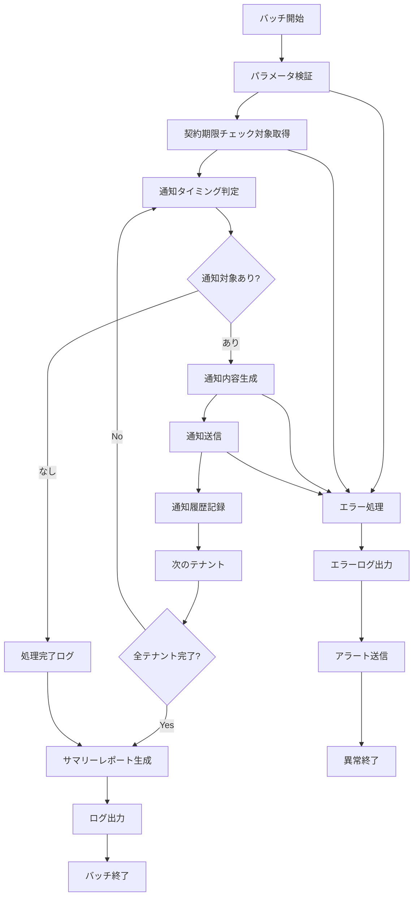

# バッチ定義書：テナント契約更新通知バッチ (BATCH-307)

## 1. 基本情報

| 項目 | 内容 |
|------|------|
| **バッチID** | BATCH-307 |
| **バッチ名** | テナント契約更新通知バッチ |
| **実行スケジュール** | 日次 09:30 |
| **優先度** | 中 |
| **ステータス** | 設計完了 |
| **作成日** | 2025/05/31 |
| **最終更新日** | 2025/05/31 |

## 2. バッチ概要

### 2.1 概要・目的
テナントの契約更新期限を監視し、期限が近づいているテナントに対して自動的に通知を送信するバッチです。契約期限の30日前、14日前、7日前、3日前、当日に段階的な通知を行い、契約更新の漏れを防止します。

### 2.2 関連テーブル
- [TBL-001_テナント管理](../database/tables/テーブル定義書_TBL-001.md)
- [TBL-002_契約情報](../database/tables/テーブル定義書_TBL-002.md)
- [TBL-025_通知履歴](../database/tables/テーブル定義書_TBL-025.md)
- [TBL-026_通知設定](../database/tables/テーブル定義書_TBL-026.md)

### 2.3 関連API
- [API-201_通知一覧取得API](../api/specs/API定義書_API-201.md)
- [API-203_通知状態更新API](../api/specs/API定義書_API-203.md)

## 3. 実行仕様

### 3.1 実行スケジュール
| 項目 | 設定値 | 備考 |
|------|--------|------|
| 実行頻度 | 日次 | cron: 30 9 * * * |
| 実行時間 | 09:30 | 営業時間開始後 |
| タイムアウト | 30分 | 最大実行時間 |
| リトライ回数 | 2回 | 失敗時の再実行 |

### 3.2 実行条件
| 条件 | 内容 | 備考 |
|------|------|------|
| 前提条件 | 通知システム稼働中 | 依存システムチェック |
| 実行可能時間 | 09:00-18:00 | 営業時間内 |
| 排他制御 | 同一バッチの重複実行禁止 | ロックファイル使用 |

### 3.3 実行パラメータ
| パラメータ名 | データ型 | 必須 | デフォルト値 | 説明 |
|--------------|----------|------|--------------|------|
| tenant_id | string | × | all | 対象テナントID |
| notification_days | array | × | [30,14,7,3,0] | 通知タイミング（日数） |
| dry_run | boolean | × | false | テスト実行フラグ |

## 4. 処理仕様

### 4.1 処理フロー


### 4.2 詳細処理

#### 4.2.1 契約期限チェック処理
```typescript
interface ContractExpirationChecker {
  tenantId: string;
  contractEndDate: Date;
  notificationSettings: NotificationSetting[];
  lastNotificationDate?: Date;
}

interface NotificationSetting {
  daysBeforeExpiration: number;
  notificationType: 'email' | 'slack' | 'teams';
  recipients: string[];
  template: string;
}

class ContractExpirationService {
  async checkExpiringContracts(targetDate: Date = new Date()): Promise<ContractExpirationChecker[]> {
    const expiringContracts = await prisma.tenants.findMany({
      where: {
        contractEndDate: {
          gte: targetDate,
          lte: new Date(targetDate.getTime() + 30 * 24 * 60 * 60 * 1000) // 30日後まで
        },
        status: 'active'
      },
      include: {
        contractInfo: true,
        notificationSettings: {
          where: {
            notificationType: 'contract_expiration'
          }
        }
      }
    });

    return expiringContracts.map(tenant => ({
      tenantId: tenant.id,
      contractEndDate: tenant.contractEndDate,
      notificationSettings: tenant.notificationSettings,
      lastNotificationDate: tenant.lastContractNotificationDate
    }));
  }

  async determineNotificationTiming(
    contract: ContractExpirationChecker,
    notificationDays: number[]
  ): Promise<NotificationTiming[]> {
    const today = new Date();
    const daysUntilExpiration = Math.ceil(
      (contract.contractEndDate.getTime() - today.getTime()) / (1000 * 60 * 60 * 24)
    );

    const notifications: NotificationTiming[] = [];

    for (const days of notificationDays) {
      if (daysUntilExpiration === days) {
        // 既に同じタイミングで通知済みかチェック
        const alreadyNotified = await this.checkNotificationHistory(
          contract.tenantId,
          days,
          today
        );

        if (!alreadyNotified) {
          notifications.push({
            tenantId: contract.tenantId,
            daysUntilExpiration: days,
            urgencyLevel: this.getUrgencyLevel(days),
            notificationDate: today
          });
        }
      }
    }

    return notifications;
  }

  private getUrgencyLevel(daysUntilExpiration: number): 'low' | 'medium' | 'high' | 'critical' {
    if (daysUntilExpiration === 0) return 'critical';
    if (daysUntilExpiration <= 3) return 'high';
    if (daysUntilExpiration <= 7) return 'medium';
    return 'low';
  }

  private async checkNotificationHistory(
    tenantId: string,
    daysBeforeExpiration: number,
    targetDate: Date
  ): Promise<boolean> {
    const startOfDay = new Date(targetDate);
    startOfDay.setHours(0, 0, 0, 0);
    
    const endOfDay = new Date(targetDate);
    endOfDay.setHours(23, 59, 59, 999);

    const existingNotification = await prisma.notificationHistory.findFirst({
      where: {
        tenantId,
        notificationType: 'contract_expiration',
        metadata: {
          path: ['daysBeforeExpiration'],
          equals: daysBeforeExpiration
        },
        sentAt: {
          gte: startOfDay,
          lte: endOfDay
        }
      }
    });

    return !!existingNotification;
  }
}
```

#### 4.2.2 通知内容生成処理
```typescript
interface NotificationContent {
  subject: string;
  body: string;
  urgencyLevel: 'low' | 'medium' | 'high' | 'critical';
  recipients: string[];
  channels: NotificationChannel[];
}

interface NotificationChannel {
  type: 'email' | 'slack' | 'teams';
  destination: string;
  template: string;
}

class NotificationContentGenerator {
  async generateContractExpirationNotification(
    tenant: any,
    daysUntilExpiration: number,
    urgencyLevel: string
  ): Promise<NotificationContent> {
    const templates = await this.getNotificationTemplates(urgencyLevel);
    
    const templateData = {
      tenantName: tenant.name,
      contractEndDate: tenant.contractEndDate.toLocaleDateString('ja-JP'),
      daysUntilExpiration,
      contractId: tenant.contractInfo.id,
      renewalUrl: `${process.env.PORTAL_URL}/contract/renewal/${tenant.id}`,
      supportEmail: process.env.SUPPORT_EMAIL,
      urgencyLevel
    };

    const subject = this.renderTemplate(templates.subject, templateData);
    const body = this.renderTemplate(templates.body, templateData);

    // 通知先の決定
    const recipients = await this.getNotificationRecipients(tenant.id, urgencyLevel);
    const channels = await this.getNotificationChannels(tenant.id, urgencyLevel);

    return {
      subject,
      body,
      urgencyLevel: urgencyLevel as any,
      recipients,
      channels
    };
  }

  private async getNotificationTemplates(urgencyLevel: string) {
    const templates = {
      low: {
        subject: '【重要】{{tenantName}}様 契約更新のご案内（期限まで{{daysUntilExpiration}}日）',
        body: `
{{tenantName}}様

いつもお世話になっております。

ご契約の更新期限が近づいておりますのでご案内いたします。

■ 契約情報
- テナント名: {{tenantName}}
- 契約終了日: {{contractEndDate}}
- 残り日数: {{daysUntilExpiration}}日

■ 更新手続き
下記URLより更新手続きを行ってください。
{{renewalUrl}}

ご不明な点がございましたら、下記までお問い合わせください。
{{supportEmail}}

今後ともよろしくお願いいたします。
        `
      },
      medium: {
        subject: '【重要】{{tenantName}}様 契約更新期限が近づいています（残り{{daysUntilExpiration}}日）',
        body: `
{{tenantName}}様

【重要】契約更新期限が近づいています。

■ 契約情報
- テナント名: {{tenantName}}
- 契約終了日: {{contractEndDate}}
- 残り日数: {{daysUntilExpiration}}日

お早めに更新手続きをお願いいたします。
{{renewalUrl}}

お問い合わせ: {{supportEmail}}
        `
      },
      high: {
        subject: '【緊急】{{tenantName}}様 契約更新期限間近（残り{{daysUntilExpiration}}日）',
        body: `
{{tenantName}}様

【緊急】契約更新期限が間近に迫っています。

■ 契約情報
- テナント名: {{tenantName}}
- 契約終了日: {{contractEndDate}}
- 残り日数: {{daysUntilExpiration}}日

至急、更新手続きを行ってください。
{{renewalUrl}}

緊急連絡先: {{supportEmail}}
        `
      },
      critical: {
        subject: '【最重要】{{tenantName}}様 契約期限当日です - 即座に対応が必要',
        body: `
{{tenantName}}様

【最重要】本日が契約期限です。

■ 契約情報
- テナント名: {{tenantName}}
- 契約終了日: {{contractEndDate}}（本日）

即座に更新手続きを行ってください。
{{renewalUrl}}

緊急対応が必要です。至急ご連絡ください。
緊急連絡先: {{supportEmail}}
        `
      }
    };

    return templates[urgencyLevel] || templates.low;
  }

  private renderTemplate(template: string, data: any): string {
    return template.replace(/\{\{(\w+)\}\}/g, (match, key) => {
      return data[key] || match;
    });
  }

  private async getNotificationRecipients(tenantId: string, urgencyLevel: string): Promise<string[]> {
    const tenant = await prisma.tenants.findUnique({
      where: { id: tenantId },
      include: {
        users: {
          where: {
            role: { in: ['admin', 'owner'] },
            status: 'active'
          }
        }
      }
    });

    const recipients = tenant?.users.map(user => user.email) || [];

    // 緊急度が高い場合は追加の通知先を含める
    if (urgencyLevel === 'critical' || urgencyLevel === 'high') {
      const emergencyContacts = await prisma.emergencyContacts.findMany({
        where: { tenantId }
      });
      recipients.push(...emergencyContacts.map(contact => contact.email));
    }

    return recipients;
  }

  private async getNotificationChannels(tenantId: string, urgencyLevel: string): Promise<NotificationChannel[]> {
    const settings = await prisma.notificationSettings.findMany({
      where: {
        tenantId,
        notificationType: 'contract_expiration',
        enabled: true
      }
    });

    const channels: NotificationChannel[] = [];

    for (const setting of settings) {
      channels.push({
        type: setting.channelType as any,
        destination: setting.destination,
        template: setting.template || 'default'
      });
    }

    // 緊急度が高い場合は強制的にメール通知を追加
    if (urgencyLevel === 'critical' && !channels.some(c => c.type === 'email')) {
      channels.push({
        type: 'email',
        destination: 'default',
        template: 'emergency'
      });
    }

    return channels;
  }
}
```

#### 4.2.3 通知送信・履歴記録処理
```typescript
interface NotificationResult {
  tenantId: string;
  notificationId: string;
  status: 'sent' | 'failed' | 'partial';
  sentChannels: string[];
  failedChannels: string[];
  sentAt: Date;
  error?: string;
}

class ContractNotificationSender {
  async sendNotifications(notifications: NotificationTiming[]): Promise<NotificationResult[]> {
    const results: NotificationResult[] = [];

    for (const notification of notifications) {
      try {
        const result = await this.sendSingleNotification(notification);
        results.push(result);
      } catch (error) {
        results.push({
          tenantId: notification.tenantId,
          notificationId: '',
          status: 'failed',
          sentChannels: [],
          failedChannels: ['all'],
          sentAt: new Date(),
          error: error.message
        });
      }
    }

    return results;
  }

  private async sendSingleNotification(notification: NotificationTiming): Promise<NotificationResult> {
    const tenant = await this.getTenantInfo(notification.tenantId);
    const content = await this.notificationGenerator.generateContractExpirationNotification(
      tenant,
      notification.daysUntilExpiration,
      notification.urgencyLevel
    );

    const sentChannels: string[] = [];
    const failedChannels: string[] = [];

    // メール送信
    for (const recipient of content.recipients) {
      try {
        await this.emailService.send({
          to: recipient,
          subject: content.subject,
          body: content.body,
          priority: this.getEmailPriority(content.urgencyLevel)
        });
        sentChannels.push(`email:${recipient}`);
      } catch (error) {
        failedChannels.push(`email:${recipient}`);
      }
    }

    // 外部チャンネル送信
    for (const channel of content.channels) {
      try {
        await this.sendToChannel(channel, content);
        sentChannels.push(`${channel.type}:${channel.destination}`);
      } catch (error) {
        failedChannels.push(`${channel.type}:${channel.destination}`);
      }
    }

    // 通知履歴記録
    const notificationId = await this.recordNotificationHistory({
      tenantId: notification.tenantId,
      notificationType: 'contract_expiration',
      subject: content.subject,
      body: content.body,
      recipients: content.recipients,
      urgencyLevel: content.urgencyLevel,
      metadata: {
        daysBeforeExpiration: notification.daysUntilExpiration,
        contractEndDate: tenant.contractEndDate,
        sentChannels,
        failedChannels
      }
    });

    // テナントの最終通知日更新
    await prisma.tenants.update({
      where: { id: notification.tenantId },
      data: { lastContractNotificationDate: new Date() }
    });

    return {
      tenantId: notification.tenantId,
      notificationId,
      status: failedChannels.length === 0 ? 'sent' : 
              sentChannels.length > 0 ? 'partial' : 'failed',
      sentChannels,
      failedChannels,
      sentAt: new Date()
    };
  }

  private getEmailPriority(urgencyLevel: string): 'low' | 'normal' | 'high' {
    switch (urgencyLevel) {
      case 'critical': return 'high';
      case 'high': return 'high';
      case 'medium': return 'normal';
      default: return 'normal';
    }
  }

  private async sendToChannel(channel: NotificationChannel, content: NotificationContent): Promise<void> {
    switch (channel.type) {
      case 'slack':
        await this.slackService.send({
          channel: channel.destination,
          text: content.subject,
          attachments: [{
            color: this.getSlackColor(content.urgencyLevel),
            text: content.body
          }]
        });
        break;
      
      case 'teams':
        await this.teamsService.send({
          webhook: channel.destination,
          title: content.subject,
          text: content.body,
          themeColor: this.getTeamsColor(content.urgencyLevel)
        });
        break;
    }
  }

  private getSlackColor(urgencyLevel: string): string {
    switch (urgencyLevel) {
      case 'critical': return 'danger';
      case 'high': return 'warning';
      case 'medium': return 'warning';
      default: return 'good';
    }
  }

  private getTeamsColor(urgencyLevel: string): string {
    switch (urgencyLevel) {
      case 'critical': return 'FF0000';
      case 'high': return 'FF6600';
      case 'medium': return 'FFCC00';
      default: return '00CC00';
    }
  }
}
```

## 5. データ仕様

### 5.1 入力データ
| データ名 | 形式 | 取得元 | 説明 |
|----------|------|--------|------|
| テナント契約情報 | DB | tenants, contract_info | 契約期限・状態情報 |
| 通知設定 | DB | notification_settings | 通知方法・宛先設定 |
| 通知履歴 | DB | notification_history | 過去の通知実績 |

### 5.2 出力データ
| データ名 | 形式 | 出力先 | 説明 |
|----------|------|--------|------|
| 通知履歴 | DB | notification_history | 送信した通知の記録 |
| 実行ログ | LOG | /logs/batch/ | バッチ実行ログ |
| 通知レポート | JSON | /data/reports/ | 日次通知サマリー |

### 5.3 データ量見積もり
| 項目 | 件数 | 備考 |
|------|------|------|
| 対象テナント数 | 500件 | 全アクティブテナント |
| 日次通知対象 | 10件 | 平均値 |
| 通知送信数 | 30件 | 複数チャンネル含む |
| 処理時間 | 10分 | 平均実行時間 |

## 6. エラーハンドリング

### 6.1 エラー分類
| エラー種別 | 対応方法 | 通知要否 | 備考 |
|------------|----------|----------|------|
| メール送信失敗 | リトライ・代替手段 | ○ | 重要エラー |
| 外部API エラー | ログ出力・継続 | △ | Slack/Teams連携 |
| データ不整合 | エラーログ・継続 | × | データエラー |

### 6.2 リトライ仕様
| 条件 | リトライ回数 | 間隔 | 備考 |
|------|--------------|------|------|
| メール送信エラー | 3回 | 5分 | 指数バックオフ |
| 外部API エラー | 2回 | 2分 | 固定間隔 |
| DB接続エラー | 2回 | 1分 | 固定間隔 |

## 7. 監視・運用

### 7.1 監視項目
| 監視項目 | 閾値 | アラート条件 | 対応方法 |
|----------|------|--------------|----------|
| 実行時間 | 30分 | 超過時 | 処理見直し |
| 通知失敗率 | 10% | 超過時 | 原因調査 |
| 緊急通知数 | 5件/日 | 超過時 | 契約管理確認 |

### 7.2 ログ出力
| ログ種別 | 出力レベル | 出力内容 | 保存期間 |
|----------|------------|----------|----------|
| 実行ログ | INFO | 処理開始・終了・通知件数 | 3ヶ月 |
| 通知ログ | INFO | 通知送信詳細・結果 | 1年 |
| エラーログ | ERROR | 送信失敗・エラー詳細 | 1年 |

### 7.3 アラート通知
| 通知条件 | 通知先 | 通知方法 | 備考 |
|----------|--------|----------|------|
| 異常終了 | 運用チーム | メール・Slack | 即座に通知 |
| 大量通知失敗 | 運用チーム | Slack | 業務時間内 |
| 緊急通知発生 | 営業チーム | メール | 即座に通知 |

## 8. 非機能要件

### 8.1 パフォーマンス
- 処理時間：30分以内
- 通知送信：100件/分
- メモリ使用量：1GB以内

### 8.2 可用性
- 成功率：95%以上
- 通知到達率：99%以上
- 障害時の手動実行機能

### 8.3 セキュリティ
- 通知内容の暗号化
- 個人情報の適切な取り扱い
- アクセスログの記録

## 9. テスト仕様

### 9.1 単体テスト
| テストケース | 入力条件 | 期待結果 |
|--------------|----------|----------|
| 30日前通知 | 契約期限30日前 | 通知送信・履歴記録 |
| 当日通知 | 契約期限当日 | 緊急通知送信 |
| 通知済みスキップ | 既に通知済み | 重複送信なし |

### 9.2 異常系テスト
| テストケース | 入力条件 | 期待結果 |
|--------------|----------|----------|
| メール送信失敗 | SMTP エラー | リトライ・代替通知 |
| 不正な契約日 | 無効な日付 | エラーログ・継続 |
| 通知設定なし | 設定未登録 | デフォルト通知 |

## 10. 実装メモ

### 10.1 技術仕様
- 言語：Node.js
- フレームワーク：Express.js
- DB接続：Prisma
- メール送信：Nodemailer
- 外部連携：Slack/Teams API

### 10.2 注意事項
- 営業時間内の実行推奨
- 緊急度に応じた通知方法の使い分け
- 重複通知の防止機能

### 10.3 デプロイ・実行環境
- 実行サーバー：通知サーバー
- 実行ユーザー：notification_user
- 実行ディレクトリ：/opt/notification/
- 設定ファイル：/etc/notification/config.json

---

**改訂履歴**

| バージョン | 日付 | 変更者 | 変更内容 |
|------------|------|--------|----------|
| 1.0 | 2025/05/31 | システムアーキテクト | 初版作成 |
