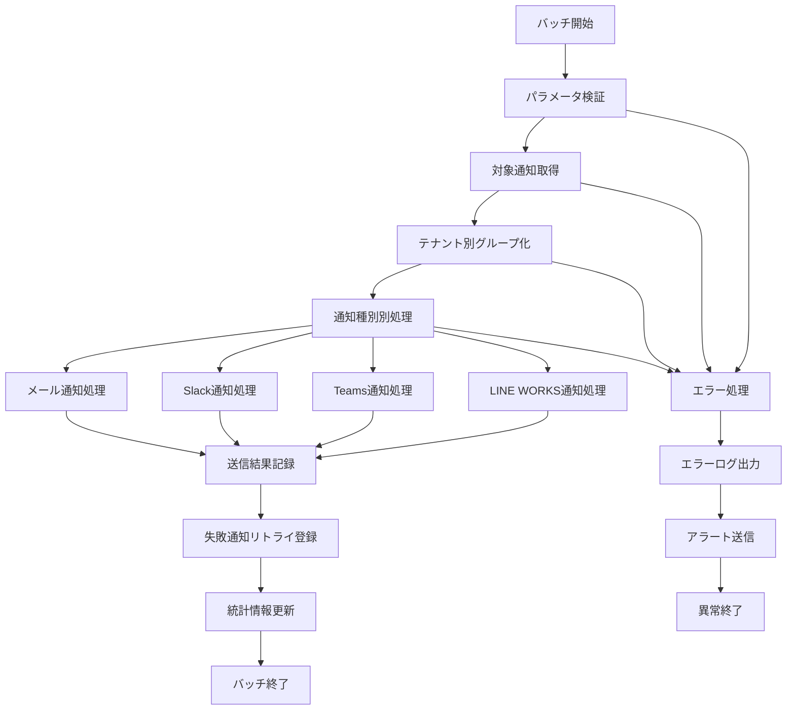

# バッチ定義書：定期通知送信バッチ (BATCH-401)

## 1. 基本情報

| 項目 | 内容 |
|------|------|
| **バッチID** | BATCH-401 |
| **バッチ名** | 定期通知送信バッチ |
| **実行スケジュール** | 日次 09:00 |
| **優先度** | 高 |
| **ステータス** | 設計完了 |
| **作成日** | 2025/05/31 |
| **最終更新日** | 2025/05/31 |

## 2. バッチ概要

### 2.1 概要・目的
スケジュール設定された通知を一括で送信するバッチです。各テナントの通知設定に基づき、メール・Slack・Teams・LINE WORKSなど複数チャンネルでの通知配信を自動化し、効率的な情報伝達を実現します。

### 2.2 関連テーブル
- [TBL-020_通知設定](../database/tables/テーブル定義書_TBL-020.md)
- [TBL-021_通知履歴](../database/tables/テーブル定義書_TBL-021.md)
- [TBL-022_通知テンプレート](../database/tables/テーブル定義書_TBL-022.md)
- [TBL-001_テナント管理](../database/tables/テーブル定義書_TBL-001.md)

### 2.3 関連API
- [API-201_通知一覧取得API](../api/specs/API定義書_API-201.md)
- [API-203_通知状態更新API](../api/specs/API定義書_API-203.md)

## 3. 実行仕様

### 3.1 実行スケジュール
| 項目 | 設定値 | 備考 |
|------|--------|------|
| 実行頻度 | 日次 | cron: 0 9 * * * |
| 実行時間 | 09:00 | 業務開始時間 |
| タイムアウト | 60分 | 最大実行時間 |
| リトライ回数 | 2回 | 失敗時の再実行 |

### 3.2 実行条件
| 条件 | 内容 | 備考 |
|------|------|------|
| 前提条件 | 通知システム稼働中 | 外部連携サービス正常 |
| 実行可能時間 | 09:00-10:00 | 業務時間帯 |
| 排他制御 | 同一バッチの重複実行禁止 | ロックファイル使用 |

### 3.3 実行パラメータ
| パラメータ名 | データ型 | 必須 | デフォルト値 | 説明 |
|--------------|----------|------|--------------|------|
| target_date | string | × | today | 対象日付（YYYY-MM-DD） |
| tenant_ids | array | × | all | 対象テナントID配列 |
| notification_types | array | × | all | 通知種別配列 |
| dry_run | boolean | × | false | テスト実行フラグ |

## 4. 処理仕様

### 4.1 処理フロー


### 4.2 詳細処理

#### 4.2.1 対象通知取得処理
```typescript
interface ScheduledNotification {
  id: string;
  tenantId: string;
  type: 'email' | 'slack' | 'teams' | 'line-works';
  templateId: string;
  recipientIds: string[];
  scheduledAt: Date;
  data: Record<string, any>;
  priority: 'high' | 'medium' | 'low';
  status: 'pending' | 'sent' | 'failed';
}

class ScheduledNotificationService {
  async getScheduledNotifications(targetDate: string): Promise<ScheduledNotification[]> {
    const startOfDay = new Date(`${targetDate}T00:00:00Z`);
    const endOfDay = new Date(`${targetDate}T23:59:59Z`);
    
    return await prisma.scheduledNotification.findMany({
      where: {
        scheduledAt: {
          gte: startOfDay,
          lte: endOfDay
        },
        status: 'pending',
        tenant: {
          status: 'active'
        }
      },
      include: {
        tenant: true,
        template: true,
        recipients: true
      },
      orderBy: [
        { priority: 'desc' },
        { scheduledAt: 'asc' }
      ]
    });
  }
}
```

#### 4.2.2 メール通知処理
```typescript
class EmailNotificationProcessor {
  async processEmailNotifications(notifications: ScheduledNotification[]): Promise<NotificationResult[]> {
    const results: NotificationResult[] = [];
    
    for (const notification of notifications) {
      try {
        const tenant = await this.getTenant(notification.tenantId);
        const template = await this.getEmailTemplate(notification.templateId);
        const recipients = await this.getEmailRecipients(notification.recipientIds);
        
        // テンプレート変数置換
        const subject = this.replaceVariables(template.subject, notification.data);
        const body = this.replaceVariables(template.body, notification.data);
        
        // メール送信
        const emailResult = await this.sendEmail({
          to: recipients.map(r => r.email),
          subject,
          html: body,
          attachments: await this.getAttachments(notification.data.attachmentIds)
        });
        
        // 送信結果記録
        await this.recordNotificationResult(notification.id, 'sent', emailResult);
        results.push({ notificationId: notification.id, status: 'sent', details: emailResult });
        
      } catch (error) {
        await this.recordNotificationResult(notification.id, 'failed', { error: error.message });
        await this.scheduleRetry(notification.id);
        results.push({ notificationId: notification.id, status: 'failed', error });
      }
    }
    
    return results;
  }
  
  private async sendEmail(emailData: EmailData): Promise<EmailResult> {
    // SendGrid/AWS SES等のメール送信サービス利用
    const result = await this.emailService.send(emailData);
    
    return {
      messageId: result.messageId,
      sentAt: new Date(),
      recipientCount: emailData.to.length,
      deliveryStatus: result.status
    };
  }
  
  private replaceVariables(template: string, data: Record<string, any>): string {
    return template.replace(/\{\{(\w+)\}\}/g, (match, key) => {
      return data[key] || match;
    });
  }
}
```

#### 4.2.3 Slack通知処理
```typescript
class SlackNotificationProcessor {
  async processSlackNotifications(notifications: ScheduledNotification[]): Promise<NotificationResult[]> {
    const results: NotificationResult[] = [];
    
    for (const notification of notifications) {
      try {
        const tenant = await this.getTenant(notification.tenantId);
        const slackConfig = tenant.integrations.slack;
        
        if (!slackConfig?.enabled) {
          throw new Error('Slack integration not enabled for tenant');
        }
        
        const template = await this.getSlackTemplate(notification.templateId);
        const channels = await this.getSlackChannels(notification.recipientIds);
        
        // Slack Block Kit形式でメッセージ構築
        const blocks = this.buildSlackBlocks(template, notification.data);
        
        // チャンネル別送信
        for (const channel of channels) {
          const slackResult = await this.sendSlackMessage({
            token: slackConfig.botToken,
            channel: channel.id,
            blocks,
            text: this.replaceVariables(template.fallbackText, notification.data)
          });
          
          await this.recordChannelResult(notification.id, channel.id, 'sent', slackResult);
        }
        
        results.push({ notificationId: notification.id, status: 'sent', channelCount: channels.length });
        
      } catch (error) {
        await this.recordNotificationResult(notification.id, 'failed', { error: error.message });
        results.push({ notificationId: notification.id, status: 'failed', error });
      }
    }
    
    return results;
  }
  
  private buildSlackBlocks(template: SlackTemplate, data: Record<string, any>): any[] {
    return template.blocks.map(block => {
      if (block.type === 'section' && block.text) {
        return {
          ...block,
          text: {
            ...block.text,
            text: this.replaceVariables(block.text.text, data)
          }
        };
      }
      return block;
    });
  }
}
```

#### 4.2.4 Teams通知処理
```typescript
class TeamsNotificationProcessor {
  async processTeamsNotifications(notifications: ScheduledNotification[]): Promise<NotificationResult[]> {
    const results: NotificationResult[] = [];
    
    for (const notification of notifications) {
      try {
        const tenant = await this.getTenant(notification.tenantId);
        const teamsConfig = tenant.integrations.teams;
        
        if (!teamsConfig?.enabled) {
          throw new Error('Teams integration not enabled for tenant');
        }
        
        const template = await this.getTeamsTemplate(notification.templateId);
        const channels = await this.getTeamsChannels(notification.recipientIds);
        
        // Adaptive Card形式でメッセージ構築
        const adaptiveCard = this.buildAdaptiveCard(template, notification.data);
        
        // チャンネル別送信
        for (const channel of channels) {
          const teamsResult = await this.sendTeamsMessage({
            webhookUrl: channel.webhookUrl,
            adaptiveCard
          });
          
          await this.recordChannelResult(notification.id, channel.id, 'sent', teamsResult);
        }
        
        results.push({ notificationId: notification.id, status: 'sent', channelCount: channels.length });
        
      } catch (error) {
        await this.recordNotificationResult(notification.id, 'failed', { error: error.message });
        results.push({ notificationId: notification.id, status: 'failed', error });
      }
    }
    
    return results;
  }
  
  private buildAdaptiveCard(template: TeamsTemplate, data: Record<string, any>): any {
    return {
      type: 'AdaptiveCard',
      version: '1.4',
      body: template.body.map(element => {
        if (element.type === 'TextBlock') {
          return {
            ...element,
            text: this.replaceVariables(element.text, data)
          };
        }
        return element;
      })
    };
  }
}
```

#### 4.2.5 LINE WORKS通知処理
```typescript
class LineWorksNotificationProcessor {
  async processLineWorksNotifications(notifications: ScheduledNotification[]): Promise<NotificationResult[]> {
    const results: NotificationResult[] = [];
    
    for (const notification of notifications) {
      try {
        const tenant = await this.getTenant(notification.tenantId);
        const lineWorksConfig = tenant.integrations.lineWorks;
        
        if (!lineWorksConfig?.enabled) {
          throw new Error('LINE WORKS integration not enabled for tenant');
        }
        
        const template = await this.getLineWorksTemplate(notification.templateId);
        const groups = await this.getLineWorksGroups(notification.recipientIds);
        
        // LINE WORKS メッセージ構築
        const message = this.buildLineWorksMessage(template, notification.data);
        
        // グループ別送信
        for (const group of groups) {
          const lineWorksResult = await this.sendLineWorksMessage({
            accessToken: await this.getLineWorksAccessToken(lineWorksConfig),
            groupId: group.id,
            message
          });
          
          await this.recordChannelResult(notification.id, group.id, 'sent', lineWorksResult);
        }
        
        results.push({ notificationId: notification.id, status: 'sent', groupCount: groups.length });
        
      } catch (error) {
        await this.recordNotificationResult(notification.id, 'failed', { error: error.message });
        results.push({ notificationId: notification.id, status: 'failed', error });
      }
    }
    
    return results;
  }
  
  private buildLineWorksMessage(template: LineWorksTemplate, data: Record<string, any>): any {
    return {
      content: {
        type: 'text',
        text: this.replaceVariables(template.text, data)
      }
    };
  }
}
```

## 5. データ仕様

### 5.1 入力データ
| データ名 | 形式 | 取得元 | 説明 |
|----------|------|--------|------|
| スケジュール通知 | DB | TBL-020 | 送信予定の通知一覧 |
| 通知テンプレート | DB | TBL-022 | 各種通知テンプレート |
| 受信者情報 | DB | TBL-002 | 通知対象ユーザー情報 |
| テナント設定 | DB | TBL-001 | 各テナントの連携設定 |

### 5.2 出力データ
| データ名 | 形式 | 出力先 | 説明 |
|----------|------|--------|------|
| 通知履歴 | DB | TBL-021 | 送信結果・履歴 |
| 実行ログ | LOG | notification_logs/ | バッチ実行ログ |
| エラーログ | LOG | error_logs/ | エラー詳細ログ |
| 統計データ | DB | TBL-025 | 送信統計情報 |

### 5.3 データ量見積もり
| 項目 | 件数 | 備考 |
|------|------|------|
| 日次通知件数 | 500件 | 全テナント合計 |
| 送信先数 | 2,000件 | 平均4件/通知 |
| 処理時間 | 30分 | 平均実行時間 |
| 成功率 | 95% | 目標値 |

## 6. エラーハンドリング

### 6.1 エラー分類
| エラー種別 | 対応方法 | 通知要否 | 備考 |
|------------|----------|----------|------|
| 外部API障害 | リトライ・代替手段 | ○ | Slack/Teams/LINE WORKS |
| メール送信失敗 | リトライ・エラー通知 | ○ | 送信サービス障害 |
| テンプレート不正 | エラーログ・スキップ | △ | 設定不備 |

### 6.2 リトライ仕様
| 条件 | リトライ回数 | 間隔 | 備考 |
|------|--------------|------|------|
| 外部API一時障害 | 3回 | 5分 | 指数バックオフ |
| メール送信失敗 | 2回 | 10分 | 固定間隔 |
| 認証エラー | 1回 | 30分 | トークン再取得 |

## 7. 監視・運用

### 7.1 監視項目
| 監視項目 | 閾値 | アラート条件 | 対応方法 |
|----------|------|--------------|----------|
| 送信成功率 | 95% | 下回り時 | 原因調査・対応 |
| 処理時間 | 60分 | 超過時 | 処理見直し |
| エラー率 | 5% | 超過時 | システム確認 |

### 7.2 ログ出力
| ログ種別 | 出力レベル | 出力内容 | 保存期間 |
|----------|------------|----------|----------|
| 実行ログ | INFO | 処理開始・終了・送信結果 | 3ヶ月 |
| エラーログ | ERROR | 送信失敗・例外詳細 | 1年 |
| 統計ログ | INFO | 送信統計・パフォーマンス | 6ヶ月 |

### 7.3 アラート通知
| 通知条件 | 通知先 | 通知方法 | 備考 |
|----------|--------|----------|------|
| 大量送信失敗 | 運用チーム | メール・Slack | 即座に通知 |
| 外部API障害 | 開発チーム | Slack | 業務時間内 |
| 処理時間超過 | 運用チーム | メール | 翌営業日まで |

## 8. 非機能要件

### 8.1 パフォーマンス
- 処理時間：60分以内
- 同時送信数：100件/分
- メモリ使用量：2GB以内

### 8.2 可用性
- 成功率：95%以上
- 障害時の手動実行機能
- 外部サービス障害時の代替手段

### 8.3 セキュリティ
- 通知内容の暗号化
- アクセストークンの安全な管理
- 送信ログの適切な保護

## 9. テスト仕様

### 9.1 単体テスト
| テストケース | 入力条件 | 期待結果 |
|--------------|----------|----------|
| 正常送信 | 有効な通知設定 | 全通知送信成功 |
| メール送信 | メール通知のみ | メール送信成功 |
| Slack送信 | Slack通知のみ | Slack送信成功 |
| 複数チャンネル | 全種別通知 | 全チャンネル送信成功 |

### 9.2 異常系テスト
| テストケース | 入力条件 | 期待結果 |
|--------------|----------|----------|
| 外部API障害 | Slack API停止 | リトライ後エラー記録 |
| 認証エラー | 無効なトークン | 認証エラー・アラート |
| テンプレート不正 | 不正なテンプレート | エラーログ・処理継続 |

## 10. 実装メモ

### 10.1 技術仕様
- 言語：Node.js
- フレームワーク：Express.js
- 外部連携：Slack API, Teams Webhook, LINE WORKS API
- メール送信：SendGrid/AWS SES
- DB接続：Prisma

### 10.2 注意事項
- 外部API制限の考慮（レート制限等）
- 大量送信時のパフォーマンス最適化
- 個人情報の適切な取り扱い
- 通知内容の機密性保持

### 10.3 デプロイ・実行環境
- 実行サーバー：通知サーバー
- 実行ユーザー：notification_user
- 実行ディレクトリ：/opt/notification/
- 設定ファイル：/etc/notification/config.json

---

**改訂履歴**

| バージョン | 日付 | 変更者 | 変更内容 |
|------------|------|--------|----------|
| 1.0 | 2025/05/31 | システムアーキテクト | 初版作成 |
