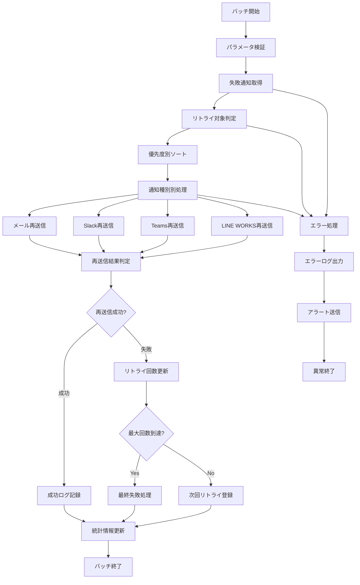

# バッチ定義書：通知失敗リトライバッチ (BATCH-402)

## 1. 基本情報

| 項目 | 内容 |
|------|------|
| **バッチID** | BATCH-402 |
| **バッチ名** | 通知失敗リトライバッチ |
| **実行スケジュール** | 時間毎（毎時45分） |
| **優先度** | 高 |
| **ステータス** | 設計完了 |
| **作成日** | 2025/05/31 |
| **最終更新日** | 2025/05/31 |

## 2. バッチ概要

### 2.1 概要・目的
送信に失敗した通知を自動的に再送信するバッチです。一時的な障害やネットワークエラーによる送信失敗を検知し、適切な間隔でリトライを実行することで、通知の確実な配信を保証します。

### 2.2 関連テーブル
- [TBL-021_通知履歴](../database/tables/テーブル定義書_TBL-021.md)
- [TBL-023_リトライ管理](../database/tables/テーブル定義書_TBL-023.md)
- [TBL-020_通知設定](../database/tables/テーブル定義書_TBL-020.md)
- [TBL-001_テナント管理](../database/tables/テーブル定義書_TBL-001.md)

### 2.3 関連API
- [API-203_通知状態更新API](../api/specs/API定義書_API-203.md)
- [API-205_リトライ管理API](../api/specs/API定義書_API-205.md)

## 3. 実行仕様

### 3.1 実行スケジュール
| 項目 | 設定値 | 備考 |
|------|--------|------|
| 実行頻度 | 時間毎 | cron: 45 * * * * |
| 実行時間 | 毎時45分 | 定期リトライ |
| タイムアウト | 30分 | 最大実行時間 |
| リトライ回数 | 1回 | バッチ自体のリトライ |

### 3.2 実行条件
| 条件 | 内容 | 備考 |
|------|------|------|
| 前提条件 | 通知システム稼働中 | 外部連携サービス正常 |
| 実行可能時間 | 24時間 | 常時監視 |
| 排他制御 | 同一バッチの重複実行禁止 | ロックファイル使用 |

### 3.3 実行パラメータ
| パラメータ名 | データ型 | 必須 | デフォルト値 | 説明 |
|--------------|----------|------|--------------|------|
| max_retry_count | number | × | 3 | 最大リトライ回数 |
| retry_interval_minutes | number | × | 60 | リトライ間隔（分） |
| priority_filter | string | × | all | 優先度フィルター |
| dry_run | boolean | × | false | テスト実行フラグ |

## 4. 処理仕様

### 4.1 処理フロー


### 4.2 詳細処理

#### 4.2.1 失敗通知取得処理
```typescript
interface FailedNotification {
  id: string;
  originalNotificationId: string;
  tenantId: string;
  type: 'email' | 'slack' | 'teams' | 'line-works';
  retryCount: number;
  maxRetryCount: number;
  lastAttemptAt: Date;
  nextRetryAt: Date;
  failureReason: string;
  priority: 'high' | 'medium' | 'low';
  originalData: Record<string, any>;
}

class FailedNotificationService {
  async getRetryTargetNotifications(): Promise<FailedNotification[]> {
    const now = new Date();
    
    return await prisma.failedNotification.findMany({
      where: {
        nextRetryAt: {
          lte: now
        },
        retryCount: {
          lt: prisma.raw('max_retry_count')
        },
        status: 'pending_retry',
        tenant: {
          status: 'active'
        }
      },
      include: {
        originalNotification: true,
        tenant: true
      },
      orderBy: [
        { priority: 'desc' },
        { nextRetryAt: 'asc' }
      ]
    });
  }
  
  async shouldRetry(notification: FailedNotification): Promise<boolean> {
    // リトライ回数チェック
    if (notification.retryCount >= notification.maxRetryCount) {
      return false;
    }
    
    // 時間間隔チェック
    const now = new Date();
    if (notification.nextRetryAt > now) {
      return false;
    }
    
    // 失敗理由による判定
    const retryableErrors = [
      'network_timeout',
      'service_unavailable',
      'rate_limit_exceeded',
      'temporary_failure'
    ];
    
    return retryableErrors.includes(notification.failureReason);
  }
}
```

#### 4.2.2 メール再送信処理
```typescript
class EmailRetryProcessor {
  async retryEmailNotifications(notifications: FailedNotification[]): Promise<RetryResult[]> {
    const results: RetryResult[] = [];
    
    for (const notification of notifications) {
      try {
        const tenant = await this.getTenant(notification.tenantId);
        const originalData = notification.originalData;
        
        // メール再送信
        const emailResult = await this.resendEmail({
          to: originalData.recipients,
          subject: originalData.subject,
          html: originalData.body,
          attachments: originalData.attachments
        });
        
        // 成功時の処理
        await this.markRetrySuccess(notification.id, emailResult);
        await this.updateOriginalNotificationStatus(notification.originalNotificationId, 'sent');
        
        results.push({
          notificationId: notification.id,
          status: 'success',
          retryCount: notification.retryCount + 1,
          details: emailResult
        });
        
      } catch (error) {
        // 失敗時の処理
        const newRetryCount = notification.retryCount + 1;
        
        if (newRetryCount >= notification.maxRetryCount) {
          // 最大リトライ回数到達
          await this.markFinalFailure(notification.id, error.message);
          await this.sendFailureAlert(notification, error);
          
          results.push({
            notificationId: notification.id,
            status: 'final_failure',
            retryCount: newRetryCount,
            error: error.message
          });
        } else {
          // 次回リトライ登録
          const nextRetryAt = this.calculateNextRetryTime(newRetryCount);
          await this.scheduleNextRetry(notification.id, newRetryCount, nextRetryAt);
          
          results.push({
            notificationId: notification.id,
            status: 'retry_scheduled',
            retryCount: newRetryCount,
            nextRetryAt
          });
        }
      }
    }
    
    return results;
  }
  
  private calculateNextRetryTime(retryCount: number): Date {
    // 指数バックオフ戦略
    const baseInterval = 60; // 60分
    const backoffMultiplier = Math.pow(2, retryCount - 1);
    const intervalMinutes = Math.min(baseInterval * backoffMultiplier, 1440); // 最大24時間
    
    return new Date(Date.now() + intervalMinutes * 60 * 1000);
  }
}
```

#### 4.2.3 Slack再送信処理
```typescript
class SlackRetryProcessor {
  async retrySlackNotifications(notifications: FailedNotification[]): Promise<RetryResult[]> {
    const results: RetryResult[] = [];
    
    for (const notification of notifications) {
      try {
        const tenant = await this.getTenant(notification.tenantId);
        const slackConfig = tenant.integrations.slack;
        
        if (!slackConfig?.enabled) {
          throw new Error('Slack integration disabled');
        }
        
        const originalData = notification.originalData;
        
        // Slack再送信
        const slackResult = await this.resendSlackMessage({
          token: slackConfig.botToken,
          channel: originalData.channel,
          blocks: originalData.blocks,
          text: originalData.fallbackText
        });
        
        await this.markRetrySuccess(notification.id, slackResult);
        results.push({
          notificationId: notification.id,
          status: 'success',
          retryCount: notification.retryCount + 1,
          details: slackResult
        });
        
      } catch (error) {
        await this.handleRetryFailure(notification, error);
        results.push({
          notificationId: notification.id,
          status: 'failed',
          retryCount: notification.retryCount + 1,
          error: error.message
        });
      }
    }
    
    return results;
  }
  
  private async resendSlackMessage(messageData: SlackMessageData): Promise<SlackResult> {
    // Slack API制限を考慮したリトライ
    const maxAttempts = 3;
    let attempt = 0;
    
    while (attempt < maxAttempts) {
      try {
        const response = await this.slackClient.chat.postMessage(messageData);
        return {
          messageId: response.ts,
          channel: response.channel,
          sentAt: new Date()
        };
      } catch (error) {
        if (error.code === 'rate_limited') {
          const retryAfter = error.headers['retry-after'] || 60;
          await this.sleep(retryAfter * 1000);
          attempt++;
          continue;
        }
        throw error;
      }
    }
    
    throw new Error('Max retry attempts exceeded for Slack API');
  }
}
```

#### 4.2.4 Teams再送信処理
```typescript
class TeamsRetryProcessor {
  async retryTeamsNotifications(notifications: FailedNotification[]): Promise<RetryResult[]> {
    const results: RetryResult[] = [];
    
    for (const notification of notifications) {
      try {
        const tenant = await this.getTenant(notification.tenantId);
        const teamsConfig = tenant.integrations.teams;
        
        if (!teamsConfig?.enabled) {
          throw new Error('Teams integration disabled');
        }
        
        const originalData = notification.originalData;
        
        // Teams再送信
        const teamsResult = await this.resendTeamsMessage({
          webhookUrl: originalData.webhookUrl,
          adaptiveCard: originalData.adaptiveCard
        });
        
        await this.markRetrySuccess(notification.id, teamsResult);
        results.push({
          notificationId: notification.id,
          status: 'success',
          retryCount: notification.retryCount + 1,
          details: teamsResult
        });
        
      } catch (error) {
        await this.handleRetryFailure(notification, error);
        results.push({
          notificationId: notification.id,
          status: 'failed',
          retryCount: notification.retryCount + 1,
          error: error.message
        });
      }
    }
    
    return results;
  }
}
```

#### 4.2.5 LINE WORKS再送信処理
```typescript
class LineWorksRetryProcessor {
  async retryLineWorksNotifications(notifications: FailedNotification[]): Promise<RetryResult[]> {
    const results: RetryResult[] = [];
    
    for (const notification of notifications) {
      try {
        const tenant = await this.getTenant(notification.tenantId);
        const lineWorksConfig = tenant.integrations.lineWorks;
        
        if (!lineWorksConfig?.enabled) {
          throw new Error('LINE WORKS integration disabled');
        }
        
        const originalData = notification.originalData;
        
        // LINE WORKS再送信
        const lineWorksResult = await this.resendLineWorksMessage({
          accessToken: await this.refreshLineWorksToken(lineWorksConfig),
          groupId: originalData.groupId,
          message: originalData.message
        });
        
        await this.markRetrySuccess(notification.id, lineWorksResult);
        results.push({
          notificationId: notification.id,
          status: 'success',
          retryCount: notification.retryCount + 1,
          details: lineWorksResult
        });
        
      } catch (error) {
        await this.handleRetryFailure(notification, error);
        results.push({
          notificationId: notification.id,
          status: 'failed',
          retryCount: notification.retryCount + 1,
          error: error.message
        });
      }
    }
    
    return results;
  }
}
```

## 5. データ仕様

### 5.1 入力データ
| データ名 | 形式 | 取得元 | 説明 |
|----------|------|--------|------|
| 失敗通知履歴 | DB | TBL-021 | 送信失敗した通知一覧 |
| リトライ管理 | DB | TBL-023 | リトライ状況・設定 |
| 元通知データ | DB | TBL-020 | 元の通知内容・設定 |
| テナント設定 | DB | TBL-001 | 各テナントの連携設定 |

### 5.2 出力データ
| データ名 | 形式 | 出力先 | 説明 |
|----------|------|--------|------|
| リトライ結果 | DB | TBL-023 | 再送信結果・状況 |
| 実行ログ | LOG | retry_logs/ | バッチ実行ログ |
| エラーログ | LOG | error_logs/ | エラー詳細ログ |
| アラート通知 | 外部 | 運用チーム | 最終失敗時の通知 |

### 5.3 データ量見積もり
| 項目 | 件数 | 備考 |
|------|------|------|
| 時間毎リトライ件数 | 50件 | 失敗率5%想定 |
| 最終失敗件数 | 5件/日 | 1%の最終失敗率 |
| 処理時間 | 15分 | 平均実行時間 |
| 成功率 | 80% | リトライ成功率 |

## 6. エラーハンドリング

### 6.1 エラー分類
| エラー種別 | 対応方法 | 通知要否 | 備考 |
|------------|----------|----------|------|
| 永続的障害 | 最終失敗・アラート | ○ | 設定不備・認証エラー |
| 一時的障害 | 次回リトライ登録 | △ | ネットワーク・API制限 |
| システムエラー | エラーログ・調査 | ○ | バッチ処理異常 |

### 6.2 リトライ戦略
| 通知種別 | 最大回数 | 間隔戦略 | 備考 |
|----------|----------|----------|------|
| メール | 3回 | 指数バックオフ | 1h, 2h, 4h |
| Slack | 5回 | 固定間隔 | 1h間隔 |
| Teams | 3回 | 指数バックオフ | 1h, 2h, 4h |
| LINE WORKS | 3回 | 固定間隔 | 1h間隔 |

## 7. 監視・運用

### 7.1 監視項目
| 監視項目 | 閾値 | アラート条件 | 対応方法 |
|----------|------|--------------|----------|
| リトライ成功率 | 80% | 下回り時 | 原因調査・対応 |
| 最終失敗率 | 1% | 超過時 | システム確認 |
| 処理時間 | 30分 | 超過時 | 処理見直し |

### 7.2 ログ出力
| ログ種別 | 出力レベル | 出力内容 | 保存期間 |
|----------|------------|----------|----------|
| 実行ログ | INFO | リトライ開始・終了・結果 | 3ヶ月 |
| エラーログ | ERROR | リトライ失敗・例外詳細 | 1年 |
| 統計ログ | INFO | リトライ統計・成功率 | 6ヶ月 |

### 7.3 アラート通知
| 通知条件 | 通知先 | 通知方法 | 備考 |
|----------|--------|----------|------|
| 最終失敗 | 運用チーム | メール・Slack | 即座に通知 |
| 大量リトライ失敗 | 開発チーム | Slack | 業務時間内 |
| システムエラー | 運用チーム | メール | 翌営業日まで |

## 8. 非機能要件

### 8.1 パフォーマンス
- 処理時間：30分以内
- 同時リトライ数：50件/時
- メモリ使用量：1GB以内

### 8.2 可用性
- 成功率：99%以上
- 24時間365日稼働
- 障害時の手動実行機能

### 8.3 セキュリティ
- リトライデータの暗号化
- アクセストークンの安全な管理
- 失敗ログの適切な保護

## 9. テスト仕様

### 9.1 単体テスト
| テストケース | 入力条件 | 期待結果 |
|--------------|----------|----------|
| 正常リトライ | 一時的失敗通知 | リトライ成功 |
| 最大回数到達 | 3回失敗済み通知 | 最終失敗処理 |
| 時間未到達 | 次回リトライ時間前 | 処理スキップ |
| 無効設定 | 連携無効テナント | エラーログ出力 |

### 9.2 異常系テスト
| テストケース | 入力条件 | 期待結果 |
|--------------|----------|----------|
| API障害継続 | 外部API停止継続 | 最終失敗・アラート |
| 認証エラー | 無効なトークン | 認証エラー・調査要求 |
| データ不整合 | 元通知データ欠損 | エラーログ・処理継続 |

## 10. 実装メモ

### 10.1 技術仕様
- 言語：Node.js
- フレームワーク：Express.js
- 外部連携：各種通知API
- DB接続：Prisma
- キュー管理：Redis/BullMQ

### 10.2 注意事項
- 外部API制限の適切な処理
- リトライループの防止
- 大量失敗時のシステム負荷考慮
- 個人情報の適切な取り扱い

### 10.3 デプロイ・実行環境
- 実行サーバー：通知サーバー
- 実行ユーザー：notification_user
- 実行ディレクトリ：/opt/notification/retry/
- 設定ファイル：/etc/notification/retry-config.json

---

**改訂履歴**

| バージョン | 日付 | 変更者 | 変更内容 |
|------------|------|--------|----------|
| 1.0 | 2025/05/31 | システムアーキテクト | 初版作成 |
