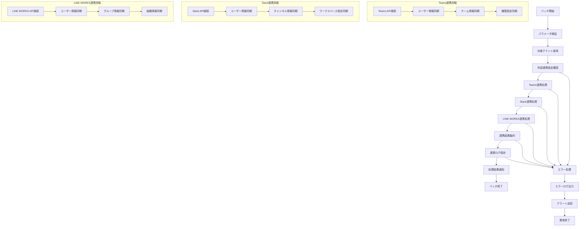

# バッチ定義書：外部システム連携バッチ (BATCH-403)

## 1. 基本情報

| 項目 | 内容 |
|------|------|
| **バッチID** | BATCH-403 |
| **バッチ名** | 外部システム連携バッチ |
| **実行スケジュール** | 日次（06:00） |
| **優先度** | 高 |
| **ステータス** | 未着手 |
| **作成日** | 2025/05/31 |
| **最終更新日** | 2025/05/31 |

## 2. バッチ概要

### 2.1 概要・目的
Teams/Slack/LINE WORKS等の外部システムとの連携処理を実行し、ユーザー情報・組織情報・通知設定の同期を行う。

### 2.2 関連テーブル
- TBL-001_テナント
- TBL-002_ユーザー
- TBL-003_組織
- TBL-030_外部連携設定
- TBL-031_連携ログ

### 2.3 関連API
- API-301_外部連携設定取得API
- API-302_連携状態更新API
- API-303_連携ログ登録API

## 3. 実行仕様

### 3.1 実行スケジュール
| 項目 | 設定値 | 備考 |
|------|--------|------|
| 実行頻度 | 0 6 * * * | cron形式（毎日06:00） |
| 実行時間 | 06:00 | 朝バッチ |
| タイムアウト | 120分 | 最大実行時間 |
| リトライ回数 | 3回 | 失敗時の再実行 |

### 3.2 実行条件
| 条件 | 内容 | 備考 |
|------|------|------|
| 前提条件 | 外部システム稼働中 | 各連携先システムの稼働確認 |
| 実行可能時間 | 06:00-08:00 | 業務開始前 |
| 排他制御 | 同一バッチの重複実行禁止 | ロックファイル使用 |

### 3.3 実行パラメータ
| パラメータ名 | データ型 | 必須 | デフォルト値 | 説明 |
|--------------|----------|------|--------------|------|
| tenant_id | string | × | all | 対象テナントID |
| sync_type | string | × | all | 同期種別（teams/slack/lineworks/all） |
| force_sync | boolean | × | false | 強制同期フラグ |
| dry_run | boolean | × | false | テスト実行フラグ |

## 4. 処理仕様

### 4.1 処理フロー

### 4.2 詳細処理
1. **初期化処理**
   - パラメータ検証
   - 対象テナント・連携種別の確定
   - 排他制御ロック取得

2. **外部連携設定確認**
   - テナント別連携設定取得
   - API認証情報の検証
   - 連携可能性チェック

3. **Teams連携処理**
   - Microsoft Graph API接続
   - ユーザー・チーム情報の取得・同期
   - 権限設定の反映

4. **Slack連携処理**
   - Slack Web API接続
   - ユーザー・チャンネル情報の取得・同期
   - ワークスペース設定の反映

5. **LINE WORKS連携処理**
   - LINE WORKS API接続
   - ユーザー・グループ・組織情報の取得・同期
   - 組織階層の反映

6. **結果処理・通知**
   - 連携結果の集約・保存
   - 連携ログの記録
   - 関係者への通知送信

## 5. データ仕様

### 5.1 入力データ
| データ名 | 形式 | 取得元 | 説明 |
|----------|------|--------|------|
| 外部連携設定 | DB | TBL-030 | 各外部システムの連携設定 |
| テナント情報 | DB | TBL-001 | 対象テナント情報 |
| ユーザー情報 | DB | TBL-002 | 現在のユーザー情報 |
| 組織情報 | DB | TBL-003 | 現在の組織情報 |

### 5.2 出力データ
| データ名 | 形式 | 出力先 | 説明 |
|----------|------|--------|------|
| 同期済みユーザー情報 | DB | TBL-002 | 外部システムから同期したユーザー情報 |
| 同期済み組織情報 | DB | TBL-003 | 外部システムから同期した組織情報 |
| 連携ログ | DB | TBL-031 | 連携処理の実行ログ |
| 実行ログ | LOG | /logs/batch/ | バッチ実行ログ |
| 連携レポート | JSON | /reports/ | 連携結果レポート |

### 5.3 データ量見積もり
| 項目 | 件数 | 備考 |
|------|------|------|
| 処理対象テナント数 | 50-200テナント | 連携設定済みテナント |
| 同期ユーザー数 | 1,000-10,000ユーザー/テナント | 外部システム登録ユーザー |
| 処理時間 | 60-120分 | 連携先数・データ量による |

## 6. エラーハンドリング

### 6.1 エラー分類
| エラー種別 | 対応方法 | 通知要否 | 備考 |
|------------|----------|----------|------|
| API接続エラー | リトライ・スキップ | ○ | 外部システム障害 |
| 認証エラー | エラーログ出力・スキップ | ○ | 認証情報不正 |
| データ形式エラー | エラーログ出力・継続 | △ | データ変換失敗 |
| レート制限エラー | 待機・リトライ | × | API制限到達 |

### 6.2 リトライ仕様
| 条件 | リトライ回数 | 間隔 | 備考 |
|------|--------------|------|------|
| API接続エラー | 3回 | 60秒 | 指数バックオフ |
| レート制限エラー | 5回 | 300秒 | 固定間隔 |
| 一時的なサーバーエラー | 2回 | 30秒 | 固定間隔 |

### 6.3 異常終了時の処理
1. 処理中断
2. 部分的な同期結果の保存
3. エラーログ出力
4. 連携管理者への通知
5. 排他制御ロック解除

## 7. 監視・運用

### 7.1 監視項目
| 監視項目 | 閾値 | アラート条件 | 対応方法 |
|----------|------|--------------|----------|
| 処理時間 | 120分 | 超過時 | 連携先・データ量確認 |
| 連携成功率 | 90% | 低下時 | 外部システム状態確認 |
| API呼び出し回数 | 制限値の80% | 超過時 | レート制限対策 |
| データ同期率 | 95% | 低下時 | データ品質確認 |

### 7.2 ログ出力
| ログ種別 | 出力レベル | 出力内容 | 保存期間 |
|----------|------------|----------|----------|
| 実行ログ | INFO | 処理開始・終了・進捗・統計 | 6ヶ月 |
| エラーログ | ERROR | エラー詳細・API応答 | 1年 |
| 連携ログ | INFO | 同期結果・データ差分 | 1年 |

### 7.3 アラート通知
| 通知条件 | 通知先 | 通知方法 | 備考 |
|----------|--------|----------|------|
| 異常終了 | 開発チーム | メール・Slack | 即座に通知 |
| 連携失敗 | 連携管理者 | メール | 業務時間内のみ |
| API制限到達 | 運用チーム | Slack | 翌営業日まで |

## 8. 非機能要件

### 8.1 パフォーマンス
- 処理時間：120分以内
- メモリ使用量：3GB以内
- CPU使用率：70%以内

### 8.2 可用性
- 成功率：95%以上
- 部分的な連携継続機能
- 外部システム障害時の迂回処理

### 8.3 セキュリティ
- API認証情報の暗号化保存
- 通信の暗号化（HTTPS/TLS）
- 連携ログのアクセス制御

## 9. テスト仕様

### 9.1 単体テスト
| テストケース | 入力条件 | 期待結果 |
|--------------|----------|----------|
| 正常連携 | 正常な連携設定 | 正常終了・データ同期完了 |
| 連携設定なし | 連携設定0件 | 正常終了（処理対象なし） |
| 大量データ | 10,000ユーザー | 正常終了・適切な処理時間 |

### 9.2 異常系テスト
| テストケース | 入力条件 | 期待結果 |
|--------------|----------|----------|
| API接続エラー | 外部システム停止 | リトライ後スキップ・継続 |
| 認証エラー | 不正な認証情報 | エラーログ出力・スキップ |
| レート制限 | API制限到達 | 待機・リトライ・継続 |

## 10. 実装メモ

### 10.1 技術仕様
- 言語：Node.js
- HTTP Client：axios
- 認証：OAuth 2.0 / JWT
- 並列処理：Promise.all / worker_threads

### 10.2 注意事項
- 各外部システムのAPI制限遵守
- 認証トークンの適切な管理・更新
- 大量データ処理時のメモリ管理

### 10.3 デプロイ・実行環境
- 実行サーバー：バッチサーバー
- 実行ユーザー：external_sync_user
- 実行ディレクトリ：/opt/batch/external-sync/
- 設定ファイル：/etc/batch/external-sync.json

---

**改訂履歴**

| バージョン | 日付 | 変更者 | 変更内容 |
|------------|------|--------|----------|
| 1.0 | 2025/05/31 | システムアーキテクト | 初版作成 |
