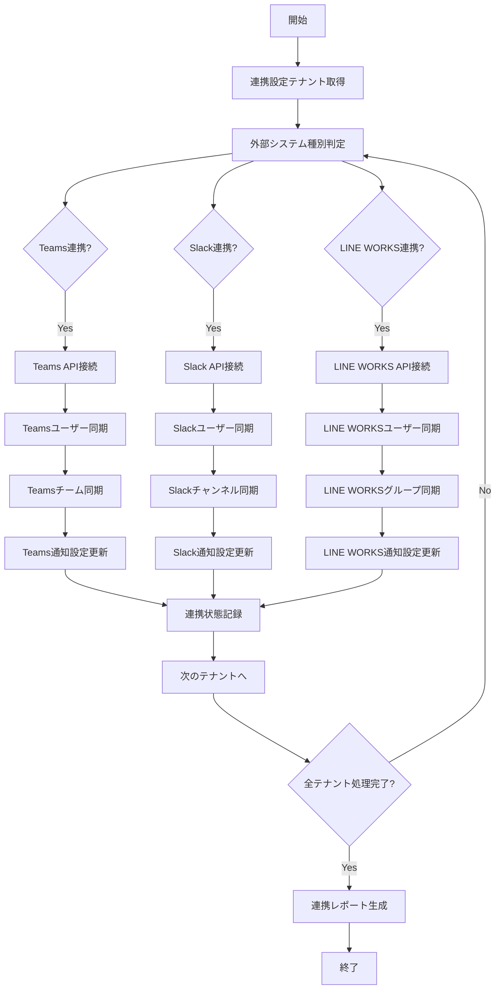

# バッチ定義書：外部システム連携バッチ

| 項目                | 内容                                                                                |
|---------------------|------------------------------------------------------------------------------------|
| **バッチID**        | BATCH-403                                                                          |
| **バッチ名称**      | 外部システム連携バッチ                                                              |
| **機能カテゴリ**    | 通知・連携                                                                          |
| **概要・目的**      | Teams/Slack/LINE WORKS等の外部システムとのデータ同期・連携処理を実行する           |
| **バッチ種別**      | 定期バッチ                                                                          |
| **実行スケジュール**| 日次（06:00）                                                                       |
| **入出力対象**      | 外部システムAPI、ユーザー情報、チーム情報、通知設定                                 |
| **優先度**          | 中                                                                                  |
| **備考**            | マルチテナント対応、API制限考慮、エラー処理強化                                     |

## 1. 処理概要

外部システム連携バッチは、マルチテナント環境において各テナントが利用する外部システム（Teams、Slack、LINE WORKS等）との連携を管理するバッチ処理です。ユーザー情報の同期、チーム・チャンネル情報の更新、認証トークンの更新、連携状態の監視を行い、外部システムとの連携を安定的に維持します。

## 2. 処理フロー



## 3. 入力データ

### 3.1 外部システム連携設定

| 項目                | データ型 | 説明                                           |
|---------------------|----------|------------------------------------------------|
| tenant_id           | String   | テナントID                                     |
| system_type         | String   | システム種別（TEAMS/SLACK/LINE_WORKS）         |
| api_endpoint        | String   | API エンドポイント                             |
| client_id           | String   | クライアントID                                 |
| client_secret       | String   | クライアントシークレット（暗号化）             |
| access_token        | String   | アクセストークン（暗号化）                     |
| refresh_token       | String   | リフレッシュトークン（暗号化）                 |
| token_expires_at    | DateTime | トークン有効期限                               |
| sync_enabled        | Boolean  | 同期有効フラグ                                 |
| last_sync_at        | DateTime | 最終同期日時                                   |

### 3.2 同期設定

| 設定項目                | データ型 | デフォルト値 | 説明                                 |
|-------------------------|----------|--------------|--------------------------------------|
| sync_users              | Boolean  | true         | ユーザー情報同期有効/無効            |
| sync_teams              | Boolean  | true         | チーム/チャンネル同期有効/無効       |
| sync_notifications      | Boolean  | true         | 通知設定同期有効/無効                |
| batch_size              | Integer  | 100          | 一度に処理するレコード数             |
| api_rate_limit          | Integer  | 60           | API呼び出し制限（回/分）             |
| retry_attempts          | Integer  | 3            | リトライ回数                         |
| timeout_seconds         | Integer  | 30           | タイムアウト時間（秒）               |

## 4. 出力データ

### 4.1 外部システム同期履歴テーブル（新規作成）

| フィールド名      | データ型 | 説明                                           |
|-------------------|----------|------------------------------------------------|
| sync_id           | String   | 同期ID（主キー）                               |
| tenant_id         | String   | テナントID                                     |
| system_type       | String   | システム種別                                   |
| sync_type         | String   | 同期種別（USERS/TEAMS/NOTIFICATIONS）          |
| started_at        | DateTime | 同期開始日時                                   |
| completed_at      | DateTime | 同期完了日時                                   |
| status            | String   | 同期ステータス（SUCCESS/FAILED/PARTIAL）       |
| records_processed | Integer  | 処理レコード数                                 |
| records_updated   | Integer  | 更新レコード数                                 |
| records_created   | Integer  | 新規作成レコード数                             |
| records_deleted   | Integer  | 削除レコード数                                 |
| error_message     | Text     | エラーメッセージ                               |

### 4.2 外部システムユーザーマッピングテーブル（新規作成）

| フィールド名      | データ型 | 説明                                           |
|-------------------|----------|------------------------------------------------|
| mapping_id        | String   | マッピングID（主キー）                         |
| tenant_id         | String   | テナントID                                     |
| internal_user_id  | String   | 内部ユーザーID                                 |
| system_type       | String   | システム種別                                   |
| external_user_id  | String   | 外部システムユーザーID                         |
| external_username | String   | 外部システムユーザー名                         |
| external_email    | String   | 外部システムメールアドレス                     |
| sync_status       | String   | 同期ステータス（ACTIVE/INACTIVE/ERROR）        |
| last_synced_at    | DateTime | 最終同期日時                                   |

## 5. 外部システム連携仕様

### 5.1 Teams連携

```typescript
class TeamsIntegrationService {
  async syncTeamsData(tenantId: string): Promise<TeamsSyncResult> {
    const config = await this.getTeamsConfig(tenantId);
    const client = new TeamsAPIClient(config);
    
    try {
      // アクセストークンの有効性確認・更新
      await this.validateAndRefreshToken(client, config);
      
      // ユーザー同期
      const userSyncResult = await this.syncTeamsUsers(client, tenantId);
      
      // チーム同期
      const teamSyncResult = await this.syncTeamsTeams(client, tenantId);
      
      // 通知設定同期
      const notificationSyncResult = await this.syncTeamsNotifications(client, tenantId);
      
      return {
        tenantId,
        systemType: 'TEAMS',
        userSync: userSyncResult,
        teamSync: teamSyncResult,
        notificationSync: notificationSyncResult,
        status: 'SUCCESS',
        syncedAt: new Date()
      };
    } catch (error) {
      await this.handleTeamsError(tenantId, error);
      throw error;
    }
  }
  
  private async syncTeamsUsers(client: TeamsAPIClient, tenantId: string): Promise<UserSyncResult> {
    const teamsUsers = await client.getUsers();
    const internalUsers = await this.getInternalUsers(tenantId);
    
    const syncResults = {
      processed: 0,
      created: 0,
      updated: 0,
      deleted: 0,
      errors: []
    };
    
    for (const teamsUser of teamsUsers) {
      try {
        const internalUser = this.findMatchingUser(teamsUser, internalUsers);
        
        if (internalUser) {
          // 既存ユーザーの更新
          await this.updateUserMapping(tenantId, internalUser.id, teamsUser);
          syncResults.updated++;
        } else {
          // 新規ユーザーマッピングの作成
          await this.createUserMapping(tenantId, teamsUser);
          syncResults.created++;
        }
        
        syncResults.processed++;
      } catch (error) {
        syncResults.errors.push({
          userId: teamsUser.id,
          error: error.message
        });
      }
    }
    
    return syncResults;
  }
  
  private async syncTeamsTeams(client: TeamsAPIClient, tenantId: string): Promise<TeamSyncResult> {
    const teamsTeams = await client.getTeams();
    const syncResults = {
      processed: 0,
      created: 0,
      updated: 0,
      errors: []
    };
    
    for (const team of teamsTeams) {
      try {
        const existingTeam = await this.findExistingTeam(tenantId, team.id);
        
        if (existingTeam) {
          await this.updateTeamInfo(tenantId, team);
          syncResults.updated++;
        } else {
          await this.createTeamInfo(tenantId, team);
          syncResults.created++;
        }
        
        // チャンネル情報の同期
        const channels = await client.getTeamChannels(team.id);
        await this.syncTeamChannels(tenantId, team.id, channels);
        
        syncResults.processed++;
      } catch (error) {
        syncResults.errors.push({
          teamId: team.id,
          error: error.message
        });
      }
    }
    
    return syncResults;
  }
}
```

### 5.2 Slack連携

```typescript
class SlackIntegrationService {
  async syncSlackData(tenantId: string): Promise<SlackSyncResult> {
    const config = await this.getSlackConfig(tenantId);
    const client = new SlackAPIClient(config);
    
    try {
      // ワークスペース情報の取得
      const workspaceInfo = await client.getWorkspaceInfo();
      
      // ユーザー同期
      const userSyncResult = await this.syncSlackUsers(client, tenantId);
      
      // チャンネル同期
      const channelSyncResult = await this.syncSlackChannels(client, tenantId);
      
      // Bot設定同期
      const botSyncResult = await this.syncSlackBots(client, tenantId);
      
      return {
        tenantId,
        systemType: 'SLACK',
        workspaceInfo,
        userSync: userSyncResult,
        channelSync: channelSyncResult,
        botSync: botSyncResult,
        status: 'SUCCESS',
        syncedAt: new Date()
      };
    } catch (error) {
      await this.handleSlackError(tenantId, error);
      throw error;
    }
  }
  
  private async syncSlackUsers(client: SlackAPIClient, tenantId: string): Promise<UserSyncResult> {
    const slackUsers = await client.getUsers();
    const syncResults = {
      processed: 0,
      created: 0,
      updated: 0,
      deleted: 0,
      errors: []
    };
    
    for (const slackUser of slackUsers) {
      try {
        // ボットユーザーは除外
        if (slackUser.is_bot || slackUser.deleted) {
          continue;
        }
        
        const existingMapping = await this.findUserMapping(tenantId, 'SLACK', slackUser.id);
        
        if (existingMapping) {
          await this.updateSlackUserMapping(existingMapping, slackUser);
          syncResults.updated++;
        } else {
          await this.createSlackUserMapping(tenantId, slackUser);
          syncResults.created++;
        }
        
        syncResults.processed++;
      } catch (error) {
        syncResults.errors.push({
          userId: slackUser.id,
          error: error.message
        });
      }
    }
    
    return syncResults;
  }
  
  private async syncSlackChannels(client: SlackAPIClient, tenantId: string): Promise<ChannelSyncResult> {
    const channels = await client.getChannels();
    const syncResults = {
      processed: 0,
      created: 0,
      updated: 0,
      errors: []
    };
    
    for (const channel of channels) {
      try {
        // プライベートチャンネルで参加していないものは除外
        if (channel.is_private && !channel.is_member) {
          continue;
        }
        
        const existingChannel = await this.findChannelMapping(tenantId, 'SLACK', channel.id);
        
        if (existingChannel) {
          await this.updateSlackChannelMapping(existingChannel, channel);
          syncResults.updated++;
        } else {
          await this.createSlackChannelMapping(tenantId, channel);
          syncResults.created++;
        }
        
        syncResults.processed++;
      } catch (error) {
        syncResults.errors.push({
          channelId: channel.id,
          error: error.message
        });
      }
    }
    
    return syncResults;
  }
}
```

### 5.3 LINE WORKS連携

```typescript
class LineWorksIntegrationService {
  async syncLineWorksData(tenantId: string): Promise<LineWorksSyncResult> {
    const config = await this.getLineWorksConfig(tenantId);
    const client = new LineWorksAPIClient(config);
    
    try {
      // アクセストークンの取得・更新
      await this.refreshLineWorksToken(client, config);
      
      // ユーザー同期
      const userSyncResult = await this.syncLineWorksUsers(client, tenantId);
      
      // グループ同期
      const groupSyncResult = await this.syncLineWorksGroups(client, tenantId);
      
      // Bot設定同期
      const botSyncResult = await this.syncLineWorksBots(client, tenantId);
      
      return {
        tenantId,
        systemType: 'LINE_WORKS',
        userSync: userSyncResult,
        groupSync: groupSyncResult,
        botSync: botSyncResult,
        status: 'SUCCESS',
        syncedAt: new Date()
      };
    } catch (error) {
      await this.handleLineWorksError(tenantId, error);
      throw error;
    }
  }
  
  private async syncLineWorksUsers(client: LineWorksAPIClient, tenantId: string): Promise<UserSyncResult> {
    const lineWorksUsers = await client.getUsers();
    const syncResults = {
      processed: 0,
      created: 0,
      updated: 0,
      deleted: 0,
      errors: []
    };
    
    for (const lineWorksUser of lineWorksUsers) {
      try {
        // 削除済みユーザーは除外
        if (lineWorksUser.deletedTime) {
          continue;
        }
        
        const existingMapping = await this.findUserMapping(tenantId, 'LINE_WORKS', lineWorksUser.userId);
        
        if (existingMapping) {
          await this.updateLineWorksUserMapping(existingMapping, lineWorksUser);
          syncResults.updated++;
        } else {
          await this.createLineWorksUserMapping(tenantId, lineWorksUser);
          syncResults.created++;
        }
        
        syncResults.processed++;
      } catch (error) {
        syncResults.errors.push({
          userId: lineWorksUser.userId,
          error: error.message
        });
      }
    }
    
    return syncResults;
  }
}
```

## 6. API制限・エラー処理

### 6.1 レート制限対応

```typescript
class APIRateLimiter {
  private rateLimits: Map<string, RateLimit> = new Map();
  
  async executeWithRateLimit<T>(
    systemType: string,
    operation: () => Promise<T>
  ): Promise<T> {
    const rateLimit = this.getRateLimit(systemType);
    
    await this.waitForRateLimit(rateLimit);
    
    try {
      const result = await operation();
      this.updateRateLimit(rateLimit, true);
      return result;
    } catch (error) {
      this.updateRateLimit(rateLimit, false);
      
      if (this.isRateLimitError(error)) {
        const retryAfter = this.extractRetryAfter(error);
        await this.sleep(retryAfter * 1000);
        return this.executeWithRateLimit(systemType, operation);
      }
      
      throw error;
    }
  }
  
  private getRateLimit(systemType: string): RateLimit {
    if (!this.rateLimits.has(systemType)) {
      const limits = {
        'TEAMS': { maxRequests: 600, windowMs: 60000 }, // 600/分
        'SLACK': { maxRequests: 100, windowMs: 60000 },  // 100/分
        'LINE_WORKS': { maxRequests: 300, windowMs: 60000 } // 300/分
      };
      
      this.rateLimits.set(systemType, {
        ...limits[systemType],
        requests: [],
        lastReset: Date.now()
      });
    }
    
    return this.rateLimits.get(systemType)!;
  }
  
  private async waitForRateLimit(rateLimit: RateLimit): Promise<void> {
    const now = Date.now();
    
    // ウィンドウ外のリクエストを削除
    rateLimit.requests = rateLimit.requests.filter(
      time => now - time < rateLimit.windowMs
    );
    
    // レート制限チェック
    if (rateLimit.requests.length >= rateLimit.maxRequests) {
      const oldestRequest = Math.min(...rateLimit.requests);
      const waitTime = rateLimit.windowMs - (now - oldestRequest);
      
      if (waitTime > 0) {
        await this.sleep(waitTime);
      }
    }
  }
}
```

### 6.2 エラー処理・リトライ

```typescript
class ExternalSystemErrorHandler {
  async handleWithRetry<T>(
    operation: () => Promise<T>,
    maxRetries: number = 3,
    backoffMs: number = 1000
  ): Promise<T> {
    let lastError: Error;
    
    for (let attempt = 1; attempt <= maxRetries; attempt++) {
      try {
        return await operation();
      } catch (error) {
        lastError = error;
        
        if (!this.isRetryableError(error) || attempt === maxRetries) {
          throw error;
        }
        
        const delay = backoffMs * Math.pow(2, attempt - 1);
        await this.sleep(delay);
      }
    }
    
    throw lastError!;
  }
  
  private isRetryableError(error: any): boolean {
    // ネットワークエラー
    if (error.code === 'ECONNRESET' || error.code === 'ETIMEDOUT') {
      return true;
    }
    
    // HTTPステータスコードによる判定
    if (error.response?.status) {
      const status = error.response.status;
      return status >= 500 || status === 429; // サーバーエラーまたはレート制限
    }
    
    return false;
  }
  
  async handleSystemError(tenantId: string, systemType: string, error: Error): Promise<void> {
    const errorRecord = {
      tenantId,
      systemType,
      errorType: this.classifyError(error),
      errorMessage: error.message,
      stackTrace: error.stack,
      occurredAt: new Date()
    };
    
    await this.saveErrorRecord(errorRecord);
    
    // 重要なエラーの場合は即座に通知
    if (this.isCriticalError(error)) {
      await this.sendCriticalErrorNotification(tenantId, systemType, error);
    }
  }
  
  private classifyError(error: Error): string {
    if (error.message.includes('authentication')) return 'AUTH_ERROR';
    if (error.message.includes('rate limit')) return 'RATE_LIMIT';
    if (error.message.includes('timeout')) return 'TIMEOUT';
    if (error.message.includes('network')) return 'NETWORK_ERROR';
    return 'UNKNOWN_ERROR';
  }
}
```

## 7. 依存関係

- テナント管理システム
- 認証・認可システム
- 通知サービス
- ユーザー管理システム
- 暗号化サービス
- ログ管理システム

## 8. 実行パラメータ

| パラメータ名        | 必須 | デフォルト値 | 説明                                           |
|---------------------|------|--------------|------------------------------------------------|
| --tenant-id         | No   | all          | 特定テナントのみ同期                           |
| --system-type       | No   | all          | 特定システム種別のみ同期                       |
| --sync-type         | No   | all          | 同期種別（users/teams/notifications）          |
| --dry-run           | No   | false        | 実際の同期を行わず結果のみ表示                 |
| --force-refresh     | No   | false        | トークンを強制的に更新                         |
| --batch-size        | No   | 100          | 一度に処理するレコード数                       |

## 9. 実行例

```bash
# 通常実行
npm run batch:external-system-integration

# 特定テナントのみ
npm run batch:external-system-integration -- --tenant-id=tenant-123

# Slackのみ同期
npm run batch:external-system-integration -- --system-type=SLACK

# ユーザー情報のみ同期
npm run batch:external-system-integration -- --sync-type=users

# ドライラン
npm run batch:external-system-integration -- --dry-run

# TypeScript直接実行
npx tsx src/batch/external-system-integration.ts
```

## 10. 改訂履歴

| 改訂日     | 改訂者 | 改訂内容                                         |
|------------|--------|--------------------------------------------------|
| 2025/05/31 | 初版   | 初版作成                                         |
