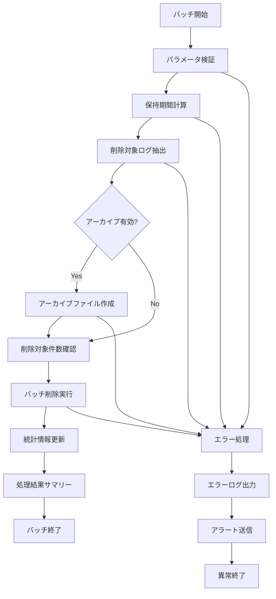

# バッチ定義書：通知ログクリーンアップバッチ (BATCH-404)

## 1. 基本情報

| 項目 | 内容 |
|------|------|
| **バッチID** | BATCH-404 |
| **バッチ名** | 通知ログクリーンアップバッチ |
| **実行スケジュール** | 週次（日曜 03:30） |
| **優先度** | 中 |
| **ステータス** | 未着手 |
| **作成日** | 2025/05/31 |
| **最終更新日** | 2025/05/31 |

## 2. バッチ概要

### 2.1 概要・目的
古い通知ログの削除・アーカイブを行い、データベースの容量を最適化し、システムパフォーマンスを維持する。

### 2.2 関連テーブル
- TBL-025_通知履歴
- TBL-026_通知エラーログ
- TBL-027_通知統計

### 2.3 関連API
- API-201_通知一覧取得API
- API-202_通知詳細取得API

## 3. 実行仕様

### 3.1 実行スケジュール
| 項目 | 設定値 | 備考 |
|------|--------|------|
| 実行頻度 | 30 3 * * 0 | cron形式（日曜 03:30） |
| 実行時間 | 03:30 | 週次メンテナンス |
| タイムアウト | 120分 | 最大実行時間 |
| リトライ回数 | 2回 | 失敗時の再実行 |

### 3.2 実行条件
| 条件 | 内容 | 備考 |
|------|------|------|
| 前提条件 | データベース稼働中 | 基本的な稼働状態 |
| 実行可能時間 | 03:00-06:00 | メンテナンス時間帯 |
| 排他制御 | 同一バッチの重複実行禁止 | ロックファイル使用 |

### 3.3 実行パラメータ
| パラメータ名 | データ型 | 必須 | デフォルト値 | 説明 |
|--------------|----------|------|--------------|------|
| retention_days | number | × | 90 | 保持期間（日） |
| archive_enabled | boolean | × | true | アーカイブ実行フラグ |
| batch_size | number | × | 1000 | 一括処理件数 |

## 4. 処理仕様

### 4.1 処理フロー

### 4.2 詳細処理
1. **初期化処理**
   - パラメータ検証
   - 保持期間の計算（現在日時 - retention_days）
   - ログファイル初期化
   - 排他制御ロック取得

2. **削除対象抽出**
   - 通知履歴テーブルから古いレコード抽出
   - 通知エラーログテーブルから古いレコード抽出
   - 削除対象件数の確認・ログ出力

3. **アーカイブ処理**（archive_enabled=trueの場合）
   - 削除対象データのCSVエクスポート
   - 圧縮ファイル作成
   - アーカイブファイルの外部ストレージ保存

4. **削除処理**
   - バッチサイズ単位での段階的削除
   - トランザクション制御による安全な削除
   - 削除進捗のログ出力

5. **後処理**
   - 通知統計テーブルの更新
   - データベース統計情報の更新
   - 処理結果サマリーの作成

## 5. データ仕様

### 5.1 入力データ
| データ名 | 形式 | 取得元 | 説明 |
|----------|------|--------|------|
| 通知履歴データ | DB | TBL-025_通知履歴 | 削除対象の通知履歴 |
| 通知エラーログ | DB | TBL-026_通知エラーログ | 削除対象のエラーログ |
| 設定パラメータ | ENV | 環境変数 | 保持期間等の設定値 |

### 5.2 出力データ
| データ名 | 形式 | 出力先 | 説明 |
|----------|------|--------|------|
| アーカイブファイル | CSV.gz | /archive/notifications/ | 削除データのアーカイブ |
| 実行ログ | LOG | /logs/batch/ | 実行履歴ログ |
| 処理サマリー | JSON | /data/summary/ | 処理結果統計 |

### 5.3 データ量見積もり
| 項目 | 件数 | 備考 |
|------|------|------|
| 週次削除件数 | 50,000件 | 平均値 |
| 最大削除件数 | 200,000件 | ピーク時 |
| 処理時間 | 60分 | 平均実行時間 |

## 6. エラーハンドリング

### 6.1 エラー分類
| エラー種別 | 対応方法 | 通知要否 | 備考 |
|------------|----------|----------|------|
| DB接続エラー | 処理中断・リトライ | ○ | 接続失敗・タイムアウト |
| ディスク容量不足 | 処理中断・アラート | ○ | アーカイブ作成失敗 |
| データ整合性エラー | エラーログ出力・継続 | △ | 外部キー制約違反等 |

### 6.2 リトライ仕様
| 条件 | リトライ回数 | 間隔 | 備考 |
|------|--------------|------|------|
| DB接続エラー | 3回 | 10分 | 指数バックオフ |
| ファイルI/Oエラー | 2回 | 5分 | 固定間隔 |
| 一時的なロックエラー | 5回 | 1分 | 短間隔リトライ |

### 6.3 異常終了時の処理
1. 処理中断
2. 部分削除のロールバック
3. エラーログ出力
4. 運用チームへアラート送信
5. 排他制御ロック解除

## 7. 監視・運用

### 7.1 監視項目
| 監視項目 | 閾値 | アラート条件 | 対応方法 |
|----------|------|--------------|----------|
| 実行時間 | 120分 | 超過時 | 処理見直し・分割実行 |
| 削除件数 | 期待値±50% | 大幅乖離時 | データ確認・設定見直し |
| ディスク使用量 | 90% | 超過時 | 容量拡張・古いアーカイブ削除 |

### 7.2 ログ出力
| ログ種別 | 出力レベル | 出力内容 | 保存期間 |
|----------|------------|----------|----------|
| 実行ログ | INFO | 処理開始・終了・削除件数 | 3ヶ月 |
| エラーログ | ERROR | エラー詳細・スタックトレース | 1年 |
| デバッグログ | DEBUG | 削除対象抽出・進捗詳細 | 1週間 |

### 7.3 アラート通知
| 通知条件 | 通知先 | 通知方法 | 備考 |
|----------|--------|----------|------|
| 異常終了 | 運用チーム | メール・Slack | 即座に通知 |
| 処理時間超過 | 開発チーム | Slack | 業務時間内のみ |
| 大量削除検知 | データ管理者 | メール | 翌営業日まで |

## 8. 非機能要件

### 8.1 パフォーマンス
- 処理時間：120分以内
- メモリ使用量：1GB以内
- CPU使用率：50%以内

### 8.2 可用性
- 成功率：98%以上
- リトライ機能による自動復旧
- 障害時の手動実行機能

### 8.3 セキュリティ
- 削除データの完全消去
- アーカイブファイルの暗号化
- アクセスログの記録

## 9. テスト仕様

### 9.1 単体テスト
| テストケース | 入力条件 | 期待結果 |
|--------------|----------|----------|
| 正常処理 | 削除対象データあり | 正常終了・指定件数削除 |
| データなし | 削除対象データなし | 正常終了（削除件数0） |
| 大量データ | 最大件数の削除対象 | 正常終了・分割処理 |

### 9.2 異常系テスト
| テストケース | 入力条件 | 期待結果 |
|--------------|----------|----------|
| DB接続エラー | DB停止状態 | リトライ後異常終了 |
| ディスク容量不足 | 容量不足状態 | アーカイブ失敗・アラート |
| 外部キー制約違反 | 参照データ存在 | エラーログ出力・継続処理 |

## 10. 実装メモ

### 10.1 技術仕様
- 言語：Node.js
- フレームワーク：なし（Pure Node.js）
- DB接続：Prisma
- ログ出力：Winston
- アーカイブ：zlib（gzip圧縮）

### 10.2 注意事項
- 大量削除時のロック競合回避
- アーカイブファイルの容量制限
- 削除処理の段階的実行によるパフォーマンス最適化

### 10.3 デプロイ・実行環境
- 実行サーバー：バッチサーバー
- 実行ユーザー：batch_user
- 実行ディレクトリ：/opt/batch/notification-cleanup/
- 設定ファイル：/etc/batch/notification-cleanup.json

---

**改訂履歴**

| バージョン | 日付 | 変更者 | 変更内容 |
|------------|------|--------|----------|
| 1.0 | 2025/05/31 | システムアーキテクト | 初版作成 |
