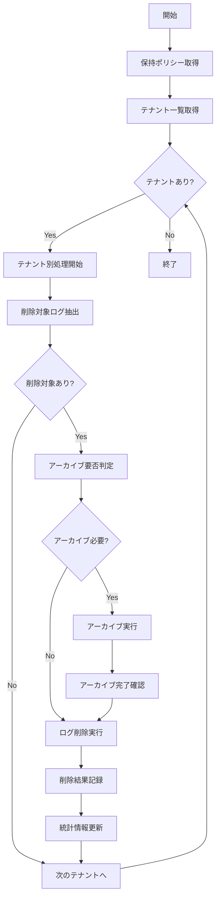

# バッチ定義書：通知ログクリーンアップバッチ

| 項目                | 内容                                                                                |
|---------------------|------------------------------------------------------------------------------------|
| **バッチID**        | BATCH-404                                                                          |
| **バッチ名称**      | 通知ログクリーンアップバッチ                                                        |
| **機能カテゴリ**    | 通知・連携管理                                                                      |
| **概要・目的**      | 古い通知ログを定期的に削除し、ストレージ容量を最適化する                            |
| **バッチ種別**      | 定期バッチ                                                                          |
| **実行スケジュール**| 週次（日曜日 03:30）                                                                |
| **入出力対象**      | NotificationLog, NotificationRetryLog, NotificationArchive                         |
| **優先度**          | 中                                                                                  |
| **備考**            | データ保持ポリシーに基づく自動削除                                                  |

## 1. 処理概要

通知ログクリーンアップバッチは、システムに蓄積された古い通知ログを定期的に削除し、ストレージ容量の最適化とパフォーマンス維持を行うバッチ処理です。テナント別の保持ポリシーに従い、必要に応じてアーカイブ処理も実行します。

## 2. 処理フロー



## 3. 入力データ

### 3.1 NotificationLogテーブル

| フィールド名      | データ型 | 説明                                           |
|-------------------|----------|------------------------------------------------|
| log_id            | String   | ログID（主キー）                               |
| tenant_id         | String   | テナントID（外部キー）                         |
| notification_type | String   | 通知種別                                       |
| send_status       | String   | 送信状態                                       |
| sent_at           | DateTime | 送信日時                                       |
| created_at        | DateTime | 作成日時                                       |
| updated_at        | DateTime | 更新日時                                       |

### 3.2 NotificationRetryLogテーブル

| フィールド名      | データ型 | 説明                                           |
|-------------------|----------|------------------------------------------------|
| retry_log_id      | String   | リトライログID（主キー）                       |
| original_log_id   | String   | 元ログID（外部キー）                           |
| retry_at          | DateTime | リトライ実行日時                               |
| retry_status      | String   | リトライ結果                                   |
| created_at        | DateTime | 作成日時                                       |

### 3.3 TenantRetentionPolicyテーブル

| フィールド名      | データ型 | 説明                                           |
|-------------------|----------|------------------------------------------------|
| tenant_id         | String   | テナントID（主キー）                           |
| log_retention_days| Integer  | ログ保持日数                                   |
| archive_enabled   | Boolean  | アーカイブ有効フラグ                           |
| archive_storage   | String   | アーカイブ先ストレージ                         |

## 4. 出力データ

### 4.1 NotificationArchiveテーブル（追加）

| フィールド名      | データ型 | 説明                                           |
|-------------------|----------|------------------------------------------------|
| archive_id        | String   | アーカイブID（主キー）                         |
| tenant_id         | String   | テナントID（外部キー）                         |
| archive_date      | Date     | アーカイブ実行日                               |
| log_count         | Integer  | アーカイブ対象ログ件数                         |
| archive_size_mb   | Decimal  | アーカイブファイルサイズ（MB）                 |
| archive_path      | String   | アーカイブファイルパス                         |
| status            | String   | アーカイブ状態（"COMPLETED"/"FAILED"）         |
| created_at        | DateTime | 作成日時                                       |

### 4.2 CleanupExecutionLogテーブル（追加）

| フィールド名      | データ型 | 説明                                           |
|-------------------|----------|------------------------------------------------|
| execution_id      | String   | 実行ID（主キー）                               |
| batch_id          | String   | バッチID                                       |
| execution_date    | DateTime | 実行日時                                       |
| total_tenants     | Integer  | 処理対象テナント数                             |
| deleted_logs      | Integer  | 削除ログ件数                                   |
| archived_logs     | Integer  | アーカイブログ件数                             |
| freed_space_mb    | Decimal  | 解放容量（MB）                                 |
| execution_time_sec| Integer  | 実行時間（秒）                                 |
| status            | String   | 実行状態（"SUCCESS"/"FAILED"/"PARTIAL"）       |

## 5. 保持ポリシー

### 5.1 デフォルト保持期間

| 通知種別          | 保持期間 | アーカイブ | 備考                     |
|-------------------|----------|------------|--------------------------|
| 緊急通知          | 1年      | 必須       | 監査要件により長期保持   |
| 重要通知          | 6ヶ月    | 推奨       | 業務継続性確保           |
| 一般通知          | 3ヶ月    | 任意       | 標準的な保持期間         |
| 情報通知          | 1ヶ月    | 不要       | 短期保持で十分           |

### 5.2 テナント別カスタマイズ

```typescript
interface TenantRetentionPolicy {
  tenantId: string;
  retentionDays: {
    emergency: number;    // 緊急通知
    important: number;    // 重要通知
    general: number;      // 一般通知
    info: number;         // 情報通知
  };
  archiveSettings: {
    enabled: boolean;
    storageType: 'S3' | 'GCS' | 'Azure';
    compressionLevel: number;
    encryptionEnabled: boolean;
  };
}
```

## 6. 実行パラメータ

| パラメータ名        | 必須 | デフォルト値 | 説明                                           |
|---------------------|------|--------------|------------------------------------------------|
| --tenant-id         | No   | 全テナント   | 特定テナントのみクリーンアップ                 |
| --retention-days    | No   | ポリシー準拠 | 保持日数の上書き指定                           |
| --dry-run           | No   | false        | 削除対象の確認のみ行い、実際の削除は行わない   |
| --force-archive     | No   | false        | アーカイブ無効テナントも強制アーカイブ         |
| --batch-size        | No   | 1000         | 一度に処理するログ件数                         |

## 7. 実行例

```bash
# 通常実行
npm run batch:notification-cleanup

# 特定テナントのみクリーンアップ
npm run batch:notification-cleanup -- --tenant-id=tenant001

# 保持期間を30日に指定
npm run batch:notification-cleanup -- --retention-days=30

# ドライラン（削除対象確認のみ）
npm run batch:notification-cleanup -- --dry-run

# 強制アーカイブ実行
npm run batch:notification-cleanup -- --force-archive

# TypeScript直接実行
npx tsx src/batch/notification-cleanup.ts
```

## 8. エラー処理

| エラーケース                      | 対応方法                                                                 |
|-----------------------------------|--------------------------------------------------------------------------|
| アーカイブストレージ接続エラー    | エラーログ記録、該当テナントをスキップして処理継続                       |
| ディスク容量不足                  | 処理中断、緊急アラート送信                                               |
| データベース接続エラー            | 最大3回リトライ、失敗時は処理中断                                        |
| 削除権限不足                      | エラーログ記録、管理者通知                                               |
| アーカイブファイル破損            | 再アーカイブ実行、失敗時は削除スキップ                                   |

## 9. 監視・アラート

### 9.1 監視項目

| 監視項目              | 閾値           | アラート条件                    |
|-----------------------|----------------|---------------------------------|
| 実行時間              | 2時間          | 超過時に警告アラート            |
| 削除ログ件数          | 100万件/回     | 超過時に情報通知                |
| エラー率              | 5%             | 超過時に警告アラート            |
| 解放容量              | 期待値の50%未満| 効果不足として情報通知          |

### 9.2 成功基準

- **完全成功**: 全テナントで正常にクリーンアップ完了
- **部分成功**: 一部テナントでエラーが発生したが、80%以上が成功
- **失敗**: 50%以上のテナントでエラーが発生

## 10. 関連バッチ

- **BATCH-401**: 定期通知送信バッチ（ログを生成）
- **BATCH-402**: 通知失敗リトライバッチ（リトライログを生成）
- **BATCH-002**: ログクリーンアップバッチ（システムログをクリーンアップ）

## 11. 改訂履歴

| 改訂日     | 改訂者 | 改訂内容                                         |
|------------|--------|--------------------------------------------------|
| 2025/05/30 | 初版   | 初版作成                                         |
