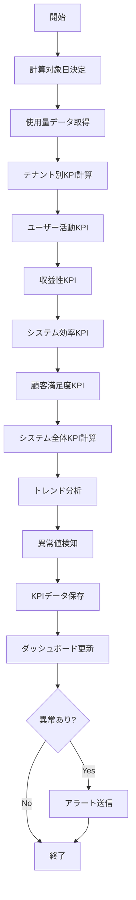

# バッチ定義書：KPI計算バッチ

| 項目                | 内容                                                                                |
|---------------------|------------------------------------------------------------------------------------|
| **バッチID**        | BATCH-205                                                                          |
| **バッチ名称**      | KPI計算バッチ                                                                       |
| **機能カテゴリ**    | レポート・集計処理                                                                  |
| **概要・目的**      | システム全体およびテナント別の主要業績指標（KPI）を計算し、経営判断の基礎データを提供する |
| **バッチ種別**      | 定期バッチ                                                                          |
| **実行スケジュール**| 毎日深夜（6:30）                                                                    |
| **入出力対象**      | 使用量集計テーブル、KPI結果テーブル                                                 |
| **優先度**          | 中                                                                                  |
| **備考**            | 使用量集計バッチ（BATCH-204）の後続処理                                             |

## 1. 処理概要

KPI計算バッチは、マルチテナント環境において各テナントおよびシステム全体の主要業績指標を日次で計算し、経営判断やサービス改善の基礎となるデータを提供するバッチ処理です。ユーザー活動率、収益性指標、システム効率性、顧客満足度などの多角的なKPIを算出し、トレンド分析や異常検知を行います。

## 2. 処理フロー



## 3. 入力データ

### 3.1 日次使用量集計データ

| フィールド名          | データ型 | 説明                                           |
|-----------------------|----------|------------------------------------------------|
| tenant_id             | String   | テナントID                                     |
| usage_date            | Date     | 集計対象日                                     |
| active_users          | Integer  | アクティブユーザー数                           |
| total_users           | Integer  | 総ユーザー数                                   |
| login_count           | Integer  | ログイン回数                                   |
| api_calls             | Integer  | API呼び出し数                                  |
| storage_used_bytes    | BigInt   | ストレージ使用量                               |
| reports_generated     | Integer  | レポート生成数                                 |
| avg_response_time     | Float    | 平均レスポンス時間                             |
| error_count           | Integer  | エラー発生数                                   |

### 3.2 テナント契約情報

| フィールド名      | データ型 | 説明                                           |
|-------------------|----------|------------------------------------------------|
| tenant_id         | String   | テナントID                                     |
| plan_type         | String   | 契約プラン種別                                 |
| monthly_fee       | Decimal  | 月額基本料金                                   |
| user_limit        | Integer  | ユーザー数上限                                 |
| storage_limit_gb  | Integer  | ストレージ容量上限（GB）                       |
| contract_start    | Date     | 契約開始日                                     |
| contract_end      | Date     | 契約終了日                                     |

### 3.3 サポート・問い合わせデータ

| フィールド名      | データ型 | 説明                                           |
|-------------------|----------|------------------------------------------------|
| tenant_id         | String   | テナントID                                     |
| inquiry_date      | Date     | 問い合わせ日                                   |
| inquiry_type      | String   | 問い合わせ種別                                 |
| resolution_time   | Integer  | 解決時間（時間）                               |
| satisfaction_score| Integer  | 満足度スコア（1-5）                            |

## 4. 出力データ

### 4.1 テナント別KPIテーブル（新規作成）

| フィールド名              | データ型 | 説明                                           |
|---------------------------|----------|------------------------------------------------|
| kpi_id                    | String   | KPI ID（主キー）                               |
| tenant_id                 | String   | テナントID                                     |
| calculation_date          | Date     | 計算対象日                                     |
| user_activation_rate      | Float    | ユーザー活性化率（%）                          |
| daily_active_user_rate    | Float    | 日次アクティブユーザー率（%）                  |
| feature_adoption_rate     | Float    | 機能採用率（%）                                |
| avg_session_duration      | Float    | 平均セッション時間（分）                       |
| revenue_per_user          | Decimal  | ユーザーあたり収益                             |
| cost_per_user             | Decimal  | ユーザーあたりコスト                           |
| profit_margin             | Float    | 利益率（%）                                    |
| churn_risk_score          | Float    | 解約リスクスコア（0-100）                      |
| system_availability       | Float    | システム可用性（%）                            |
| avg_response_time         | Float    | 平均レスポンス時間（ms）                       |
| error_rate                | Float    | エラー率（%）                                  |
| storage_efficiency        | Float    | ストレージ効率性（%）                          |
| customer_satisfaction     | Float    | 顧客満足度スコア（1-5）                        |
| support_response_time     | Float    | サポート平均応答時間（時間）                   |
| created_at                | DateTime | 作成日時                                       |

### 4.2 システム全体KPIテーブル（新規作成）

| フィールド名              | データ型 | 説明                                           |
|---------------------------|----------|------------------------------------------------|
| system_kpi_id             | String   | システムKPI ID（主キー）                       |
| calculation_date          | Date     | 計算対象日                                     |
| total_active_tenants      | Integer  | アクティブテナント数                           |
| total_active_users        | Integer  | 総アクティブユーザー数                         |
| platform_revenue          | Decimal  | プラットフォーム総収益                         |
| avg_tenant_health_score   | Float    | 平均テナント健全性スコア                       |
| system_uptime             | Float    | システム稼働率（%）                            |
| platform_growth_rate     | Float    | プラットフォーム成長率（%）                    |
| resource_utilization     | Float    | リソース使用率（%）                            |
| security_incident_count   | Integer  | セキュリティインシデント数                     |
| data_quality_score        | Float    | データ品質スコア（0-100）                      |
| created_at                | DateTime | 作成日時                                       |

### 4.3 KPIトレンドテーブル（新規作成）

| フィールド名      | データ型 | 説明                                           |
|-------------------|----------|------------------------------------------------|
| trend_id          | String   | トレンドID（主キー）                           |
| tenant_id         | String   | テナントID（システム全体の場合はNULL）         |
| kpi_name          | String   | KPI名                                          |
| calculation_date  | Date     | 計算日                                         |
| current_value     | Float    | 現在値                                         |
| previous_value    | Float    | 前日値                                         |
| change_rate       | Float    | 変化率（%）                                    |
| trend_direction   | String   | トレンド方向（UP/DOWN/STABLE）                 |
| anomaly_flag      | Boolean  | 異常値フラグ                                   |
| created_at        | DateTime | 作成日時                                       |

## 5. KPI計算仕様

### 5.1 ユーザー活動KPI

```sql
-- ユーザー活性化率
SELECT 
    tenant_id,
    (active_users::FLOAT / NULLIF(total_users, 0)) * 100 as user_activation_rate
FROM daily_usage_summary 
WHERE usage_date = :target_date;

-- 日次アクティブユーザー率（7日平均）
SELECT 
    tenant_id,
    AVG((active_users::FLOAT / NULLIF(total_users, 0)) * 100) as daily_active_user_rate
FROM daily_usage_summary 
WHERE usage_date BETWEEN :target_date - INTERVAL '6 days' AND :target_date
GROUP BY tenant_id;
```

### 5.2 収益性KPI

```sql
-- ユーザーあたり収益（ARPU）
SELECT 
    t.tenant_id,
    (t.monthly_fee / NULLIF(u.total_users, 0)) as revenue_per_user
FROM tenant_contracts t
JOIN daily_usage_summary u ON t.tenant_id = u.tenant_id
WHERE u.usage_date = :target_date;

-- 利益率
SELECT 
    tenant_id,
    ((revenue_per_user - cost_per_user) / NULLIF(revenue_per_user, 0)) * 100 as profit_margin
FROM tenant_kpi_calculations;
```

### 5.3 システム効率KPI

```sql
-- システム可用性
SELECT 
    tenant_id,
    (1 - (error_count::FLOAT / NULLIF(api_calls, 0))) * 100 as system_availability
FROM daily_usage_summary 
WHERE usage_date = :target_date;

-- ストレージ効率性
SELECT 
    t.tenant_id,
    (u.storage_used_bytes::FLOAT / (t.storage_limit_gb * 1024 * 1024 * 1024)) * 100 as storage_efficiency
FROM tenant_contracts t
JOIN daily_usage_summary u ON t.tenant_id = u.tenant_id
WHERE u.usage_date = :target_date;
```

### 5.4 顧客満足度KPI

```sql
-- 顧客満足度スコア（30日平均）
SELECT 
    tenant_id,
    AVG(satisfaction_score) as customer_satisfaction
FROM support_inquiries 
WHERE inquiry_date BETWEEN :target_date - INTERVAL '29 days' AND :target_date
GROUP BY tenant_id;

-- サポート平均応答時間
SELECT 
    tenant_id,
    AVG(resolution_time) as support_response_time
FROM support_inquiries 
WHERE inquiry_date = :target_date
GROUP BY tenant_id;
```

## 6. 異常検知・アラート

### 6.1 異常検知パターン

| KPI名                 | 異常条件                                           |
|-----------------------|---------------------------------------------------|
| ユーザー活性化率      | 前日比30%以上の減少                               |
| エラー率              | 5%以上                                            |
| 平均レスポンス時間    | 前日比200%以上の増加                              |
| 解約リスクスコア      | 80以上                                            |
| 顧客満足度            | 3.0以下                                           |
| システム可用性        | 95%以下                                           |

### 6.2 アラート通知

```typescript
interface KPIAlert {
  tenantId: string;
  kpiName: string;
  currentValue: number;
  threshold: number;
  severity: 'LOW' | 'MEDIUM' | 'HIGH' | 'CRITICAL';
  trendDirection: 'UP' | 'DOWN' | 'STABLE';
  recommendedAction: string;
}
```

## 7. トレンド分析

### 7.1 移動平均計算

```sql
-- 7日移動平均
SELECT 
    tenant_id,
    kpi_name,
    calculation_date,
    current_value,
    AVG(current_value) OVER (
        PARTITION BY tenant_id, kpi_name 
        ORDER BY calculation_date 
        ROWS BETWEEN 6 PRECEDING AND CURRENT ROW
    ) as moving_avg_7d
FROM kpi_trends;
```

### 7.2 季節性調整

```sql
-- 曜日別平均との比較
SELECT 
    tenant_id,
    kpi_name,
    calculation_date,
    current_value,
    AVG(current_value) OVER (
        PARTITION BY tenant_id, kpi_name, EXTRACT(DOW FROM calculation_date)
        ORDER BY calculation_date 
        ROWS BETWEEN 21 PRECEDING AND 7 PRECEDING
    ) as seasonal_avg
FROM kpi_trends;
```

## 8. エラー処理

| エラーケース                      | 対応方法                                                                 |
|-----------------------------------|--------------------------------------------------------------------------|
| 使用量データ不足                  | 前日データで代替計算、警告ログ出力                                       |
| 計算結果異常値                    | 上下限値でクリッピング、異常フラグ設定                                   |
| 外部データ取得失敗                | 前回値を使用、データ品質スコアに反映                                     |
| メモリ不足                        | バッチサイズを縮小して再実行                                             |

## 9. パフォーマンス最適化

### 9.1 インデックス要件

```sql
-- KPI計算用インデックス
CREATE INDEX idx_usage_summary_tenant_date ON daily_usage_summary(tenant_id, usage_date);
CREATE INDEX idx_tenant_contracts_tenant ON tenant_contracts(tenant_id);
CREATE INDEX idx_support_inquiries_tenant_date ON support_inquiries(tenant_id, inquiry_date);

-- トレンド分析用インデックス
CREATE INDEX idx_kpi_trends_tenant_kpi_date ON kpi_trends(tenant_id, kpi_name, calculation_date);
```

### 9.2 計算最適化

| 計算種別        | 最適化手法                                         |
|-----------------|---------------------------------------------------|
| 単純集計        | 並列処理、インデックス活用                        |
| 移動平均        | ウィンドウ関数使用                                |
| 複雑計算        | 中間結果キャッシュ                                |
| トレンド分析    | 差分計算、増分更新                                |

## 10. 依存関係

- 日次使用量集計テーブル（BATCH-204の出力）
- テナント契約情報テーブル
- サポート・問い合わせテーブル
- 機能別使用量集計テーブル
- 通知サービス

## 11. 実行パラメータ

| パラメータ名        | 必須 | デフォルト値 | 説明                                           |
|---------------------|------|--------------|------------------------------------------------|
| --target-date       | No   | 前日         | 計算対象日（YYYY-MM-DD形式）                   |
| --tenant-id         | No   | all          | 特定テナントのみ計算                           |
| --kpi-type          | No   | all          | 特定KPI種別のみ計算                            |
| --skip-trends       | No   | false        | トレンド分析をスキップ                         |
| --skip-alerts       | No   | false        | 異常検知アラートをスキップ                     |
| --dry-run           | No   | false        | 計算のみ実行、データ保存なし                   |

## 12. 実行例

```bash
# 通常実行
npm run batch:kpi-calculation

# 特定日の計算
npm run batch:kpi-calculation -- --target-date=2025-05-30

# 特定テナントのみ計算
npm run batch:kpi-calculation -- --tenant-id=tenant_001

# 収益性KPIのみ計算
npm run batch:kpi-calculation -- --kpi-type=revenue

# ドライラン
npm run batch:kpi-calculation -- --dry-run

# TypeScript直接実行
npx tsx src/batch/kpi-calculation.ts

# パラメータ付きTypeScript実行
npx tsx src/batch/kpi-calculation.ts --target-date=2025-05-30 --kpi-type=all
```

## 13. 運用上の注意点

- 本バッチは使用量集計バッチ（BATCH-204）の完了後に実行してください。
- KPIの閾値は定期的に見直し、ビジネス要件に応じて調整してください。
- 大量のテナントがある場合、計算時間が長くなる可能性があるため、並列処理を検討してください。
- 異常検知の精度向上のため、季節性やトレンドを考慮した閾値設定が重要です。

## 14. ダッシュボード連携

### 14.1 リアルタイム更新

```typescript
// KPI計算完了後のダッシュボード更新
interface DashboardUpdate {
  tenantId: string;
  kpiData: {
    userActivationRate: number;
    revenuePerUser: number;
    systemAvailability: number;
    customerSatisfaction: number;
  };
  trendData: {
    kpiName: string;
    changeRate: number;
    trendDirection: string;
  }[];
  alerts: KPIAlert[];
}
```

### 14.2 データエクスポート

```sql
-- 月次KPIレポート用データ
SELECT 
    tenant_id,
    DATE_TRUNC('month', calculation_date) as month,
    AVG(user_activation_rate) as avg_user_activation,
    AVG(revenue_per_user) as avg_revenue_per_user,
    AVG(system_availability) as avg_availability,
    AVG(customer_satisfaction) as avg_satisfaction
FROM tenant_kpi_calculations
WHERE calculation_date >= DATE_TRUNC('month', CURRENT_DATE - INTERVAL '12 months')
GROUP BY tenant_id, DATE_TRUNC('month', calculation_date)
ORDER BY tenant_id, month;
```

## 15. 改訂履歴

| 改訂日     | 改訂者 | 改訂内容                                         |
|------------|--------|--------------------------------------------------|
| 2025/05/31 | 初版   | 初版作成                                         |
