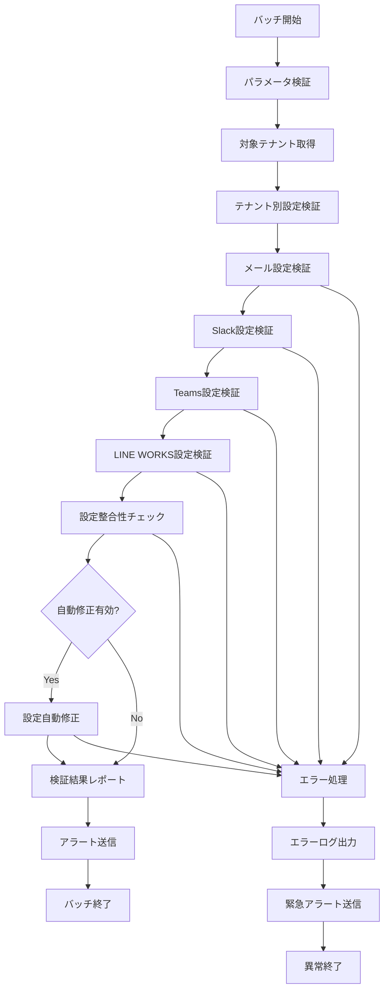

# バッチ定義書：通知設定検証バッチ (BATCH-405)

## 1. 基本情報

| 項目 | 内容 |
|------|------|
| **バッチID** | BATCH-405 |
| **バッチ名** | 通知設定検証バッチ |
| **実行スケジュール** | 日次（05:45） |
| **優先度** | 高 |
| **ステータス** | 未着手 |
| **作成日** | 2025/05/31 |
| **最終更新日** | 2025/05/31 |

## 2. バッチ概要

### 2.1 概要・目的
各テナントの通知設定の有効性を検証し、無効な設定の検知・修正を行い、通知システムの信頼性を確保する。

### 2.2 関連テーブル
- TBL-023_通知設定
- TBL-024_通知チャンネル
- TBL-025_通知履歴
- TBL-028_テナント設定

### 2.3 関連API
- API-203_通知状態更新API
- API-204_全通知既読API
- API-301_システム状態取得API

## 3. 実行仕様

### 3.1 実行スケジュール
| 項目 | 設定値 | 備考 |
|------|--------|------|
| 実行頻度 | 45 5 * * * | cron形式（毎日 05:45） |
| 実行時間 | 05:45 | 朝の業務開始前 |
| タイムアウト | 30分 | 最大実行時間 |
| リトライ回数 | 3回 | 失敗時の再実行 |

### 3.2 実行条件
| 条件 | 内容 | 備考 |
|------|------|------|
| 前提条件 | 通知システム稼働中 | 外部連携サービス含む |
| 実行可能時間 | 05:00-07:00 | 業務開始前の時間帯 |
| 排他制御 | 同一バッチの重複実行禁止 | ロックファイル使用 |

### 3.3 実行パラメータ
| パラメータ名 | データ型 | 必須 | デフォルト値 | 説明 |
|--------------|----------|------|--------------|------|
| tenant_id | string | × | all | 検証対象テナントID |
| check_external | boolean | × | true | 外部サービス接続確認 |
| auto_fix | boolean | × | false | 自動修正実行フラグ |

## 4. 処理仕様

### 4.1 処理フロー

### 4.2 詳細処理
1. **初期化処理**
   - パラメータ検証
   - 対象テナント一覧取得
   - ログファイル初期化
   - 排他制御ロック取得

2. **メール設定検証**
   - SMTP設定の接続確認
   - 認証情報の有効性確認
   - 送信者アドレスの検証
   - 配信制限設定の確認

3. **外部サービス設定検証**
   - Slack: Webhook URL・トークンの有効性確認
   - Teams: Webhook URL・認証情報の確認
   - LINE WORKS: API キー・認証情報の確認
   - 各サービスへのテスト送信実行

4. **設定整合性チェック**
   - 通知ルールの論理的整合性確認
   - 重複設定の検知
   - 無効な通知先の検知
   - 権限設定の妥当性確認

5. **自動修正処理**（auto_fix=trueの場合）
   - 無効な設定の無効化
   - 重複設定の統合
   - デフォルト値の適用
   - 修正履歴の記録

## 5. データ仕様

### 5.1 入力データ
| データ名 | 形式 | 取得元 | 説明 |
|----------|------|--------|------|
| 通知設定データ | DB | TBL-023_通知設定 | 各テナントの通知設定 |
| 通知チャンネル | DB | TBL-024_通知チャンネル | 通知先チャンネル情報 |
| テナント設定 | DB | TBL-028_テナント設定 | テナント固有設定 |

### 5.2 出力データ
| データ名 | 形式 | 出力先 | 説明 |
|----------|------|--------|------|
| 検証結果レポート | JSON | /data/reports/ | 設定検証結果詳細 |
| 修正履歴 | DB | TBL-025_通知履歴 | 自動修正の実行履歴 |
| 実行ログ | LOG | /logs/batch/ | 実行履歴ログ |

### 5.3 データ量見積もり
| 項目 | 件数 | 備考 |
|------|------|------|
| 検証対象テナント | 100件 | 平均値 |
| 通知設定件数 | 500件 | テナント当たり平均5件 |
| 処理時間 | 15分 | 平均実行時間 |

## 6. エラーハンドリング

### 6.1 エラー分類
| エラー種別 | 対応方法 | 通知要否 | 備考 |
|------------|----------|----------|------|
| 外部サービス接続エラー | エラーログ出力・継続 | ○ | Slack/Teams/LINE WORKS |
| 設定データ不整合 | 自動修正・アラート | ○ | データ整合性問題 |
| 認証エラー | エラーログ出力・継続 | ○ | 無効な認証情報 |

### 6.2 リトライ仕様
| 条件 | リトライ回数 | 間隔 | 備考 |
|------|--------------|------|------|
| 外部API接続エラー | 3回 | 30秒 | 指数バックオフ |
| DB接続エラー | 3回 | 10秒 | 固定間隔 |
| 一時的なネットワークエラー | 5回 | 5秒 | 短間隔リトライ |

### 6.3 異常終了時の処理
1. 処理中断
2. 部分修正のロールバック
3. エラーログ出力
4. 緊急アラート送信
5. 排他制御ロック解除

## 7. 監視・運用

### 7.1 監視項目
| 監視項目 | 閾値 | アラート条件 | 対応方法 |
|----------|------|--------------|----------|
| 実行時間 | 30分 | 超過時 | 処理見直し・並列化 |
| 無効設定検知率 | 10% | 超過時 | 設定見直し・教育 |
| 外部サービス接続失敗率 | 20% | 超過時 | サービス状況確認 |

### 7.2 ログ出力
| ログ種別 | 出力レベル | 出力内容 | 保存期間 |
|----------|------------|----------|----------|
| 実行ログ | INFO | 処理開始・終了・検証結果 | 3ヶ月 |
| エラーログ | ERROR | エラー詳細・スタックトレース | 1年 |
| 修正ログ | WARN | 自動修正内容・変更前後 | 6ヶ月 |

### 7.3 アラート通知
| 通知条件 | 通知先 | 通知方法 | 備考 |
|----------|--------|----------|------|
| 大量無効設定検知 | 運用チーム | メール・Slack | 即座に通知 |
| 外部サービス障害 | 開発チーム | Slack | 業務時間内のみ |
| 自動修正実行 | システム管理者 | メール | 修正内容詳細 |

## 8. 非機能要件

### 8.1 パフォーマンス
- 処理時間：30分以内
- メモリ使用量：512MB以内
- CPU使用率：30%以内

### 8.2 可用性
- 成功率：99%以上
- 外部サービス障害時の継続処理
- 部分的な設定検証の実行

### 8.3 セキュリティ
- 認証情報の暗号化保存
- 外部API呼び出しの安全な実行
- 設定変更の監査ログ記録

## 9. テスト仕様

### 9.1 単体テスト
| テストケース | 入力条件 | 期待結果 |
|--------------|----------|----------|
| 正常設定 | 全設定が有効 | 正常終了・問題なし |
| 無効メール設定 | SMTP設定エラー | 無効設定検知・レポート出力 |
| 無効Slack設定 | 無効なWebhook URL | 無効設定検知・アラート |

### 9.2 異常系テスト
| テストケース | 入力条件 | 期待結果 |
|--------------|----------|----------|
| 外部サービス障害 | Slack API障害 | エラーログ出力・継続処理 |
| DB接続エラー | DB停止状態 | リトライ後異常終了 |
| 設定データ破損 | 不正な設定データ | エラー検知・修正提案 |

## 10. 実装メモ

### 10.1 技術仕様
- 言語：Node.js
- フレームワーク：なし（Pure Node.js）
- DB接続：Prisma
- ログ出力：Winston
- 外部API：axios（HTTP クライアント）

### 10.2 注意事項
- 外部サービスのレート制限対応
- 認証情報の安全な取り扱い
- 設定変更時の影響範囲確認

### 10.3 デプロイ・実行環境
- 実行サーバー：バッチサーバー
- 実行ユーザー：batch_user
- 実行ディレクトリ：/opt/batch/notification-validation/
- 設定ファイル：/etc/batch/notification-validation.json

---

**改訂履歴**

| バージョン | 日付 | 変更者 | 変更内容 |
|------------|------|--------|----------|
| 1.0 | 2025/05/31 | システムアーキテクト | 初版作成 |
