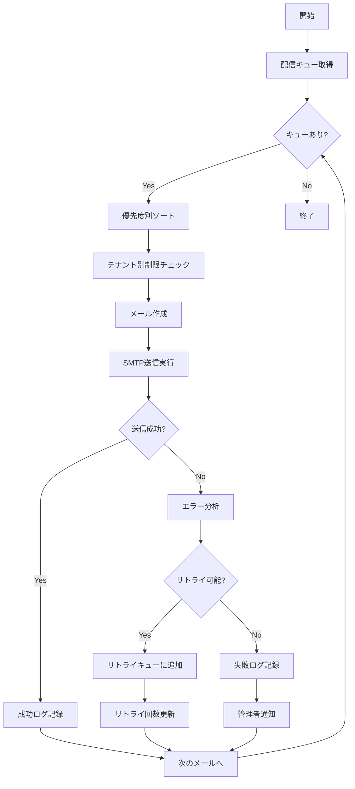

# バッチ定義書：メール配信バッチ

| 項目                | 内容                                                                                |
|---------------------|------------------------------------------------------------------------------------|
| **バッチID**        | BATCH-406                                                                          |
| **バッチ名称**      | メール配信バッチ                                                                    |
| **機能カテゴリ**    | 通知・連携管理                                                                      |
| **概要・目的**      | メール配信キューを処理し、効率的かつ確実にメール送信を実行する                      |
| **バッチ種別**      | 定期バッチ                                                                          |
| **実行スケジュール**| 時間毎（毎時10分）                                                                  |
| **入出力対象**      | EmailQueue, EmailLog, EmailTemplate                                                |
| **優先度**          | 高                                                                                  |
| **備考**            | 高頻度実行による即座性確保                                                          |

## 1. 処理概要

メール配信バッチは、システムに蓄積されたメール配信キューを定期的に処理し、優先度とテナント別の配信制限を考慮しながら効率的にメール送信を実行するバッチ処理です。送信失敗時の自動リトライ機能と詳細なログ記録により、高い配信成功率を実現します。

## 2. 処理フロー



## 3. 入力データ

### 3.1 EmailQueueテーブル

| フィールド名      | データ型 | 説明                                           |
|-------------------|----------|------------------------------------------------|
| queue_id          | String   | キューID（主キー）                             |
| tenant_id         | String   | テナントID（外部キー）                         |
| priority          | Integer  | 優先度（1:最高 ～ 5:最低）                     |
| recipient_email   | String   | 送信先メールアドレス                           |
| recipient_name    | String   | 送信先名前                                     |
| subject           | String   | 件名                                           |
| body_html         | Text     | HTML本文                                       |
| body_text         | Text     | テキスト本文                                   |
| template_id       | String   | テンプレートID（外部キー）                     |
| template_data     | JSON     | テンプレート変数データ                         |
| scheduled_at      | DateTime | 送信予定日時                                   |
| retry_count       | Integer  | リトライ回数                                   |
| max_retry         | Integer  | 最大リトライ回数                               |
| status            | String   | 状態（"PENDING"/"PROCESSING"/"SENT"/"FAILED"） |
| created_at        | DateTime | 作成日時                                       |

### 3.2 EmailTemplateテーブル

| フィールド名      | データ型 | 説明                                           |
|-------------------|----------|------------------------------------------------|
| template_id       | String   | テンプレートID（主キー）                       |
| tenant_id         | String   | テナントID（外部キー）                         |
| template_name     | String   | テンプレート名                                 |
| subject_template  | String   | 件名テンプレート                               |
| html_template     | Text     | HTMLテンプレート                               |
| text_template     | Text     | テキストテンプレート                           |
| variables         | JSON     | 利用可能変数一覧                               |

### 3.3 TenantEmailConfigテーブル

| フィールド名      | データ型 | 説明                                           |
|-------------------|----------|------------------------------------------------|
| tenant_id         | String   | テナントID（主キー）                           |
| smtp_host         | String   | SMTPホスト                                     |
| smtp_port         | Integer  | SMTPポート                                     |
| smtp_username     | String   | SMTP認証ユーザー名                             |
| smtp_password     | String   | SMTP認証パスワード（暗号化）                   |
| from_email        | String   | 送信元メールアドレス                           |
| from_name         | String   | 送信元名前                                     |
| daily_limit       | Integer  | 日次送信制限                                   |
| hourly_limit      | Integer  | 時間毎送信制限                                 |
| rate_limit_per_min| Integer  | 分毎送信制限                                   |

## 4. 出力データ

### 4.1 EmailLogテーブル（追加）

| フィールド名      | データ型 | 説明                                           |
|-------------------|----------|------------------------------------------------|
| log_id            | String   | ログID（主キー）                               |
| queue_id          | String   | キューID（外部キー）                           |
| tenant_id         | String   | テナントID（外部キー）                         |
| recipient_email   | String   | 送信先メールアドレス                           |
| subject           | String   | 件名                                           |
| sent_at           | DateTime | 送信日時                                       |
| status            | String   | 送信結果（"SUCCESS"/"FAILED"/"RETRY"）         |
| smtp_response     | String   | SMTP応答                                       |
| error_code        | String   | エラーコード                                   |
| error_message     | String   | エラーメッセージ                               |
| processing_time_ms| Integer  | 処理時間（ミリ秒）                             |
| retry_count       | Integer  | リトライ回数                                   |

### 4.2 EmailDeliveryStatsテーブル（追加）

| フィールド名      | データ型 | 説明                                           |
|-------------------|----------|------------------------------------------------|
| stats_id          | String   | 統計ID（主キー）                               |
| tenant_id         | String   | テナントID（外部キー）                         |
| execution_date    | DateTime | 実行日時                                       |
| total_queued      | Integer  | キュー総数                                     |
| total_sent        | Integer  | 送信成功数                                     |
| total_failed      | Integer  | 送信失敗数                                     |
| total_retried     | Integer  | リトライ数                                     |
| avg_processing_time| Decimal | 平均処理時間（秒）                             |
| throughput_per_min| Decimal  | 分毎スループット                               |

## 5. 配信制御

### 5.1 優先度制御

| 優先度 | 説明                    | 用途例                           | 処理順序 |
|--------|-------------------------|----------------------------------|----------|
| 1      | 緊急（即座配信）        | パスワードリセット、緊急通知     | 最優先   |
| 2      | 高（1時間以内）         | 重要な業務通知、承認依頼         | 高優先   |
| 3      | 中（6時間以内）         | 一般的な通知、レポート配信       | 通常     |
| 4      | 低（24時間以内）        | 情報提供、ニュースレター         | 低優先   |
| 5      | 最低（制限なし）        | マーケティングメール             | 最低優先 |

### 5.2 レート制限

```typescript
interface RateLimitConfig {
  tenantId: string;
  limits: {
    perMinute: number;    // 分毎制限
    perHour: number;      // 時間毎制限
    perDay: number;       // 日毎制限
  };
  priorityMultiplier: {
    emergency: number;    // 緊急時の制限緩和倍率
    business: number;     // 営業時間の制限調整
  };
}
```

### 5.3 送信時間制御

| 時間帯        | 制限レベル | 説明                               |
|---------------|------------|------------------------------------|
| 09:00-18:00   | 通常       | 営業時間内は通常制限               |
| 18:00-22:00   | 緩和       | 夕方は制限を緩和                   |
| 22:00-09:00   | 厳格       | 夜間は緊急メールのみ               |
| 土日祝日      | 制限       | 休日は重要度2以上のみ              |

## 6. テンプレート処理

### 6.1 変数置換

```typescript
interface TemplateVariables {
  // ユーザー情報
  user: {
    name: string;
    email: string;
    company: string;
    department: string;
  };
  // システム情報
  system: {
    appName: string;
    baseUrl: string;
    supportEmail: string;
    currentDate: string;
  };
  // カスタム変数
  custom: Record<string, any>;
}
```

### 6.2 多言語対応

| 言語コード | 言語名     | テンプレート接尾辞 |
|------------|------------|--------------------|
| ja         | 日本語     | _ja                |
| en         | 英語       | _en                |
| zh         | 中国語     | _zh                |
| ko         | 韓国語     | _ko                |

## 7. 実行パラメータ

| パラメータ名        | 必須 | デフォルト値 | 説明                                           |
|---------------------|------|--------------|------------------------------------------------|
| --tenant-id         | No   | 全テナント   | 特定テナントのみ処理                           |
| --priority          | No   | 全優先度     | 特定優先度のみ処理                             |
| --batch-size        | No   | 100          | 一度に処理するメール数                         |
| --max-processing-time| No  | 50           | 最大処理時間（分）                             |
| --dry-run           | No   | false        | 送信せずに処理確認のみ                         |
| --force-send        | No   | false        | 制限を無視して強制送信                         |

## 8. 実行例

```bash
# 通常実行
npm run batch:email-delivery

# 特定テナントのみ処理
npm run batch:email-delivery -- --tenant-id=tenant001

# 緊急メールのみ処理
npm run batch:email-delivery -- --priority=1

# バッチサイズ指定
npm run batch:email-delivery -- --batch-size=50

# ドライラン
npm run batch:email-delivery -- --dry-run

# TypeScript直接実行
npx tsx src/batch/email-delivery.ts
```

## 9. エラー処理

| エラーケース                      | 対応方法                                                                 |
|-----------------------------------|--------------------------------------------------------------------------|
| SMTP接続エラー                    | 5分後にリトライ、3回失敗で管理者通知                                     |
| 認証エラー                        | 即座に管理者通知、該当テナントの処理停止                                 |
| メールアドレス不正                | エラーログ記録、該当メールをスキップ                                     |
| 添付ファイルサイズ超過            | ファイル圧縮試行、失敗時はリンク配信に変更                               |
| レート制限超過                    | 次回実行時まで待機                                                       |
| テンプレート変数不足              | デフォルト値で補完、警告ログ出力                                         |

## 10. 監視・アラート

### 10.1 監視項目

| 監視項目              | 閾値           | アラート条件                    |
|-----------------------|----------------|---------------------------------|
| 送信成功率            | 95%            | 下回った場合に警告              |
| 平均処理時間          | 5秒            | 超過時に性能警告                |
| キュー滞留数          | 1000件         | 超過時に処理能力警告            |
| エラー率              | 5%             | 超過時に緊急アラート            |

### 10.2 ダッシュボード指標

- **リアルタイム送信状況**: 現在の送信レート、キュー状況
- **日次配信統計**: 送信数、成功率、エラー分析
- **テナント別パフォーマンス**: テナント毎の配信状況
- **トレンド分析**: 週次・月次の配信傾向

## 11. 関連バッチ

- **BATCH-401**: 定期通知送信バッチ（メールキューを生成）
- **BATCH-402**: 通知失敗リトライバッチ（失敗メールを再キュー）
- **BATCH-405**: 通知設定検証バッチ（SMTP設定を検証）

## 12. 改訂履歴

| 改訂日     | 改訂者 | 改訂内容                                         |
|------------|--------|--------------------------------------------------|
| 2025/05/30 | 初版   | 初版作成                                         |
