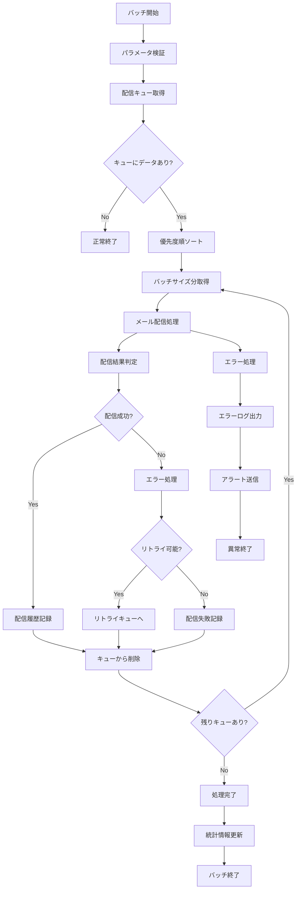

# バッチ定義書：メール配信バッチ (BATCH-406)

## 1. 基本情報

| 項目 | 内容 |
|------|------|
| **バッチID** | BATCH-406 |
| **バッチ名** | メール配信バッチ |
| **実行スケジュール** | 時間毎（毎時10分） |
| **優先度** | 高 |
| **ステータス** | 未着手 |
| **作成日** | 2025/05/31 |
| **最終更新日** | 2025/05/31 |

## 2. バッチ概要

### 2.1 概要・目的
メール配信キューに蓄積されたメールを順次処理し、確実な配信を行う。配信失敗時のリトライ処理も含む。

### 2.2 関連テーブル
- TBL-029_メール配信キュー
- TBL-030_メール配信履歴
- TBL-031_メール配信エラー
- TBL-023_通知設定

### 2.3 関連API
- API-205_メール送信API
- API-206_メール配信状況取得API

## 3. 実行仕様

### 3.1 実行スケジュール
| 項目 | 設定値 | 備考 |
|------|--------|------|
| 実行頻度 | 10 * * * * | cron形式（毎時10分） |
| 実行時間 | 毎時10分 | 高頻度実行 |
| タイムアウト | 50分 | 最大実行時間 |
| リトライ回数 | 3回 | 失敗時の再実行 |

### 3.2 実行条件
| 条件 | 内容 | 備考 |
|------|------|------|
| 前提条件 | SMTP サーバー稼働中 | メール送信基盤 |
| 実行可能時間 | 24時間 | 常時実行 |
| 排他制御 | 同一バッチの重複実行禁止 | ロックファイル使用 |

### 3.3 実行パラメータ
| パラメータ名 | データ型 | 必須 | デフォルト値 | 説明 |
|--------------|----------|------|--------------|------|
| batch_size | number | × | 100 | 一括処理件数 |
| max_retry | number | × | 3 | 最大リトライ回数 |
| priority_only | boolean | × | false | 高優先度メールのみ処理 |

## 4. 処理仕様

### 4.1 処理フロー

### 4.2 詳細処理
1. **初期化処理**
   - パラメータ検証
   - SMTP接続確認
   - ログファイル初期化
   - 排他制御ロック取得

2. **配信キュー取得**
   - 未配信メールの抽出
   - 優先度順（高→中→低）でソート
   - 配信予定時刻の確認
   - バッチサイズ分の取得

3. **メール配信処理**
   - テナント別SMTP設定の取得
   - メールテンプレートの適用
   - 添付ファイルの処理
   - SMTP経由での配信実行

4. **配信結果処理**
   - 配信成功：履歴テーブルへ記録
   - 配信失敗：エラー内容の分析・記録
   - リトライ判定：一時的エラーか永続的エラーか

5. **統計情報更新**
   - 配信成功・失敗件数の集計
   - テナント別配信統計の更新
   - 配信パフォーマンス指標の記録

## 5. データ仕様

### 5.1 入力データ
| データ名 | 形式 | 取得元 | 説明 |
|----------|------|--------|------|
| メール配信キュー | DB | TBL-029_メール配信キュー | 配信待ちメール |
| 通知設定 | DB | TBL-023_通知設定 | SMTP設定・テンプレート |
| 添付ファイル | FILE | /data/attachments/ | メール添付ファイル |

### 5.2 出力データ
| データ名 | 形式 | 出力先 | 説明 |
|----------|------|--------|------|
| 配信履歴 | DB | TBL-030_メール配信履歴 | 配信成功記録 |
| 配信エラー | DB | TBL-031_メール配信エラー | 配信失敗記録 |
| 実行ログ | LOG | /logs/batch/ | 実行履歴ログ |

### 5.3 データ量見積もり
| 項目 | 件数 | 備考 |
|------|------|------|
| 時間毎配信件数 | 500件 | 平均値 |
| 最大配信件数 | 2,000件 | ピーク時 |
| 処理時間 | 30分 | 平均実行時間 |

## 6. エラーハンドリング

### 6.1 エラー分類
| エラー種別 | 対応方法 | 通知要否 | 備考 |
|------------|----------|----------|------|
| SMTP接続エラー | リトライ・アラート | ○ | サーバー障害・設定不備 |
| 認証エラー | エラー記録・スキップ | ○ | 無効な認証情報 |
| 受信者エラー | エラー記録・スキップ | × | 無効なメールアドレス |
| 添付ファイルエラー | エラー記録・継続 | △ | ファイル不存在・容量超過 |

### 6.2 リトライ仕様
| 条件 | リトライ回数 | 間隔 | 備考 |
|------|--------------|------|------|
| SMTP一時エラー | 3回 | 10分 | 指数バックオフ |
| ネットワークエラー | 5回 | 5分 | 短間隔リトライ |
| レート制限エラー | 3回 | 30分 | 長間隔リトライ |

### 6.3 異常終了時の処理
1. 処理中断
2. 処理中メールの状態復元
3. エラーログ出力
4. 緊急アラート送信
5. 排他制御ロック解除

## 7. 監視・運用

### 7.1 監視項目
| 監視項目 | 閾値 | アラート条件 | 対応方法 |
|----------|------|--------------|----------|
| 実行時間 | 50分 | 超過時 | 処理見直し・分割実行 |
| 配信失敗率 | 5% | 超過時 | SMTP設定確認 |
| キュー滞留件数 | 1,000件 | 超過時 | 処理頻度見直し |

### 7.2 ログ出力
| ログ種別 | 出力レベル | 出力内容 | 保存期間 |
|----------|------------|----------|----------|
| 実行ログ | INFO | 処理開始・終了・配信件数 | 3ヶ月 |
| エラーログ | ERROR | エラー詳細・スタックトレース | 1年 |
| 配信ログ | DEBUG | 個別メール配信詳細 | 1週間 |

### 7.3 アラート通知
| 通知条件 | 通知先 | 通知方法 | 備考 |
|----------|--------|----------|------|
| SMTP障害 | 運用チーム | メール・Slack | 即座に通知 |
| 大量配信失敗 | 開発チーム | Slack | 業務時間内のみ |
| キュー滞留 | システム管理者 | メール | 1時間毎 |

## 8. 非機能要件

### 8.1 パフォーマンス
- 処理時間：50分以内
- メモリ使用量：1GB以内
- CPU使用率：40%以内

### 8.2 可用性
- 成功率：99%以上
- SMTP障害時の自動切り替え
- 配信失敗時の自動リトライ

### 8.3 セキュリティ
- SMTP認証情報の暗号化
- メール内容の機密性保護
- 配信ログの適切な管理

## 9. テスト仕様

### 9.1 単体テスト
| テストケース | 入力条件 | 期待結果 |
|--------------|----------|----------|
| 正常配信 | 有効なメールキュー | 正常配信・履歴記録 |
| 空キュー | 配信対象なし | 正常終了（処理件数0） |
| 大量配信 | 最大件数のキュー | 正常配信・分割処理 |

### 9.2 異常系テスト
| テストケース | 入力条件 | 期待結果 |
|--------------|----------|----------|
| SMTP障害 | SMTP サーバー停止 | リトライ後エラー記録 |
| 認証失敗 | 無効な認証情報 | エラー記録・スキップ |
| 無効受信者 | 存在しないメールアドレス | エラー記録・継続処理 |

## 10. 実装メモ

### 10.1 技術仕様
- 言語：Node.js
- フレームワーク：なし（Pure Node.js）
- DB接続：Prisma
- メール送信：Nodemailer
- ログ出力：Winston

### 10.2 注意事項
- SMTP プロバイダーのレート制限対応
- 大容量添付ファイルの処理最適化
- メール配信の冪等性確保

### 10.3 デプロイ・実行環境
- 実行サーバー：バッチサーバー
- 実行ユーザー：batch_user
- 実行ディレクトリ：/opt/batch/email-delivery/
- 設定ファイル：/etc/batch/email-delivery.json

---

**改訂履歴**

| バージョン | 日付 | 変更者 | 変更内容 |
|------------|------|--------|----------|
| 1.0 | 2025/05/31 | システムアーキテクト | 初版作成 |
