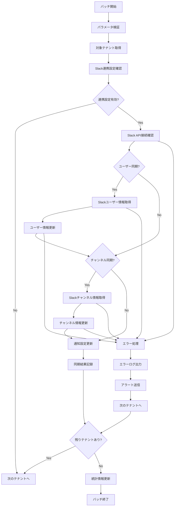

# バッチ定義書：Slack連携同期バッチ (BATCH-407)

## 1. 基本情報

| 項目 | 内容 |
|------|------|
| **バッチID** | BATCH-407 |
| **バッチ名** | Slack連携同期バッチ |
| **実行スケジュール** | 日次（06:15） |
| **優先度** | 中 |
| **ステータス** | 未着手 |
| **作成日** | 2025/05/31 |
| **最終更新日** | 2025/05/31 |

## 2. バッチ概要

### 2.1 概要・目的
各テナントのSlackワークスペースとの連携情報を同期し、ユーザー・チャンネル情報を最新状態に保つ。

### 2.2 関連テーブル
- TBL-032_Slack連携設定
- TBL-033_Slackユーザー情報
- TBL-034_Slackチャンネル情報
- TBL-024_通知チャンネル

### 2.3 関連API
- API-207_Slack連携設定API
- API-208_Slack通知送信API

## 3. 実行仕様

### 3.1 実行スケジュール
| 項目 | 設定値 | 備考 |
|------|--------|------|
| 実行頻度 | 15 6 * * * | cron形式（毎日 06:15） |
| 実行時間 | 06:15 | 朝の業務開始前 |
| タイムアウト | 45分 | 最大実行時間 |
| リトライ回数 | 3回 | 失敗時の再実行 |

### 3.2 実行条件
| 条件 | 内容 | 備考 |
|------|------|------|
| 前提条件 | Slack API稼働中 | 外部サービス依存 |
| 実行可能時間 | 06:00-08:00 | 業務開始前の時間帯 |
| 排他制御 | 同一バッチの重複実行禁止 | ロックファイル使用 |

### 3.3 実行パラメータ
| パラメータ名 | データ型 | 必須 | デフォルト値 | 説明 |
|--------------|----------|------|--------------|------|
| tenant_id | string | × | all | 同期対象テナントID |
| sync_users | boolean | × | true | ユーザー情報同期フラグ |
| sync_channels | boolean | × | true | チャンネル情報同期フラグ |

## 4. 処理仕様

### 4.1 処理フロー

### 4.2 詳細処理
1. **初期化処理**
   - パラメータ検証
   - 対象テナント一覧取得
   - ログファイル初期化
   - 排他制御ロック取得

2. **Slack連携設定確認**
   - テナント別Slack設定の取得
   - アクセストークンの有効性確認
   - API接続テストの実行
   - レート制限情報の確認

3. **ユーザー情報同期**
   - Slack Users API呼び出し
   - ユーザー一覧の取得・解析
   - 既存ユーザー情報との差分確認
   - 新規・更新・削除ユーザーの処理

4. **チャンネル情報同期**
   - Slack Conversations API呼び出し
   - チャンネル一覧の取得・解析
   - 既存チャンネル情報との差分確認
   - 新規・更新・削除チャンネルの処理

5. **通知設定更新**
   - 無効になったチャンネルの通知設定無効化
   - 新規チャンネルのデフォルト通知設定作成
   - 権限変更に伴う設定調整

## 5. データ仕様

### 5.1 入力データ
| データ名 | 形式 | 取得元 | 説明 |
|----------|------|--------|------|
| Slack連携設定 | DB | TBL-032_Slack連携設定 | アクセストークン等 |
| 既存ユーザー情報 | DB | TBL-033_Slackユーザー情報 | 現在のユーザー情報 |
| 既存チャンネル情報 | DB | TBL-034_Slackチャンネル情報 | 現在のチャンネル情報 |

### 5.2 出力データ
| データ名 | 形式 | 出力先 | 説明 |
|----------|------|--------|------|
| 更新ユーザー情報 | DB | TBL-033_Slackユーザー情報 | 同期後のユーザー情報 |
| 更新チャンネル情報 | DB | TBL-034_Slackチャンネル情報 | 同期後のチャンネル情報 |
| 同期履歴 | DB | TBL-035_Slack同期履歴 | 同期実行履歴 |
| 実行ログ | LOG | /logs/batch/ | 実行履歴ログ |

### 5.3 データ量見積もり
| 項目 | 件数 | 備考 |
|------|------|------|
| 対象テナント | 50件 | Slack連携有効テナント |
| ユーザー数/テナント | 100件 | 平均値 |
| チャンネル数/テナント | 50件 | 平均値 |
| 処理時間 | 30分 | 平均実行時間 |

## 6. エラーハンドリング

### 6.1 エラー分類
| エラー種別 | 対応方法 | 通知要否 | 備考 |
|------------|----------|----------|------|
| Slack API エラー | リトライ・継続 | ○ | レート制限・認証エラー |
| 認証エラー | エラー記録・スキップ | ○ | 無効なアクセストークン |
| データ整合性エラー | エラー記録・継続 | △ | 不正なデータ形式 |

### 6.2 リトライ仕様
| 条件 | リトライ回数 | 間隔 | 備考 |
|------|--------------|------|------|
| Slack API レート制限 | 3回 | 60秒 | レート制限解除待ち |
| ネットワークエラー | 5回 | 10秒 | 短間隔リトライ |
| 一時的なAPI障害 | 3回 | 30秒 | 指数バックオフ |

### 6.3 異常終了時の処理
1. 処理中断
2. 部分更新のロールバック
3. エラーログ出力
4. アラート送信
5. 排他制御ロック解除

## 7. 監視・運用

### 7.1 監視項目
| 監視項目 | 閾値 | アラート条件 | 対応方法 |
|----------|------|--------------|----------|
| 実行時間 | 45分 | 超過時 | 処理見直し・並列化 |
| API エラー率 | 10% | 超過時 | Slack設定確認 |
| 同期失敗テナント数 | 5件 | 超過時 | 個別調査・修正 |

### 7.2 ログ出力
| ログ種別 | 出力レベル | 出力内容 | 保存期間 |
|----------|------------|----------|----------|
| 実行ログ | INFO | 処理開始・終了・同期件数 | 3ヶ月 |
| エラーログ | ERROR | エラー詳細・スタックトレース | 1年 |
| 同期ログ | DEBUG | 個別同期処理詳細 | 1週間 |

### 7.3 アラート通知
| 通知条件 | 通知先 | 通知方法 | 備考 |
|----------|--------|----------|------|
| Slack API障害 | 運用チーム | メール・Slack | 即座に通知 |
| 大量同期失敗 | 開発チーム | Slack | 業務時間内のみ |
| 認証エラー | システム管理者 | メール | トークン更新要 |

## 8. 非機能要件

### 8.1 パフォーマンス
- 処理時間：45分以内
- メモリ使用量：512MB以内
- CPU使用率：30%以内

### 8.2 可用性
- 成功率：95%以上
- Slack API障害時の継続処理
- 部分的な同期失敗の許容

### 8.3 セキュリティ
- アクセストークンの暗号化保存
- API呼び出しの安全な実行
- 同期データの適切な管理

## 9. テスト仕様

### 9.1 単体テスト
| テストケース | 入力条件 | 期待結果 |
|--------------|----------|----------|
| 正常同期 | 有効なSlack設定 | 正常同期・データ更新 |
| 連携設定なし | Slack未連携テナント | 正常終了（処理スキップ） |
| 新規ユーザー追加 | Slackに新規ユーザー | ユーザー情報追加 |

### 9.2 異常系テスト
| テストケース | 入力条件 | 期待結果 |
|--------------|----------|----------|
| API障害 | Slack API停止 | エラー記録・継続処理 |
| 認証失敗 | 無効なアクセストークン | エラー記録・スキップ |
| レート制限 | API呼び出し制限 | 待機後リトライ |

## 10. 実装メモ

### 10.1 技術仕様
- 言語：Node.js
- フレームワーク：なし（Pure Node.js）
- DB接続：Prisma
- Slack API：@slack/web-api
- ログ出力：Winston

### 10.2 注意事項
- Slack API のレート制限対応
- 大量データ取得時のページネーション処理
- アクセストークンの安全な管理

### 10.3 デプロイ・実行環境
- 実行サーバー：バッチサーバー
- 実行ユーザー：batch_user
- 実行ディレクトリ：/opt/batch/slack-sync/
- 設定ファイル：/etc/batch/slack-sync.json

---

**改訂履歴**

| バージョン | 日付 | 変更者 | 変更内容 |
|------------|------|--------|----------|
| 1.0 | 2025/05/31 | システムアーキテクト | 初版作成 |
