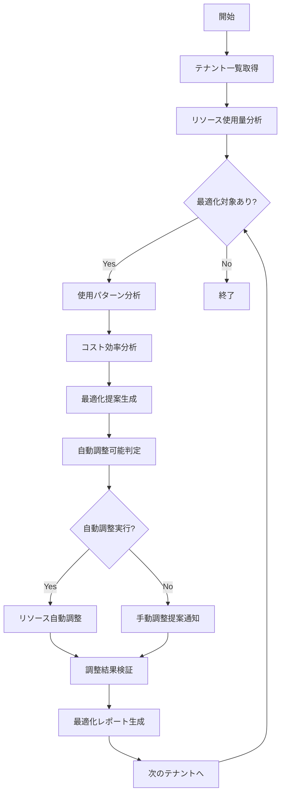

# バッチ定義書：テナントリソース最適化バッチ

| 項目                | 内容                                                                                |
|---------------------|------------------------------------------------------------------------------------|
| **バッチID**        | BATCH-306                                                                          |
| **バッチ名称**      | テナントリソース最適化バッチ                                                        |
| **機能カテゴリ**    | テナント管理                                                                        |
| **概要・目的**      | テナント別リソース使用状況を分析し、最適化提案・自動調整を実行する                  |
| **バッチ種別**      | 定期バッチ                                                                          |
| **実行スケジュール**| 週次（土曜 02:00）                                                                  |
| **入出力対象**      | テナントリソース、使用量データ、最適化設定、コスト分析                              |
| **優先度**          | 中                                                                                  |
| **備考**            | マルチテナント対応、コスト最適化、自動スケーリング連携                              |

## 1. 処理概要

テナントリソース最適化バッチは、マルチテナント環境において各テナントのリソース使用パターンを分析し、コスト効率とパフォーマンスの最適化を図るバッチ処理です。使用量データの分析、リソース配分の最適化提案、自動調整の実行により、システム全体の効率性を向上させます。

## 2. 処理フロー



## 3. 入力データ

### 3.1 リソース使用量データ

| リソース種別        | 監視項目                                               |
|---------------------|-------------------------------------------------------|
| CPU                 | 平均使用率、ピーク使用率、使用時間帯パターン           |
| メモリ              | 平均使用量、最大使用量、メモリリーク検出               |
| ストレージ          | 使用容量、増加率、ファイル種別分析                     |
| ネットワーク        | 帯域幅使用量、トラフィックパターン、レイテンシ         |
| データベース        | 接続数、クエリ実行時間、インデックス効率               |
| API呼び出し         | リクエスト数、応答時間、エラー率                       |

### 3.2 最適化設定

| 設定項目                | データ型 | デフォルト値 | 説明                                 |
|-------------------------|----------|--------------|--------------------------------------|
| cpu_optimization_threshold| Float  | 70.0         | CPU最適化実行閾値（%）               |
| memory_optimization_threshold| Float | 80.0       | メモリ最適化実行閾値（%）            |
| storage_cleanup_threshold| Float   | 85.0         | ストレージクリーンアップ閾値（%）    |
| auto_scaling_enabled    | Boolean  | true         | 自動スケーリング有効/無効            |
| cost_optimization_target| Float    | 15.0         | コスト削減目標（%）                  |
| analysis_period_days    | Integer  | 30           | 分析対象期間（日）                   |

## 4. 出力データ

### 4.1 リソース最適化結果テーブル（新規作成）

| フィールド名      | データ型 | 説明                                           |
|-------------------|----------|------------------------------------------------|
| optimization_id   | String   | 最適化ID（主キー）                             |
| tenant_id         | String   | テナントID                                     |
| analysis_date     | Date     | 分析実行日                                     |
| resource_type     | String   | リソース種別                                   |
| current_allocation| Float    | 現在の割り当て量                               |
| recommended_allocation| Float | 推奨割り当て量                              |
| optimization_type | String   | 最適化種別（SCALE_UP/SCALE_DOWN/REBALANCE）    |
| expected_savings  | Float    | 期待コスト削減額                               |
| implementation_status| String | 実装ステータス（PENDING/APPLIED/REJECTED）   |
| applied_at        | DateTime | 適用日時                                       |
| effectiveness_score| Float   | 効果スコア（0-10）                            |

### 4.2 テナントリソース分析テーブル（新規作成）

| フィールド名      | データ型 | 説明                                           |
|-------------------|----------|------------------------------------------------|
| analysis_id       | String   | 分析ID（主キー）                               |
| tenant_id         | String   | テナントID                                     |
| analysis_period_start| Date  | 分析期間開始日                                 |
| analysis_period_end| Date    | 分析期間終了日                                 |
| avg_cpu_usage     | Float    | 平均CPU使用率（%）                             |
| peak_cpu_usage    | Float    | ピークCPU使用率（%）                           |
| avg_memory_usage  | Float    | 平均メモリ使用量（GB）                         |
| storage_usage     | Float    | ストレージ使用量（GB）                         |
| api_call_count    | Integer  | API呼び出し数                                  |
| cost_current      | Float    | 現在のコスト                                   |
| cost_optimized    | Float    | 最適化後予想コスト                             |
| efficiency_score  | Float    | 効率性スコア（0-10）                           |

## 5. 最適化仕様

### 5.1 リソース使用量分析

```typescript
class ResourceUsageAnalyzer {
  async analyzeTenantResources(tenantId: string): Promise<ResourceAnalysis> {
    const analysisResult = {
      tenantId,
      analysisPeriod: this.getAnalysisPeriod(),
      resourceMetrics: await this.collectResourceMetrics(tenantId),
      usagePatterns: await this.analyzeUsagePatterns(tenantId),
      costAnalysis: await this.analyzeCosts(tenantId),
      optimizationOpportunities: []
    };
    
    // CPU最適化機会の検出
    const cpuOptimization = await this.analyzeCPUOptimization(analysisResult);
    if (cpuOptimization) {
      analysisResult.optimizationOpportunities.push(cpuOptimization);
    }
    
    // メモリ最適化機会の検出
    const memoryOptimization = await this.analyzeMemoryOptimization(analysisResult);
    if (memoryOptimization) {
      analysisResult.optimizationOpportunities.push(memoryOptimization);
    }
    
    // ストレージ最適化機会の検出
    const storageOptimization = await this.analyzeStorageOptimization(analysisResult);
    if (storageOptimization) {
      analysisResult.optimizationOpportunities.push(storageOptimization);
    }
    
    return analysisResult;
  }
  
  private async analyzeCPUOptimization(analysis: ResourceAnalysis): Promise<OptimizationOpportunity | null> {
    const cpuMetrics = analysis.resourceMetrics.cpu;
    
    // 低使用率の検出（スケールダウン機会）
    if (cpuMetrics.averageUsage < 30 && cpuMetrics.peakUsage < 60) {
      return {
        type: 'SCALE_DOWN',
        resourceType: 'CPU',
        currentAllocation: cpuMetrics.allocatedCores,
        recommendedAllocation: Math.ceil(cpuMetrics.allocatedCores * 0.7),
        expectedSavings: this.calculateCPUSavings(cpuMetrics.allocatedCores * 0.3),
        confidence: 0.8,
        reason: 'Low CPU utilization detected'
      };
    }
    
    // 高使用率の検出（スケールアップ機会）
    if (cpuMetrics.averageUsage > 80 || cpuMetrics.peakUsage > 95) {
      return {
        type: 'SCALE_UP',
        resourceType: 'CPU',
        currentAllocation: cpuMetrics.allocatedCores,
        recommendedAllocation: Math.ceil(cpuMetrics.allocatedCores * 1.3),
        expectedCost: this.calculateCPUCost(cpuMetrics.allocatedCores * 0.3),
        confidence: 0.9,
        reason: 'High CPU utilization detected'
      };
    }
    
    return null;
  }
}
```

### 5.2 コスト効率分析

```typescript
class CostEfficiencyAnalyzer {
  async analyzeCostEfficiency(tenantId: string): Promise<CostAnalysis> {
    const currentCosts = await this.getCurrentCosts(tenantId);
    const resourceUsage = await this.getResourceUsage(tenantId);
    const benchmarkData = await this.getBenchmarkData();
    
    return {
      tenantId,
      currentMonthlyCost: currentCosts.total,
      costBreakdown: currentCosts.breakdown,
      efficiencyScore: this.calculateEfficiencyScore(resourceUsage, currentCosts),
      benchmarkComparison: this.compareToBenchmark(resourceUsage, currentCosts, benchmarkData),
      optimizationPotential: this.calculateOptimizationPotential(resourceUsage, currentCosts),
      recommendations: await this.generateCostRecommendations(resourceUsage, currentCosts)
    };
  }
  
  private calculateEfficiencyScore(usage: ResourceUsage, costs: CostBreakdown): number {
    // リソース使用効率の計算
    const cpuEfficiency = usage.cpu.averageUsage / 100;
    const memoryEfficiency = usage.memory.averageUsage / 100;
    const storageEfficiency = usage.storage.usedPercentage / 100;
    
    // コスト効率の計算
    const costPerUser = costs.total / usage.activeUsers;
    const costPerAPICall = costs.total / usage.apiCalls;
    
    // 総合効率スコア（0-10）
    const resourceScore = (cpuEfficiency + memoryEfficiency + storageEfficiency) / 3 * 10;
    const costScore = Math.min(10, 10 - (costPerUser / 100)); // 基準値との比較
    
    return (resourceScore + costScore) / 2;
  }
  
  private async generateCostRecommendations(usage: ResourceUsage, costs: CostBreakdown): Promise<CostRecommendation[]> {
    const recommendations: CostRecommendation[] = [];
    
    // 未使用リソースの検出
    if (usage.cpu.averageUsage < 40) {
      recommendations.push({
        type: 'REDUCE_CPU',
        description: 'CPU使用率が低いため、インスタンスサイズを縮小',
        expectedSavings: costs.compute * 0.3,
        implementation: 'AUTO',
        priority: 'HIGH'
      });
    }
    
    // ストレージ最適化
    if (usage.storage.unusedPercentage > 30) {
      recommendations.push({
        type: 'OPTIMIZE_STORAGE',
        description: '未使用ストレージの削除とアーカイブ',
        expectedSavings: costs.storage * 0.2,
        implementation: 'MANUAL',
        priority: 'MEDIUM'
      });
    }
    
    // 予約インスタンスの提案
    if (usage.consistentUsage > 0.8) {
      recommendations.push({
        type: 'RESERVED_INSTANCES',
        description: '安定した使用パターンのため予約インスタンスを推奨',
        expectedSavings: costs.compute * 0.4,
        implementation: 'MANUAL',
        priority: 'HIGH'
      });
    }
    
    return recommendations;
  }
}
```

### 5.3 自動最適化実行

```typescript
class AutoOptimizationExecutor {
  async executeOptimizations(optimizations: OptimizationOpportunity[]): Promise<OptimizationResult[]> {
    const results: OptimizationResult[] = [];
    
    for (const optimization of optimizations) {
      if (this.isAutoExecutable(optimization)) {
        try {
          const result = await this.executeOptimization(optimization);
          results.push(result);
        } catch (error) {
          results.push({
            optimizationId: optimization.id,
            status: 'FAILED',
            error: error.message,
            executedAt: new Date()
          });
        }
      } else {
        // 手動実行が必要な場合は通知
        await this.notifyManualOptimization(optimization);
        results.push({
          optimizationId: optimization.id,
          status: 'MANUAL_REQUIRED',
          executedAt: new Date()
        });
      }
    }
    
    return results;
  }
  
  private async executeOptimization(optimization: OptimizationOpportunity): Promise<OptimizationResult> {
    switch (optimization.type) {
      case 'SCALE_DOWN':
        return await this.executeScaleDown(optimization);
      case 'SCALE_UP':
        return await this.executeScaleUp(optimization);
      case 'REBALANCE':
        return await this.executeRebalance(optimization);
      default:
        throw new Error(`Unknown optimization type: ${optimization.type}`);
    }
  }
  
  private async executeScaleDown(optimization: OptimizationOpportunity): Promise<OptimizationResult> {
    const tenantId = optimization.tenantId;
    const resourceType = optimization.resourceType;
    
    // 事前チェック
    await this.validateScaleDown(tenantId, resourceType, optimization.recommendedAllocation);
    
    // スケールダウン実行
    await this.scaleResource(tenantId, resourceType, optimization.recommendedAllocation);
    
    // 結果検証
    const verification = await this.verifyOptimization(tenantId, resourceType);
    
    return {
      optimizationId: optimization.id,
      status: verification.success ? 'SUCCESS' : 'PARTIAL',
      actualSavings: verification.actualSavings,
      performanceImpact: verification.performanceImpact,
      executedAt: new Date()
    };
  }
}
```

## 6. 最適化レポート生成

### 6.1 週次最適化レポート

```typescript
class OptimizationReportGenerator {
  async generateWeeklyReport(): Promise<OptimizationReport> {
    const tenants = await this.getActiveTenants();
    const optimizations = await this.getWeeklyOptimizations();
    
    const report = {
      reportId: generateId(),
      reportType: 'WEEKLY_OPTIMIZATION',
      generatedAt: new Date(),
      period: this.getReportPeriod(),
      summary: {
        totalTenants: tenants.length,
        optimizedTenants: optimizations.filter(o => o.status === 'SUCCESS').length,
        totalSavings: optimizations.reduce((sum, o) => sum + (o.actualSavings || 0), 0),
        averageEfficiencyImprovement: this.calculateAverageImprovement(optimizations)
      },
      tenantDetails: await this.generateTenantDetails(tenants, optimizations),
      recommendations: await this.generateGlobalRecommendations(optimizations)
    };
    
    return report;
  }
  
  private async generateTenantDetails(tenants: Tenant[], optimizations: OptimizationResult[]): Promise<TenantOptimizationDetail[]> {
    const details: TenantOptimizationDetail[] = [];
    
    for (const tenant of tenants) {
      const tenantOptimizations = optimizations.filter(o => o.tenantId === tenant.id);
      const analysis = await this.getLatestAnalysis(tenant.id);
      
      details.push({
        tenantId: tenant.id,
        tenantName: tenant.name,
        currentEfficiencyScore: analysis.efficiencyScore,
        optimizationsApplied: tenantOptimizations.length,
        costSavings: tenantOptimizations.reduce((sum, o) => sum + (o.actualSavings || 0), 0),
        performanceImpact: this.calculatePerformanceImpact(tenantOptimizations),
        nextRecommendations: await this.getNextRecommendations(tenant.id)
      });
    }
    
    return details;
  }
}
```

## 7. 依存関係

- テナント管理システム
- リソース監視システム
- コスト管理システム
- 自動スケーリングサービス
- 通知サービス
- レポート生成システム

## 8. 実行パラメータ

| パラメータ名        | 必須 | デフォルト値 | 説明                                           |
|---------------------|------|--------------|------------------------------------------------|
| --tenant-id         | No   | all          | 特定テナントのみ最適化                         |
| --resource-type     | No   | all          | 特定リソース種別のみ最適化                     |
| --dry-run           | No   | false        | 最適化提案のみ生成（実行なし）                 |
| --auto-execute      | No   | true         | 自動実行可能な最適化を実行                     |
| --cost-threshold    | No   | 100          | 最適化実行の最小コスト削減額                   |
| --analysis-period   | No   | 30           | 分析対象期間（日）                             |

## 9. 実行例

```bash
# 通常実行
npm run batch:tenant-resource-optimization

# 特定テナントのみ
npm run batch:tenant-resource-optimization -- --tenant-id=tenant-123

# ドライラン
npm run batch:tenant-resource-optimization -- --dry-run

# 手動実行のみ
npm run batch:tenant-resource-optimization -- --auto-execute=false

# TypeScript直接実行
npx tsx src/batch/tenant-resource-optimization.ts
```

## 10. 改訂履歴

| 改訂日     | 改訂者 | 改訂内容                                         |
|------------|--------|--------------------------------------------------|
| 2025/05/31 | 初版   | 初版作成                                         |
