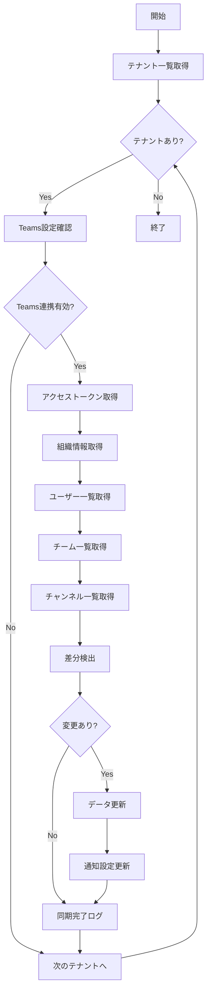

# バッチ定義書：Teams連携同期バッチ

| 項目                | 内容                                                                                |
|---------------------|------------------------------------------------------------------------------------|
| **バッチID**        | BATCH-408                                                                          |
| **バッチ名称**      | Teams連携同期バッチ                                                                 |
| **機能カテゴリ**    | 通知・連携管理                                                                      |
| **概要・目的**      | Microsoft Teamsのユーザー・チーム・チャンネル情報を同期し、通知設定を最新化する     |
| **バッチ種別**      | 定期バッチ                                                                          |
| **実行スケジュール**| 日次（06:30）                                                                       |
| **入出力対象**      | TeamsUsers, TeamsChannels, TeamsWorkspaces                                         |
| **優先度**          | 中                                                                                  |
| **備考**            | Microsoft Graph API制限を考慮した同期処理                                           |

## 1. 処理概要

Teams連携同期バッチは、Microsoft TeamsのGraph APIを使用してユーザー・チーム・チャンネル情報を取得し、システム内の情報を最新状態に同期するバッチ処理です。Azure AD連携によるユーザー管理と通知設定の自動更新を行います。

## 2. 処理フロー



## 3. 入力データ

### 3.1 TeamsWorkspacesテーブル

| フィールド名      | データ型 | 説明                                           |
|-------------------|----------|------------------------------------------------|
| workspace_id      | String   | ワークスペースID（主キー）                     |
| tenant_id         | String   | テナントID（外部キー）                         |
| azure_tenant_id   | String   | Azure ADテナントID                             |
| client_id         | String   | アプリケーションID                             |
| client_secret     | String   | クライアントシークレット（暗号化）             |
| webhook_url       | String   | Incoming Webhook URL                           |
| is_active         | Boolean  | 有効フラグ                                     |
| last_sync_at      | DateTime | 最終同期日時                                   |

### 3.2 TeamsUsersテーブル

| フィールド名      | データ型 | 説明                                           |
|-------------------|----------|------------------------------------------------|
| teams_user_id     | String   | TeamsユーザーID（主キー）                      |
| workspace_id      | String   | ワークスペースID（外部キー）                   |
| user_id           | String   | システムユーザーID（外部キー）                 |
| azure_user_id     | String   | Azure ADユーザーID                             |
| display_name      | String   | 表示名                                         |
| email             | String   | メールアドレス                                 |
| job_title         | String   | 役職                                           |
| department        | String   | 部署                                           |
| is_guest          | Boolean  | ゲストユーザーフラグ                           |
| presence_status   | String   | プレゼンス状態                                 |

### 3.3 TeamsChannelsテーブル

| フィールド名      | データ型 | 説明                                           |
|-------------------|----------|------------------------------------------------|
| teams_channel_id  | String   | TeamsチャンネルID（主キー）                    |
| workspace_id      | String   | ワークスペースID（外部キー）                   |
| team_id           | String   | チームID                                       |
| channel_name      | String   | チャンネル名                                   |
| channel_type      | String   | チャンネル種別（"standard"/"private"/"shared"）|
| description       | String   | チャンネル説明                                 |
| member_count      | Integer  | メンバー数                                     |
| is_archived       | Boolean  | アーカイブフラグ                               |

## 4. Microsoft Graph API連携

### 4.1 使用API一覧

| API名                    | 用途                     | レート制限        | 必要権限                |
|--------------------------|--------------------------|-------------------|-------------------------|
| /users                   | ユーザー一覧取得         | 10,000/10min      | User.Read.All           |
| /groups                  | チーム一覧取得           | 10,000/10min      | Group.Read.All          |
| /teams/{id}/channels     | チャンネル一覧取得       | 10,000/10min      | Channel.ReadBasic.All   |
| /users/{id}/presence     | プレゼンス情報取得       | 1,500/10min       | Presence.Read.All       |

### 4.2 認証フロー

```typescript
interface TeamsAuthConfig {
  tenantId: string;
  clientId: string;
  clientSecret: string;
  scope: string[];
  
  async getAccessToken(): Promise<string>;
  async refreshToken(refreshToken: string): Promise<string>;
}
```

## 5. 実行パラメータ

| パラメータ名        | 必須 | デフォルト値 | 説明                                           |
|---------------------|------|--------------|------------------------------------------------|
| --tenant-id         | No   | 全テナント   | 特定テナントのみ同期                           |
| --sync-type         | No   | INCREMENTAL  | 同期種別（FULL/INCREMENTAL）                   |
| --include-presence  | No   | false        | プレゼンス情報も同期                           |
| --dry-run           | No   | false        | 同期内容確認のみ                               |

## 6. 実行例

```bash
# 通常実行
npm run batch:teams-sync

# プレゼンス情報も含めて同期
npm run batch:teams-sync -- --include-presence=true

# TypeScript直接実行
npx tsx src/batch/teams-sync.ts
```

## 7. 関連バッチ

- **BATCH-407**: Slack連携同期バッチ（類似の同期処理）
- **BATCH-409**: LINE WORKS連携同期バッチ（類似の同期処理）

## 8. 改訂履歴

| 改訂日     | 改訂者 | 改訂内容                                         |
|------------|--------|--------------------------------------------------|
| 2025/05/30 | 初版   | 初版作成                                         |
