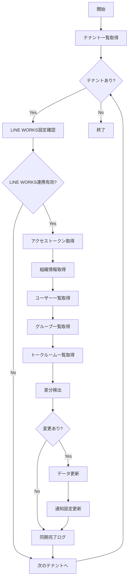

# バッチ定義書：LINE WORKS連携同期バッチ

| 項目                | 内容                                                                                |
|---------------------|------------------------------------------------------------------------------------|
| **バッチID**        | BATCH-409                                                                          |
| **バッチ名称**      | LINE WORKS連携同期バッチ                                                            |
| **機能カテゴリ**    | 通知・連携管理                                                                      |
| **概要・目的**      | LINE WORKSのユーザー・グループ・トーク情報を同期し、通知設定を最新化する            |
| **バッチ種別**      | 定期バッチ                                                                          |
| **実行スケジュール**| 日次（06:45）                                                                       |
| **入出力対象**      | LineWorksUsers, LineWorksGroups, LineWorksWorkspaces                               |
| **優先度**          | 中                                                                                  |
| **備考**            | LINE WORKS API制限を考慮した同期処理                                                |

## 1. 処理概要

LINE WORKS連携同期バッチは、LINE WORKS APIを使用してユーザー・グループ・トーク情報を取得し、システム内の情報を最新状態に同期するバッチ処理です。組織構造の変更やメンバーの異動を自動的に反映し、通知設定を最新化します。

## 2. 処理フロー



## 3. 入力データ

### 3.1 LineWorksWorkspacesテーブル

| フィールド名      | データ型 | 説明                                           |
|-------------------|----------|------------------------------------------------|
| workspace_id      | String   | ワークスペースID（主キー）                     |
| tenant_id         | String   | テナントID（外部キー）                         |
| domain_id         | String   | LINE WORKSドメインID                           |
| client_id         | String   | クライアントID                                 |
| client_secret     | String   | クライアントシークレット（暗号化）             |
| service_account   | String   | サービスアカウント                             |
| private_key       | Text     | 秘密鍵（暗号化）                               |
| is_active         | Boolean  | 有効フラグ                                     |
| last_sync_at      | DateTime | 最終同期日時                                   |

### 3.2 LineWorksUsersテーブル

| フィールド名      | データ型 | 説明                                           |
|-------------------|----------|------------------------------------------------|
| lineworks_user_id | String   | LINE WORKSユーザーID（主キー）                 |
| workspace_id      | String   | ワークスペースID（外部キー）                   |
| user_id           | String   | システムユーザーID（外部キー）                 |
| user_name         | String   | ユーザー名                                     |
| display_name      | String   | 表示名                                         |
| email             | String   | メールアドレス                                 |
| mobile            | String   | 携帯電話番号                                   |
| department        | String   | 部署                                           |
| position          | String   | 役職                                           |
| is_activated      | Boolean  | アクティベート状態                             |

### 3.3 LineWorksGroupsテーブル

| フィールド名      | データ型 | 説明                                           |
|-------------------|----------|------------------------------------------------|
| lineworks_group_id| String   | LINE WORKSグループID（主キー）                 |
| workspace_id      | String   | ワークスペースID（外部キー）                   |
| group_name        | String   | グループ名                                     |
| description       | String   | グループ説明                                   |
| member_count      | Integer  | メンバー数                                     |
| is_open           | Boolean  | オープングループフラグ                         |
| created_at        | DateTime | 作成日時                                       |

## 4. LINE WORKS API連携

### 4.1 使用API一覧

| API名                    | 用途                     | レート制限        | 必要権限                |
|--------------------------|--------------------------|-------------------|-------------------------|
| /users                   | ユーザー一覧取得         | 2,000/hour        | user:read               |
| /groups                  | グループ一覧取得         | 2,000/hour        | group:read              |
| /bots/{botId}/users      | Bot友達一覧取得          | 2,000/hour        | bot:read                |
| /talk/rooms              | トークルーム一覧取得     | 2,000/hour        | talk:read               |

### 4.2 認証方式

```typescript
interface LineWorksAuth {
  domainId: string;
  clientId: string;
  clientSecret: string;
  serviceAccount: string;
  privateKey: string;
  
  async generateJWT(): Promise<string>;
  async getAccessToken(): Promise<string>;
}
```

## 5. 実行パラメータ

| パラメータ名        | 必須 | デフォルト値 | 説明                                           |
|---------------------|------|--------------|------------------------------------------------|
| --tenant-id         | No   | 全テナント   | 特定テナントのみ同期                           |
| --sync-type         | No   | INCREMENTAL  | 同期種別（FULL/INCREMENTAL）                   |
| --include-talk      | No   | false        | トークルーム情報も同期                         |
| --dry-run           | No   | false        | 同期内容確認のみ                               |

## 6. 実行例

```bash
# 通常実行
npm run batch:lineworks-sync

# トークルーム情報も含めて同期
npm run batch:lineworks-sync -- --include-talk=true

# TypeScript直接実行
npx tsx src/batch/lineworks-sync.ts
```

## 7. 関連バッチ

- **BATCH-407**: Slack連携同期バッチ（類似の同期処理）
- **BATCH-408**: Teams連携同期バッチ（類似の同期処理）

## 8. 改訂履歴

| 改訂日     | 改訂者 | 改訂内容                                         |
|------------|--------|--------------------------------------------------|
| 2025/05/30 | 初版   | 初版作成                                         |
