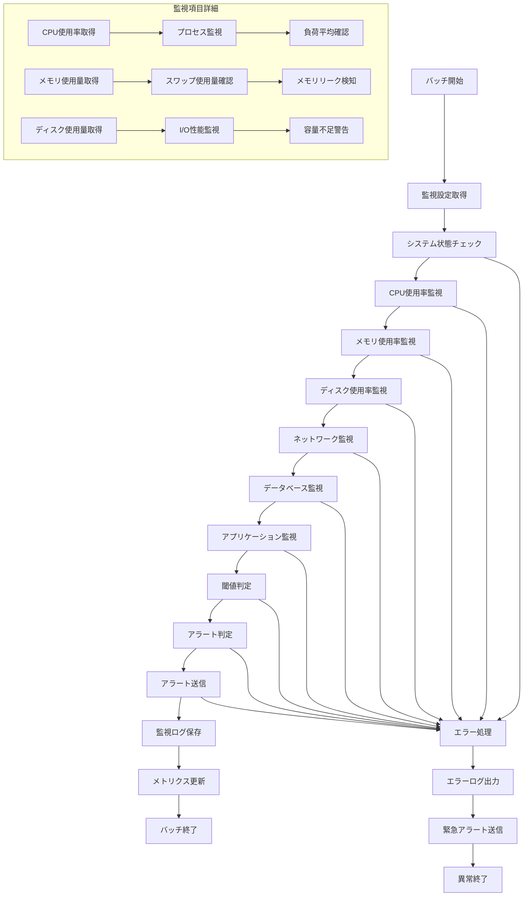

# バッチ定義書：システム監視バッチ (BATCH-501)

## 1. 基本情報

| 項目 | 内容 |
|------|------|
| **バッチID** | BATCH-501 |
| **バッチ名** | システム監視バッチ |
| **実行スケジュール** | 5分毎 |
| **優先度** | 最高 |
| **ステータス** | 未着手 |
| **作成日** | 2025/05/31 |
| **最終更新日** | 2025/05/31 |

## 2. バッチ概要

### 2.1 概要・目的
システム全体の監視・アラート処理を実行し、システム稼働状況の確認、異常検知、アラート送信を行う。

### 2.2 関連テーブル
- TBL-040_システム監視設定
- TBL-041_監視ログ
- TBL-042_アラート履歴
- TBL-043_システムメトリクス

### 2.3 関連API
- API-501_システム状態取得API
- API-502_監視設定取得API
- API-503_アラート送信API

## 3. 実行仕様

### 3.1 実行スケジュール
| 項目 | 設定値 | 備考 |
|------|--------|------|
| 実行頻度 | */5 * * * * | cron形式（5分毎） |
| 実行時間 | 常時 | 24時間監視 |
| タイムアウト | 3分 | 最大実行時間 |
| リトライ回数 | 1回 | 失敗時の再実行 |

### 3.2 実行条件
| 条件 | 内容 | 備考 |
|------|------|------|
| 前提条件 | システム稼働中 | 監視対象システムの稼働 |
| 実行可能時間 | 24時間 | 常時実行 |
| 排他制御 | 同一バッチの重複実行禁止 | ロックファイル使用 |

### 3.3 実行パラメータ
| パラメータ名 | データ型 | 必須 | デフォルト値 | 説明 |
|--------------|----------|------|--------------|------|
| monitor_level | string | × | all | 監視レベル（critical/warning/info/all） |
| alert_enabled | boolean | × | true | アラート送信有効フラグ |
| tenant_id | string | × | all | 対象テナントID |
| check_interval | number | × | 300 | チェック間隔（秒） |

## 4. 処理仕様

### 4.1 処理フロー

### 4.2 詳細処理
1. **初期化処理**
   - 監視設定の取得・検証
   - 前回実行結果の確認
   - 排他制御ロック取得

2. **システム状態チェック**
   - 基本的なシステム稼働確認
   - 重要プロセスの生存確認
   - サービス稼働状況の確認

3. **リソース監視**
   - CPU使用率・負荷平均の取得
   - メモリ使用量・スワップ使用量の確認
   - ディスク使用量・I/O性能の監視

4. **ネットワーク監視**
   - ネットワーク接続状況の確認
   - 通信遅延・パケットロスの監視
   - 外部サービスへの接続確認

5. **データベース監視**
   - データベース接続状況の確認
   - クエリ性能・レスポンス時間の監視
   - 接続プール・ロック状況の確認

6. **アプリケーション監視**
   - Webアプリケーションの応答確認
   - API エンドポイントの稼働確認
   - エラー率・レスポンス時間の監視

7. **アラート処理**
   - 閾値との比較・判定
   - アラートレベルの決定
   - 通知先・通知方法の決定
   - アラート送信・履歴保存

## 5. データ仕様

### 5.1 入力データ
| データ名 | 形式 | 取得元 | 説明 |
|----------|------|--------|------|
| 監視設定 | DB | TBL-040 | 監視項目・閾値設定 |
| 前回監視結果 | DB | TBL-041 | 前回の監視結果 |
| システムメトリクス | OS | システム | CPU・メモリ・ディスク情報 |

### 5.2 出力データ
| データ名 | 形式 | 出力先 | 説明 |
|----------|------|--------|------|
| 監視ログ | DB | TBL-041 | 監視結果・メトリクス |
| アラート履歴 | DB | TBL-042 | 発生したアラート情報 |
| システムメトリクス | DB | TBL-043 | 時系列メトリクスデータ |
| 実行ログ | LOG | /logs/batch/ | バッチ実行ログ |
| アラート通知 | 外部 | Slack/メール | アラート通知 |

### 5.3 データ量見積もり
| 項目 | 件数 | 備考 |
|------|------|------|
| 監視項目数 | 50-100項目 | システム・アプリケーション監視項目 |
| 1回あたりメトリクス数 | 100-200件 | 各監視項目のメトリクス |
| 処理時間 | 1-3分 | 監視項目数による |

## 6. エラーハンドリング

### 6.1 エラー分類
| エラー種別 | 対応方法 | 通知要否 | 備考 |
|------------|----------|----------|------|
| システム監視エラー | エラーログ出力・継続 | ○ | 監視対象システム異常 |
| 監視設定エラー | デフォルト設定・継続 | △ | 設定不正・欠損 |
| アラート送信エラー | リトライ・ログ出力 | ○ | 通知システム異常 |
| データベースエラー | リトライ・緊急アラート | ○ | 監視データ保存失敗 |

### 6.2 リトライ仕様
| 条件 | リトライ回数 | 間隔 | 備考 |
|------|--------------|------|------|
| DB接続エラー | 2回 | 30秒 | 固定間隔 |
| アラート送信エラー | 3回 | 60秒 | 指数バックオフ |
| 外部システム接続エラー | 1回 | 10秒 | 短間隔リトライ |

### 6.3 異常終了時の処理
1. 処理中断
2. 緊急アラート送信
3. エラーログ出力
4. 監視継続のための最小限処理
5. 排他制御ロック解除

## 7. 監視・運用

### 7.1 監視項目
| 監視項目 | 閾値 | アラート条件 | 対応方法 |
|----------|------|--------------|----------|
| 処理時間 | 3分 | 超過時 | 監視項目・処理見直し |
| 監視成功率 | 95% | 低下時 | システム状態確認 |
| アラート送信成功率 | 98% | 低下時 | 通知システム確認 |
| メトリクス保存成功率 | 99% | 低下時 | データベース確認 |

### 7.2 ログ出力
| ログ種別 | 出力レベル | 出力内容 | 保存期間 |
|----------|------------|----------|----------|
| 実行ログ | INFO | 処理開始・終了・監視結果サマリー | 1ヶ月 |
| エラーログ | ERROR | エラー詳細・システム状態 | 6ヶ月 |
| 監視ログ | DEBUG | 詳細メトリクス・判定結果 | 1週間 |

### 7.3 アラート通知
| 通知条件 | 通知先 | 通知方法 | 備考 |
|----------|--------|----------|------|
| 監視バッチ異常 | 運用チーム | メール・Slack | 即座に通知 |
| システム異常検知 | 開発チーム | Slack・電話 | 重要度による |
| 閾値超過 | 担当者 | メール・Slack | アラートレベルによる |

## 8. 非機能要件

### 8.1 パフォーマンス
- 処理時間：3分以内
- メモリ使用量：512MB以内
- CPU使用率：30%以内

### 8.2 可用性
- 成功率：99%以上
- 監視継続性の保証
- 自己監視機能

### 8.3 セキュリティ
- 監視データのアクセス制御
- アラート通知の暗号化
- 監視ログの改ざん防止

## 9. テスト仕様

### 9.1 単体テスト
| テストケース | 入力条件 | 期待結果 |
|--------------|----------|----------|
| 正常監視 | 正常なシステム状態 | 正常終了・メトリクス保存 |
| 閾値超過 | CPU使用率90% | アラート送信・ログ出力 |
| 監視項目なし | 監視設定0件 | 正常終了（監視対象なし） |

### 9.2 異常系テスト
| テストケース | 入力条件 | 期待結果 |
|--------------|----------|----------|
| システム異常 | 監視対象サービス停止 | アラート送信・エラーログ |
| DB接続エラー | データベース停止 | リトライ後緊急アラート |
| 通知システム異常 | Slack API エラー | リトライ・代替通知 |

## 10. 実装メモ

### 10.1 技術仕様
- 言語：Node.js
- システム監視：node-os-utils, systeminformation
- 通知：nodemailer, @slack/web-api
- メトリクス収集：prometheus client

### 10.2 注意事項
- 高頻度実行による負荷対策
- 監視対象システムへの影響最小化
- アラート疲れ防止のための閾値調整

### 10.3 デプロイ・実行環境
- 実行サーバー：監視サーバー
- 実行ユーザー：monitor_user
- 実行ディレクトリ：/opt/batch/system-monitor/
- 設定ファイル：/etc/batch/system-monitor.json

---

**改訂履歴**

| バージョン | 日付 | 変更者 | 変更内容 |
|------------|------|--------|----------|
| 1.0 | 2025/05/31 | システムアーキテクト | 初版作成 |
