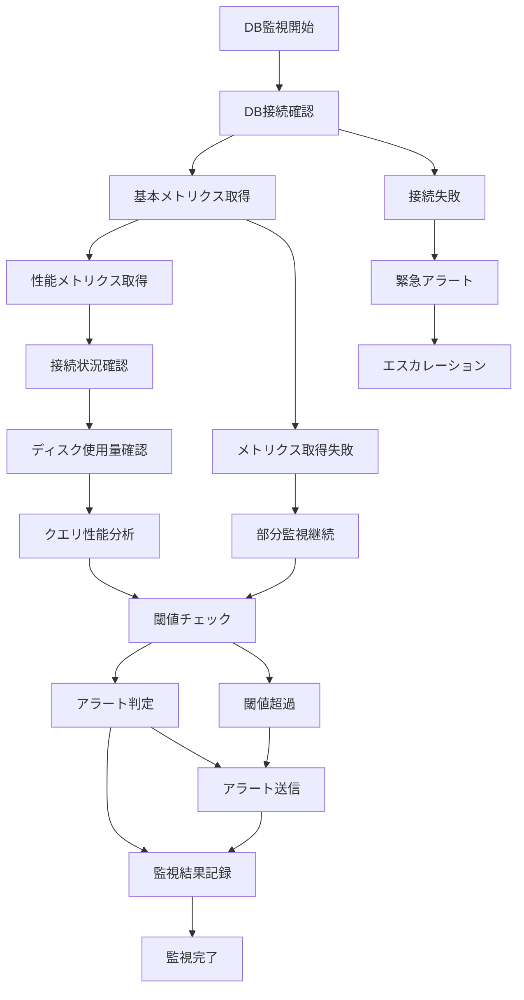

# バッチ定義書：データベース監視バッチ (BATCH-502)

## 1. 基本情報

| 項目 | 内容 |
|------|------|
| **バッチID** | BATCH-502 |
| **バッチ名** | データベース監視バッチ |
| **実行スケジュール** | 10分毎 |
| **優先度** | 高 |
| **ステータス** | 未着手 |
| **作成日** | 2025/05/31 |
| **最終更新日** | 2025/05/31 |

## 2. バッチ概要

### 2.1 概要・目的
データベースのパフォーマンス、接続状況、リソース使用状況を監視し、異常を検知してアラートを送信する。

### 2.2 関連テーブル
- TBL-051_DB監視履歴
- TBL-052_DB性能メトリクス
- TBL-053_DB接続状況
- TBL-054_アラート設定

### 2.3 関連API
- API-251_DB状態取得API
- API-252_DB性能メトリクス取得API

## 3. 実行仕様

### 3.1 実行スケジュール
| 項目 | 設定値 | 備考 |
|------|--------|------|
| 実行頻度 | */10 * * * * | 10分毎 |
| 実行時間 | 10分間隔 | 継続監視 |
| タイムアウト | 5分 | 最大実行時間 |
| リトライ回数 | 2回 | 監視継続性重視 |

### 3.2 実行条件
| 条件 | 内容 | 備考 |
|------|------|------|
| 前提条件 | データベース稼働中 | 基本条件 |
| 実行可能時間 | 24時間 | 継続監視 |
| 排他制御 | 同一バッチの重複実行禁止 | 監視精度確保 |

### 3.3 実行パラメータ
| パラメータ名 | データ型 | 必須 | デフォルト値 | 説明 |
|--------------|----------|------|--------------|------|
| check_level | string | × | "standard" | 監視レベル（basic/standard/detailed） |
| alert_threshold | object | × | 設定値 | アラート閾値設定 |
| target_databases | array | × | 全DB | 監視対象データベース |

## 4. 処理仕様

### 4.1 処理フロー

### 4.2 詳細処理
1. **データベース接続確認**
   - 各データベースへの接続テスト
   - 接続プールの状況確認
   - レスポンス時間測定
   - 接続エラーの記録

2. **基本メトリクス取得**
   - CPU使用率の取得
   - メモリ使用量の確認
   - ディスクI/O状況の監視
   - ネットワーク使用量の測定

3. **性能メトリクス取得**
   - クエリ実行時間の分析
   - スロークエリの検出
   - インデックス使用状況の確認
   - ロック状況の監視

4. **接続状況確認**
   - アクティブ接続数の確認
   - 接続プールの使用状況
   - 長時間実行中のクエリ検出
   - デッドロックの監視

5. **アラート処理**
   - 閾値超過の判定
   - アラートレベルの決定
   - 通知先の特定
   - アラート送信の実行

## 5. データ仕様

### 5.1 入力データ
| データ名 | 形式 | 取得元 | 説明 |
|----------|------|--------|------|
| DB接続情報 | CONFIG | 設定ファイル | データベース接続設定 |
| 監視設定 | DB | TBL-054_アラート設定 | 監視閾値・通知設定 |
| 前回監視結果 | DB | TBL-051_DB監視履歴 | 比較用前回結果 |

### 5.2 出力データ
| データ名 | 形式 | 出力先 | 説明 |
|----------|------|--------|------|
| 監視結果 | DB | TBL-051_DB監視履歴 | 監視実行結果 |
| 性能メトリクス | DB | TBL-052_DB性能メトリクス | 性能測定結果 |
| 接続状況 | DB | TBL-053_DB接続状況 | 接続状況記録 |
| アラートログ | LOG | /logs/db-monitoring/ | アラート発生ログ |

### 5.3 データ量見積もり
| 項目 | 件数 | 備考 |
|------|------|------|
| 監視対象DB数 | 10件 | 全環境 |
| 取得メトリクス数 | 50件/DB | 各種指標 |
| 処理時間 | 3分 | 平均実行時間 |

## 6. エラーハンドリング

### 6.1 エラー分類
| エラー種別 | 対応方法 | 通知要否 | 備考 |
|------------|----------|----------|------|
| DB接続エラー | 緊急アラート・継続監視 | ○ | 最高優先度 |
| メトリクス取得エラー | 部分監視・継続 | ○ | 可能な範囲で継続 |
| 性能劣化 | アラート・継続監視 | ○ | 閾値別対応 |

### 6.2 リトライ仕様
| 条件 | リトライ回数 | 間隔 | 備考 |
|------|--------------|------|------|
| 接続タイムアウト | 2回 | 30秒 | 迅速な再試行 |
| メトリクス取得失敗 | 1回 | 60秒 | 負荷考慮 |
| 一時的エラー | 2回 | 30秒 | 継続監視重視 |

### 6.3 異常終了時の処理
1. 監視処理の安全停止
2. 部分結果の保存
3. 緊急アラートの送信
4. 次回監視への影響最小化

## 7. 監視・運用

### 7.1 監視項目
| 監視項目 | 閾値 | アラート条件 | 対応方法 |
|----------|------|--------------|----------|
| DB接続成功率 | 95% | 低下時 | 接続プール調整・DB確認 |
| クエリ応答時間 | 1秒 | 超過時 | クエリ最適化・インデックス確認 |
| CPU使用率 | 80% | 超過時 | 負荷分散・リソース追加 |

### 7.2 ログ出力
| ログ種別 | 出力レベル | 出力内容 | 保存期間 |
|----------|------------|----------|----------|
| 監視ログ | INFO | 監視結果・メトリクス | 3ヶ月 |
| エラーログ | ERROR | エラー詳細・対応記録 | 6ヶ月 |
| アラートログ | WARN | アラート発生・解決記録 | 1年 |

### 7.3 アラート通知
| 通知条件 | 通知先 | 通知方法 | 備考 |
|----------|--------|----------|------|
| DB接続失敗 | DBA・運用チーム | 電話・Slack | 即座に通知 |
| 性能劣化 | DBA・開発チーム | Slack・メール | 15分以内 |
| リソース不足 | インフラチーム | Slack・メール | 30分以内 |

## 8. 非機能要件

### 8.1 パフォーマンス
- 処理時間：5分以内
- メモリ使用量：512MB以内
- CPU使用率：10%以内

### 8.2 可用性
- 成功率：99%以上
- 24時間継続監視
- 自動復旧機能

### 8.3 セキュリティ
- DB接続情報の暗号化
- 監視ログの適切な管理
- アクセス権限の制御

## 9. テスト仕様

### 9.1 単体テスト
| テストケース | 入力条件 | 期待結果 |
|--------------|----------|----------|
| 正常監視 | 正常なDB状態 | 監視完了・正常結果記録 |
| 性能劣化検知 | 高負荷状態 | アラート送信・記録 |
| 接続失敗検知 | DB停止状態 | 緊急アラート・エスカレーション |

### 9.2 異常系テスト
| テストケース | 入力条件 | 期待結果 |
|--------------|----------|----------|
| DB接続失敗 | ネットワーク障害 | 緊急アラート・継続監視 |
| メトリクス取得失敗 | 権限不足 | 部分監視・エラー記録 |
| 監視処理タイムアウト | 高負荷状態 | 安全停止・次回監視継続 |

## 10. 実装メモ

### 10.1 技術仕様
- 言語：Node.js
- フレームワーク：Express.js
- DB監視：pg-monitor・mysql-monitor
- メトリクス収集：Prometheus client
- ログ出力：Winston

### 10.2 注意事項
- DB負荷を最小限に抑制
- 監視処理の軽量化
- アラート疲れの防止

### 10.3 デプロイ・実行環境
- 実行サーバー：監視専用サーバー
- 実行ユーザー：db_monitor
- 実行ディレクトリ：/opt/monitoring/database/
- 設定ファイル：/etc/monitoring/db-monitor.json

---

**改訂履歴**

| バージョン | 日付 | 変更者 | 変更内容 |
|------------|------|--------|----------|
| 1.0 | 2025/05/31 | システムアーキテクト | 初版作成 |
