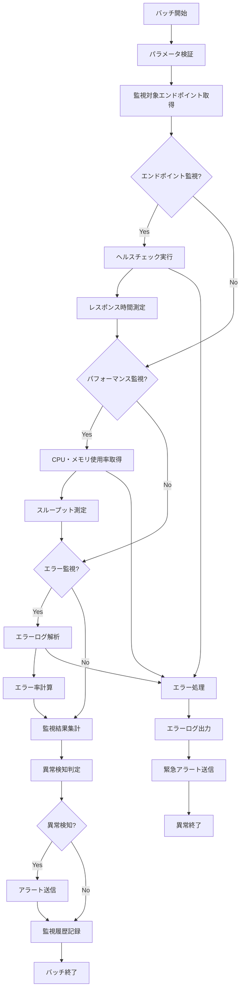

# バッチ定義書：アプリケーション監視バッチ (BATCH-503)

## 1. 基本情報

| 項目 | 内容 |
|------|------|
| **バッチID** | BATCH-503 |
| **バッチ名** | アプリケーション監視バッチ |
| **実行スケジュール** | 5分毎 |
| **優先度** | 高 |
| **ステータス** | 未着手 |
| **作成日** | 2025/05/31 |
| **最終更新日** | 2025/05/31 |

## 2. バッチ概要

### 2.1 概要・目的
Webアプリケーションの稼働状況・レスポンス時間・エラー率を監視し、サービス品質を維持する。

### 2.2 関連テーブル
- TBL-048_アプリケーション監視履歴
- TBL-049_エンドポイント監視設定
- TBL-050_アプリケーションアラート設定

### 2.3 関連API
- API-303_ヘルスチェックAPI
- API-304_メトリクス取得API

## 3. 実行仕様

### 3.1 実行スケジュール
| 項目 | 設定値 | 備考 |
|------|--------|------|
| 実行頻度 | */5 * * * * | cron形式（5分毎） |
| 実行時間 | 5分毎 | 高頻度監視 |
| タイムアウト | 3分 | 最大実行時間 |
| リトライ回数 | 2回 | 失敗時の再実行 |

### 3.2 実行条件
| 条件 | 内容 | 備考 |
|------|------|------|
| 前提条件 | アプリケーション稼働中 | 基本的な稼働状態 |
| 実行可能時間 | 24時間 | 常時監視 |
| 排他制御 | 同一バッチの重複実行禁止 | ロックファイル使用 |

### 3.3 実行パラメータ
| パラメータ名 | データ型 | 必須 | デフォルト値 | 説明 |
|--------------|----------|------|--------------|------|
| check_endpoints | boolean | × | true | エンドポイント監視フラグ |
| check_performance | boolean | × | true | パフォーマンス監視フラグ |
| check_errors | boolean | × | true | エラー監視フラグ |

## 4. 処理仕様

### 4.1 処理フロー

### 4.2 詳細処理
1. **初期化処理**
   - パラメータ検証
   - 監視対象エンドポイント一覧取得
   - ログファイル初期化
   - 排他制御ロック取得

2. **エンドポイント監視**
   - 各エンドポイントへのHTTPリクエスト送信
   - レスポンス時間・ステータスコードの記録
   - 可用性の計算
   - SSL証明書の有効期限確認

3. **パフォーマンス監視**
   - アプリケーションサーバーのリソース使用状況取得
   - スループット（RPS）の測定
   - 同時接続数の確認
   - キューの滞留状況確認

4. **エラー監視**
   - アプリケーションログの解析
   - エラー発生率の計算
   - 特定エラーパターンの検出
   - 例外スタックトレースの分析

5. **異常検知・アラート**
   - 各監視項目の閾値チェック
   - 異常パターンの検出
   - アラートレベルの判定
   - 通知先の決定・送信

## 5. データ仕様

### 5.1 入力データ
| データ名 | 形式 | 取得元 | 説明 |
|----------|------|--------|------|
| エンドポイント設定 | DB | TBL-049_エンドポイント監視設定 | 監視対象URL・閾値 |
| アラート設定 | DB | TBL-050_アプリケーションアラート設定 | 通知設定 |
| アプリケーションログ | LOG | /logs/application/ | エラー解析用ログ |

### 5.2 出力データ
| データ名 | 形式 | 出力先 | 説明 |
|----------|------|--------|------|
| 監視履歴 | DB | TBL-048_アプリケーション監視履歴 | 監視結果の記録 |
| アラートログ | LOG | /logs/alerts/ | アラート送信履歴 |
| 実行ログ | LOG | /logs/batch/ | 実行履歴ログ |

### 5.3 データ量見積もり
| 項目 | 件数 | 備考 |
|------|------|------|
| 監視エンドポイント数 | 50件 | 主要API・画面 |
| 履歴保存期間 | 7日 | 詳細履歴 |
| 処理時間 | 1分 | 平均実行時間 |

## 6. エラーハンドリング

### 6.1 エラー分類
| エラー種別 | 対応方法 | 通知要否 | 備考 |
|------------|----------|----------|------|
| エンドポイント応答なし | 緊急アラート・リトライ | ○ | サービス停止 |
| レスポンス時間超過 | アラート・継続 | ○ | パフォーマンス劣化 |
| 高エラー率 | アラート・継続 | ○ | アプリケーション異常 |

### 6.2 リトライ仕様
| 条件 | リトライ回数 | 間隔 | 備考 |
|------|--------------|------|------|
| HTTP接続エラー | 3回 | 30秒 | 短間隔リトライ |
| タイムアウト | 2回 | 60秒 | 負荷軽減待ち |
| 5xx系エラー | 3回 | 30秒 | サーバーエラー |

### 6.3 異常終了時の処理
1. 処理中断
2. エラーログ出力
3. 緊急アラート送信
4. 排他制御ロック解除

## 7. 監視・運用

### 7.1 監視項目
| 監視項目 | 閾値 | アラート条件 | 対応方法 |
|----------|------|--------------|----------|
| レスポンス時間 | 3秒 | 超過時 | パフォーマンス調査 |
| 可用性 | 99% | 下回り時 | インフラ確認 |
| エラー率 | 5% | 超過時 | アプリケーション調査 |
| CPU使用率 | 80% | 超過時 | スケールアウト検討 |

### 7.2 ログ出力
| ログ種別 | 出力レベル | 出力内容 | 保存期間 |
|----------|------------|----------|----------|
| 実行ログ | INFO | 処理開始・終了・監視結果 | 1ヶ月 |
| エラーログ | ERROR | エラー詳細・スタックトレース | 3ヶ月 |
| アラートログ | WARN | アラート詳細・閾値情報 | 3ヶ月 |

### 7.3 アラート通知
| 通知条件 | 通知先 | 通知方法 | 備考 |
|----------|--------|----------|------|
| サービス停止 | 運用チーム | メール・Slack・電話 | 緊急対応 |
| パフォーマンス劣化 | 開発チーム | Slack | 業務時間内のみ |
| 高エラー率 | 開発チーム | Slack | 即座に通知 |

## 8. 非機能要件

### 8.1 パフォーマンス
- 処理時間：3分以内
- メモリ使用量：256MB以内
- CPU使用率：10%以内

### 8.2 可用性
- 成功率：99.9%以上
- アプリケーション障害時の適切なエラー処理
- 監視継続性の確保

### 8.3 セキュリティ
- 監視用認証情報の安全な管理
- 機密情報の適切な取り扱い
- アクセスログの記録

## 9. テスト仕様

### 9.1 単体テスト
| テストケース | 入力条件 | 期待結果 |
|--------------|----------|----------|
| 正常監視 | アプリケーション正常稼働 | 正常終了・履歴記録 |
| レスポンス遅延検知 | 遅いレスポンス | アラート送信 |
| エラー率上昇検知 | 高エラー率 | 警告アラート送信 |

### 9.2 異常系テスト
| テストケース | 入力条件 | 期待結果 |
|--------------|----------|----------|
| サービス停止 | アプリケーション停止 | 緊急アラート送信 |
| タイムアウト | 応答なし | エラー記録・リトライ |
| 認証失敗 | 無効な認証情報 | エラー記録・スキップ |

## 10. 実装メモ

### 10.1 技術仕様
- 言語：Node.js
- フレームワーク：なし（Pure Node.js）
- DB接続：Prisma
- HTTP クライアント：axios
- ログ出力：Winston

### 10.2 注意事項
- 監視リクエストの軽量化
- 高頻度実行による負荷軽減
- アラート送信の重複防止

### 10.3 デプロイ・実行環境
- 実行サーバー：監視サーバー
- 実行ユーザー：monitor_user
- 実行ディレクトリ：/opt/batch/app-monitor/
- 設定ファイル：/etc/batch/app-monitor.json

---

**改訂履歴**

| バージョン | 日付 | 変更者 | 変更内容 |
|------------|------|--------|----------|
| 1.0 | 2025/05/31 | システムアーキテクト | 初版作成 |
