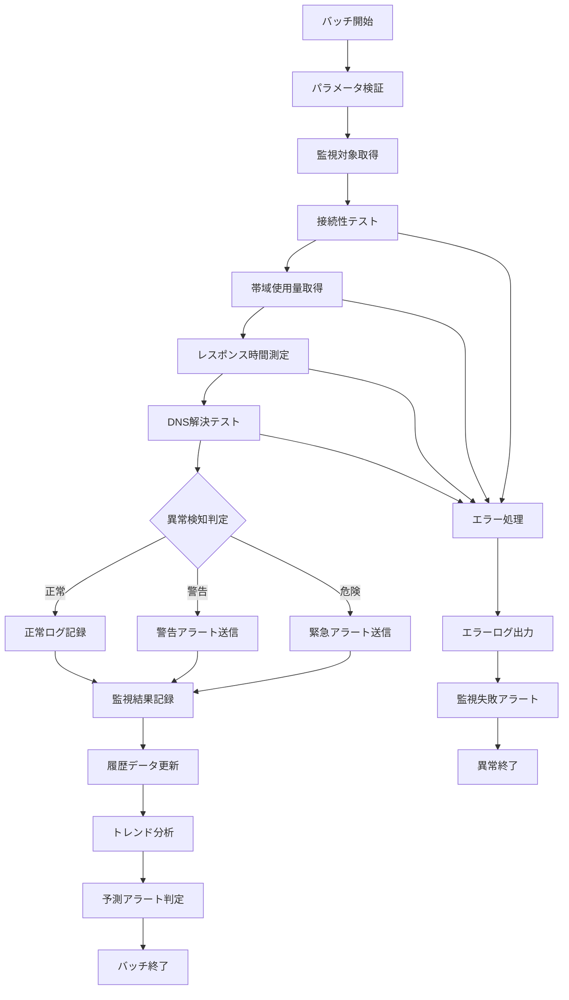

# バッチ定義書：ネットワーク監視バッチ (BATCH-505)

## 1. 基本情報

| 項目 | 内容 |
|------|------|
| **バッチID** | BATCH-505 |
| **バッチ名** | ネットワーク監視バッチ |
| **実行スケジュール** | 時間毎（毎時35分） |
| **優先度** | 高 |
| **ステータス** | 未着手 |
| **作成日** | 2025/05/31 |
| **最終更新日** | 2025/05/31 |

## 2. バッチ概要

### 2.1 概要・目的
システムのネットワーク状況を監視し、接続性・帯域使用量・レスポンス時間の異常検知・アラート送信を行う。

### 2.2 関連テーブル
- TBL-063_ネットワーク監視結果
- TBL-064_ネットワーク監視設定
- TBL-065_ネットワーク使用量履歴

### 2.3 関連API
- API-313_ネットワーク状況取得API
- API-314_ネットワーク監視設定API

## 3. 実行仕様

### 3.1 実行スケジュール
| 項目 | 設定値 | 備考 |
|------|--------|------|
| 実行頻度 | 35 * * * * | cron形式（毎時35分） |
| 実行時間 | 毎時35分 | 定期監視 |
| タイムアウト | 15分 | 最大実行時間 |
| リトライ回数 | 2回 | 失敗時の再実行 |

### 3.2 実行条件
| 条件 | 内容 | 備考 |
|------|------|------|
| 前提条件 | システム稼働中 | 監視対象システム |
| 実行可能時間 | 24時間 | 常時監視 |
| 排他制御 | 同一バッチの重複実行禁止 | ロックファイル使用 |

### 3.3 実行パラメータ
| パラメータ名 | データ型 | 必須 | デフォルト値 | 説明 |
|--------------|----------|------|--------------|------|
| ping_timeout | number | × | 5 | Ping タイムアウト（秒） |
| bandwidth_threshold | number | × | 80 | 帯域使用率閾値（%） |
| response_time_threshold | number | × | 1000 | レスポンス時間閾値（ms） |

## 4. 処理仕様

### 4.1 処理フロー

### 4.2 詳細処理
1. **初期化処理**
   - パラメータ検証
   - 監視設定の読み込み
   - 監視対象エンドポイントの取得
   - 排他制御ロック取得

2. **接続性テスト**
   - 外部APIエンドポイントへのPing実行
   - データベース接続テスト
   - 内部サービス間通信テスト
   - CDN・外部サービス接続確認

3. **帯域使用量監視**
   - ネットワークインターフェース使用量取得
   - 送受信データ量の測定
   - 帯域使用率の計算
   - ピーク時間帯の特定

4. **レスポンス時間測定**
   - 主要エンドポイントのレスポンス時間測定
   - データベースクエリ実行時間測定
   - 外部API呼び出し時間測定
   - ページロード時間の測定

5. **異常検知・アラート**
   - 閾値超過の検知
   - 接続失敗の検知
   - パフォーマンス劣化の検知
   - 予測的アラートの送信

## 5. データ仕様

### 5.1 入力データ
| データ名 | 形式 | 取得元 | 説明 |
|----------|------|--------|------|
| ネットワーク統計 | SYSTEM | /proc/net/dev | ネットワーク使用量統計 |
| 監視設定 | DB | TBL-064_ネットワーク監視設定 | 監視対象・閾値設定 |
| 履歴データ | DB | TBL-065_ネットワーク使用量履歴 | 過去のネットワーク使用量 |

### 5.2 出力データ
| データ名 | 形式 | 出力先 | 説明 |
|----------|------|--------|------|
| 監視結果 | DB | TBL-063_ネットワーク監視結果 | 監視結果・アラート情報 |
| 使用量履歴 | DB | TBL-065_ネットワーク使用量履歴 | 時系列使用量データ |
| 接続テストログ | LOG | /logs/network/ | 接続テスト詳細ログ |
| 実行ログ | LOG | /logs/batch/ | 実行履歴ログ |

### 5.3 データ量見積もり
| 項目 | 件数 | 備考 |
|------|------|------|
| 監視対象エンドポイント数 | 20個 | 平均値 |
| 履歴保存期間 | 1ヶ月 | 時間毎データ |
| 処理時間 | 5分 | 平均実行時間 |

## 6. エラーハンドリング

### 6.1 エラー分類
| エラー種別 | 対応方法 | 通知要否 | 備考 |
|------------|----------|----------|------|
| 接続タイムアウト | リトライ・継続 | ○ | ネットワーク問題 |
| DNS解決失敗 | リトライ・継続 | ○ | DNS問題 |
| 帯域測定エラー | エラー記録・継続 | △ | 測定失敗 |

### 6.2 リトライ仕様
| 条件 | リトライ回数 | 間隔 | 備考 |
|------|--------------|------|------|
| 接続タイムアウト | 3回 | 30秒 | ネットワーク復旧待ち |
| DNS解決失敗 | 3回 | 10秒 | DNS復旧待ち |
| 一時的なネットワークエラー | 2回 | 60秒 | ネットワーク安定化待ち |

### 6.3 異常終了時の処理
1. 処理中断
2. 部分更新のロールバック
3. エラーログ出力
4. ネットワーク監視失敗アラート送信
5. 排他制御ロック解除

## 7. 監視・運用

### 7.1 監視項目
| 監視項目 | 閾値 | アラート条件 | 対応方法 |
|----------|------|--------------|----------|
| 実行時間 | 15分 | 超過時 | 処理見直し・最適化 |
| 接続失敗率 | 10% | 超過時 | ネットワーク調査 |
| レスポンス時間劣化 | 2倍 | 超過時 | パフォーマンス調査 |

### 7.2 ログ出力
| ログ種別 | 出力レベル | 出力内容 | 保存期間 |
|----------|------------|----------|----------|
| 実行ログ | INFO | 処理開始・終了・監視結果 | 1ヶ月 |
| エラーログ | ERROR | エラー詳細・スタックトレース | 3ヶ月 |
| 接続テストログ | DEBUG | 接続テスト詳細・レスポンス時間 | 1週間 |

### 7.3 アラート通知
| 通知条件 | 通知先 | 通知方法 | 備考 |
|----------|--------|----------|------|
| 重要サービス接続失敗 | 運用チーム | Slack・メール・電話 | 即座に通知 |
| 帯域使用率高騰 | 運用チーム | Slack・メール | 15分以内 |
| レスポンス時間劣化 | 開発チーム | Slack・メール | 30分以内 |

## 8. 非機能要件

### 8.1 パフォーマンス
- 処理時間：15分以内
- メモリ使用量：100MB以内
- CPU使用率：10%以内

### 8.2 可用性
- 成功率：95%以上
- 一部エンドポイント監視失敗の許容
- 監視継続性の確保

### 8.3 セキュリティ
- ネットワーク情報の適切な管理
- 監視結果の機密性確保
- アクセスログの記録

## 9. テスト仕様

### 9.1 単体テスト
| テストケース | 入力条件 | 期待結果 |
|--------------|----------|----------|
| 正常監視 | 通常のネットワーク状況 | 正常終了・結果記録 |
| 接続失敗検知 | エンドポイント停止 | 接続失敗アラート送信 |
| 帯域使用率高騰検知 | 高帯域使用状況 | 帯域アラート送信 |

### 9.2 異常系テスト
| テストケース | 入力条件 | 期待結果 |
|--------------|----------|----------|
| 全接続失敗 | ネットワーク断絶 | エラー記録・アラート送信 |
| DNS解決失敗 | DNS停止状態 | エラー記録・リトライ実行 |
| タイムアウト発生 | 極端に遅いレスポンス | タイムアウト処理・継続 |

## 10. 実装メモ

### 10.1 技術仕様
- 言語：Node.js
- フレームワーク：なし（Pure Node.js）
- DB接続：Prisma
- ネットワーク監視：ping・curl・axios
- ログ出力：Winston

### 10.2 注意事項
- 並列接続テストによる効率化
- タイムアウト設定の適切な調整
- 外部サービス依存の最小化

### 10.3 デプロイ・実行環境
- 実行サーバー：監視サーバー
- 実行ユーザー：monitor_user
- 実行ディレクトリ：/opt/batch/network-monitor/
- 設定ファイル：/etc/batch/network-monitor.json

---

**改訂履歴**

| バージョン | 日付 | 変更者 | 変更内容 |
|------------|------|--------|----------|
| 1.0 | 2025/05/31 | システムアーキテクト | 初版作成 |
