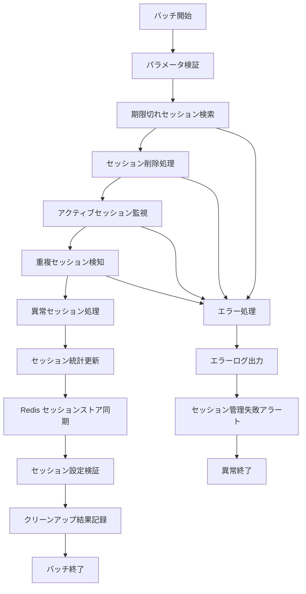

# バッチ定義書：セッション管理バッチ (BATCH-506)

## 1. 基本情報

| 項目 | 内容 |
|------|------|
| **バッチID** | BATCH-506 |
| **バッチ名** | セッション管理バッチ |
| **実行スケジュール** | 時間毎（毎時50分） |
| **優先度** | 中 |
| **ステータス** | 未着手 |
| **作成日** | 2025/05/31 |
| **最終更新日** | 2025/05/31 |

## 2. バッチ概要

### 2.1 概要・目的
期限切れセッションの削除・アクティブセッション監視・セッション統計の更新を行う。

### 2.2 関連テーブル
- TBL-066_セッション管理
- TBL-067_セッション統計
- TBL-068_セッション設定

### 2.3 関連API
- API-315_セッション情報取得API
- API-316_セッション管理API

## 3. 実行仕様

### 3.1 実行スケジュール
| 項目 | 設定値 | 備考 |
|------|--------|------|
| 実行頻度 | 50 * * * * | cron形式（毎時50分） |
| 実行時間 | 毎時50分 | 定期クリーンアップ |
| タイムアウト | 10分 | 最大実行時間 |
| リトライ回数 | 2回 | 失敗時の再実行 |

### 3.2 実行条件
| 条件 | 内容 | 備考 |
|------|------|------|
| 前提条件 | システム稼働中 | セッション管理対象 |
| 実行可能時間 | 24時間 | 常時実行 |
| 排他制御 | 同一バッチの重複実行禁止 | ロックファイル使用 |

### 3.3 実行パラメータ
| パラメータ名 | データ型 | 必須 | デフォルト値 | 説明 |
|--------------|----------|------|--------------|------|
| session_timeout | number | × | 1800 | セッションタイムアウト（秒） |
| cleanup_batch_size | number | × | 1000 | 一括削除件数 |
| max_concurrent_sessions | number | × | 10 | ユーザー最大同時セッション数 |

## 4. 処理仕様

### 4.1 処理フロー

### 4.2 詳細処理
1. **初期化処理**
   - パラメータ検証
   - セッション設定の読み込み
   - データベース接続確認
   - 排他制御ロック取得

2. **期限切れセッション削除**
   - タイムアウト時間を超過したセッションの特定
   - 一括削除処理の実行
   - Redisセッションストアからの削除
   - 削除件数の記録

3. **アクティブセッション監視**
   - 現在アクティブなセッション数の確認
   - ユーザー別同時セッション数の監視
   - 異常に長時間継続するセッションの検知
   - セッション使用パターンの分析

4. **重複・異常セッション処理**
   - 同一ユーザーの重複セッション検知
   - 最大同時セッション数超過の処理
   - 不正なセッションの検知・削除
   - セキュリティ違反セッションの処理

5. **統計情報更新**
   - セッション統計データの更新
   - ユーザー別セッション履歴の記録
   - セッション使用傾向の分析
   - レポート用データの生成

## 5. データ仕様

### 5.1 入力データ
| データ名 | 形式 | 取得元 | 説明 |
|----------|------|--------|------|
| セッション情報 | DB | TBL-066_セッション管理 | 現在のセッション情報 |
| セッション設定 | DB | TBL-068_セッション設定 | タイムアウト・制限設定 |
| Redisセッション | REDIS | Redis Store | セッションストア情報 |

### 5.2 出力データ
| データ名 | 形式 | 出力先 | 説明 |
|----------|------|--------|------|
| セッション統計 | DB | TBL-067_セッション統計 | セッション使用統計 |
| クリーンアップログ | LOG | /logs/session/ | セッション削除履歴 |
| 実行ログ | LOG | /logs/batch/ | 実行履歴ログ |
| アラートログ | LOG | /logs/alerts/ | 異常セッション検知ログ |

### 5.3 データ量見積もり
| 項目 | 件数 | 備考 |
|------|------|------|
| 削除対象セッション数 | 500件 | 1時間あたり平均 |
| アクティブセッション数 | 2,000件 | 平均値 |
| 処理時間 | 3分 | 平均実行時間 |

## 6. エラーハンドリング

### 6.1 エラー分類
| エラー種別 | 対応方法 | 通知要否 | 備考 |
|------------|----------|----------|------|
| セッション削除エラー | リトライ・継続 | △ | 部分的な削除失敗 |
| Redis接続エラー | リトライ・継続 | ○ | セッションストア問題 |
| DB更新エラー | リトライ・継続 | ○ | データ整合性問題 |

### 6.2 リトライ仕様
| 条件 | リトライ回数 | 間隔 | 備考 |
|------|--------------|------|------|
| セッション削除エラー | 3回 | 10秒 | 短間隔リトライ |
| Redis接続エラー | 3回 | 30秒 | 接続復旧待ち |
| DB接続エラー | 3回 | 30秒 | 接続復旧待ち |

### 6.3 異常終了時の処理
1. 処理中断
2. 部分更新のロールバック
3. エラーログ出力
4. セッション管理失敗アラート送信
5. 排他制御ロック解除

## 7. 監視・運用

### 7.1 監視項目
| 監視項目 | 閾値 | アラート条件 | 対応方法 |
|----------|------|--------------|----------|
| 実行時間 | 10分 | 超過時 | 処理見直し・最適化 |
| 削除失敗率 | 5% | 超過時 | システム調査 |
| アクティブセッション数 | 5,000件 | 超過時 | 負荷分散検討 |

### 7.2 ログ出力
| ログ種別 | 出力レベル | 出力内容 | 保存期間 |
|----------|------------|----------|----------|
| 実行ログ | INFO | 処理開始・終了・削除件数 | 1ヶ月 |
| エラーログ | ERROR | エラー詳細・スタックトレース | 3ヶ月 |
| クリーンアップログ | INFO | 削除セッション詳細 | 1週間 |

### 7.3 アラート通知
| 通知条件 | 通知先 | 通知方法 | 備考 |
|----------|--------|----------|------|
| 大量セッション削除失敗 | 運用チーム | Slack・メール | 30分以内 |
| Redis接続失敗 | 運用チーム | Slack・メール | 15分以内 |
| 異常セッション検知 | セキュリティチーム | メール | 1時間以内 |

## 8. 非機能要件

### 8.1 パフォーマンス
- 処理時間：10分以内
- メモリ使用量：200MB以内
- CPU使用率：15%以内

### 8.2 可用性
- 成功率：98%以上
- 部分的な削除失敗の許容
- セッション管理継続性の確保

### 8.3 セキュリティ
- セッション情報の適切な削除
- 個人情報の機密性確保
- アクセスログの記録

## 9. テスト仕様

### 9.1 単体テスト
| テストケース | 入力条件 | 期待結果 |
|--------------|----------|----------|
| 正常クリーンアップ | 期限切れセッション存在 | 正常削除・統計更新 |
| 重複セッション検知 | 同一ユーザー複数セッション | 重複セッション処理 |
| 異常セッション検知 | 長時間継続セッション | 異常セッション削除 |

### 9.2 異常系テスト
| テストケース | 入力条件 | 期待結果 |
|--------------|----------|----------|
| Redis接続失敗 | Redis停止状態 | エラー記録・リトライ実行 |
| 大量セッション削除 | 大量期限切れセッション | 分割処理・正常完了 |
| DB接続エラー | DB停止状態 | エラー記録・アラート送信 |

## 10. 実装メモ

### 10.1 技術仕様
- 言語：Node.js
- フレームワーク：なし（Pure Node.js）
- DB接続：Prisma
- セッションストア：Redis
- ログ出力：Winston

### 10.2 注意事項
- 大量セッション削除時のパフォーマンス考慮
- Redis とDBの整合性確保
- セッション削除時の適切なクリーンアップ

### 10.3 デプロイ・実行環境
- 実行サーバー：アプリケーションサーバー
- 実行ユーザー：app_user
- 実行ディレクトリ：/opt/batch/session-manager/
- 設定ファイル：/etc/batch/session-manager.json

---

**改訂履歴**

| バージョン | 日付 | 変更者 | 変更内容 |
|------------|------|--------|----------|
| 1.0 | 2025/05/31 | システムアーキテクト | 初版作成 |
