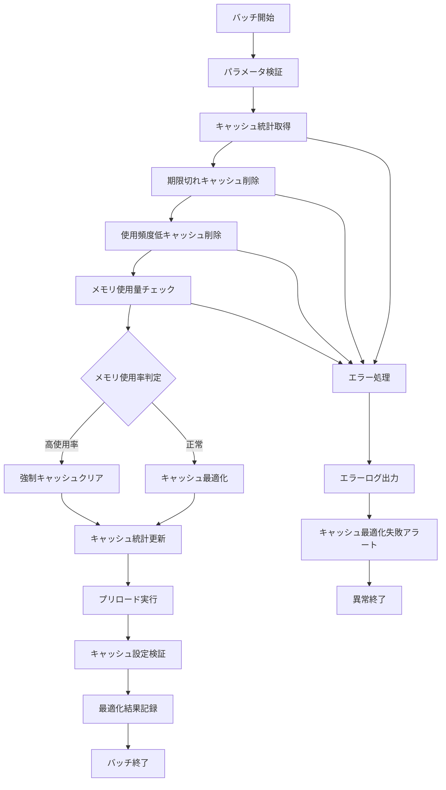

# バッチ定義書：キャッシュ最適化バッチ (BATCH-507)

## 1. 基本情報

| 項目 | 内容 |
|------|------|
| **バッチID** | BATCH-507 |
| **バッチ名** | キャッシュ最適化バッチ |
| **実行スケジュール** | 日次（03:45） |
| **優先度** | 中 |
| **ステータス** | 未着手 |
| **作成日** | 2025/05/31 |
| **最終更新日** | 2025/05/31 |

## 2. バッチ概要

### 2.1 概要・目的
システム全体のキャッシュの最適化・クリア・統計更新を行い、パフォーマンスの向上を図る。

### 2.2 関連テーブル
- TBL-069_キャッシュ統計
- TBL-070_キャッシュ設定
- TBL-071_キャッシュ使用履歴

### 2.3 関連API
- API-317_キャッシュ統計取得API
- API-318_キャッシュ管理API

## 3. 実行仕様

### 3.1 実行スケジュール
| 項目 | 設定値 | 備考 |
|------|--------|------|
| 実行頻度 | 45 3 * * * | cron形式（日次 03:45） |
| 実行時間 | 03:45 | 低負荷時間帯 |
| タイムアウト | 30分 | 最大実行時間 |
| リトライ回数 | 2回 | 失敗時の再実行 |

### 3.2 実行条件
| 条件 | 内容 | 備考 |
|------|------|------|
| 前提条件 | システム稼働中 | キャッシュ管理対象 |
| 実行可能時間 | 03:00-05:00 | 低負荷時間帯 |
| 排他制御 | 同一バッチの重複実行禁止 | ロックファイル使用 |

### 3.3 実行パラメータ
| パラメータ名 | データ型 | 必須 | デフォルト値 | 説明 |
|--------------|----------|------|--------------|------|
| cache_ttl_threshold | number | × | 86400 | キャッシュTTL閾値（秒） |
| memory_usage_threshold | number | × | 80 | メモリ使用率閾値（%） |
| enable_preload | boolean | × | true | プリロード実行有効化 |

## 4. 処理仕様

### 4.1 処理フロー

### 4.2 詳細処理
1. **初期化処理**
   - パラメータ検証
   - キャッシュ設定の読み込み
   - Redis・Memcached接続確認
   - 排他制御ロック取得

2. **キャッシュ統計取得**
   - 各キャッシュストアの使用状況取得
   - ヒット率・ミス率の計算
   - メモリ使用量の確認
   - キャッシュサイズの測定

3. **期限切れキャッシュ削除**
   - TTL期限切れキャッシュの特定
   - 一括削除処理の実行
   - 削除件数・容量の記録
   - メモリ解放の確認

4. **使用頻度低キャッシュ削除**
   - アクセス頻度の低いキャッシュ特定
   - LRU（Least Recently Used）アルゴリズム適用
   - 不要キャッシュの削除
   - 容量最適化の実行

5. **キャッシュプリロード**
   - 頻繁にアクセスされるデータの事前読み込み
   - 重要なマスタデータのキャッシュ
   - API レスポンスの事前キャッシュ
   - ウォームアップ処理の実行

## 5. データ仕様

### 5.1 入力データ
| データ名 | 形式 | 取得元 | 説明 |
|----------|------|--------|------|
| キャッシュ統計 | REDIS/MEMCACHED | Cache Store | キャッシュ使用統計 |
| キャッシュ設定 | DB | TBL-070_キャッシュ設定 | TTL・容量制限設定 |
| 使用履歴 | DB | TBL-071_キャッシュ使用履歴 | アクセス履歴データ |

### 5.2 出力データ
| データ名 | 形式 | 出力先 | 説明 |
|----------|------|--------|------|
| キャッシュ統計 | DB | TBL-069_キャッシュ統計 | 最適化後の統計情報 |
| 最適化ログ | LOG | /logs/cache/ | 最適化実行詳細 |
| 実行ログ | LOG | /logs/batch/ | 実行履歴ログ |
| パフォーマンスログ | LOG | /logs/performance/ | 最適化効果測定 |

### 5.3 データ量見積もり
| 項目 | 件数 | 備考 |
|------|------|------|
| 削除対象キャッシュ数 | 10,000件 | 日次平均 |
| プリロード対象数 | 1,000件 | 重要データ |
| 処理時間 | 15分 | 平均実行時間 |

## 6. エラーハンドリング

### 6.1 エラー分類
| エラー種別 | 対応方法 | 通知要否 | 備考 |
|------------|----------|----------|------|
| キャッシュ削除エラー | リトライ・継続 | △ | 部分的な削除失敗 |
| Redis接続エラー | リトライ・継続 | ○ | キャッシュストア問題 |
| プリロードエラー | エラー記録・継続 | △ | プリロード失敗 |

### 6.2 リトライ仕様
| 条件 | リトライ回数 | 間隔 | 備考 |
|------|--------------|------|------|
| キャッシュ削除エラー | 3回 | 30秒 | 短間隔リトライ |
| Redis接続エラー | 3回 | 60秒 | 接続復旧待ち |
| プリロードエラー | 2回 | 120秒 | データ取得待ち |

### 6.3 異常終了時の処理
1. 処理中断
2. 部分更新のロールバック
3. エラーログ出力
4. キャッシュ最適化失敗アラート送信
5. 排他制御ロック解除

## 7. 監視・運用

### 7.1 監視項目
| 監視項目 | 閾値 | アラート条件 | 対応方法 |
|----------|------|--------------|----------|
| 実行時間 | 30分 | 超過時 | 処理見直し・最適化 |
| 削除失敗率 | 10% | 超過時 | システム調査 |
| メモリ使用率 | 90% | 超過時 | 強制クリア実行 |

### 7.2 ログ出力
| ログ種別 | 出力レベル | 出力内容 | 保存期間 |
|----------|------------|----------|----------|
| 実行ログ | INFO | 処理開始・終了・最適化結果 | 1ヶ月 |
| エラーログ | ERROR | エラー詳細・スタックトレース | 3ヶ月 |
| 最適化ログ | INFO | 削除・プリロード詳細 | 1週間 |

### 7.3 アラート通知
| 通知条件 | 通知先 | 通知方法 | 備考 |
|----------|--------|----------|------|
| 大量キャッシュ削除失敗 | 運用チーム | Slack・メール | 30分以内 |
| Redis接続失敗 | 運用チーム | Slack・メール | 15分以内 |
| メモリ使用率異常 | 運用チーム | Slack・メール・電話 | 即座に通知 |

## 8. 非機能要件

### 8.1 パフォーマンス
- 処理時間：30分以内
- メモリ使用量：500MB以内
- CPU使用率：20%以内

### 8.2 可用性
- 成功率：95%以上
- 部分的な最適化失敗の許容
- キャッシュサービス継続性の確保

### 8.3 セキュリティ
- キャッシュデータの適切な削除
- 機密情報の完全消去
- アクセスログの記録

## 9. テスト仕様

### 9.1 単体テスト
| テストケース | 入力条件 | 期待結果 |
|--------------|----------|----------|
| 正常最適化 | 期限切れキャッシュ存在 | 正常削除・統計更新 |
| メモリ使用率高騰 | 高メモリ使用状況 | 強制クリア実行 |
| プリロード実行 | プリロード対象存在 | 正常プリロード完了 |

### 9.2 異常系テスト
| テストケース | 入力条件 | 期待結果 |
|--------------|----------|----------|
| Redis接続失敗 | Redis停止状態 | エラー記録・リトライ実行 |
| 大量キャッシュ削除 | 大量期限切れキャッシュ | 分割処理・正常完了 |
| プリロード失敗 | データ取得エラー | エラー記録・継続処理 |

## 10. 実装メモ

### 10.1 技術仕様
- 言語：Node.js
- フレームワーク：なし（Pure Node.js）
- キャッシュストア：Redis・Memcached
- DB接続：Prisma
- ログ出力：Winston

### 10.2 注意事項
- 大量キャッシュ削除時のパフォーマンス考慮
- プリロード処理の効率化
- キャッシュ削除時の適切なメモリ解放

### 10.3 デプロイ・実行環境
- 実行サーバー：キャッシュサーバー
- 実行ユーザー：cache_user
- 実行ディレクトリ：/opt/batch/cache-optimizer/
- 設定ファイル：/etc/batch/cache-optimizer.json

---

**改訂履歴**

| バージョン | 日付 | 変更者 | 変更内容 |
|------------|------|--------|----------|
| 1.0 | 2025/05/31 | システムアーキテクト | 初版作成 |
