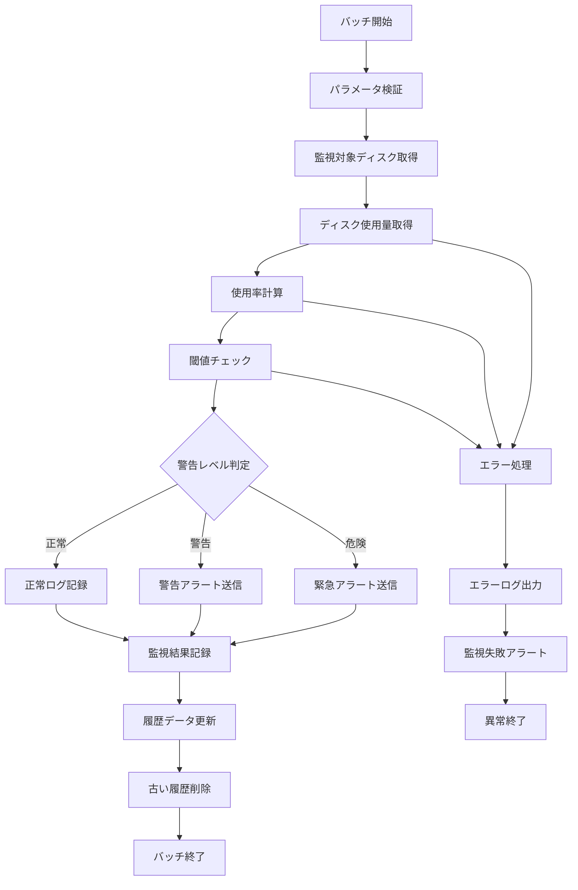

# バッチ定義書：ディスク容量監視バッチ (BATCH-508)

## 1. 基本情報

| 項目 | 内容 |
|------|------|
| **バッチID** | BATCH-508 |
| **バッチ名** | ディスク容量監視バッチ |
| **実行スケジュール** | 時間毎（毎時05分） |
| **優先度** | 高 |
| **ステータス** | 未着手 |
| **作成日** | 2025/05/31 |
| **最終更新日** | 2025/05/31 |

## 2. バッチ概要

### 2.1 概要・目的
システム全体のディスク使用量を監視し、容量不足の早期検知・アラート送信を行う。

### 2.2 関連テーブル
- TBL-057_ディスク監視結果
- TBL-058_ディスク容量閾値設定
- TBL-059_ディスク使用量履歴

### 2.3 関連API
- API-309_ディスク使用量取得API
- API-310_ディスク監視設定API

## 3. 実行仕様

### 3.1 実行スケジュール
| 項目 | 設定値 | 備考 |
|------|--------|------|
| 実行頻度 | 5 * * * * | cron形式（毎時05分） |
| 実行時間 | 毎時05分 | 定期監視 |
| タイムアウト | 10分 | 最大実行時間 |
| リトライ回数 | 2回 | 失敗時の再実行 |

### 3.2 実行条件
| 条件 | 内容 | 備考 |
|------|------|------|
| 前提条件 | システム稼働中 | 監視対象システム |
| 実行可能時間 | 24時間 | 常時監視 |
| 排他制御 | 同一バッチの重複実行禁止 | ロックファイル使用 |

### 3.3 実行パラメータ
| パラメータ名 | データ型 | 必須 | デフォルト値 | 説明 |
|--------------|----------|------|--------------|------|
| warning_threshold | number | × | 80 | 警告閾値（%） |
| critical_threshold | number | × | 90 | 危険閾値（%） |
| check_all_mounts | boolean | × | true | 全マウントポイント監視 |

## 4. 処理仕様

### 4.1 処理フロー

### 4.2 詳細処理
1. **初期化処理**
   - パラメータ検証
   - 監視設定の読み込み
   - 監視対象ディスクの特定
   - 排他制御ロック取得

2. **ディスク使用量取得**
   - 各マウントポイントの容量取得
   - 使用量・空き容量の計算
   - 使用率の算出
   - inode使用率の確認

3. **閾値チェック・判定**
   - 警告閾値（80%）との比較
   - 危険閾値（90%）との比較
   - 急激な使用量増加の検知
   - 予測される満杯時期の計算

4. **アラート送信**
   - レベル別の通知先振り分け
   - 緊急度に応じた通知方法選択
   - 通知内容の詳細化
   - 対応手順の案内

5. **監視結果記録**
   - 監視結果のDB保存
   - 履歴データの蓄積
   - トレンド分析用データ作成
   - レポート用統計情報更新

## 5. データ仕様

### 5.1 入力データ
| データ名 | 形式 | 取得元 | 説明 |
|----------|------|--------|------|
| ディスク情報 | SYSTEM | df コマンド | ディスク使用量情報 |
| 監視設定 | DB | TBL-058_ディスク容量閾値設定 | 監視閾値・対象ディスク |
| 履歴データ | DB | TBL-059_ディスク使用量履歴 | 過去の使用量データ |

### 5.2 出力データ
| データ名 | 形式 | 出力先 | 説明 |
|----------|------|--------|------|
| 監視結果 | DB | TBL-057_ディスク監視結果 | 監視結果・アラート情報 |
| 使用量履歴 | DB | TBL-059_ディスク使用量履歴 | 時系列使用量データ |
| アラートログ | LOG | /logs/alerts/ | アラート送信履歴 |
| 実行ログ | LOG | /logs/batch/ | 実行履歴ログ |

### 5.3 データ量見積もり
| 項目 | 件数 | 備考 |
|------|------|------|
| 監視対象ディスク数 | 10個 | 平均値 |
| 履歴保存期間 | 3ヶ月 | 時間毎データ |
| 処理時間 | 2分 | 平均実行時間 |

## 6. エラーハンドリング

### 6.1 エラー分類
| エラー種別 | 対応方法 | 通知要否 | 備考 |
|------------|----------|----------|------|
| ディスクアクセスエラー | リトライ・継続 | ○ | マウント問題等 |
| 閾値設定エラー | デフォルト値使用 | △ | 設定不備 |
| DB更新エラー | リトライ・継続 | ○ | データ整合性問題 |

### 6.2 リトライ仕様
| 条件 | リトライ回数 | 間隔 | 備考 |
|------|--------------|------|------|
| ディスクアクセスエラー | 3回 | 10秒 | 短間隔リトライ |
| DB接続エラー | 3回 | 30秒 | 接続復旧待ち |
| 一時的なシステムエラー | 2回 | 60秒 | システム復旧待ち |

### 6.3 異常終了時の処理
1. 処理中断
2. 部分更新のロールバック
3. エラーログ出力
4. 監視失敗アラート送信
5. 排他制御ロック解除

## 7. 監視・運用

### 7.1 監視項目
| 監視項目 | 閾値 | アラート条件 | 対応方法 |
|----------|------|--------------|----------|
| 実行時間 | 10分 | 超過時 | 処理見直し・最適化 |
| 監視失敗率 | 5% | 超過時 | システム調査 |
| アラート送信数 | 50件/日 | 超過時 | 閾値見直し |

### 7.2 ログ出力
| ログ種別 | 出力レベル | 出力内容 | 保存期間 |
|----------|------------|----------|----------|
| 実行ログ | INFO | 処理開始・終了・監視結果 | 1ヶ月 |
| エラーログ | ERROR | エラー詳細・スタックトレース | 3ヶ月 |
| アラートログ | WARN | アラート送信詳細 | 3ヶ月 |

### 7.3 アラート通知
| 通知条件 | 通知先 | 通知方法 | 備考 |
|----------|--------|----------|------|
| 危険閾値超過 | 運用チーム | Slack・メール・電話 | 即座に通知 |
| 警告閾値超過 | 運用チーム | Slack・メール | 15分以内 |
| 監視失敗 | 運用チーム | メール | 定期確認 |

## 8. 非機能要件

### 8.1 パフォーマンス
- 処理時間：10分以内
- メモリ使用量：100MB以内
- CPU使用率：10%以内

### 8.2 可用性
- 成功率：99%以上
- 一部ディスク監視失敗の許容
- 監視継続性の確保

### 8.3 セキュリティ
- システム情報の適切な管理
- 監視結果の機密性確保
- アクセスログの記録

## 9. テスト仕様

### 9.1 単体テスト
| テストケース | 入力条件 | 期待結果 |
|--------------|----------|----------|
| 正常監視 | 通常のディスク使用量 | 正常終了・結果記録 |
| 警告レベル検知 | 80%以上の使用量 | 警告アラート送信 |
| 危険レベル検知 | 90%以上の使用量 | 緊急アラート送信 |

### 9.2 異常系テスト
| テストケース | 入力条件 | 期待結果 |
|--------------|----------|----------|
| ディスクアクセス不可 | マウントエラー | エラー記録・アラート送信 |
| 設定不備 | 不正な閾値設定 | デフォルト値使用・継続処理 |
| DB接続エラー | DB停止状態 | エラー記録・リトライ実行 |

## 10. 実装メモ

### 10.1 技術仕様
- 言語：Node.js
- フレームワーク：なし（Pure Node.js）
- DB接続：Prisma
- システム情報取得：child_process
- ログ出力：Winston

### 10.2 注意事項
- 複数マウントポイントの効率的な監視
- ネットワークドライブの監視除外
- 一時的なスパイクの除外

### 10.3 デプロイ・実行環境
- 実行サーバー：監視サーバー
- 実行ユーザー：monitor_user
- 実行ディレクトリ：/opt/batch/disk-monitor/
- 設定ファイル：/etc/batch/disk-monitor.json

---

**改訂履歴**

| バージョン | 日付 | 変更者 | 変更内容 |
|------------|------|--------|----------|
| 1.0 | 2025/05/31 | システムアーキテクト | 初版作成 |
