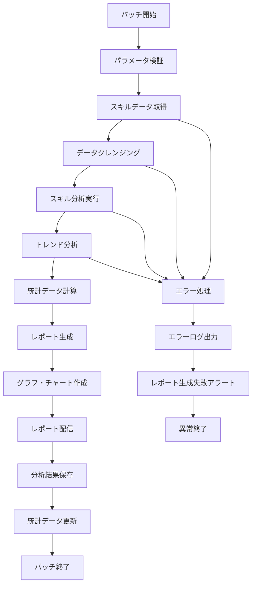

# バッチ定義書：スキル分析レポート生成バッチ (BATCH-601)

## 1. 基本情報

| 項目 | 内容 |
|------|------|
| **バッチID** | BATCH-601 |
| **バッチ名** | スキル分析レポート生成バッチ |
| **実行スケジュール** | 週次（日曜日 04:00） |
| **優先度** | 中 |
| **ステータス** | 未着手 |
| **作成日** | 2025/05/31 |
| **最終更新日** | 2025/05/31 |

## 2. バッチ概要

### 2.1 概要・目的
スキルデータの分析・集計を行い、週次スキル分析レポートを生成・配信する。

### 2.2 関連テーブル
- TBL-072_スキル分析結果
- TBL-073_スキルレポート設定
- TBL-074_スキル統計データ

### 2.3 関連API
- API-319_スキルデータ取得API
- API-320_レポート生成API

## 3. 実行仕様

### 3.1 実行スケジュール
| 項目 | 設定値 | 備考 |
|------|--------|------|
| 実行頻度 | 0 4 * * 0 | cron形式（週次 日曜日 04:00） |
| 実行時間 | 04:00 | 低負荷時間帯 |
| タイムアウト | 60分 | 最大実行時間 |
| リトライ回数 | 2回 | 失敗時の再実行 |

### 3.2 実行条件
| 条件 | 内容 | 備考 |
|------|------|------|
| 前提条件 | スキルデータ存在 | 分析対象データ |
| 実行可能時間 | 03:00-06:00 | 低負荷時間帯 |
| 排他制御 | 同一バッチの重複実行禁止 | ロックファイル使用 |

### 3.3 実行パラメータ
| パラメータ名 | データ型 | 必須 | デフォルト値 | 説明 |
|--------------|----------|------|--------------|------|
| analysis_period | number | × | 7 | 分析期間（日） |
| report_format | string | × | "pdf" | レポート形式（pdf/excel） |
| enable_trend_analysis | boolean | × | true | トレンド分析有効化 |

## 4. 処理仕様

### 4.1 処理フロー

### 4.2 詳細処理
1. **初期化処理**
   - パラメータ検証
   - レポート設定の読み込み
   - 分析期間の設定
   - 排他制御ロック取得

2. **スキルデータ取得・クレンジング**
   - 指定期間のスキルデータ取得
   - データの正規化・標準化
   - 欠損データの補完
   - 異常値の検出・除外

3. **スキル分析実行**
   - スキル習得状況の分析
   - スキルレベル分布の計算
   - スキルカテゴリ別集計
   - 個人・チーム別スキル分析

4. **トレンド分析**
   - 過去データとの比較分析
   - スキル成長率の計算
   - 習得傾向の分析
   - 予測モデルの適用

5. **レポート生成・配信**
   - PDF/Excelレポートの生成
   - グラフ・チャートの作成
   - 配信先への送信
   - 配信結果の記録

## 5. データ仕様

### 5.1 入力データ
| データ名 | 形式 | 取得元 | 説明 |
|----------|------|--------|------|
| スキルデータ | DB | スキル関連テーブル | 個人・チームスキル情報 |
| レポート設定 | DB | TBL-073_スキルレポート設定 | レポート生成設定 |
| 過去統計データ | DB | TBL-074_スキル統計データ | トレンド分析用データ |

### 5.2 出力データ
| データ名 | 形式 | 出力先 | 説明 |
|----------|------|--------|------|
| 分析結果 | DB | TBL-072_スキル分析結果 | 分析結果データ |
| 統計データ | DB | TBL-074_スキル統計データ | 更新された統計情報 |
| レポートファイル | FILE | /reports/skill/ | PDF/Excelレポート |
| 実行ログ | LOG | /logs/batch/ | 実行履歴ログ |

### 5.3 データ量見積もり
| 項目 | 件数 | 備考 |
|------|------|------|
| 分析対象スキルデータ数 | 50,000件 | 週次データ |
| 生成レポート数 | 100件 | テナント・チーム別 |
| 処理時間 | 30分 | 平均実行時間 |

## 6. エラーハンドリング

### 6.1 エラー分類
| エラー種別 | 対応方法 | 通知要否 | 備考 |
|------------|----------|----------|------|
| データ取得エラー | リトライ・継続 | ○ | データソース問題 |
| 分析処理エラー | エラー記録・継続 | ○ | 分析ロジック問題 |
| レポート生成エラー | リトライ・継続 | ○ | ファイル生成問題 |

### 6.2 リトライ仕様
| 条件 | リトライ回数 | 間隔 | 備考 |
|------|--------------|------|------|
| データ取得エラー | 3回 | 60秒 | DB復旧待ち |
| 分析処理エラー | 2回 | 120秒 | メモリ解放待ち |
| レポート生成エラー | 3回 | 30秒 | ファイルシステム復旧待ち |

### 6.3 異常終了時の処理
1. 処理中断
2. 部分更新のロールバック
3. エラーログ出力
4. レポート生成失敗アラート送信
5. 排他制御ロック解除

## 7. 監視・運用

### 7.1 監視項目
| 監視項目 | 閾値 | アラート条件 | 対応方法 |
|----------|------|--------------|----------|
| 実行時間 | 60分 | 超過時 | 処理見直し・最適化 |
| レポート生成失敗率 | 5% | 超過時 | システム調査 |
| データ取得失敗率 | 10% | 超過時 | データソース調査 |

### 7.2 ログ出力
| ログ種別 | 出力レベル | 出力内容 | 保存期間 |
|----------|------------|----------|----------|
| 実行ログ | INFO | 処理開始・終了・分析結果 | 3ヶ月 |
| エラーログ | ERROR | エラー詳細・スタックトレース | 6ヶ月 |
| 分析ログ | DEBUG | 分析処理詳細・統計情報 | 1ヶ月 |

### 7.3 アラート通知
| 通知条件 | 通知先 | 通知方法 | 備考 |
|----------|--------|----------|------|
| レポート生成失敗 | 運用チーム | Slack・メール | 1時間以内 |
| データ分析エラー | 開発チーム | Slack・メール | 2時間以内 |
| 大量データ処理失敗 | 運用チーム | メール | 30分以内 |

## 8. 非機能要件

### 8.1 パフォーマンス
- 処理時間：60分以内
- メモリ使用量：2GB以内
- CPU使用率：30%以内

### 8.2 可用性
- 成功率：95%以上
- 部分的なレポート生成失敗の許容
- 分析処理継続性の確保

### 8.3 セキュリティ
- スキルデータの適切な管理
- レポートファイルの機密性確保
- アクセスログの記録

## 9. テスト仕様

### 9.1 単体テスト
| テストケース | 入力条件 | 期待結果 |
|--------------|----------|----------|
| 正常レポート生成 | 正常なスキルデータ | レポート生成・配信完了 |
| トレンド分析実行 | 過去データ存在 | トレンド分析結果出力 |
| 複数形式レポート | PDF・Excel指定 | 両形式レポート生成 |

### 9.2 異常系テスト
| テストケース | 入力条件 | 期待結果 |
|--------------|----------|----------|
| データ不足 | スキルデータなし | エラー記録・アラート送信 |
| 分析処理失敗 | 不正なデータ形式 | エラー記録・継続処理 |
| ファイル生成失敗 | ディスク容量不足 | エラー記録・リトライ実行 |

## 10. 実装メモ

### 10.1 技術仕様
- 言語：Python
- フレームワーク：pandas・numpy・matplotlib
- DB接続：SQLAlchemy
- レポート生成：ReportLab・openpyxl
- ログ出力：logging

### 10.2 注意事項
- 大量データ処理時のメモリ管理
- レポート生成時のファイルサイズ制限
- 分析処理の効率化

### 10.3 デプロイ・実行環境
- 実行サーバー：分析サーバー
- 実行ユーザー：analytics_user
- 実行ディレクトリ：/opt/batch/skill-analytics/
- 設定ファイル：/etc/batch/skill-analytics.json

---

**改訂履歴**

| バージョン | 日付 | 変更者 | 変更内容 |
|------------|------|--------|----------|
| 1.0 | 2025/05/31 | システムアーキテクト | 初版作成 |
