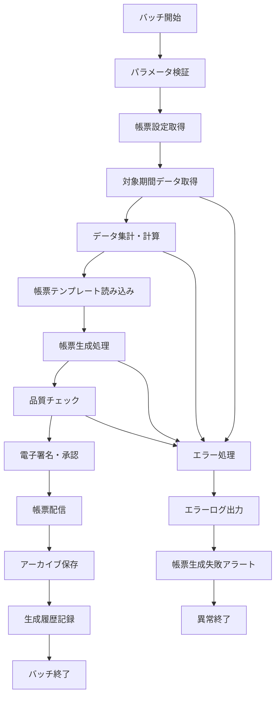

# バッチ定義書：帳票自動生成バッチ (BATCH-602)

## 1. 基本情報

| 項目 | 内容 |
|------|------|
| **バッチID** | BATCH-602 |
| **バッチ名** | 帳票自動生成バッチ |
| **実行スケジュール** | 月次（1日 05:00） |
| **優先度** | 高 |
| **ステータス** | 未着手 |
| **作成日** | 2025/05/31 |
| **最終更新日** | 2025/05/31 |

## 2. バッチ概要

### 2.1 概要・目的
月次・年次の各種帳票を自動生成し、関係者への配信・保管を行う。

### 2.2 関連テーブル
- TBL-075_帳票生成設定
- TBL-076_帳票生成履歴
- TBL-077_帳票配信先

### 2.3 関連API
- API-321_帳票データ取得API
- API-322_帳票生成API

## 3. 実行仕様

### 3.1 実行スケジュール
| 項目 | 設定値 | 備考 |
|------|--------|------|
| 実行頻度 | 0 5 1 * * | cron形式（月次 1日 05:00） |
| 実行時間 | 05:00 | 低負荷時間帯 |
| タイムアウト | 120分 | 最大実行時間 |
| リトライ回数 | 2回 | 失敗時の再実行 |

### 3.2 実行条件
| 条件 | 内容 | 備考 |
|------|------|------|
| 前提条件 | 前月データ確定 | 帳票対象データ |
| 実行可能時間 | 04:00-08:00 | 低負荷時間帯 |
| 排他制御 | 同一バッチの重複実行禁止 | ロックファイル使用 |

### 3.3 実行パラメータ
| パラメータ名 | データ型 | 必須 | デフォルト値 | 説明 |
|--------------|----------|------|--------------|------|
| target_month | string | × | "previous" | 対象月（previous/current） |
| report_types | array | × | ["all"] | 生成帳票種別 |
| output_format | string | × | "pdf" | 出力形式（pdf/excel/csv） |

## 4. 処理仕様

### 4.1 処理フロー

### 4.2 詳細処理
1. **初期化処理**
   - パラメータ検証
   - 帳票設定の読み込み
   - 対象期間の決定
   - 排他制御ロック取得

2. **データ取得・集計**
   - 対象期間のデータ取得
   - 帳票種別別データ集計
   - 計算式の適用
   - データ整合性チェック

3. **帳票生成処理**
   - テンプレートファイルの読み込み
   - データの帳票への埋め込み
   - レイアウト調整・書式設定
   - 複数形式での出力

4. **品質チェック・承認**
   - 帳票内容の妥当性チェック
   - 数値の整合性確認
   - 電子署名の付与
   - 承認ワークフローの実行

5. **配信・保管**
   - 配信先への送信
   - アーカイブストレージへの保存
   - 配信結果の記録
   - 保管期限の設定

## 5. データ仕様

### 5.1 入力データ
| データ名 | 形式 | 取得元 | 説明 |
|----------|------|--------|------|
| 業務データ | DB | 各業務テーブル | 帳票作成元データ |
| 帳票設定 | DB | TBL-075_帳票生成設定 | 帳票種別・設定情報 |
| テンプレート | FILE | /templates/reports/ | 帳票テンプレートファイル |

### 5.2 出力データ
| データ名 | 形式 | 出力先 | 説明 |
|----------|------|--------|------|
| 生成帳票 | FILE | /reports/generated/ | 生成された帳票ファイル |
| 生成履歴 | DB | TBL-076_帳票生成履歴 | 生成履歴・結果 |
| アーカイブ | FILE | /archive/reports/ | 長期保管用帳票 |
| 実行ログ | LOG | /logs/batch/ | 実行履歴ログ |

### 5.3 データ量見積もり
| 項目 | 件数 | 備考 |
|------|------|------|
| 生成帳票数 | 200件 | 月次帳票 |
| 処理対象データ量 | 1,000,000件 | 月次集計データ |
| 処理時間 | 60分 | 平均実行時間 |

## 6. エラーハンドリング

### 6.1 エラー分類
| エラー種別 | 対応方法 | 通知要否 | 備考 |
|------------|----------|----------|------|
| データ取得エラー | リトライ・継続 | ○ | データソース問題 |
| 帳票生成エラー | リトライ・継続 | ○ | テンプレート・データ問題 |
| 配信エラー | リトライ・継続 | ○ | ネットワーク・権限問題 |

### 6.2 リトライ仕様
| 条件 | リトライ回数 | 間隔 | 備考 |
|------|--------------|------|------|
| データ取得エラー | 3回 | 120秒 | DB復旧待ち |
| 帳票生成エラー | 3回 | 60秒 | ファイルシステム復旧待ち |
| 配信エラー | 5回 | 300秒 | ネットワーク復旧待ち |

### 6.3 異常終了時の処理
1. 処理中断
2. 部分生成帳票の削除
3. エラーログ出力
4. 帳票生成失敗アラート送信
5. 排他制御ロック解除

## 7. 監視・運用

### 7.1 監視項目
| 監視項目 | 閾値 | アラート条件 | 対応方法 |
|----------|------|--------------|----------|
| 実行時間 | 120分 | 超過時 | 処理見直し・最適化 |
| 帳票生成失敗率 | 5% | 超過時 | システム調査 |
| 配信失敗率 | 10% | 超過時 | ネットワーク調査 |

### 7.2 ログ出力
| ログ種別 | 出力レベル | 出力内容 | 保存期間 |
|----------|------------|----------|----------|
| 実行ログ | INFO | 処理開始・終了・生成結果 | 1年 |
| エラーログ | ERROR | エラー詳細・スタックトレース | 3年 |
| 帳票ログ | INFO | 帳票生成詳細・配信結果 | 3年 |

### 7.3 アラート通知
| 通知条件 | 通知先 | 通知方法 | 備考 |
|----------|--------|----------|------|
| 帳票生成失敗 | 経理チーム・運用チーム | Slack・メール・電話 | 即座に通知 |
| 配信失敗 | 運用チーム | Slack・メール | 30分以内 |
| データ整合性エラー | 経理チーム・開発チーム | メール | 1時間以内 |

## 8. 非機能要件

### 8.1 パフォーマンス
- 処理時間：120分以内
- メモリ使用量：4GB以内
- CPU使用率：40%以内

### 8.2 可用性
- 成功率：99%以上
- 重要帳票の生成保証
- 配信継続性の確保

### 8.3 セキュリティ
- 帳票データの暗号化
- アクセス権限の厳格管理
- 監査ログの記録

## 9. テスト仕様

### 9.1 単体テスト
| テストケース | 入力条件 | 期待結果 |
|--------------|----------|----------|
| 正常帳票生成 | 正常な業務データ | 帳票生成・配信完了 |
| 複数形式出力 | PDF・Excel指定 | 両形式帳票生成 |
| 電子署名付与 | 署名設定有効 | 署名付き帳票生成 |

### 9.2 異常系テスト
| テストケース | 入力条件 | 期待結果 |
|--------------|----------|----------|
| データ不整合 | 不正な業務データ | エラー記録・アラート送信 |
| テンプレート不備 | 破損テンプレート | エラー記録・リトライ実行 |
| 配信先不達 | 無効な配信先 | エラー記録・継続処理 |

## 10. 実装メモ

### 10.1 技術仕様
- 言語：Java
- フレームワーク：Spring Boot・Apache POI
- DB接続：MyBatis
- 帳票生成：JasperReports・iText
- ログ出力：Logback

### 10.2 注意事項
- 大量データ処理時のメモリ管理
- 帳票テンプレートのバージョン管理
- 配信失敗時の再送制御

### 10.3 デプロイ・実行環境
- 実行サーバー：帳票サーバー
- 実行ユーザー：report_user
- 実行ディレクトリ：/opt/batch/report-generator/
- 設定ファイル：/etc/batch/report-generator.properties

---

**改訂履歴**

| バージョン | 日付 | 変更者 | 変更内容 |
|------------|------|--------|----------|
| 1.0 | 2025/05/31 | システムアーキテクト | 初版作成 |
