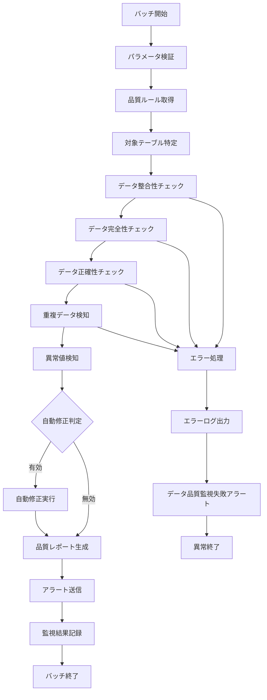

# バッチ定義書：データ品質監視バッチ (BATCH-603)

## 1. 基本情報

| 項目 | 内容 |
|------|------|
| **バッチID** | BATCH-603 |
| **バッチ名** | データ品質監視バッチ |
| **実行スケジュール** | 日次（02:30） |
| **優先度** | 高 |
| **ステータス** | 未着手 |
| **作成日** | 2025/05/31 |
| **最終更新日** | 2025/05/31 |

## 2. バッチ概要

### 2.1 概要・目的
システム内のデータ品質を監視し、データの整合性・完全性・正確性をチェック・レポートする。

### 2.2 関連テーブル
- TBL-078_データ品質監視設定
- TBL-079_データ品質監視結果
- TBL-080_データ品質ルール

### 2.3 関連API
- API-323_データ品質チェックAPI
- API-324_データ品質レポートAPI

## 3. 実行仕様

### 3.1 実行スケジュール
| 項目 | 設定値 | 備考 |
|------|--------|------|
| 実行頻度 | 30 2 * * * | cron形式（日次 02:30） |
| 実行時間 | 02:30 | 低負荷時間帯 |
| タイムアウト | 90分 | 最大実行時間 |
| リトライ回数 | 2回 | 失敗時の再実行 |

### 3.2 実行条件
| 条件 | 内容 | 備考 |
|------|------|------|
| 前提条件 | システム稼働中 | データ品質監視対象 |
| 実行可能時間 | 02:00-05:00 | 低負荷時間帯 |
| 排他制御 | 同一バッチの重複実行禁止 | ロックファイル使用 |

### 3.3 実行パラメータ
| パラメータ名 | データ型 | 必須 | デフォルト値 | 説明 |
|--------------|----------|------|--------------|------|
| check_scope | string | × | "all" | チェック対象範囲 |
| severity_threshold | string | × | "warning" | 重要度閾値 |
| enable_auto_fix | boolean | × | false | 自動修正有効化 |

## 4. 処理仕様

### 4.1 処理フロー

### 4.2 詳細処理
1. **初期化処理**
   - パラメータ検証
   - 品質監視設定の読み込み
   - 品質ルールの取得
   - 排他制御ロック取得

2. **データ整合性チェック**
   - 外部キー制約の検証
   - 参照整合性の確認
   - テーブル間データの整合性チェック
   - 業務ルールに基づく整合性検証

3. **データ完全性チェック**
   - 必須項目の欠損チェック
   - データ型・形式の検証
   - 値域・範囲の妥当性確認
   - 文字エンコーディングの検証

4. **データ正確性チェック**
   - 計算値の妥当性検証
   - 集計値の整合性確認
   - 履歴データの連続性チェック
   - 業務ロジックに基づく妥当性検証

5. **異常検知・自動修正**
   - 重複データの検知・統合
   - 異常値の検知・補正
   - データ品質スコアの算出
   - 自動修正可能項目の処理

## 5. データ仕様

### 5.1 入力データ
| データ名 | 形式 | 取得元 | 説明 |
|----------|------|--------|------|
| 業務データ | DB | 全業務テーブル | 品質チェック対象データ |
| 品質設定 | DB | TBL-078_データ品質監視設定 | 監視設定・閾値 |
| 品質ルール | DB | TBL-080_データ品質ルール | チェックルール定義 |

### 5.2 出力データ
| データ名 | 形式 | 出力先 | 説明 |
|----------|------|--------|------|
| 監視結果 | DB | TBL-079_データ品質監視結果 | 品質チェック結果 |
| 品質レポート | FILE | /reports/quality/ | 品質監視レポート |
| 修正ログ | LOG | /logs/quality/ | 自動修正実行ログ |
| 実行ログ | LOG | /logs/batch/ | 実行履歴ログ |

### 5.3 データ量見積もり
| 項目 | 件数 | 備考 |
|------|------|------|
| チェック対象テーブル数 | 100個 | 全業務テーブル |
| チェック対象レコード数 | 10,000,000件 | 日次データ |
| 処理時間 | 45分 | 平均実行時間 |

## 6. エラーハンドリング

### 6.1 エラー分類
| エラー種別 | 対応方法 | 通知要否 | 備考 |
|------------|----------|----------|------|
| データアクセスエラー | リトライ・継続 | ○ | DB接続問題 |
| 品質ルール実行エラー | エラー記録・継続 | ○ | ルール定義問題 |
| 自動修正エラー | エラー記録・継続 | ○ | 修正処理問題 |

### 6.2 リトライ仕様
| 条件 | リトライ回数 | 間隔 | 備考 |
|------|--------------|------|------|
| データアクセスエラー | 3回 | 60秒 | DB復旧待ち |
| 品質ルール実行エラー | 2回 | 30秒 | ルール再読み込み |
| 自動修正エラー | 3回 | 120秒 | データロック解除待ち |

### 6.3 異常終了時の処理
1. 処理中断
2. 部分修正のロールバック
3. エラーログ出力
4. データ品質監視失敗アラート送信
5. 排他制御ロック解除

## 7. 監視・運用

### 7.1 監視項目
| 監視項目 | 閾値 | アラート条件 | 対応方法 |
|----------|------|--------------|----------|
| 実行時間 | 90分 | 超過時 | 処理見直し・最適化 |
| 品質スコア | 80% | 下回り時 | データ品質改善 |
| 重大な品質問題検知数 | 10件 | 超過時 | 緊急対応 |

### 7.2 ログ出力
| ログ種別 | 出力レベル | 出力内容 | 保存期間 |
|----------|------------|----------|----------|
| 実行ログ | INFO | 処理開始・終了・品質スコア | 3ヶ月 |
| エラーログ | ERROR | エラー詳細・スタックトレース | 1年 |
| 品質ログ | WARN | 品質問題詳細・修正内容 | 6ヶ月 |

### 7.3 アラート通知
| 通知条件 | 通知先 | 通知方法 | 備考 |
|----------|--------|----------|------|
| 重大な品質問題検知 | データ管理者・開発チーム | Slack・メール・電話 | 即座に通知 |
| 品質スコア低下 | データ管理者 | Slack・メール | 30分以内 |
| 自動修正大量実行 | 運用チーム | Slack・メール | 1時間以内 |

## 8. 非機能要件

### 8.1 パフォーマンス
- 処理時間：90分以内
- メモリ使用量：3GB以内
- CPU使用率：35%以内

### 8.2 可用性
- 成功率：98%以上
- 部分的な品質チェック失敗の許容
- 監視継続性の確保

### 8.3 セキュリティ
- データアクセス権限の厳格管理
- 品質レポートの機密性確保
- 監査ログの記録

## 9. テスト仕様

### 9.1 単体テスト
| テストケース | 入力条件 | 期待結果 |
|--------------|----------|----------|
| 正常品質チェック | 正常なデータ | 品質スコア算出・レポート生成 |
| 整合性エラー検知 | 不整合データ存在 | エラー検知・アラート送信 |
| 自動修正実行 | 修正可能な品質問題 | 自動修正・ログ記録 |

### 9.2 異常系テスト
| テストケース | 入力条件 | 期待結果 |
|--------------|----------|----------|
| 大量品質問題検知 | 大量の品質問題 | エラー記録・緊急アラート |
| 品質ルール不正 | 不正なルール定義 | エラー記録・継続処理 |
| DB接続エラー | DB停止状態 | エラー記録・リトライ実行 |

## 10. 実装メモ

### 10.1 技術仕様
- 言語：Python
- フレームワーク：pandas・SQLAlchemy
- DB接続：psycopg2・pymysql
- データ品質：Great Expectations
- ログ出力：logging

### 10.2 注意事項
- 大量データ処理時のメモリ管理
- 品質ルールの効率的な実行
- 自動修正時のデータ整合性確保

### 10.3 デプロイ・実行環境
- 実行サーバー：データ品質サーバー
- 実行ユーザー：quality_user
- 実行ディレクトリ：/opt/batch/data-quality/
- 設定ファイル：/etc/batch/data-quality.yaml

---

**改訂履歴**

| バージョン | 日付 | 変更者 | 変更内容 |
|------------|------|--------|----------|
| 1.0 | 2025/05/31 | システムアーキテクト | 初版作成 |
