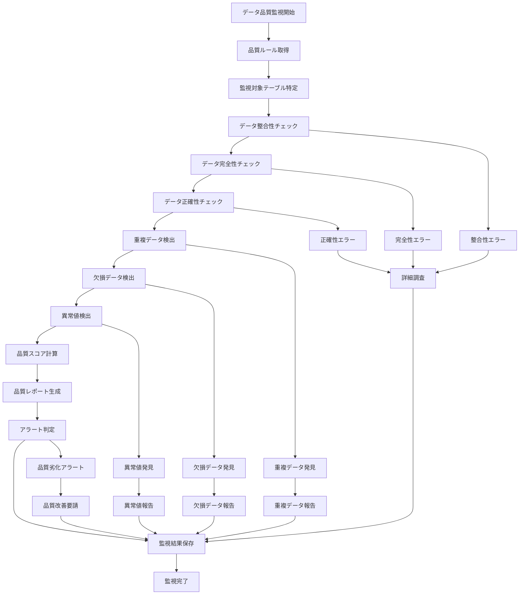

# バッチ定義書：データ品質監視バッチ (BATCH-603)

## 1. 基本情報

| 項目 | 内容 |
|------|------|
| **バッチID** | BATCH-603 |
| **バッチ名** | データ品質監視バッチ |
| **実行スケジュール** | 日次 |
| **優先度** | 中 |
| **ステータス** | 未着手 |
| **作成日** | 2025/05/31 |
| **最終更新日** | 2025/05/31 |

## 2. バッチ概要

### 2.1 概要・目的
データベース内のデータ品質を監視し、データの整合性、完全性、正確性を確認してレポートを生成する。

### 2.2 関連テーブル
- TBL-061_データ品質監視履歴
- TBL-062_データ品質ルール
- TBL-063_データ品質メトリクス
- TBL-064_データ品質アラート

### 2.3 関連API
- API-261_データ品質状態取得API
- API-262_データ品質レポート取得API

## 3. 実行仕様

### 3.1 実行スケジュール
| 項目 | 設定値 | 備考 |
|------|--------|------|
| 実行頻度 | 0 4 * * * | 毎日04:00 |
| 実行時間 | 04:00 | 業務時間外 |
| タイムアウト | 60分 | 最大実行時間 |
| リトライ回数 | 2回 | 品質確保重視 |

### 3.2 実行条件
| 条件 | 内容 | 備考 |
|------|------|------|
| 前提条件 | データベース稼働中 | 基本条件 |
| 実行可能時間 | 02:00-06:00 | 業務時間外 |
| 排他制御 | データ更新処理との排他 | 整合性確保 |

### 3.3 実行パラメータ
| パラメータ名 | データ型 | 必須 | デフォルト値 | 説明 |
|--------------|----------|------|--------------|------|
| check_scope | string | × | "all" | 監視範囲（all/critical/custom） |
| target_tables | array | × | 全テーブル | 監視対象テーブル |
| quality_rules | array | × | 全ルール | 適用品質ルール |

## 4. 処理仕様

### 4.1 処理フロー

### 4.2 詳細処理
1. **データ整合性チェック**
   - 外部キー制約の確認
   - 参照整合性の検証
   - データ型の整合性確認
   - 制約違反の検出

2. **データ完全性チェック**
   - 必須項目の欠損確認
   - データの網羅性検証
   - レコード数の妥当性確認
   - データ範囲の完全性確認

3. **データ正確性チェック**
   - データ形式の妥当性確認
   - 値の範囲チェック
   - パターンマッチング検証
   - ビジネスルールの適合性確認

4. **重複・欠損データ検出**
   - 重複レコードの特定
   - 一意制約違反の検出
   - 欠損値の分析
   - データ品質パターンの分析

5. **品質レポート生成**
   - 品質スコアの算出
   - 品質トレンドの分析
   - 改善提案の生成
   - 詳細レポートの作成

## 5. データ仕様

### 5.1 入力データ
| データ名 | 形式 | 取得元 | 説明 |
|----------|------|--------|------|
| 品質ルール | DB | TBL-062_データ品質ルール | 品質チェックルール |
| 監視対象データ | DB | 各業務テーブル | 品質監視対象データ |
| 前回監視結果 | DB | TBL-061_データ品質監視履歴 | 比較用前回結果 |

### 5.2 出力データ
| データ名 | 形式 | 出力先 | 説明 |
|----------|------|--------|------|
| 監視結果 | DB | TBL-061_データ品質監視履歴 | 品質監視結果 |
| 品質メトリクス | DB | TBL-063_データ品質メトリクス | 品質指標データ |
| 品質レポート | PDF | /reports/data-quality/ | 品質監視レポート |
| アラート情報 | DB | TBL-064_データ品質アラート | 品質劣化アラート |

### 5.3 データ量見積もり
| 項目 | 件数 | 備考 |
|------|------|------|
| 監視対象テーブル数 | 50件 | 主要業務テーブル |
| 品質ルール数 | 200件 | 各種品質ルール |
| 処理時間 | 45分 | 平均実行時間 |

## 6. エラーハンドリング

### 6.1 エラー分類
| エラー種別 | 対応方法 | 通知要否 | 備考 |
|------------|----------|----------|------|
| データアクセスエラー | リトライ・部分実行 | ○ | 可能な範囲で継続 |
| 品質ルールエラー | ルール無効化・継続 | ○ | 他ルールで継続 |
| 重大品質劣化 | 緊急アラート・調査要請 | ○ | 最高優先度 |

### 6.2 リトライ仕様
| 条件 | リトライ回数 | 間隔 | 備考 |
|------|--------------|------|------|
| データアクセス失敗 | 2回 | 60秒 | 負荷考慮 |
| 一時的エラー | 1回 | 120秒 | 安定性重視 |
| タイムアウト | 1回 | 300秒 | リソース確保後 |

### 6.3 異常終了時の処理
1. 部分監視結果の保存
2. エラー詳細の記録
3. 次回監視への影響評価
4. 手動監視要請の送信

## 7. 監視・運用

### 7.1 監視項目
| 監視項目 | 閾値 | アラート条件 | 対応方法 |
|----------|------|--------------|----------|
| データ品質スコア | 80% | 低下時 | データ品質改善・調査 |
| 重複データ率 | 5% | 超過時 | 重複データ削除・調査 |
| 欠損データ率 | 10% | 超過時 | データ補完・調査 |

### 7.2 ログ出力
| ログ種別 | 出力レベル | 出力内容 | 保存期間 |
|----------|------------|----------|----------|
| 品質監視ログ | INFO | 監視結果・品質スコア | 6ヶ月 |
| エラーログ | ERROR | エラー詳細・対応記録 | 1年 |
| 品質劣化ログ | WARN | 品質劣化・改善提案 | 1年 |

### 7.3 アラート通知
| 通知条件 | 通知先 | 通知方法 | 備考 |
|----------|--------|----------|------|
| 重大品質劣化 | データ管理者・開発チーム | Slack・メール | 即座に通知 |
| 品質スコア低下 | データ管理者 | メール | 日次レポート |
| 異常値検出 | 業務担当者 | メール | 業務時間内 |

## 8. 非機能要件

### 8.1 パフォーマンス
- 処理時間：60分以内
- メモリ使用量：2GB以内
- CPU使用率：50%以内

### 8.2 可用性
- 成功率：95%以上
- 日次実行の確実性
- 部分実行による継続性

### 8.3 セキュリティ
- データアクセス権限の制御
- 品質レポートの適切な管理
- 個人情報の保護

## 9. テスト仕様

### 9.1 単体テスト
| テストケース | 入力条件 | 期待結果 |
|--------------|----------|----------|
| 正常品質監視 | 高品質データ | 監視完了・高品質スコア |
| 品質劣化検知 | 低品質データ | アラート送信・改善提案 |
| 重複データ検出 | 重複レコード存在 | 重複検出・報告 |

### 9.2 異常系テスト
| テストケース | 入力条件 | 期待結果 |
|--------------|----------|----------|
| データアクセス失敗 | DB接続エラー | リトライ・部分実行 |
| 品質ルールエラー | 無効ルール | ルール無効化・継続 |
| 処理タイムアウト | 大量データ | 安全停止・次回継続 |

## 10. 実装メモ

### 10.1 技術仕様
- 言語：Python
- フレームワーク：Pandas・NumPy
- データ分析：scikit-learn
- レポート生成：ReportLab
- ログ出力：logging

### 10.2 注意事項
- データ品質ルールの適切な設定
- 業務への影響を最小限に抑制
- 品質改善の継続的な実施

### 10.3 デプロイ・実行環境
- 実行サーバー：データ分析専用サーバー
- 実行ユーザー：data_quality
- 実行ディレクトリ：/opt/data-quality/
- 設定ファイル：/etc/data-quality/config.yaml

---

**改訂履歴**

| バージョン | 日付 | 変更者 | 変更内容 |
|------------|------|--------|----------|
| 1.0 | 2025/05/31 | システムアーキテクト | 初版作成 |
