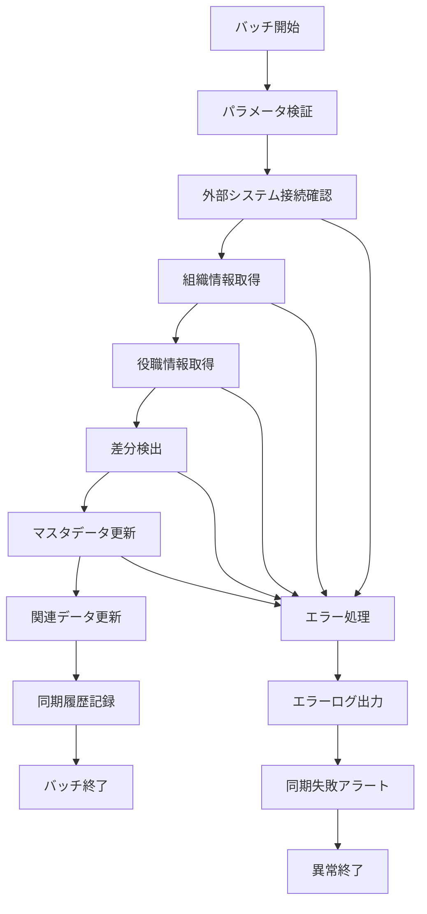

# バッチ定義書：組織・役職マスタ同期バッチ (BATCH-701)

## 1. 基本情報

| 項目 | 内容 |
|------|------|
| **バッチID** | BATCH-701 |
| **バッチ名** | 組織・役職マスタ同期バッチ |
| **実行スケジュール** | 日次（05:00） |
| **優先度** | 高 |
| **ステータス** | 未着手 |
| **作成日** | 2025/05/31 |
| **最終更新日** | 2025/05/31 |

## 2. バッチ概要

### 2.1 概要・目的
外部人事システムから組織・役職情報を取得し、システム内のマスタデータと同期する。

### 2.2 関連テーブル
- TBL-081_組織マスタ
- TBL-082_役職マスタ
- TBL-083_同期履歴

### 2.3 関連API
- API-325_組織情報取得API
- API-326_役職情報取得API

## 3. 実行仕様

### 3.1 実行スケジュール
| 項目 | 設定値 | 備考 |
|------|--------|------|
| 実行頻度 | 0 5 * * * | cron形式（日次 05:00） |
| 実行時間 | 05:00 | 業務開始前 |
| タイムアウト | 30分 | 最大実行時間 |
| リトライ回数 | 3回 | 失敗時の再実行 |

### 3.2 実行条件
| 条件 | 内容 | 備考 |
|------|------|------|
| 前提条件 | 外部人事システム稼働中 | API接続可能 |
| 実行可能時間 | 05:00-06:00 | 業務開始前 |
| 排他制御 | 同一バッチの重複実行禁止 | ロックファイル使用 |

### 3.3 実行パラメータ
| パラメータ名 | データ型 | 必須 | デフォルト値 | 説明 |
|--------------|----------|------|--------------|------|
| sync_type | string | × | "incremental" | 同期タイプ（full/incremental） |
| target_date | date | × | 前日 | 同期対象日 |
| dry_run | boolean | × | false | テスト実行フラグ |

## 4. 処理仕様

### 4.1 処理フロー

### 4.2 詳細処理
1. **初期化処理**
   - パラメータ検証
   - 外部システム接続確認
   - 同期開始ログ出力
   - 排他制御ロック取得

2. **データ取得処理**
   - 外部人事システムから組織情報取得
   - 外部人事システムから役職情報取得
   - データ形式の正規化
   - 取得データの妥当性チェック

3. **差分検出処理**
   - 既存マスタとの比較
   - 新規・更新・削除対象の特定
   - 変更内容の詳細記録
   - 影響範囲の分析

4. **マスタ更新処理**
   - 組織マスタの更新
   - 役職マスタの更新
   - 関連テーブルの更新
   - データ整合性チェック

5. **後処理**
   - 同期結果サマリー作成
   - 同期履歴の記録
   - 関係者への通知
   - 排他制御ロック解除

## 5. データ仕様

### 5.1 入力データ
| データ名 | 形式 | 取得元 | 説明 |
|----------|------|--------|------|
| 組織情報 | JSON | 外部人事システムAPI | 組織階層・部署情報 |
| 役職情報 | JSON | 外部人事システムAPI | 役職・職位情報 |
| 同期設定 | DB | TBL-083_同期履歴 | 前回同期情報 |

### 5.2 出力データ
| データ名 | 形式 | 出力先 | 説明 |
|----------|------|--------|------|
| 組織マスタ | DB | TBL-081_組織マスタ | 更新された組織情報 |
| 役職マスタ | DB | TBL-082_役職マスタ | 更新された役職情報 |
| 同期履歴 | DB | TBL-083_同期履歴 | 同期実行履歴 |
| 実行ログ | LOG | /logs/batch/ | 実行履歴ログ |

### 5.3 データ量見積もり
| 項目 | 件数 | 備考 |
|------|------|------|
| 組織データ数 | 500件 | 全社組織 |
| 役職データ数 | 100件 | 全役職 |
| 処理時間 | 15分 | 平均実行時間 |

## 6. エラーハンドリング

### 6.1 エラー分類
| エラー種別 | 対応方法 | 通知要否 | 備考 |
|------------|----------|----------|------|
| 外部システム接続エラー | リトライ・継続 | ○ | ネットワーク・認証問題 |
| データ形式エラー | エラー記録・継続 | ○ | API仕様変更等 |
| マスタ更新エラー | ロールバック・停止 | ○ | DB制約違反等 |

### 6.2 リトライ仕様
| 条件 | リトライ回数 | 間隔 | 備考 |
|------|--------------|------|------|
| 外部API接続エラー | 5回 | 60秒 | 指数バックオフ |
| データ取得エラー | 3回 | 30秒 | 固定間隔 |
| DB更新エラー | 2回 | 10秒 | 固定間隔 |

### 6.3 異常終了時の処理
1. 処理中断
2. 部分更新のロールバック
3. エラーログ出力
4. 同期失敗アラート送信
5. 排他制御ロック解除

## 7. 監視・運用

### 7.1 監視項目
| 監視項目 | 閾値 | アラート条件 | 対応方法 |
|----------|------|--------------|----------|
| 実行時間 | 30分 | 超過時 | 処理見直し・最適化 |
| 同期失敗率 | 5% | 超過時 | 外部システム調査 |
| データ差分数 | 期待値±50% | 乖離時 | データ確認 |

### 7.2 ログ出力
| ログ種別 | 出力レベル | 出力内容 | 保存期間 |
|----------|------------|----------|----------|
| 実行ログ | INFO | 処理開始・終了・同期結果 | 6ヶ月 |
| エラーログ | ERROR | エラー詳細・スタックトレース | 1年 |
| 同期ログ | INFO | 同期詳細・差分情報 | 3ヶ月 |

### 7.3 アラート通知
| 通知条件 | 通知先 | 通知方法 | 備考 |
|----------|--------|----------|------|
| 同期失敗 | 人事システム管理者・運用チーム | メール・Slack | 即座に通知 |
| 大量データ変更 | 人事担当者 | メール | 1時間以内 |
| 外部システム接続失敗 | 運用チーム | Slack | 30分以内 |

## 8. 非機能要件

### 8.1 パフォーマンス
- 処理時間：30分以内
- メモリ使用量：1GB以内
- CPU使用率：50%以内

### 8.2 可用性
- 成功率：99%以上
- 外部システム障害時の自動リトライ
- 手動同期機能の提供

### 8.3 セキュリティ
- 外部API認証の適切な管理
- 個人情報の適切な取り扱い
- アクセスログの記録

## 9. テスト仕様

### 9.1 単体テスト
| テストケース | 入力条件 | 期待結果 |
|--------------|----------|----------|
| 正常同期 | 正常な組織・役職データ | 同期完了・マスタ更新 |
| 差分なし | 変更なしデータ | 同期完了・更新なし |
| 新規組織追加 | 新規組織データ | 新規組織マスタ作成 |

### 9.2 異常系テスト
| テストケース | 入力条件 | 期待結果 |
|--------------|----------|----------|
| 外部システム停止 | API接続不可 | リトライ後異常終了 |
| 不正データ形式 | 不正なJSON | エラー記録・継続処理 |
| DB制約違反 | 重複キー | ロールバック・異常終了 |

## 10. 実装メモ

### 10.1 技術仕様
- 言語：Node.js
- フレームワーク：Express.js
- DB接続：Prisma
- 外部API：Axios
- ログ出力：Winston

### 10.2 注意事項
- 外部システムのAPI仕様変更への対応
- 大量データ処理時のメモリ管理
- 個人情報保護法への準拠

### 10.3 デプロイ・実行環境
- 実行サーバー：マスタ同期サーバー
- 実行ユーザー：sync_user
- 実行ディレクトリ：/opt/batch/master-sync/
- 設定ファイル：/etc/batch/master-sync.json

---

**改訂履歴**

| バージョン | 日付 | 変更者 | 変更内容 |
|------------|------|--------|----------|
| 1.0 | 2025/05/31 | システムアーキテクト | 初版作成 |
