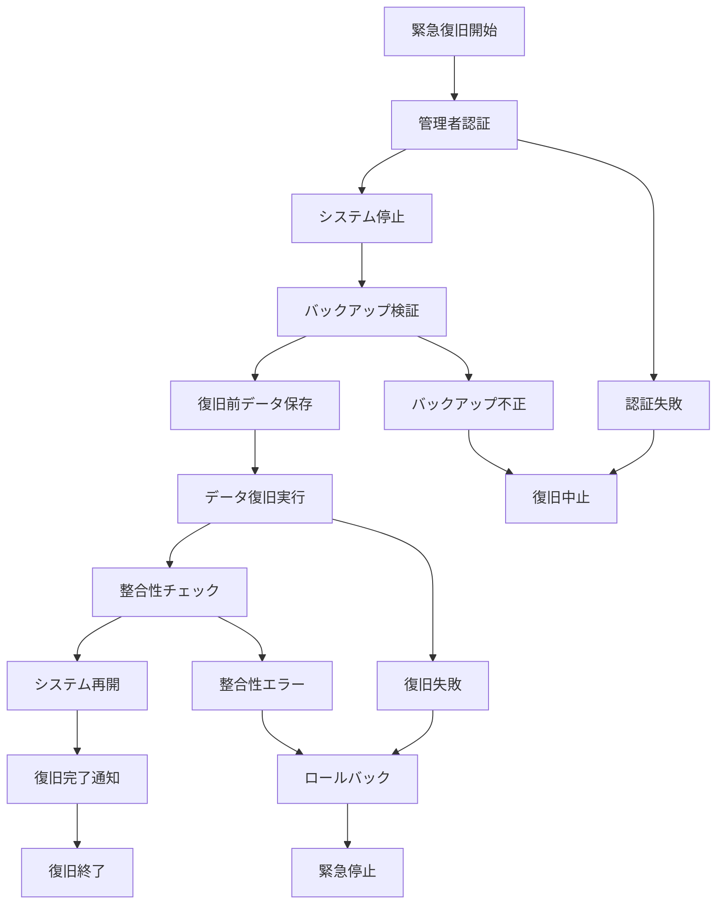

# バッチ定義書：緊急データ復旧バッチ (BATCH-901)

## 1. 基本情報

| 項目 | 内容 |
|------|------|
| **バッチID** | BATCH-901 |
| **バッチ名** | 緊急データ復旧バッチ |
| **実行スケジュール** | 手動実行 |
| **優先度** | 最高 |
| **ステータス** | 未着手 |
| **作成日** | 2025/05/31 |
| **最終更新日** | 2025/05/31 |

## 2. バッチ概要

### 2.1 概要・目的
システム障害やデータ破損時に、バックアップからデータを緊急復旧する。

### 2.2 関連テーブル
- 全テーブル（復旧対象による）
- TBL-084_復旧履歴
- TBL-085_バックアップ管理

### 2.3 関連API
- API-327_バックアップ取得API
- API-328_復旧状況確認API

## 3. 実行仕様

### 3.1 実行スケジュール
| 項目 | 設定値 | 備考 |
|------|--------|------|
| 実行頻度 | 手動実行 | 緊急時のみ |
| 実行時間 | 任意 | 24時間対応 |
| タイムアウト | 240分 | 最大実行時間 |
| リトライ回数 | 1回 | 慎重な実行 |

### 3.2 実行条件
| 条件 | 内容 | 備考 |
|------|------|------|
| 前提条件 | システム管理者承認 | 緊急時対応 |
| 実行可能時間 | 24時間 | 緊急対応 |
| 排他制御 | 全バッチ停止 | 復旧作業専用 |

### 3.3 実行パラメータ
| パラメータ名 | データ型 | 必須 | デフォルト値 | 説明 |
|--------------|----------|------|--------------|------|
| backup_date | date | ○ | - | 復旧対象バックアップ日 |
| target_tables | array | ○ | - | 復旧対象テーブル |
| recovery_type | string | ○ | - | 復旧タイプ（full/partial） |

## 4. 処理仕様

### 4.1 処理フロー

### 4.2 詳細処理
1. **緊急対応準備**
   - 管理者認証・承認確認
   - システム全体の停止
   - 復旧作業開始通知
   - 排他制御ロック取得

2. **バックアップ検証**
   - 指定バックアップの存在確認
   - バックアップファイルの整合性チェック
   - 復旧可能性の事前評価
   - 復旧計画の最終確認

3. **復旧前準備**
   - 現在データの緊急バックアップ
   - 復旧対象テーブルの特定
   - 依存関係の確認
   - 復旧順序の決定

4. **データ復旧実行**
   - データベース復旧処理
   - ファイルシステム復旧処理
   - 設定ファイル復旧処理
   - 段階的復旧の実行

5. **復旧後検証**
   - データ整合性の全面チェック
   - システム機能の動作確認
   - パフォーマンステスト
   - 復旧完了の最終確認

## 5. データ仕様

### 5.1 入力データ
| データ名 | 形式 | 取得元 | 説明 |
|----------|------|--------|------|
| バックアップファイル | DUMP/FILE | バックアップストレージ | 復旧元データ |
| 復旧パラメータ | JSON | 管理者入力 | 復旧設定情報 |
| システム設定 | CONFIG | 設定ファイル | システム構成情報 |

### 5.2 出力データ
| データ名 | 形式 | 出力先 | 説明 |
|----------|------|--------|------|
| 復旧データ | DB | 全データベース | 復旧されたデータ |
| 復旧履歴 | DB | TBL-084_復旧履歴 | 復旧作業記録 |
| 復旧レポート | PDF | /reports/recovery/ | 復旧作業報告書 |
| 実行ログ | LOG | /logs/emergency/ | 緊急作業ログ |

### 5.3 データ量見積もり
| 項目 | 件数 | 備考 |
|------|------|------|
| 復旧対象データ量 | 全データ | 最大ケース |
| 処理時間 | 120分 | 平均復旧時間 |
| 最大処理時間 | 240分 | 大規模復旧時 |

## 6. エラーハンドリング

### 6.1 エラー分類
| エラー種別 | 対応方法 | 通知要否 | 備考 |
|------------|----------|----------|------|
| 認証エラー | 復旧中止 | ○ | セキュリティ重視 |
| バックアップ破損 | 代替バックアップ検索 | ○ | 複数バックアップ確認 |
| 復旧処理エラー | ロールバック・緊急停止 | ○ | 被害拡大防止 |

### 6.2 リトライ仕様
| 条件 | リトライ回数 | 間隔 | 備考 |
|------|--------------|------|------|
| ネットワークエラー | 3回 | 30秒 | 接続復旧待ち |
| ファイルI/Oエラー | 2回 | 60秒 | ストレージ復旧待ち |
| DB復旧エラー | 1回 | 300秒 | 慎重な再実行 |

### 6.3 異常終了時の処理
1. 復旧処理の即座停止
2. 部分復旧のロールバック
3. システムの緊急停止状態維持
4. 緊急事態アラート送信
5. 手動介入要請

## 7. 監視・運用

### 7.1 監視項目
| 監視項目 | 閾値 | アラート条件 | 対応方法 |
|----------|------|--------------|----------|
| 復旧進捗 | 計画通り | 遅延時 | 追加リソース投入 |
| データ整合性 | 100% | 不整合検出時 | 復旧中止・調査 |
| システム負荷 | 80% | 超過時 | 処理調整 |

### 7.2 ログ出力
| ログ種別 | 出力レベル | 出力内容 | 保存期間 |
|----------|------------|----------|----------|
| 復旧ログ | INFO | 復旧進捗・結果詳細 | 永久保存 |
| エラーログ | ERROR | エラー詳細・対応記録 | 永久保存 |
| 監査ログ | AUDIT | 操作履歴・承認記録 | 永久保存 |

### 7.3 アラート通知
| 通知条件 | 通知先 | 通知方法 | 備考 |
|----------|--------|----------|------|
| 復旧開始 | 全関係者 | メール・電話・Slack | 即座に通知 |
| 復旧完了 | 全関係者 | メール・電話・Slack | 即座に通知 |
| 復旧失敗 | 緊急対応チーム | 電話・Slack | 即座に通知 |

## 8. 非機能要件

### 8.1 パフォーマンス
- 処理時間：240分以内
- メモリ使用量：8GB以内
- CPU使用率：90%以内（緊急時）

### 8.2 可用性
- 成功率：95%以上
- 24時間対応体制
- 複数バックアップからの復旧

### 8.3 セキュリティ
- 多重認証による実行制御
- 全操作の監査ログ記録
- 機密データの適切な取り扱い

## 9. テスト仕様

### 9.1 単体テスト
| テストケース | 入力条件 | 期待結果 |
|--------------|----------|----------|
| 正常復旧 | 正常なバックアップ | 復旧完了・システム正常稼働 |
| 部分復旧 | 特定テーブル指定 | 指定テーブルのみ復旧 |
| 整合性チェック | 復旧後データ | 整合性確認・問題なし |

### 9.2 異常系テスト
| テストケース | 入力条件 | 期待結果 |
|--------------|----------|----------|
| 認証失敗 | 不正な認証情報 | 復旧中止・アラート送信 |
| バックアップ破損 | 破損バックアップ | 代替バックアップ使用 |
| 復旧処理失敗 | DB接続エラー | ロールバック・緊急停止 |

## 10. 実装メモ

### 10.1 技術仕様
- 言語：Python
- フレームワーク：Django
- DB復旧：pg_restore・mysqldump
- ファイル復旧：rsync・tar
- ログ出力：logging

### 10.2 注意事項
- 復旧作業の慎重な実行
- 複数バックアップの事前準備
- 緊急時対応手順の定期訓練

### 10.3 デプロイ・実行環境
- 実行サーバー：緊急対応サーバー
- 実行ユーザー：emergency_admin
- 実行ディレクトリ：/opt/emergency/recovery/
- 設定ファイル：/etc/emergency/recovery.conf

---

**改訂履歴**

| バージョン | 日付 | 変更者 | 変更内容 |
|------------|------|--------|----------|
| 1.0 | 2025/05/31 | システムアーキテクト | 初版作成 |
