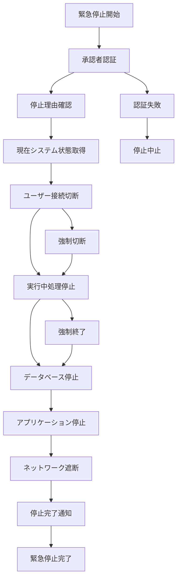

# バッチ定義書：システム緊急停止バッチ (BATCH-902)

## 1. 基本情報

| 項目 | 内容 |
|------|------|
| **バッチID** | BATCH-902 |
| **バッチ名** | システム緊急停止バッチ |
| **実行スケジュール** | 手動実行 |
| **優先度** | 最高 |
| **ステータス** | 未着手 |
| **作成日** | 2025/05/31 |
| **最終更新日** | 2025/05/31 |

## 2. バッチ概要

### 2.1 概要・目的
セキュリティインシデントや重大障害発生時に、システム全体を緊急停止する。

### 2.2 関連テーブル
- TBL-086_緊急停止履歴
- TBL-087_システム状態管理
- TBL-088_停止理由管理

### 2.3 関連API
- API-329_システム状態取得API
- API-330_緊急停止実行API

## 3. 実行仕様

### 3.1 実行スケジュール
| 項目 | 設定値 | 備考 |
|------|--------|------|
| 実行頻度 | 手動実行 | 緊急時のみ |
| 実行時間 | 任意 | 24時間対応 |
| タイムアウト | 10分 | 迅速な停止 |
| リトライ回数 | 0回 | 一回限りの実行 |

### 3.2 実行条件
| 条件 | 内容 | 備考 |
|------|------|------|
| 前提条件 | 緊急事態発生 | セキュリティ・障害対応 |
| 実行可能時間 | 24時間 | 緊急対応 |
| 排他制御 | 最優先実行 | 他処理を強制停止 |

### 3.3 実行パラメータ
| パラメータ名 | データ型 | 必須 | デフォルト値 | 説明 |
|--------------|----------|------|--------------|------|
| stop_reason | string | ○ | - | 停止理由（security/failure/maintenance） |
| stop_level | string | ○ | - | 停止レベル（partial/full） |
| authorized_by | string | ○ | - | 承認者ID |

## 4. 処理仕様

### 4.1 処理フロー

### 4.2 詳細処理
1. **緊急停止準備**
   - 承認者認証・権限確認
   - 停止理由の記録
   - 緊急停止開始通知
   - システム状態の保存

2. **ユーザー切断処理**
   - アクティブセッションの特定
   - ユーザーへの緊急通知送信
   - セッションの強制切断
   - 新規接続の拒否設定

3. **処理停止**
   - 実行中バッチの強制停止
   - キューイング処理の停止
   - バックグラウンド処理の停止
   - 外部連携の停止

4. **システム停止**
   - アプリケーションサーバー停止
   - データベースサーバー停止
   - Webサーバー停止
   - 関連サービスの停止

5. **最終処理**
   - 停止状態の記録
   - 緊急停止完了通知
   - 復旧手順の準備
   - 監査ログの保存

## 5. データ仕様

### 5.1 入力データ
| データ名 | 形式 | 取得元 | 説明 |
|----------|------|--------|------|
| 停止パラメータ | JSON | 管理者入力 | 停止設定情報 |
| システム状態 | DB | TBL-087_システム状態管理 | 現在のシステム状態 |
| アクティブセッション | MEMORY | セッション管理 | 接続中ユーザー情報 |

### 5.2 出力データ
| データ名 | 形式 | 出力先 | 説明 |
|----------|------|--------|------|
| 停止履歴 | DB | TBL-086_緊急停止履歴 | 停止実行記録 |
| システム状態 | DB | TBL-087_システム状態管理 | 停止後状態 |
| 停止レポート | PDF | /reports/emergency/ | 停止作業報告書 |
| 監査ログ | LOG | /logs/emergency/ | 緊急停止ログ |

### 5.3 データ量見積もり
| 項目 | 件数 | 備考 |
|------|------|------|
| 切断対象セッション数 | 1,000件 | 最大同時接続数 |
| 停止対象プロセス数 | 100件 | システム全体 |
| 処理時間 | 5分 | 平均停止時間 |

## 6. エラーハンドリング

### 6.1 エラー分類
| エラー種別 | 対応方法 | 通知要否 | 備考 |
|------------|----------|----------|------|
| 認証エラー | 停止中止 | ○ | セキュリティ重視 |
| プロセス停止エラー | 強制終了 | ○ | 確実な停止 |
| 通知送信エラー | 継続処理 | △ | 停止を優先 |

### 6.2 リトライ仕様
| 条件 | リトライ回数 | 間隔 | 備考 |
|------|--------------|------|------|
| プロセス停止失敗 | 2回 | 10秒 | 強制終了 |
| DB接続エラー | 1回 | 5秒 | 記録優先 |
| 通知送信失敗 | 0回 | - | 停止を優先 |

### 6.3 異常終了時の処理
1. 部分停止状態の記録
2. 手動介入要請
3. 緊急事態エスカレーション
4. 物理的停止の検討

## 7. 監視・運用

### 7.1 監視項目
| 監視項目 | 閾値 | アラート条件 | 対応方法 |
|----------|------|--------------|----------|
| 停止進捗 | 計画通り | 遅延時 | 強制停止実行 |
| プロセス状態 | 全停止 | 残存時 | 手動停止 |
| ネットワーク状態 | 遮断完了 | 接続残存時 | 物理遮断 |

### 7.2 ログ出力
| ログ種別 | 出力レベル | 出力内容 | 保存期間 |
|----------|------------|----------|----------|
| 停止ログ | CRITICAL | 停止進捗・結果詳細 | 永久保存 |
| エラーログ | ERROR | エラー詳細・対応記録 | 永久保存 |
| 監査ログ | AUDIT | 操作履歴・承認記録 | 永久保存 |

### 7.3 アラート通知
| 通知条件 | 通知先 | 通知方法 | 備考 |
|----------|--------|----------|------|
| 停止開始 | 全関係者・全ユーザー | メール・電話・Slack・システム内通知 | 即座に通知 |
| 停止完了 | 緊急対応チーム | メール・電話・Slack | 即座に通知 |
| 停止失敗 | 緊急対応チーム | 電話・Slack | 即座に通知 |

## 8. 非機能要件

### 8.1 パフォーマンス
- 処理時間：10分以内
- メモリ使用量：最小限
- CPU使用率：最優先実行

### 8.2 可用性
- 成功率：100%（必須）
- 24時間対応体制
- 物理的停止手段の準備

### 8.3 セキュリティ
- 多重認証による実行制御
- 全操作の監査ログ記録
- 不正実行の防止

## 9. テスト仕様

### 9.1 単体テスト
| テストケース | 入力条件 | 期待結果 |
|--------------|----------|----------|
| 正常停止 | 正常な停止パラメータ | システム完全停止 |
| 部分停止 | 部分停止指定 | 指定範囲のみ停止 |
| 強制停止 | プロセス応答なし | 強制終了・停止完了 |

### 9.2 異常系テスト
| テストケース | 入力条件 | 期待結果 |
|--------------|----------|----------|
| 認証失敗 | 不正な認証情報 | 停止中止・アラート送信 |
| 権限不足 | 権限不足ユーザー | 停止拒否・監査ログ記録 |
| プロセス停止失敗 | 停止不可プロセス | 強制終了・完了報告 |

## 10. 実装メモ

### 10.1 技術仕様
- 言語：Python
- フレームワーク：Flask
- プロセス制御：psutil・systemctl
- ネットワーク制御：iptables・nginx
- ログ出力：logging

### 10.2 注意事項
- 緊急停止の慎重な判断
- 復旧手順の事前準備
- 定期的な停止訓練の実施

### 10.3 デプロイ・実行環境
- 実行サーバー：緊急対応サーバー
- 実行ユーザー：emergency_admin
- 実行ディレクトリ：/opt/emergency/shutdown/
- 設定ファイル：/etc/emergency/shutdown.conf

---

**改訂履歴**

| バージョン | 日付 | 変更者 | 変更内容 |
|------------|------|--------|----------|
| 1.0 | 2025/05/31 | システムアーキテクト | 初版作成 |
