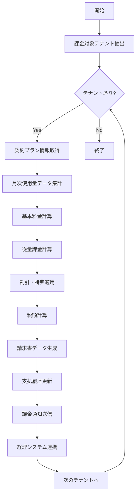

# バッチ定義書：テナント課金計算バッチ

| 項目                | 内容                                                                                |
|---------------------|------------------------------------------------------------------------------------|
| **バッチID**        | BATCH-902                                                                          |
| **バッチ名称**      | テナント課金計算バッチ                                                              |
| **機能カテゴリ**    | テナント管理                                                                        |
| **概要・目的**      | テナント別の月次課金額を計算し、請求書データを生成する                              |
| **バッチ種別**      | 定期バッチ                                                                          |
| **実行スケジュール**| 毎月1日深夜（2:00）                                                                 |
| **入出力対象**      | TenantBillingData, InvoiceData, PaymentHistory                                     |
| **優先度**          | 最高                                                                                |
| **備考**            | 課金処理のため高精度要求                                                            |

## 1. 処理概要

テナント課金計算バッチは、BATCH-901で集計されたテナント使用量データを基に、月次の課金額を計算し請求書データを生成するバッチ処理です。契約プラン、従量課金、割引適用などを考慮した正確な課金計算を行い、請求書発行の準備を行います。

## 2. 処理フロー



## 3. 入力データ

### 3.1 TenantBillingDataテーブル

| フィールド名      | データ型 | 説明                                           |
|-------------------|----------|------------------------------------------------|
| tenant_id         | String   | テナントID（外部キー）                         |
| billing_date      | Date     | 課金対象日                                     |
| plan_type         | String   | 契約プラン                                     |
| base_amount       | Decimal  | 基本料金                                       |
| usage_amount      | Decimal  | 従量課金額                                     |
| total_amount      | Decimal  | 合計金額                                       |

### 3.2 TenantContractテーブル

| フィールド名      | データ型 | 説明                                           |
|-------------------|----------|------------------------------------------------|
| tenant_id         | String   | テナントID（主キー）                           |
| plan_type         | String   | 契約プラン（"BASIC"/"STANDARD"/"PREMIUM"）     |
| contract_start    | Date     | 契約開始日                                     |
| contract_end      | Date     | 契約終了日                                     |
| billing_cycle     | String   | 請求サイクル（"MONTHLY"/"YEARLY"）             |
| discount_rate     | Decimal  | 割引率（%）                                    |
| special_pricing   | JSON     | 特別価格設定                                   |

### 3.3 PricingMasterテーブル

| フィールド名      | データ型 | 説明                                           |
|-------------------|----------|------------------------------------------------|
| plan_type         | String   | プラン種別                                     |
| base_price        | Decimal  | 基本料金（月額）                               |
| user_unit_price   | Decimal  | ユーザー単価                                   |
| storage_unit_price| Decimal  | ストレージ単価（GB）                           |
| api_unit_price    | Decimal  | API呼び出し単価（1000回）                      |
| effective_from    | Date     | 適用開始日                                     |

## 4. 出力データ

### 4.1 MonthlyInvoiceテーブル（追加）

| フィールド名      | データ型 | 説明                                           |
|-------------------|----------|------------------------------------------------|
| invoice_id        | String   | 請求書ID（主キー）                             |
| tenant_id         | String   | テナントID（外部キー）                         |
| billing_month     | String   | 請求対象月（YYYY-MM）                          |
| plan_type         | String   | 契約プラン                                     |
| base_amount       | Decimal  | 基本料金                                       |
| usage_amount      | Decimal  | 従量課金額                                     |
| discount_amount   | Decimal  | 割引額                                         |
| subtotal          | Decimal  | 小計                                           |
| tax_amount        | Decimal  | 税額                                           |
| total_amount      | Decimal  | 請求総額                                       |
| due_date          | Date     | 支払期限                                       |
| status            | String   | 請求状態（"PENDING"/"SENT"/"PAID"/"OVERDUE"）  |
| invoice_details   | JSON     | 請求明細                                       |
| created_at        | DateTime | 作成日時                                       |

### 4.2 PaymentHistoryテーブル（更新）

| フィールド名      | データ型 | 説明                                           |
|-------------------|----------|------------------------------------------------|
| payment_id        | String   | 支払ID（主キー）                               |
| invoice_id        | String   | 請求書ID（外部キー）                           |
| tenant_id         | String   | テナントID（外部キー）                         |
| payment_status    | String   | 支払状態（"PENDING"/"COMPLETED"/"FAILED"）     |
| payment_method    | String   | 支払方法                                       |
| scheduled_date    | Date     | 支払予定日                                     |
| updated_at        | DateTime | 更新日時                                       |

### 4.3 課金通知メール

各テナントに請求書発行通知を送信：

- 件名：「月次請求書発行のお知らせ」
- 本文：請求額、支払期限、請求明細、支払方法

## 5. エラー処理

| エラーケース                      | 対応方法                                                                 |
|-----------------------------------|--------------------------------------------------------------------------|
| 使用量データ不足                  | エラーログを記録し、前月データで補完。管理者に通知                       |
| 価格マスタ不整合                  | エラーログを記録し、処理を中断。管理者に緊急通知                         |
| 課金計算エラー                    | エラーログを記録し、該当テナントの請求書を保留状態に設定                 |
| 経理システム連携エラー            | 請求書生成は完了させ、連携エラーのみ管理者に報告                         |

## 6. 依存関係

- **BATCH-901**: テナント使用量集計バッチ（前提条件）
- TenantBillingDataテーブル
- TenantContractテーブル
- PricingMasterテーブル
- MonthlyInvoiceテーブル
- PaymentHistoryテーブル
- メール通知サービス
- 経理システムAPI

## 7. 実行パラメータ

| パラメータ名        | 必須 | デフォルト値 | 説明                                           |
|---------------------|------|--------------|------------------------------------------------|
| --billing-month     | No   | 前月         | 課金対象月（YYYY-MM形式）                      |
| --tenant-id         | No   | 全テナント   | 特定テナントのみ課金計算                       |
| --skip-notification | No   | false        | 課金通知メール送信をスキップ                   |
| --dry-run           | No   | false        | 計算結果の確認のみ行い、実際の保存は行わない   |
| --force-recalc      | No   | false        | 既存請求書を再計算（修正時用）                 |

## 8. 実行例

```bash
# 通常実行（前月分課金計算）
npm run batch:tenant-billing

# 特定月の課金計算
npm run batch:tenant-billing -- --billing-month=2025-05

# 特定テナントのみ課金計算
npm run batch:tenant-billing -- --tenant-id=tenant001

# ドライラン（計算結果確認のみ）
npm run batch:tenant-billing -- --dry-run

# 請求書再計算（修正時）
npm run batch:tenant-billing -- --billing-month=2025-05 --force-recalc

# TypeScript直接実行
npx tsx src/batch/tenant-billing.ts

# パラメータ付きTypeScript実行
npx tsx src/batch/tenant-billing.ts --billing-month=2025-05 --dry-run
```

## 9. 運用上の注意点

- 本バッチは課金処理の中核となるため、実行前に必ずBATCH-901の正常完了を確認してください。
- 価格改定時は、PricingMasterテーブルの更新と本バッチの動作確認を必ず行ってください。
- 請求書の修正が必要な場合は、--force-recalcオプションを使用して再計算を行ってください。
- 経理システムとの連携エラーが発生した場合、手動での連携処理が必要になる場合があります。
- 税率変更時は、税額計算ロジックの更新が必要です。

## 10. 課金計算ロジック

### 10.1 基本料金計算

```
基本料金 = プラン基本料金 × 契約期間比率
```

### 10.2 従量課金計算

```
従量課金 = (ユーザー数 × ユーザー単価) + 
          (ストレージ使用量GB × ストレージ単価) + 
          (API呼び出し回数/1000 × API単価)
```

### 10.3 割引適用

```
割引額 = (基本料金 + 従量課金) × 割引率
小計 = 基本料金 + 従量課金 - 割引額
```

### 10.4 税額計算

```
税額 = 小計 × 消費税率
請求総額 = 小計 + 税額
```

## 11. 関連バッチ

- **BATCH-901**: テナント使用量集計バッチ（前提条件）
- **BATCH-903**: テナント状態監視バッチ（課金状況を参照）
- **BATCH-951**: 定期通知送信バッチ（請求書通知を送信）

## 12. 改訂履歴

| 改訂日     | 改訂者 | 改訂内容                                         |
|------------|--------|--------------------------------------------------|
| 2025/05/30 | 初版   | 初版作成                                         |
