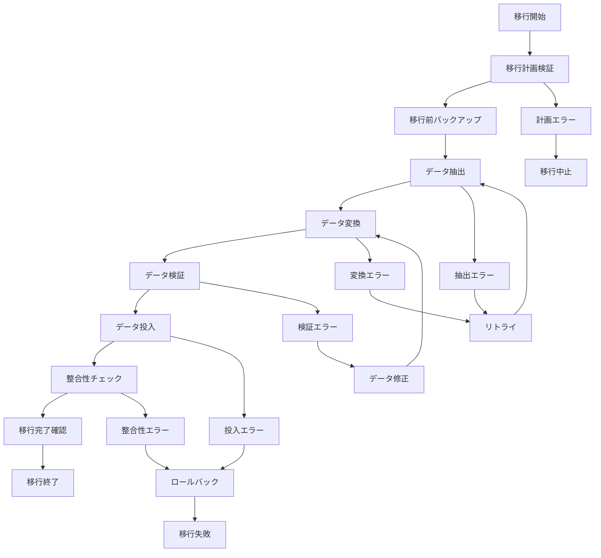

# バッチ定義書：大量データ移行バッチ (BATCH-903)

## 1. 基本情報

| 項目 | 内容 |
|------|------|
| **バッチID** | BATCH-903 |
| **バッチ名** | 大量データ移行バッチ |
| **実行スケジュール** | 手動実行 |
| **優先度** | 高 |
| **ステータス** | 未着手 |
| **作成日** | 2025/05/31 |
| **最終更新日** | 2025/05/31 |

## 2. バッチ概要

### 2.1 概要・目的
システム更新やデータ統合時に、大量データの移行・変換処理を実行する。

### 2.2 関連テーブル
- 全テーブル（移行対象による）
- TBL-089_移行履歴
- TBL-090_移行設定
- TBL-091_データマッピング

### 2.3 関連API
- API-331_移行データ取得API
- API-332_移行進捗確認API

## 3. 実行仕様

### 3.1 実行スケジュール
| 項目 | 設定値 | 備考 |
|------|--------|------|
| 実行頻度 | 手動実行 | 計画的実行 |
| 実行時間 | 任意 | メンテナンス時間推奨 |
| タイムアウト | 480分 | 最大実行時間 |
| リトライ回数 | 2回 | 慎重な再実行 |

### 3.2 実行条件
| 条件 | 内容 | 備考 |
|------|------|------|
| 前提条件 | 移行計画承認済み | 事前計画必須 |
| 実行可能時間 | メンテナンス時間 | 業務影響最小化 |
| 排他制御 | 関連バッチ停止 | 移行作業専用 |

### 3.3 実行パラメータ
| パラメータ名 | データ型 | 必須 | デフォルト値 | 説明 |
|--------------|----------|------|--------------|------|
| migration_plan_id | string | ○ | - | 移行計画ID |
| source_system | string | ○ | - | 移行元システム |
| target_tables | array | ○ | - | 移行対象テーブル |
| batch_size | integer | × | 1000 | バッチサイズ |

## 4. 処理仕様

### 4.1 処理フロー

### 4.2 詳細処理
1. **移行準備**
   - 移行計画の詳細確認
   - 移行前データのバックアップ
   - 移行環境の準備
   - 排他制御ロック取得

2. **データ抽出**
   - 移行元システムからのデータ抽出
   - 抽出データの妥当性チェック
   - 抽出ログの記録
   - 進捗状況の更新

3. **データ変換**
   - データ形式の変換
   - マッピングルールの適用
   - データクレンジング
   - 変換結果の検証

4. **データ投入**
   - バッチ単位でのデータ投入
   - 制約チェック・エラーハンドリング
   - 投入進捗の監視
   - 中間コミット処理

5. **移行後検証**
   - データ件数の照合
   - データ内容の整合性チェック
   - 業務ロジックの動作確認
   - 移行完了報告

## 5. データ仕様

### 5.1 入力データ
| データ名 | 形式 | 取得元 | 説明 |
|----------|------|--------|------|
| 移行元データ | DB/FILE | 移行元システム | 移行対象データ |
| 移行計画 | JSON | TBL-090_移行設定 | 移行設定情報 |
| マッピング定義 | JSON | TBL-091_データマッピング | データ変換ルール |

### 5.2 出力データ
| データ名 | 形式 | 出力先 | 説明 |
|----------|------|--------|------|
| 移行データ | DB | 移行先テーブル | 移行済みデータ |
| 移行履歴 | DB | TBL-089_移行履歴 | 移行実行記録 |
| 移行レポート | PDF | /reports/migration/ | 移行結果報告書 |
| エラーデータ | CSV | /data/migration/errors/ | 移行エラーデータ |

### 5.3 データ量見積もり
| 項目 | 件数 | 備考 |
|------|------|------|
| 移行対象データ量 | 10,000,000件 | 最大ケース |
| バッチサイズ | 1,000件 | 処理単位 |
| 処理時間 | 240分 | 平均移行時間 |

## 6. エラーハンドリング

### 6.1 エラー分類
| エラー種別 | 対応方法 | 通知要否 | 備考 |
|------------|----------|----------|------|
| データ抽出エラー | リトライ・継続 | ○ | 接続・権限問題 |
| データ変換エラー | エラー記録・継続 | ○ | マッピングルール見直し |
| データ投入エラー | ロールバック・停止 | ○ | 制約違反・容量不足 |

### 6.2 リトライ仕様
| 条件 | リトライ回数 | 間隔 | 備考 |
|------|--------------|------|------|
| 接続エラー | 3回 | 60秒 | 指数バックオフ |
| 一時的エラー | 2回 | 30秒 | 固定間隔 |
| 制約違反 | 1回 | 120秒 | データ確認後 |

### 6.3 異常終了時の処理
1. 移行処理の即座停止
2. 部分移行のロールバック
3. エラーデータの詳細記録
4. 移行失敗アラート送信
5. 手動復旧手順の提示

## 7. 監視・運用

### 7.1 監視項目
| 監視項目 | 閾値 | アラート条件 | 対応方法 |
|----------|------|--------------|----------|
| 移行進捗 | 計画通り | 遅延時 | リソース追加・並列化 |
| エラー率 | 1% | 超過時 | 移行停止・原因調査 |
| システム負荷 | 80% | 超過時 | 処理調整 |

### 7.2 ログ出力
| ログ種別 | 出力レベル | 出力内容 | 保存期間 |
|----------|------------|----------|----------|
| 移行ログ | INFO | 移行進捗・結果詳細 | 1年 |
| エラーログ | ERROR | エラー詳細・対応記録 | 1年 |
| パフォーマンスログ | DEBUG | 処理時間・リソース使用量 | 3ヶ月 |

### 7.3 アラート通知
| 通知条件 | 通知先 | 通知方法 | 備考 |
|----------|--------|----------|------|
| 移行開始 | プロジェクトチーム | メール・Slack | 開始通知 |
| 移行完了 | プロジェクトチーム | メール・Slack | 完了通知 |
| 移行エラー | 運用チーム・開発チーム | メール・Slack | 即座に通知 |

## 8. 非機能要件

### 8.1 パフォーマンス
- 処理時間：480分以内
- メモリ使用量：4GB以内
- CPU使用率：70%以内

### 8.2 可用性
- 成功率：98%以上
- 中断・再開機能
- ロールバック機能

### 8.3 セキュリティ
- データ暗号化による転送
- アクセス権限の適切な管理
- 移行ログの監査証跡

## 9. テスト仕様

### 9.1 単体テスト
| テストケース | 入力条件 | 期待結果 |
|--------------|----------|----------|
| 正常移行 | 正常なデータ・設定 | 移行完了・データ整合性確保 |
| 大量データ移行 | 最大データ量 | 正常完了・性能要件満足 |
| 部分移行 | 特定テーブル指定 | 指定テーブルのみ移行 |

### 9.2 異常系テスト
| テストケース | 入力条件 | 期待結果 |
|--------------|----------|----------|
| 接続エラー | 移行元システム停止 | リトライ後エラー報告 |
| 容量不足 | ディスク容量不足 | 移行停止・アラート送信 |
| 制約違反 | 重複キーデータ | エラー記録・継続処理 |

## 10. 実装メモ

### 10.1 技術仕様
- 言語：Python
- フレームワーク：Pandas・SQLAlchemy
- DB接続：Prisma・psycopg2
- 並列処理：multiprocessing
- ログ出力：logging

### 10.2 注意事項
- 大量データ処理時のメモリ管理
- 移行計画の事前十分な検証
- ロールバック手順の確実な準備

### 10.3 デプロイ・実行環境
- 実行サーバー：データ移行専用サーバー
- 実行ユーザー：migration_user
- 実行ディレクトリ：/opt/migration/
- 設定ファイル：/etc/migration/config.json

---

**改訂履歴**

| バージョン | 日付 | 変更者 | 変更内容 |
|------------|------|--------|----------|
| 1.0 | 2025/05/31 | システムアーキテクト | 初版作成 |
