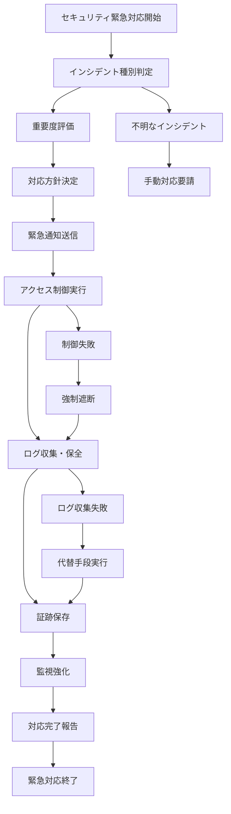

# バッチ定義書：セキュリティ緊急対応バッチ (BATCH-904)

## 1. 基本情報

| 項目 | 内容 |
|------|------|
| **バッチID** | BATCH-904 |
| **バッチ名** | セキュリティ緊急対応バッチ |
| **実行スケジュール** | 手動実行 |
| **優先度** | 最高 |
| **ステータス** | 未着手 |
| **作成日** | 2025/05/31 |
| **最終更新日** | 2025/05/31 |

## 2. バッチ概要

### 2.1 概要・目的
セキュリティインシデント発生時に、緊急対応処理を自動実行する。

### 2.2 関連テーブル
- TBL-092_セキュリティインシデント
- TBL-093_緊急対応履歴
- TBL-094_アクセス制御
- TBL-095_セキュリティログ

### 2.3 関連API
- API-333_セキュリティ状態取得API
- API-334_緊急対応実行API

## 3. 実行仕様

### 3.1 実行スケジュール
| 項目 | 設定値 | 備考 |
|------|--------|------|
| 実行頻度 | 手動実行 | インシデント発生時 |
| 実行時間 | 任意 | 24時間対応 |
| タイムアウト | 30分 | 迅速な対応 |
| リトライ回数 | 1回 | 慎重な実行 |

### 3.2 実行条件
| 条件 | 内容 | 備考 |
|------|------|------|
| 前提条件 | セキュリティインシデント発生 | 緊急事態対応 |
| 実行可能時間 | 24時間 | 緊急対応 |
| 排他制御 | 最優先実行 | セキュリティ最優先 |

### 3.3 実行パラメータ
| パラメータ名 | データ型 | 必須 | デフォルト値 | 説明 |
|--------------|----------|------|--------------|------|
| incident_type | string | ○ | - | インシデント種別（intrusion/malware/ddos） |
| severity_level | string | ○ | - | 重要度（critical/high/medium） |
| response_mode | string | ○ | - | 対応モード（isolate/monitor/block） |

## 4. 処理仕様

### 4.1 処理フロー

### 4.2 詳細処理
1. **インシデント分析**
   - インシデント種別の特定
   - 影響範囲の評価
   - 重要度レベルの判定
   - 対応方針の決定

2. **緊急通知**
   - セキュリティチームへの即座通知
   - 経営陣への重要度別通知
   - 関係部署への状況共有
   - 外部機関への報告準備

3. **アクセス制御**
   - 不正アクセス元のブロック
   - 影響を受けたアカウントの無効化
   - ネットワークセグメントの分離
   - 緊急アクセス権限の設定

4. **証跡保全**
   - セキュリティログの緊急保存
   - システムログの収集
   - ネットワークログの保全
   - フォレンジック用データの準備

5. **監視強化**
   - セキュリティ監視の強化
   - 異常検知感度の向上
   - 追加ログ収集の開始
   - リアルタイム監視の実施

## 5. データ仕様

### 5.1 入力データ
| データ名 | 形式 | 取得元 | 説明 |
|----------|------|--------|------|
| インシデント情報 | JSON | セキュリティ監視システム | インシデント詳細 |
| セキュリティログ | LOG | 各種システム | セキュリティ関連ログ |
| アクセス制御設定 | DB | TBL-094_アクセス制御 | 現在の制御設定 |

### 5.2 出力データ
| データ名 | 形式 | 出力先 | 説明 |
|----------|------|--------|------|
| 対応履歴 | DB | TBL-093_緊急対応履歴 | 対応実行記録 |
| インシデント記録 | DB | TBL-092_セキュリティインシデント | インシデント詳細記録 |
| 保全ログ | FILE | /security/forensics/ | フォレンジック用ログ |
| 対応レポート | PDF | /reports/security/ | 緊急対応報告書 |

### 5.3 データ量見積もり
| 項目 | 件数 | 備考 |
|------|------|------|
| 処理対象ログ数 | 100,000件 | インシデント規模による |
| ブロック対象IP数 | 1,000件 | 最大ケース |
| 処理時間 | 15分 | 平均対応時間 |

## 6. エラーハンドリング

### 6.1 エラー分類
| エラー種別 | 対応方法 | 通知要否 | 備考 |
|------------|----------|----------|------|
| アクセス制御エラー | 強制遮断・手動対応 | ○ | セキュリティ最優先 |
| ログ収集エラー | 代替手段・継続 | ○ | 証跡保全重要 |
| 通知送信エラー | 複数手段・継続 | ○ | 確実な通知 |

### 6.2 リトライ仕様
| 条件 | リトライ回数 | 間隔 | 備考 |
|------|--------------|------|------|
| ネットワーク制御失敗 | 2回 | 10秒 | 迅速な再実行 |
| ログ収集失敗 | 3回 | 5秒 | 証跡保全重要 |
| 通知送信失敗 | 5回 | 30秒 | 確実な通知 |

### 6.3 異常終了時の処理
1. 部分対応の継続実行
2. 手動対応への切り替え
3. エスカレーション実行
4. 緊急事態宣言

## 7. 監視・運用

### 7.1 監視項目
| 監視項目 | 閾値 | アラート条件 | 対応方法 |
|----------|------|--------------|----------|
| 対応進捗 | 計画通り | 遅延時 | 手動介入・追加リソース |
| セキュリティ状態 | 安全レベル | 悪化時 | 追加対応・強化措置 |
| システム負荷 | 90% | 超過時 | リソース調整 |

### 7.2 ログ出力
| ログ種別 | 出力レベル | 出力内容 | 保存期間 |
|----------|------------|----------|----------|
| セキュリティログ | CRITICAL | 対応詳細・結果 | 永久保存 |
| エラーログ | ERROR | エラー詳細・対応記録 | 永久保存 |
| 監査ログ | AUDIT | 操作履歴・承認記録 | 永久保存 |

### 7.3 アラート通知
| 通知条件 | 通知先 | 通知方法 | 備考 |
|----------|--------|----------|------|
| 対応開始 | セキュリティチーム・経営陣 | 電話・メール・Slack | 即座に通知 |
| 対応完了 | 全関係者 | メール・Slack | 30分以内 |
| 対応失敗 | セキュリティチーム | 電話・Slack | 即座に通知 |

## 8. 非機能要件

### 8.1 パフォーマンス
- 処理時間：30分以内
- メモリ使用量：2GB以内
- CPU使用率：最優先実行

### 8.2 可用性
- 成功率：99%以上
- 24時間対応体制
- 冗長化された実行環境

### 8.3 セキュリティ
- 多重認証による実行制御
- 全操作の監査ログ記録
- 証跡の改ざん防止

## 9. テスト仕様

### 9.1 単体テスト
| テストケース | 入力条件 | 期待結果 |
|--------------|----------|----------|
| 正常対応 | 標準的なインシデント | 対応完了・セキュリティ確保 |
| 重大インシデント | 高重要度インシデント | 迅速対応・完全遮断 |
| 複合インシデント | 複数種別同時発生 | 優先度別対応・完了 |

### 9.2 異常系テスト
| テストケース | 入力条件 | 期待結果 |
|--------------|----------|----------|
| 制御失敗 | アクセス制御不可 | 強制遮断・手動対応要請 |
| ログ収集失敗 | ログシステム停止 | 代替手段・継続処理 |
| 通知失敗 | 通信システム障害 | 複数手段・確実通知 |

## 10. 実装メモ

### 10.1 技術仕様
- 言語：Python
- フレームワーク：FastAPI
- セキュリティ制御：iptables・fail2ban
- ログ収集：ELK Stack・Fluentd
- 通知：Slack・メール・SMS

### 10.2 注意事項
- セキュリティインシデントの迅速な対応
- 証跡保全の確実な実行
- 誤検知による過剰対応の防止

### 10.3 デプロイ・実行環境
- 実行サーバー：セキュリティ専用サーバー
- 実行ユーザー：security_admin
- 実行ディレクトリ：/opt/security/emergency/
- 設定ファイル：/etc/security/emergency.conf

---

**改訂履歴**

| バージョン | 日付 | 変更者 | 変更内容 |
|------------|------|--------|----------|
| 1.0 | 2025/05/31 | システムアーキテクト | 初版作成 |
