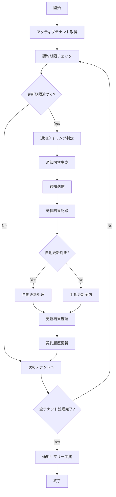

# バッチ定義書：テナント契約更新通知バッチ

| 項目                | 内容                                                                                |
|---------------------|------------------------------------------------------------------------------------|
| **バッチID**        | BATCH-307                                                                          |
| **バッチ名称**      | テナント契約更新通知バッチ                                                          |
| **機能カテゴリ**    | テナント管理                                                                        |
| **概要・目的**      | テナント契約の更新期限を監視し、適切なタイミングで更新通知を送信する                |
| **バッチ種別**      | 定期バッチ                                                                          |
| **実行スケジュール**| 日次（09:30）                                                                       |
| **入出力対象**      | テナント契約情報、通知設定、更新履歴、契約管理システム                              |
| **優先度**          | 高                                                                                  |
| **備考**            | マルチテナント対応、段階的通知、自動更新オプション                                  |

## 1. 処理概要

テナント契約更新通知バッチは、マルチテナント環境において各テナントの契約期限を監視し、更新期限に応じて段階的な通知を送信するバッチ処理です。契約期限の90日前、60日前、30日前、14日前、7日前、3日前、当日に適切な通知を送信し、契約の継続性を確保します。

## 2. 処理フロー



## 3. 入力データ

### 3.1 テナント契約情報

| 項目                | データ型 | 説明                                           |
|---------------------|----------|------------------------------------------------|
| tenant_id           | String   | テナントID                                     |
| contract_start_date | Date     | 契約開始日                                     |
| contract_end_date   | Date     | 契約終了日                                     |
| contract_type       | String   | 契約種別（MONTHLY/YEARLY/CUSTOM）              |
| auto_renewal        | Boolean  | 自動更新フラグ                                 |
| renewal_notice_days | Integer  | 更新通知日数                                   |
| billing_contact     | String   | 請求担当者                                     |
| technical_contact   | String   | 技術担当者                                     |
| contract_status     | String   | 契約ステータス（ACTIVE/SUSPENDED/EXPIRED）     |

### 3.2 通知設定

| 設定項目                | データ型 | デフォルト値 | 説明                                 |
|-------------------------|----------|--------------|--------------------------------------|
| notification_days       | Array    | [90,60,30,14,7,3,1] | 通知送信日（期限前日数）    |
| notification_channels   | Array    | ['email','slack'] | 通知チャンネル              |
| escalation_enabled      | Boolean  | true         | エスカレーション有効/無効            |
| auto_renewal_enabled    | Boolean  | true         | 自動更新機能有効/無効                |
| grace_period_days       | Integer  | 7            | 猶予期間（日）                       |
| reminder_frequency      | String   | daily        | リマインダー頻度                     |

## 4. 出力データ

### 4.1 契約更新通知履歴テーブル（新規作成）

| フィールド名      | データ型 | 説明                                           |
|-------------------|----------|------------------------------------------------|
| notification_id   | String   | 通知ID（主キー）                               |
| tenant_id         | String   | テナントID                                     |
| contract_id       | String   | 契約ID                                         |
| notification_type | String   | 通知種別（RENEWAL_REMINDER/EXPIRY_WARNING）    |
| days_before_expiry| Integer  | 期限前日数                                     |
| sent_at           | DateTime | 送信日時                                       |
| sent_to           | String   | 送信先                                         |
| channel           | String   | 送信チャンネル                                 |
| status            | String   | 送信ステータス（SENT/FAILED/PENDING）          |
| response_received | Boolean  | 応答受信フラグ                                 |
| response_at       | DateTime | 応答日時                                       |

### 4.2 契約更新処理履歴テーブル（新規作成）

| フィールド名      | データ型 | 説明                                           |
|-------------------|----------|------------------------------------------------|
| renewal_id        | String   | 更新ID（主キー）                               |
| tenant_id         | String   | テナントID                                     |
| old_contract_id   | String   | 旧契約ID                                       |
| new_contract_id   | String   | 新契約ID                                       |
| renewal_type      | String   | 更新種別（AUTO/MANUAL/UPGRADE/DOWNGRADE）      |
| renewal_date      | Date     | 更新日                                         |
| new_end_date      | Date     | 新契約終了日                                   |
| price_change      | Float    | 価格変更額                                     |
| processed_by      | String   | 処理者                                         |
| status            | String   | 処理ステータス（SUCCESS/FAILED/PENDING）       |

## 5. 通知仕様

### 5.1 契約期限監視

```typescript
class ContractExpiryMonitor {
  async checkContractExpiry(): Promise<ExpiryCheckResult[]> {
    const activeContracts = await this.getActiveContracts();
    const results: ExpiryCheckResult[] = [];
    
    for (const contract of activeContracts) {
      const daysUntilExpiry = this.calculateDaysUntilExpiry(contract.endDate);
      const notificationSchedule = await this.getNotificationSchedule(contract.tenantId);
      
      if (this.shouldSendNotification(daysUntilExpiry, notificationSchedule)) {
        const notificationType = this.determineNotificationType(daysUntilExpiry);
        const notificationSent = await this.sendRenewalNotification(contract, notificationType, daysUntilExpiry);
        
        results.push({
          tenantId: contract.tenantId,
          contractId: contract.id,
          daysUntilExpiry,
          notificationType,
          notificationSent,
          autoRenewalEligible: contract.autoRenewal && this.isAutoRenewalEligible(contract)
        });
      }
    }
    
    return results;
  }
  
  private shouldSendNotification(daysUntilExpiry: number, schedule: number[]): boolean {
    return schedule.includes(daysUntilExpiry);
  }
  
  private determineNotificationType(daysUntilExpiry: number): string {
    if (daysUntilExpiry >= 30) return 'EARLY_REMINDER';
    if (daysUntilExpiry >= 7) return 'RENEWAL_REMINDER';
    if (daysUntilExpiry >= 1) return 'URGENT_REMINDER';
    return 'EXPIRY_WARNING';
  }
  
  private async sendRenewalNotification(contract: Contract, type: string, daysUntilExpiry: number): Promise<boolean> {
    try {
      const tenant = await this.getTenant(contract.tenantId);
      const template = await this.getNotificationTemplate(type);
      const recipients = await this.getContractContacts(contract);
      
      const notificationData = {
        tenantName: tenant.name,
        contractEndDate: contract.endDate,
        daysUntilExpiry,
        renewalUrl: this.generateRenewalUrl(contract),
        contactSupport: this.getSupportContact()
      };
      
      await this.notificationService.send({
        recipients,
        template,
        data: notificationData,
        channels: tenant.notificationChannels
      });
      
      await this.recordNotification(contract, type, daysUntilExpiry);
      return true;
    } catch (error) {
      console.error('Failed to send renewal notification:', error);
      return false;
    }
  }
}
```

### 5.2 自動更新処理

```typescript
class AutoRenewalProcessor {
  async processAutoRenewals(): Promise<AutoRenewalResult[]> {
    const autoRenewalContracts = await this.getAutoRenewalContracts();
    const results: AutoRenewalResult[] = [];
    
    for (const contract of autoRenewalContracts) {
      try {
        const renewalResult = await this.processAutoRenewal(contract);
        results.push(renewalResult);
      } catch (error) {
        results.push({
          contractId: contract.id,
          tenantId: contract.tenantId,
          status: 'FAILED',
          error: error.message,
          processedAt: new Date()
        });
      }
    }
    
    return results;
  }
  
  private async processAutoRenewal(contract: Contract): Promise<AutoRenewalResult> {
    // 更新前チェック
    await this.validateRenewalEligibility(contract);
    
    // 新契約期間の計算
    const newEndDate = this.calculateNewEndDate(contract);
    
    // 価格計算
    const newPrice = await this.calculateRenewalPrice(contract);
    
    // 支払い処理
    const paymentResult = await this.processPayment(contract.tenantId, newPrice);
    
    if (!paymentResult.success) {
      throw new Error(`Payment failed: ${paymentResult.error}`);
    }
    
    // 契約更新
    const newContract = await this.createRenewalContract(contract, newEndDate, newPrice);
    
    // 旧契約の終了
    await this.closeOldContract(contract.id);
    
    // 更新通知
    await this.sendRenewalConfirmation(contract.tenantId, newContract);
    
    return {
      contractId: contract.id,
      tenantId: contract.tenantId,
      newContractId: newContract.id,
      newEndDate,
      newPrice,
      status: 'SUCCESS',
      processedAt: new Date()
    };
  }
  
  private async validateRenewalEligibility(contract: Contract): Promise<void> {
    const tenant = await this.getTenant(contract.tenantId);
    
    // テナントステータス確認
    if (tenant.status !== 'ACTIVE') {
      throw new Error('Tenant is not active');
    }
    
    // 支払い履歴確認
    const paymentHistory = await this.getPaymentHistory(contract.tenantId);
    if (this.hasOutstandingPayments(paymentHistory)) {
      throw new Error('Outstanding payments exist');
    }
    
    // 利用規約違反確認
    const violations = await this.checkPolicyViolations(contract.tenantId);
    if (violations.length > 0) {
      throw new Error('Policy violations detected');
    }
  }
}
```

### 5.3 通知テンプレート管理

```typescript
class RenewalNotificationTemplates {
  private templates = {
    EARLY_REMINDER: {
      subject: '【{{tenantName}}】契約更新のご案内（{{daysUntilExpiry}}日前）',
      body: `
いつもお世話になっております。

{{tenantName}} 様の契約が {{contractEndDate}} に期限を迎えます。
契約の継続をご希望の場合は、期限までに更新手続きをお願いいたします。

■ 契約情報
- 契約終了日: {{contractEndDate}}
- 残り日数: {{daysUntilExpiry}}日

■ 更新手続き
下記URLより更新手続きを行ってください：
{{renewalUrl}}

ご不明な点がございましたら、お気軽にお問い合わせください。
{{contactSupport}}
      `
    },
    
    RENEWAL_REMINDER: {
      subject: '【重要】{{tenantName}} 契約更新期限が近づいています（{{daysUntilExpiry}}日前）',
      body: `
【重要なお知らせ】

{{tenantName}} 様の契約期限が近づいております。

■ 契約情報
- 契約終了日: {{contractEndDate}}
- 残り日数: {{daysUntilExpiry}}日

サービスの継続利用には更新手続きが必要です。
期限までに手続きを完了してください。

■ 更新手続き
{{renewalUrl}}

■ お問い合わせ
{{contactSupport}}
      `
    },
    
    URGENT_REMINDER: {
      subject: '【緊急】{{tenantName}} 契約期限まで{{daysUntilExpiry}}日です',
      body: `
【緊急通知】

{{tenantName}} 様の契約期限まで残り{{daysUntilExpiry}}日となりました。

期限を過ぎるとサービスが停止される可能性があります。
至急、更新手続きを行ってください。

■ 更新手続き（緊急）
{{renewalUrl}}

■ 緊急連絡先
{{contactSupport}}
      `
    },
    
    EXPIRY_WARNING: {
      subject: '【最終警告】{{tenantName}} 契約が本日期限を迎えます',
      body: `
【最終警告】

{{tenantName}} 様の契約が本日期限を迎えます。

更新手続きが完了していない場合、サービスが停止されます。
緊急で更新手続きを行ってください。

■ 緊急更新手続き
{{renewalUrl}}

■ 緊急連絡先
{{contactSupport}}
      `
    }
  };
  
  getTemplate(type: string): NotificationTemplate {
    return this.templates[type] || this.templates.RENEWAL_REMINDER;
  }
}
```

## 6. エスカレーション処理

### 6.1 未応答エスカレーション

```typescript
class RenewalEscalationManager {
  async processEscalations(): Promise<EscalationResult[]> {
    const pendingRenewals = await this.getPendingRenewals();
    const results: EscalationResult[] = [];
    
    for (const renewal of pendingRenewals) {
      const escalationLevel = this.determineEscalationLevel(renewal);
      
      if (escalationLevel > 0) {
        const escalationResult = await this.executeEscalation(renewal, escalationLevel);
        results.push(escalationResult);
      }
    }
    
    return results;
  }
  
  private determineEscalationLevel(renewal: PendingRenewal): number {
    const daysUntilExpiry = this.calculateDaysUntilExpiry(renewal.contractEndDate);
    const notificationsSent = renewal.notificationHistory.length;
    const lastResponseDays = this.daysSinceLastResponse(renewal);
    
    if (daysUntilExpiry <= 1 && notificationsSent >= 3) return 3; // 最高レベル
    if (daysUntilExpiry <= 7 && notificationsSent >= 2) return 2; // 高レベル
    if (daysUntilExpiry <= 14 && lastResponseDays >= 7) return 1; // 中レベル
    
    return 0; // エスカレーション不要
  }
  
  private async executeEscalation(renewal: PendingRenewal, level: number): Promise<EscalationResult> {
    const escalationActions = {
      1: () => this.sendManagerNotification(renewal),
      2: () => this.sendExecutiveNotification(renewal),
      3: () => this.sendCriticalAlert(renewal)
    };
    
    try {
      await escalationActions[level]();
      
      return {
        renewalId: renewal.id,
        escalationLevel: level,
        status: 'SUCCESS',
        executedAt: new Date()
      };
    } catch (error) {
      return {
        renewalId: renewal.id,
        escalationLevel: level,
        status: 'FAILED',
        error: error.message,
        executedAt: new Date()
      };
    }
  }
}
```

## 7. 依存関係

- テナント管理システム
- 契約管理システム
- 通知サービス
- 支払い処理システム
- 顧客管理システム
- レポート生成システム

## 8. 実行パラメータ

| パラメータ名        | 必須 | デフォルト値 | 説明                                           |
|---------------------|------|--------------|------------------------------------------------|
| --tenant-id         | No   | all          | 特定テナントのみ処理                           |
| --notification-only | No   | false        | 通知のみ実行（自動更新なし）                   |
| --dry-run           | No   | false        | 実際の通知・更新を行わず結果のみ表示           |
| --escalation-level  | No   | all          | 特定エスカレーションレベルのみ処理             |
| --days-ahead        | No   | 90           | 何日前まで契約期限をチェックするか             |

## 9. 実行例

```bash
# 通常実行
npm run batch:tenant-contract-renewal-notification

# 特定テナントのみ
npm run batch:tenant-contract-renewal-notification -- --tenant-id=tenant-123

# 通知のみ（自動更新なし）
npm run batch:tenant-contract-renewal-notification -- --notification-only

# ドライラン
npm run batch:tenant-contract-renewal-notification -- --dry-run

# TypeScript直接実行
npx tsx src/batch/tenant-contract-renewal-notification.ts
```

## 10. 改訂履歴

| 改訂日     | 改訂者 | 改訂内容                                         |
|------------|--------|--------------------------------------------------|
| 2025/05/31 | 初版   | 初版作成                                         |
