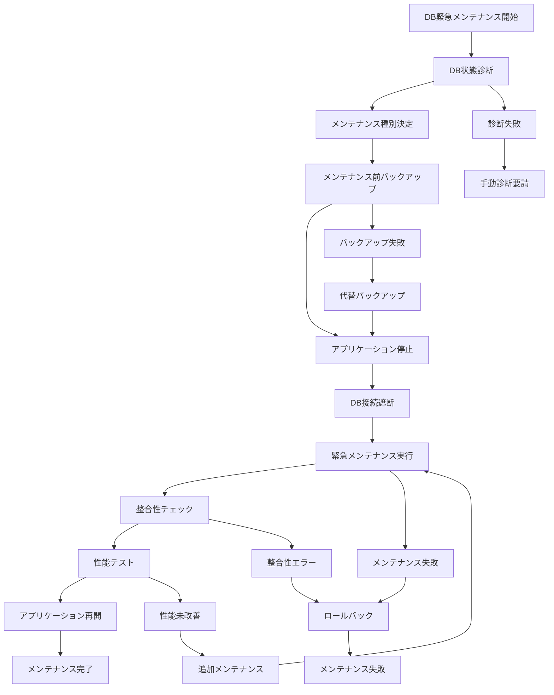

# バッチ定義書：データベース緊急メンテナンスバッチ (BATCH-905)

## 1. 基本情報

| 項目 | 内容 |
|------|------|
| **バッチID** | BATCH-905 |
| **バッチ名** | データベース緊急メンテナンスバッチ |
| **実行スケジュール** | 手動実行 |
| **優先度** | 最高 |
| **ステータス** | 未着手 |
| **作成日** | 2025/05/31 |
| **最終更新日** | 2025/05/31 |

## 2. バッチ概要

### 2.1 概要・目的
データベース障害や性能劣化時に、緊急メンテナンス処理を実行する。

### 2.2 関連テーブル
- 全テーブル（メンテナンス対象による）
- TBL-096_DB緊急メンテナンス履歴
- TBL-097_DB状態管理
- TBL-098_メンテナンス設定

### 2.3 関連API
- API-335_DB状態取得API
- API-336_緊急メンテナンス実行API

## 3. 実行仕様

### 3.1 実行スケジュール
| 項目 | 設定値 | 備考 |
|------|--------|------|
| 実行頻度 | 手動実行 | 緊急時のみ |
| 実行時間 | 任意 | 24時間対応 |
| タイムアウト | 180分 | 最大実行時間 |
| リトライ回数 | 1回 | 慎重な実行 |

### 3.2 実行条件
| 条件 | 内容 | 備考 |
|------|------|------|
| 前提条件 | DB障害・性能劣化発生 | 緊急事態対応 |
| 実行可能時間 | 24時間 | 緊急対応 |
| 排他制御 | 全DB処理停止 | メンテナンス専用 |

### 3.3 実行パラメータ
| パラメータ名 | データ型 | 必須 | デフォルト値 | 説明 |
|--------------|----------|------|--------------|------|
| maintenance_type | string | ○ | - | メンテナンス種別（repair/optimize/rebuild） |
| target_databases | array | ○ | - | 対象データベース |
| severity_level | string | ○ | - | 重要度（critical/high/medium） |

## 4. 処理仕様

### 4.1 処理フロー

### 4.2 詳細処理
1. **緊急診断**
   - データベース状態の詳細診断
   - 障害原因の特定
   - メンテナンス方針の決定
   - 影響範囲の評価

2. **メンテナンス準備**
   - 緊急バックアップの実行
   - アプリケーションの段階的停止
   - DB接続の完全遮断
   - メンテナンス環境の準備

3. **緊急メンテナンス実行**
   - データベース修復処理
   - インデックス再構築
   - 統計情報更新
   - 性能最適化処理

4. **検証・テスト**
   - データ整合性の全面チェック
   - 性能ベンチマークテスト
   - 機能動作確認
   - 負荷テスト実行

5. **サービス復旧**
   - アプリケーションの段階的再開
   - 接続制限の段階的解除
   - 監視強化の実施
   - 復旧完了報告

## 5. データ仕様

### 5.1 入力データ
| データ名 | 形式 | 取得元 | 説明 |
|----------|------|--------|------|
| DB状態情報 | JSON | DB監視システム | データベース状態 |
| メンテナンス設定 | DB | TBL-098_メンテナンス設定 | メンテナンス設定 |
| 障害情報 | LOG | DBログ | 障害詳細情報 |

### 5.2 出力データ
| データ名 | 形式 | 出力先 | 説明 |
|----------|------|--------|------|
| メンテナンス履歴 | DB | TBL-096_DB緊急メンテナンス履歴 | メンテナンス記録 |
| DB状態 | DB | TBL-097_DB状態管理 | メンテナンス後状態 |
| メンテナンスレポート | PDF | /reports/db-maintenance/ | メンテナンス報告書 |
| 性能レポート | CSV | /data/performance/ | 性能改善結果 |

### 5.3 データ量見積もり
| 項目 | 件数 | 備考 |
|------|------|------|
| 対象テーブル数 | 100件 | 全システム |
| 処理データ量 | 1TB | 最大ケース |
| 処理時間 | 120分 | 平均メンテナンス時間 |

## 6. エラーハンドリング

### 6.1 エラー分類
| エラー種別 | 対応方法 | 通知要否 | 備考 |
|------------|----------|----------|------|
| バックアップ失敗 | 代替手段・継続 | ○ | データ保護最優先 |
| メンテナンス失敗 | ロールバック・停止 | ○ | 安全性確保 |
| 整合性エラー | 修復・再実行 | ○ | データ整合性重要 |

### 6.2 リトライ仕様
| 条件 | リトライ回数 | 間隔 | 備考 |
|------|--------------|------|------|
| 一時的エラー | 2回 | 60秒 | 慎重な再実行 |
| リソース不足 | 1回 | 300秒 | リソース確保後 |
| 整合性エラー | 1回 | 600秒 | 詳細確認後 |

### 6.3 異常終了時の処理
1. メンテナンス処理の即座停止
2. データベースのロールバック
3. 緊急バックアップからの復旧
4. 手動メンテナンス要請
5. 緊急事態エスカレーション

## 7. 監視・運用

### 7.1 監視項目
| 監視項目 | 閾値 | アラート条件 | 対応方法 |
|----------|------|--------------|----------|
| メンテナンス進捗 | 計画通り | 遅延時 | リソース追加・手動介入 |
| DB性能 | 改善目標値 | 未達成時 | 追加最適化・再実行 |
| データ整合性 | 100% | 不整合時 | 修復処理・調査 |

### 7.2 ログ出力
| ログ種別 | 出力レベル | 出力内容 | 保存期間 |
|----------|------------|----------|----------|
| メンテナンスログ | INFO | メンテナンス詳細・結果 | 1年 |
| エラーログ | ERROR | エラー詳細・対応記録 | 1年 |
| 性能ログ | INFO | 性能改善結果・ベンチマーク | 6ヶ月 |

### 7.3 アラート通知
| 通知条件 | 通知先 | 通知方法 | 備考 |
|----------|--------|----------|------|
| メンテナンス開始 | DBA・運用チーム・開発チーム | メール・Slack | 即座に通知 |
| メンテナンス完了 | 全関係者 | メール・Slack | 完了通知 |
| メンテナンス失敗 | DBA・緊急対応チーム | 電話・Slack | 即座に通知 |

## 8. 非機能要件

### 8.1 パフォーマンス
- 処理時間：180分以内
- メモリ使用量：8GB以内
- CPU使用率：90%以内（緊急時）

### 8.2 可用性
- 成功率：95%以上
- 24時間対応体制
- 複数バックアップからの復旧

### 8.3 セキュリティ
- DBA権限による実行制御
- 全操作の監査ログ記録
- データ暗号化の維持

## 9. テスト仕様

### 9.1 単体テスト
| テストケース | 入力条件 | 期待結果 |
|--------------|----------|----------|
| 正常メンテナンス | 標準的なDB障害 | メンテナンス完了・性能改善 |
| 大規模メンテナンス | 全DB対象 | 正常完了・全体最適化 |
| 部分メンテナンス | 特定テーブル指定 | 指定範囲のみメンテナンス |

### 9.2 異常系テスト
| テストケース | 入力条件 | 期待結果 |
|--------------|----------|----------|
| バックアップ失敗 | ストレージ障害 | 代替手段・継続処理 |
| メンテナンス失敗 | 修復不可能な破損 | ロールバック・手動要請 |
| 整合性エラー | データ不整合 | 修復処理・再実行 |

## 10. 実装メモ

### 10.1 技術仕様
- 言語：Python・SQL
- フレームワーク：SQLAlchemy
- DB管理：PostgreSQL・MySQL管理ツール
- 監視：Prometheus・Grafana
- ログ出力：logging

### 10.2 注意事項
- データベースメンテナンスの慎重な実行
- バックアップの確実な取得
- 性能改善効果の定量的測定

### 10.3 デプロイ・実行環境
- 実行サーバー：DB管理専用サーバー
- 実行ユーザー：db_admin
- 実行ディレクトリ：/opt/db-maintenance/
- 設定ファイル：/etc/db-maintenance/config.json

---

**改訂履歴**

| バージョン | 日付 | 変更者 | 変更内容 |
|------------|------|--------|----------|
| 1.0 | 2025/05/31 | システムアーキテクト | 初版作成 |
