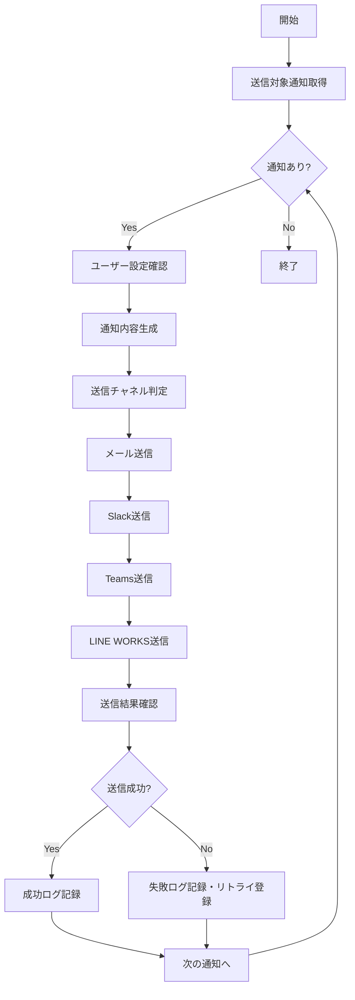

# バッチ定義書：定期通知送信バッチ

| 項目                | 内容                                                                                |
|---------------------|------------------------------------------------------------------------------------|
| **バッチID**        | BATCH-951                                                                          |
| **バッチ名称**      | 定期通知送信バッチ                                                                  |
| **機能カテゴリ**    | 通知・連携管理                                                                      |
| **概要・目的**      | スケジュール設定された通知を一括送信し、ユーザーへの情報提供を自動化する            |
| **バッチ種別**      | 定期バッチ                                                                          |
| **実行スケジュール**| 毎日朝（8:00）                                                                      |
| **入出力対象**      | NotificationSchedule, NotificationLog, UserPreferences                             |
| **優先度**          | 高                                                                                  |
| **備考**            | マルチチャネル対応                                                                  |

## 1. 処理概要

定期通知送信バッチは、事前に設定されたスケジュールに基づいて、ユーザーに対する各種通知（リマインダー、レポート、アラート等）を一括送信するバッチ処理です。メール、Slack、Teams、LINE WORKS等の複数チャネルに対応します。

## 2. 処理フロー



## 3. 入力データ

### 3.1 NotificationScheduleテーブル

| フィールド名      | データ型 | 説明                                           |
|-------------------|----------|------------------------------------------------|
| schedule_id       | String   | スケジュールID（主キー）                       |
| tenant_id         | String   | テナントID（外部キー）                         |
| notification_type | String   | 通知種別                                       |
| target_users      | JSON     | 対象ユーザー                                   |
| schedule_pattern  | String   | スケジュールパターン                           |
| next_send_at      | DateTime | 次回送信日時                                   |
| template_id       | String   | テンプレートID                                 |
| is_active         | Boolean  | 有効フラグ                                     |

### 3.2 UserNotificationPreferencesテーブル

| フィールド名      | データ型 | 説明                                           |
|-------------------|----------|------------------------------------------------|
| user_id           | String   | ユーザーID（主キー）                           |
| tenant_id         | String   | テナントID（外部キー）                         |
| email_enabled     | Boolean  | メール通知有効                                 |
| slack_enabled     | Boolean  | Slack通知有効                                  |
| teams_enabled     | Boolean  | Teams通知有効                                  |
| line_works_enabled| Boolean  | LINE WORKS通知有効                             |
| notification_types| JSON     | 通知種別別設定                                 |

## 4. 出力データ

### 4.1 NotificationLogテーブル（追加）

| フィールド名      | データ型 | 説明                                           |
|-------------------|----------|------------------------------------------------|
| log_id            | String   | ログID（主キー）                               |
| schedule_id       | String   | スケジュールID（外部キー）                     |
| tenant_id         | String   | テナントID（外部キー）                         |
| user_id           | String   | ユーザーID（外部キー）                         |
| notification_type | String   | 通知種別                                       |
| channel           | String   | 送信チャネル（"EMAIL"/"SLACK"/"TEAMS"/"LINE"） |
| send_status       | String   | 送信状態（"SUCCESS"/"FAILED"/"PENDING"）       |
| sent_at           | DateTime | 送信日時                                       |
| error_message     | String   | エラーメッセージ                               |
| retry_count       | Integer  | リトライ回数                                   |
| message_content   | JSON     | 送信内容                                       |

## 5. 通知種別

### 5.1 リマインダー通知

- **スキル評価期限**: 評価期限の1週間前、3日前、当日
- **目標設定期限**: 設定期限の1週間前、3日前、当日
- **研修受講期限**: 受講期限の2週間前、1週間前、3日前

### 5.2 レポート通知

- **週次活動レポート**: 毎週月曜日朝
- **月次スキル分析レポート**: 毎月1日朝
- **四半期目標進捗レポート**: 四半期初日朝

### 5.3 システム通知

- **メンテナンス予告**: メンテナンス24時間前、1時間前
- **機能追加通知**: 新機能リリース時
- **重要なお知らせ**: 管理者からの緊急連絡

## 6. 送信チャネル設定

### 6.1 メール送信

- **SMTPサーバー**: 設定済みSMTPサーバー経由
- **テンプレート**: HTML形式、レスポンシブ対応
- **添付ファイル**: PDF レポート等の添付対応

### 6.2 Slack送信

- **Webhook URL**: テナント別設定
- **チャネル**: ユーザー別プライベートチャネル
- **フォーマット**: Markdown形式、ボタン・リンク対応

### 6.3 Teams送信

- **Webhook URL**: テナント別設定
- **カード形式**: Adaptive Cards形式
- **アクション**: 直接リンク・ボタン対応

### 6.4 LINE WORKS送信

- **Bot API**: LINE WORKS Bot API経由
- **トーク**: 個人トーク・グループトーク対応
- **リッチメッセージ**: 画像・ボタン対応

## 7. 実行パラメータ

| パラメータ名        | 必須 | デフォルト値 | 説明                                           |
|---------------------|------|--------------|------------------------------------------------|
| --tenant-id         | No   | 全テナント   | 特定テナントのみ送信                           |
| --notification-type | No   | 全種別       | 特定通知種別のみ送信                           |
| --channel           | No   | 全チャネル   | 特定チャネルのみ送信                           |
| --dry-run           | No   | false        | 送信対象の確認のみ行い、実際の送信は行わない   |
| --force-send        | No   | false        | ユーザー設定を無視して強制送信                 |

## 8. 実行例

```bash
# 通常実行
npm run batch:notification-send

# 特定テナントのみ送信
npm run batch:notification-send -- --tenant-id=tenant001

# リマインダー通知のみ送信
npm run batch:notification-send -- --notification-type=reminder

# メール送信のみ
npm run batch:notification-send -- --channel=email

# ドライラン
npm run batch:notification-send -- --dry-run

# TypeScript直接実行
npx tsx src/batch/notification-send.ts
```

## 9. エラー処理

| エラーケース                      | 対応方法                                                                 |
|-----------------------------------|--------------------------------------------------------------------------|
| SMTP接続エラー                   | 最大3回リトライ、失敗時は管理者通知                                      |
| Slack Webhook エラー             | エラーログ記録、該当ユーザーをスキップして処理継続                       |
| Teams API エラー                 | エラーログ記録、該当ユーザーをスキップして処理継続                       |
| LINE WORKS API エラー            | エラーログ記録、該当ユーザーをスキップして処理継続                       |
| テンプレート生成エラー            | デフォルトテンプレートを使用、警告ログ記録                               |

## 10. 関連バッチ

- **BATCH-952**: 通知失敗リトライバッチ（失敗通知を再送）
- **BATCH-203**: 資格期限アラートバッチ（期限通知を生成）
- **BATCH-902**: テナント課金計算バッチ（請求書通知を生成）

## 11. 改訂履歴

| 改訂日     | 改訂者 | 改訂内容                                         |
|------------|--------|--------------------------------------------------|
| 2025/05/30 | 初版   | 初版作成                                         |
