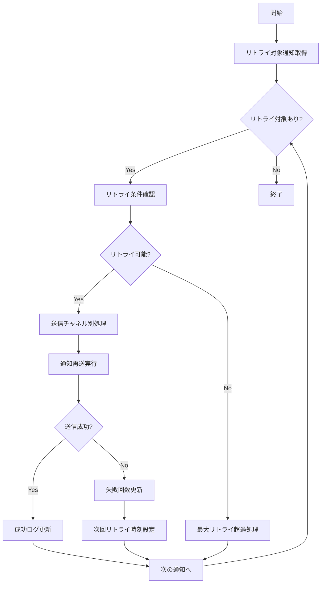

# バッチ定義書：通知失敗リトライバッチ

| 項目                | 内容                                                                                |
|---------------------|------------------------------------------------------------------------------------|
| **バッチID**        | BATCH-952                                                                          |
| **バッチ名称**      | 通知失敗リトライバッチ                                                              |
| **機能カテゴリ**    | 通知・連携管理                                                                      |
| **概要・目的**      | 送信失敗した通知を再送処理し、通知の確実な配信を保証する                            |
| **バッチ種別**      | 定期バッチ                                                                          |
| **実行スケジュール**| 毎時間（毎時30分）                                                                  |
| **入出力対象**      | NotificationLog, RetryQueue                                                         |
| **優先度**          | 高                                                                                  |
| **備考**            | 通知信頼性確保                                                                      |

## 1. 処理概要

通知失敗リトライバッチは、BATCH-951で送信失敗した通知や一時的なエラーで配信できなかった通知を再送するバッチ処理です。指数バックオフアルゴリズムを使用して適切な間隔でリトライを行い、通知の確実な配信を保証します。

## 2. 処理フロー



## 3. 入力データ

### 3.1 NotificationLogテーブル

| フィールド名      | データ型 | 説明                                           |
|-------------------|----------|------------------------------------------------|
| log_id            | String   | ログID（主キー）                               |
| send_status       | String   | 送信状態（"FAILED"/"PENDING"）                 |
| retry_count       | Integer  | リトライ回数                                   |
| next_retry_at     | DateTime | 次回リトライ日時                               |
| error_message     | String   | エラーメッセージ                               |
| channel           | String   | 送信チャネル                                   |

## 4. 出力データ

### 4.1 NotificationRetryLogテーブル（追加）

| フィールド名      | データ型 | 説明                                           |
|-------------------|----------|------------------------------------------------|
| retry_log_id      | String   | リトライログID（主キー）                       |
| original_log_id   | String   | 元ログID（外部キー）                           |
| retry_attempt     | Integer  | リトライ試行回数                               |
| retry_at          | DateTime | リトライ実行日時                               |
| retry_status      | String   | リトライ結果（"SUCCESS"/"FAILED"/"SKIPPED"）   |
| error_type        | String   | エラー種別                                     |
| error_details     | JSON     | エラー詳細                                     |
| next_retry_at     | DateTime | 次回リトライ予定日時                           |

## 5. リトライ戦略

### 5.1 指数バックオフ

```
次回リトライ時刻 = 現在時刻 + (基本間隔 × 2^リトライ回数) + ランダムジッター
```

| リトライ回数 | 基本間隔 | 実際の間隔（例）    |
|--------------|----------|---------------------|
| 1回目        | 5分      | 5-10分              |
| 2回目        | 5分      | 10-20分             |
| 3回目        | 5分      | 20-40分             |
| 4回目        | 5分      | 40-80分             |
| 5回目        | 5分      | 80-160分            |

### 5.2 最大リトライ回数

| 通知種別          | 最大リトライ回数 | 最大保持期間 |
|-------------------|------------------|--------------|
| 緊急通知          | 10回             | 24時間       |
| 重要通知          | 7回              | 12時間       |
| 一般通知          | 5回              | 6時間        |
| 情報通知          | 3回              | 3時間        |

## 6. エラー種別別対応

### 6.1 一時的エラー（リトライ対象）

- **ネットワークタイムアウト**: 通常のリトライ間隔
- **サーバー過負荷（5xx）**: 長めのリトライ間隔
- **レート制限**: API制限解除まで待機
- **一時的な認証エラー**: 認証情報更新後リトライ

### 6.2 永続的エラー（リトライ停止）

- **不正な宛先（4xx）**: 即座にリトライ停止
- **認証失敗**: 設定確認が必要
- **フォーマットエラー**: テンプレート修正が必要
- **権限不足**: 権限設定確認が必要

## 7. 実行パラメータ

| パラメータ名        | 必須 | デフォルト値 | 説明                                           |
|---------------------|------|--------------|------------------------------------------------|
| --max-retry-count   | No   | 5            | 最大リトライ回数                               |
| --channel           | No   | 全チャネル   | 特定チャネルのみリトライ                       |
| --priority          | No   | 全優先度     | 特定優先度のみリトライ                         |
| --dry-run           | No   | false        | リトライ対象の確認のみ行い、実際の送信は行わない |
| --force-retry       | No   | false        | 最大リトライ回数を無視して強制リトライ         |

## 8. 実行例

```bash
# 通常実行
npm run batch:notification-retry

# 最大リトライ回数を3回に設定
npm run batch:notification-retry -- --max-retry-count=3

# メール送信のみリトライ
npm run batch:notification-retry -- --channel=email

# 緊急通知のみリトライ
npm run batch:notification-retry -- --priority=urgent

# ドライラン
npm run batch:notification-retry -- --dry-run

# TypeScript直接実行
npx tsx src/batch/notification-retry.ts
```

## 9. 関連バッチ

- **BATCH-951**: 定期通知送信バッチ（失敗通知を生成）
- **BATCH-954**: 通知ログクリーンアップバッチ（古いリトライログを削除）

## 10. 改訂履歴

| 改訂日     | 改訂者 | 改訂内容                                         |
|------------|--------|--------------------------------------------------|
| 2025/05/30 | 初版   | 初版作成                                         |
