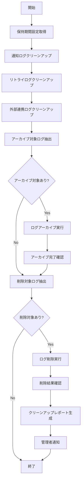

# バッチ定義書：通知ログクリーンアップバッチ

| 項目                | 内容                                                                                |
|---------------------|------------------------------------------------------------------------------------|
| **バッチID**        | BATCH-954                                                                          |
| **バッチ名称**      | 通知ログクリーンアップバッチ                                                        |
| **機能カテゴリ**    | 通知・連携管理                                                                      |
| **概要・目的**      | 古い通知ログを削除し、データベースの容量を最適化する                                |
| **バッチ種別**      | 定期バッチ                                                                          |
| **実行スケジュール**| 毎週日曜日深夜（2:00）                                                              |
| **入出力対象**      | NotificationLog, NotificationRetryLog, ExternalSyncLog                             |
| **優先度**          | 低                                                                                  |
| **備考**            | ストレージ最適化                                                                    |

## 1. 処理概要

通知ログクリーンアップバッチは、保存期間を過ぎた古い通知ログ、リトライログ、外部システム連携ログを削除するバッチ処理です。法的要件や監査要件を満たしつつ、データベースの容量を最適化します。

## 2. 処理フロー



## 3. 入力データ

### 3.1 NotificationLogテーブル

| フィールド名      | データ型 | 説明                                           |
|-------------------|----------|------------------------------------------------|
| log_id            | String   | ログID（主キー）                               |
| sent_at           | DateTime | 送信日時                                       |
| notification_type | String   | 通知種別                                       |
| send_status       | String   | 送信状態                                       |

### 3.2 NotificationRetryLogテーブル

| フィールド名      | データ型 | 説明                                           |
|-------------------|----------|------------------------------------------------|
| retry_log_id      | String   | リトライログID（主キー）                       |
| retry_at          | DateTime | リトライ実行日時                               |
| retry_status      | String   | リトライ結果                                   |

### 3.3 ExternalSyncLogテーブル

| フィールド名      | データ型 | 説明                                           |
|-------------------|----------|------------------------------------------------|
| sync_log_id       | String   | 同期ログID（主キー）                           |
| synced_at         | DateTime | 同期実行日時                                   |
| sync_status       | String   | 同期結果                                       |

## 4. 出力データ

### 4.1 LogCleanupReportテーブル（追加）

| フィールド名      | データ型 | 説明                                           |
|-------------------|----------|------------------------------------------------|
| cleanup_id        | String   | クリーンアップID（主キー）                     |
| cleanup_date      | Date     | クリーンアップ実行日                           |
| log_type          | String   | ログ種別                                       |
| retention_days    | Integer  | 保持期間（日数）                               |
| records_archived  | Integer  | アーカイブレコード数                           |
| records_deleted   | Integer  | 削除レコード数                                 |
| storage_freed_mb  | Integer  | 解放されたストレージ容量（MB）                 |
| execution_time_ms | Integer  | 実行時間（ミリ秒）                             |
| status            | String   | 実行結果（"SUCCESS"/"FAILED"/"PARTIAL"）       |
| error_details     | JSON     | エラー詳細                                     |
| created_at        | DateTime | 作成日時                                       |

## 5. 保持期間設定

### 5.1 通知ログ

| 通知種別          | 保持期間 | アーカイブ期間 | 完全削除期間 |
|-------------------|----------|----------------|--------------|
| 緊急通知          | 1年      | 3年            | 7年          |
| 重要通知          | 6ヶ月    | 2年            | 5年          |
| 一般通知          | 3ヶ月    | 1年            | 3年          |
| 情報通知          | 1ヶ月    | 6ヶ月          | 1年          |

### 5.2 システムログ

| ログ種別          | 保持期間 | アーカイブ期間 | 完全削除期間 |
|-------------------|----------|----------------|--------------|
| エラーログ        | 6ヶ月    | 2年            | 5年          |
| 成功ログ          | 3ヶ月    | 1年            | 3年          |
| リトライログ      | 1ヶ月    | 6ヶ月          | 1年          |
| 外部連携ログ      | 3ヶ月    | 1年            | 3年          |

## 6. アーカイブ処理

### 6.1 アーカイブ対象

- 保持期間を過ぎたが、法的要件により保存が必要なログ
- 圧縮してコールドストレージに移動
- 検索性を維持したインデックス情報を保持

### 6.2 アーカイブ形式

- **ファイル形式**: JSON Lines (.jsonl)
- **圧縮**: gzip圧縮
- **暗号化**: AES-256暗号化
- **保存先**: AWS S3 Glacier / Azure Archive Storage

## 7. 実行パラメータ

| パラメータ名        | 必須 | デフォルト値 | 説明                                           |
|---------------------|------|--------------|------------------------------------------------|
| --log-type          | No   | 全種別       | 特定ログ種別のみクリーンアップ                 |
| --retention-days    | No   | 設定値       | 保持期間を日数で指定                           |
| --skip-archive      | No   | false        | アーカイブ処理をスキップ                       |
| --dry-run           | No   | false        | 削除対象の確認のみ行い、実際の削除は行わない   |
| --force-delete      | No   | false        | アーカイブなしで強制削除                       |

## 8. 実行例

```bash
# 通常実行
npm run batch:log-cleanup

# 通知ログのみクリーンアップ
npm run batch:log-cleanup -- --log-type=notification

# 保持期間を30日に設定
npm run batch:log-cleanup -- --retention-days=30

# アーカイブなしで削除
npm run batch:log-cleanup -- --skip-archive

# ドライラン
npm run batch:log-cleanup -- --dry-run

# TypeScript直接実行
npx tsx src/batch/log-cleanup.ts
```

## 9. エラー処理

| エラーケース                      | 対応方法                                                                 |
|-----------------------------------|--------------------------------------------------------------------------|
| アーカイブ処理エラー              | エラーログ記録、削除処理を停止して管理者に通知                           |
| ストレージ容量不足                | アーカイブ先の容量確認を管理者に依頼                                     |
| 削除処理エラー                    | エラーログ記録、部分的に成功した場合は結果を報告                         |
| 権限不足エラー                    | 必要な権限を管理者に通知                                                 |

## 10. 安全性確保

### 10.1 削除前確認

- 法的要件チェック
- 監査要件チェック
- 依存関係チェック
- バックアップ確認

### 10.2 復旧手順

- アーカイブからの復元手順
- 緊急時の復旧手順
- データ整合性確認手順

## 11. 関連バッチ

- **BATCH-951**: 定期通知送信バッチ（通知ログを生成）
- **BATCH-952**: 通知失敗リトライバッチ（リトライログを生成）
- **BATCH-953**: 外部システム連携バッチ（連携ログを生成）

## 12. 改訂履歴

| 改訂日     | 改訂者 | 改訂内容                                         |
|------------|--------|--------------------------------------------------|
| 2025/05/30 | 初版   | 初版作成                                         |
