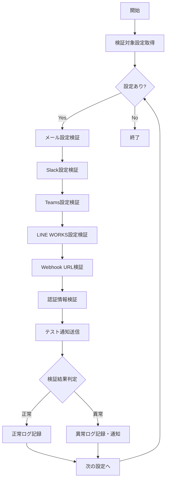

# バッチ定義書：通知設定検証バッチ

| 項目                | 内容                                                                                |
|---------------------|------------------------------------------------------------------------------------|
| **バッチID**        | BATCH-955                                                                          |
| **バッチ名称**      | 通知設定検証バッチ                                                                  |
| **機能カテゴリ**    | 通知・連携管理                                                                      |
| **概要・目的**      | 通知設定の有効性を確認し、設定不備や接続エラーを事前に検知する                      |
| **バッチ種別**      | 定期バッチ                                                                          |
| **実行スケジュール**| 毎日深夜（6:00）                                                                    |
| **入出力対象**      | NotificationConfig, ValidationResult, HealthCheck                                  |
| **優先度**          | 中                                                                                  |
| **備考**            | 予防保守                                                                            |

## 1. 処理概要

通知設定検証バッチは、各種通知設定（メール、Slack、Teams、LINE WORKS）の有効性を定期的に検証し、設定不備や接続エラーを事前に検知するバッチ処理です。問題を早期発見することで、通知の確実な配信を保証します。

## 2. 処理フロー



## 3. 入力データ

### 3.1 NotificationConfigテーブル

| フィールド名      | データ型 | 説明                                           |
|-------------------|----------|------------------------------------------------|
| config_id         | String   | 設定ID（主キー）                               |
| tenant_id         | String   | テナントID（外部キー）                         |
| config_type       | String   | 設定種別（"EMAIL"/"SLACK"/"TEAMS"/"LINE"）     |
| endpoint_url      | String   | エンドポイントURL                              |
| auth_credentials  | String   | 認証情報（暗号化）                             |
| is_active         | Boolean  | 有効フラグ                                     |
| last_validated_at | DateTime | 最終検証日時                                   |

### 3.2 UserNotificationPreferencesテーブル

| フィールド名      | データ型 | 説明                                           |
|-------------------|----------|------------------------------------------------|
| user_id           | String   | ユーザーID（主キー）                           |
| tenant_id         | String   | テナントID（外部キー）                         |
| email_address     | String   | メールアドレス                                 |
| slack_user_id     | String   | Slack ユーザーID                               |
| teams_user_id     | String   | Teams ユーザーID                               |
| line_works_user_id| String   | LINE WORKS ユーザーID                          |

## 4. 出力データ

### 4.1 NotificationValidationLogテーブル（追加）

| フィールド名      | データ型 | 説明                                           |
|-------------------|----------|------------------------------------------------|
| validation_id     | String   | 検証ID（主キー）                               |
| config_id         | String   | 設定ID（外部キー）                             |
| validation_date   | Date     | 検証実行日                                     |
| validation_type   | String   | 検証種別（"CONNECTION"/"AUTH"/"SEND_TEST"）    |
| validation_status | String   | 検証結果（"SUCCESS"/"WARNING"/"FAILED"）       |
| response_time_ms  | Integer  | レスポンス時間（ミリ秒）                       |
| error_code        | String   | エラーコード                                   |
| error_message     | String   | エラーメッセージ                               |
| test_details      | JSON     | テスト詳細                                     |
| recommendations  | JSON     | 改善推奨事項                                   |
| created_at        | DateTime | 作成日時                                       |

## 5. 検証項目

### 5.1 メール設定検証

- **SMTP接続**: SMTPサーバーへの接続確認
- **認証**: SMTP認証の有効性確認
- **送信テスト**: テストメールの送信確認
- **DNS設定**: SPF/DKIM/DMARC設定確認

### 5.2 Slack設定検証

- **Webhook URL**: Incoming Webhook URLの有効性確認
- **Bot Token**: Bot Tokenの有効性・権限確認
- **チャネル**: 対象チャネルの存在・権限確認
- **API制限**: レート制限の確認

### 5.3 Teams設定検証

- **Webhook URL**: Incoming Webhook URLの有効性確認
- **Graph API**: Microsoft Graph APIの認証・権限確認
- **チーム**: 対象チーム・チャネルの存在確認
- **アプリ権限**: Teams アプリの権限確認

### 5.4 LINE WORKS設定検証

- **Bot API**: Bot APIの認証・権限確認
- **ユーザー**: 対象ユーザーの存在確認
- **トーク**: Bot トークの有効性確認
- **API制限**: レート制限の確認

## 6. 検証レベル

### 6.1 基本検証（毎日実行）

- 接続確認
- 認証確認
- 基本設定確認

### 6.2 詳細検証（週1回実行）

- テスト通知送信
- パフォーマンス測定
- セキュリティ設定確認

### 6.3 完全検証（月1回実行）

- 全機能テスト
- 負荷テスト
- 災害復旧テスト

## 7. 実行パラメータ

| パラメータ名        | 必須 | デフォルト値 | 説明                                           |
|---------------------|------|--------------|------------------------------------------------|
| --tenant-id         | No   | 全テナント   | 特定テナントのみ検証                           |
| --config-type       | No   | 全種別       | 特定設定種別のみ検証                           |
| --validation-level  | No   | basic        | 検証レベル（basic/detailed/full）              |
| --send-test         | No   | false        | テスト通知の実際の送信                         |
| --dry-run           | No   | false        | 検証結果の確認のみ行い、通知は行わない         |

## 8. 実行例

```bash
# 通常実行（基本検証）
npm run batch:notification-validation

# 特定テナントのみ検証
npm run batch:notification-validation -- --tenant-id=tenant001

# Slack設定のみ検証
npm run batch:notification-validation -- --config-type=slack

# 詳細検証
npm run batch:notification-validation -- --validation-level=detailed

# テスト通知送信あり
npm run batch:notification-validation -- --send-test

# ドライラン
npm run batch:notification-validation -- --dry-run

# TypeScript直接実行
npx tsx src/batch/notification-validation.ts
```

## 9. アラート条件

### 9.1 即座にアラート

- 認証エラー
- 接続エラー（3回連続）
- 権限不足エラー

### 9.2 警告レベル

- レスポンス時間の劣化（3秒以上）
- API制限の接近（80%以上）
- 設定の不整合

### 9.3 情報レベル

- 設定変更の検知
- パフォーマンスの改善
- 新機能の利用可能性

## 10. 改善推奨事項

### 10.1 自動修正可能

- 期限切れトークンの更新
- 無効なユーザーIDの削除
- デフォルト設定の復元

### 10.2 手動対応必要

- 権限設定の変更
- 新しいWebhook URLの設定
- セキュリティ設定の更新

## 11. 関連バッチ

- **BATCH-951**: 定期通知送信バッチ（検証済み設定を使用）
- **BATCH-953**: 外部システム連携バッチ（設定情報を参照）
- **BATCH-905**: テナント設定同期バッチ（設定の整合性確認）

## 12. 改訂履歴

| 改訂日     | 改訂者 | 改訂内容                                         |
|------------|--------|--------------------------------------------------|
| 2025/05/30 | 初版   | 初版作成                                         |
