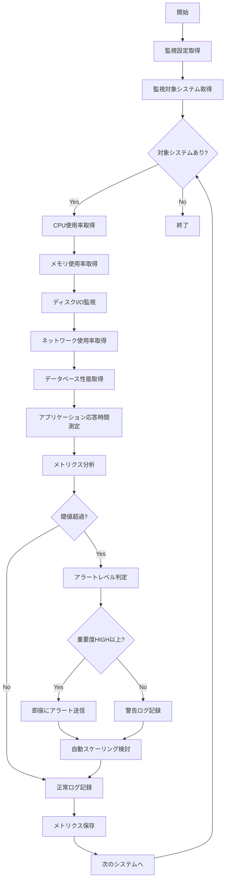

# バッチ定義書：パフォーマンス監視バッチ

| 項目                | 内容                                                                                |
|---------------------|------------------------------------------------------------------------------------|
| **バッチID**        | BATCH-004                                                                          |
| **バッチ名称**      | パフォーマンス監視バッチ                                                            |
| **機能カテゴリ**    | 基盤・システム管理                                                                  |
| **概要・目的**      | システムパフォーマンスを定期的に監視し、性能劣化を早期発見・記録する                |
| **バッチ種別**      | 定期バッチ                                                                          |
| **実行スケジュール**| 毎時15分                                                                            |
| **入出力対象**      | システムリソース、パフォーマンスメトリクス、監視ログ                                |
| **優先度**          | 高                                                                                  |
| **備考**            | マルチテナント対応、リアルタイム監視、自動アラート                                  |

## 1. 処理概要

パフォーマンス監視バッチは、マルチテナント環境において各システムコンポーネントのパフォーマンスメトリクスを定期的に収集・分析し、性能劣化や異常を早期発見するバッチ処理です。CPU、メモリ、ディスク、ネットワーク、データベース、アプリケーションレベルでの包括的な性能監視を実行し、閾値を超過した場合は即座に管理者に通知します。

## 2. 処理フロー



## 3. 入力データ

### 3.1 監視対象メトリクス

| メトリクス種別      | 監視項目                                               |
|---------------------|-------------------------------------------------------|
| CPU                 | 使用率、ロードアベレージ、プロセス数、コンテキストスイッチ |
| メモリ              | 使用率、空き容量、スワップ使用率、キャッシュ使用率     |
| ディスク            | 使用率、I/O待機時間、読み書き速度、IOPS               |
| ネットワーク        | 帯域幅使用率、パケット数、エラー率、レイテンシ         |
| データベース        | 接続数、クエリ実行時間、ロック待機、キャッシュヒット率 |
| アプリケーション    | 応答時間、スループット、エラー率、セッション数         |

### 3.2 監視設定

| 設定項目                | データ型 | デフォルト値 | 説明                                 |
|-------------------------|----------|--------------|--------------------------------------|
| cpu_threshold           | Float    | 80.0         | CPU使用率アラート閾値（%）           |
| memory_threshold        | Float    | 85.0         | メモリ使用率アラート閾値（%）        |
| disk_threshold          | Float    | 90.0         | ディスク使用率アラート閾値（%）      |
| network_threshold       | Float    | 70.0         | ネットワーク使用率アラート閾値（%）  |
| response_time_threshold | Integer  | 2000         | 応答時間アラート閾値（ms）           |
| collection_interval     | Integer  | 60           | メトリクス収集間隔（秒）             |

## 4. 出力データ

### 4.1 パフォーマンスメトリクステーブル（新規作成）

| フィールド名      | データ型 | 説明                                           |
|-------------------|----------|------------------------------------------------|
| metric_id         | String   | メトリクスID（主キー）                         |
| timestamp         | DateTime | 測定日時                                       |
| component_type    | String   | コンポーネント種別                             |
| component_name    | String   | コンポーネント名                               |
| metric_name       | String   | メトリクス名                                   |
| metric_value      | Float    | メトリクス値                                   |
| unit              | String   | 単位                                           |
| threshold_value   | Float    | 閾値                                           |
| status            | String   | ステータス（NORMAL/WARNING/CRITICAL）          |
| tenant_id         | String   | テナントID                                     |

### 4.2 パフォーマンスアラート履歴テーブル（新規作成）

| フィールド名      | データ型 | 説明                                           |
|-------------------|----------|------------------------------------------------|
| alert_id          | String   | アラートID（主キー）                           |
| triggered_at      | DateTime | アラート発生日時                               |
| resolved_at       | DateTime | アラート解決日時                               |
| component_type    | String   | コンポーネント種別                             |
| component_name    | String   | コンポーネント名                               |
| metric_name       | String   | メトリクス名                                   |
| threshold_value   | Float    | 閾値                                           |
| actual_value      | Float    | 実測値                                         |
| severity          | String   | 重要度（LOW/MEDIUM/HIGH/CRITICAL）             |
| status            | String   | ステータス（OPEN/ACKNOWLEDGED/RESOLVED）       |
| tenant_id         | String   | テナントID                                     |

## 5. 監視仕様

### 5.1 システムリソース監視

```typescript
class SystemResourceMonitor {
  async collectSystemMetrics(): Promise<PerformanceMetric[]> {
    const metrics: PerformanceMetric[] = [];
    
    // CPU使用率
    const cpuUsage = await this.getCPUUsage();
    metrics.push({
      componentType: 'system',
      componentName: 'CPU',
      metricName: 'usage_percentage',
      metricValue: cpuUsage,
      unit: 'percent',
      timestamp: new Date()
    });
    
    // メモリ使用率
    const memoryUsage = await this.getMemoryUsage();
    metrics.push({
      componentType: 'system',
      componentName: 'Memory',
      metricName: 'usage_percentage',
      metricValue: memoryUsage,
      unit: 'percent',
      timestamp: new Date()
    });
    
    // ディスク使用率
    const diskUsage = await this.getDiskUsage();
    metrics.push({
      componentType: 'system',
      componentName: 'Disk',
      metricName: 'usage_percentage',
      metricValue: diskUsage,
      unit: 'percent',
      timestamp: new Date()
    });
    
    return metrics;
  }
  
  private async getCPUUsage(): Promise<number> {
    const os = require('os');
    const cpus = os.cpus();
    
    let totalIdle = 0;
    let totalTick = 0;
    
    for (const cpu of cpus) {
      for (const type in cpu.times) {
        totalTick += cpu.times[type];
      }
      totalIdle += cpu.times.idle;
    }
    
    return 100 - (totalIdle / totalTick * 100);
  }
}
```

### 5.2 データベースパフォーマンス監視

```typescript
class DatabasePerformanceMonitor {
  async collectDatabaseMetrics(): Promise<PerformanceMetric[]> {
    const metrics: PerformanceMetric[] = [];
    
    // 接続数
    const connectionCount = await this.getConnectionCount();
    metrics.push({
      componentType: 'database',
      componentName: 'PostgreSQL',
      metricName: 'active_connections',
      metricValue: connectionCount,
      unit: 'count',
      timestamp: new Date()
    });
    
    // 平均クエリ実行時間
    const avgQueryTime = await this.getAverageQueryTime();
    metrics.push({
      componentType: 'database',
      componentName: 'PostgreSQL',
      metricName: 'avg_query_time',
      metricValue: avgQueryTime,
      unit: 'milliseconds',
      timestamp: new Date()
    });
    
    // キャッシュヒット率
    const cacheHitRatio = await this.getCacheHitRatio();
    metrics.push({
      componentType: 'database',
      componentName: 'PostgreSQL',
      metricName: 'cache_hit_ratio',
      metricValue: cacheHitRatio,
      unit: 'percent',
      timestamp: new Date()
    });
    
    return metrics;
  }
  
  private async getConnectionCount(): Promise<number> {
    const result = await prisma.$queryRaw`
      SELECT count(*) as connection_count 
      FROM pg_stat_activity 
      WHERE state = 'active'
    `;
    return result[0].connection_count;
  }
  
  private async getAverageQueryTime(): Promise<number> {
    const result = await prisma.$queryRaw`
      SELECT avg(mean_exec_time) as avg_time 
      FROM pg_stat_statements 
      WHERE calls > 0
    `;
    return result[0].avg_time || 0;
  }
}
```

### 5.3 アプリケーションパフォーマンス監視

```typescript
class ApplicationPerformanceMonitor {
  async collectApplicationMetrics(): Promise<PerformanceMetric[]> {
    const metrics: PerformanceMetric[] = [];
    
    // API応答時間
    const apiResponseTimes = await this.measureAPIResponseTimes();
    metrics.push(...apiResponseTimes);
    
    // スループット
    const throughput = await this.calculateThroughput();
    metrics.push({
      componentType: 'application',
      componentName: 'API',
      metricName: 'requests_per_second',
      metricValue: throughput,
      unit: 'rps',
      timestamp: new Date()
    });
    
    // エラー率
    const errorRate = await this.calculateErrorRate();
    metrics.push({
      componentType: 'application',
      componentName: 'API',
      metricName: 'error_rate',
      metricValue: errorRate,
      unit: 'percent',
      timestamp: new Date()
    });
    
    return metrics;
  }
  
  private async measureAPIResponseTimes(): Promise<PerformanceMetric[]> {
    const endpoints = [
      '/api/health',
      '/api/auth/me',
      '/api/tenants',
      '/api/users',
      '/api/reports'
    ];
    
    const metrics: PerformanceMetric[] = [];
    
    for (const endpoint of endpoints) {
      const startTime = Date.now();
      try {
        await fetch(`${process.env.BASE_URL}${endpoint}`, {
          timeout: 5000
        });
        const responseTime = Date.now() - startTime;
        
        metrics.push({
          componentType: 'application',
          componentName: endpoint,
          metricName: 'response_time',
          metricValue: responseTime,
          unit: 'milliseconds',
          timestamp: new Date()
        });
      } catch (error) {
        // エラーの場合はタイムアウト値を記録
        metrics.push({
          componentType: 'application',
          componentName: endpoint,
          metricName: 'response_time',
          metricValue: 5000,
          unit: 'milliseconds',
          timestamp: new Date()
        });
      }
    }
    
    return metrics;
  }
}
```

## 6. アラート処理

### 6.1 閾値監視とアラート生成

```typescript
class PerformanceAlertManager {
  async checkThresholds(metrics: PerformanceMetric[]): Promise<PerformanceAlert[]> {
    const alerts: PerformanceAlert[] = [];
    
    for (const metric of metrics) {
      const threshold = await this.getThreshold(metric.componentType, metric.metricName);
      
      if (metric.metricValue > threshold.warning) {
        const severity = metric.metricValue > threshold.critical ? 'CRITICAL' : 
                        metric.metricValue > threshold.high ? 'HIGH' : 'MEDIUM';
        
        alerts.push({
          componentType: metric.componentType,
          componentName: metric.componentName,
          metricName: metric.metricName,
          thresholdValue: threshold.warning,
          actualValue: metric.metricValue,
          severity,
          triggeredAt: new Date(),
          status: 'OPEN'
        });
      }
    }
    
    return alerts;
  }
  
  async sendAlert(alert: PerformanceAlert): Promise<void> {
    const message = this.formatAlertMessage(alert);
    
    switch (alert.severity) {
      case 'CRITICAL':
        await this.sendImmediateAlert(message);
        break;
      case 'HIGH':
        await this.sendHighPriorityAlert(message);
        break;
      default:
        await this.sendStandardAlert(message);
        break;
    }
  }
  
  private formatAlertMessage(alert: PerformanceAlert): string {
    return `
パフォーマンスアラート: ${alert.severity}

コンポーネント: ${alert.componentName}
メトリクス: ${alert.metricName}
閾値: ${alert.thresholdValue}
実測値: ${alert.actualValue}
発生時刻: ${alert.triggeredAt.toISOString()}

推奨対応:
${this.getRecommendedAction(alert)}
    `;
  }
}
```

## 7. 自動スケーリング連携

### 7.1 スケーリング判定

```typescript
class AutoScalingManager {
  async evaluateScalingNeed(metrics: PerformanceMetric[]): Promise<ScalingRecommendation[]> {
    const recommendations: ScalingRecommendation[] = [];
    
    // CPU使用率によるスケーリング判定
    const cpuMetric = metrics.find(m => m.metricName === 'usage_percentage' && m.componentType === 'system');
    if (cpuMetric && cpuMetric.metricValue > 80) {
      recommendations.push({
        type: 'SCALE_UP',
        component: 'compute',
        reason: 'High CPU usage detected',
        urgency: cpuMetric.metricValue > 90 ? 'HIGH' : 'MEDIUM'
      });
    }
    
    // メモリ使用率によるスケーリング判定
    const memoryMetric = metrics.find(m => m.metricName === 'usage_percentage' && m.componentType === 'memory');
    if (memoryMetric && memoryMetric.metricValue > 85) {
      recommendations.push({
        type: 'SCALE_UP',
        component: 'memory',
        reason: 'High memory usage detected',
        urgency: memoryMetric.metricValue > 95 ? 'HIGH' : 'MEDIUM'
      });
    }
    
    return recommendations;
  }
}
```

## 8. 依存関係

- システムリソース監視ツール
- データベース監視機能
- アプリケーション監視ライブラリ
- アラート通知サービス
- メトリクス保存データベース
- 自動スケーリングサービス

## 9. 実行パラメータ

| パラメータ名        | 必須 | デフォルト値 | 説明                                           |
|---------------------|------|--------------|------------------------------------------------|
| --component-type    | No   | all          | 特定コンポーネント種別のみ監視                 |
| --tenant-id         | No   | all          | 特定テナントのみ監視                           |
| --detailed-metrics  | No   | false        | 詳細メトリクス収集                             |
| --skip-alerts       | No   | false        | アラート送信をスキップ                         |
| --collection-interval| No  | 60           | メトリクス収集間隔（秒）                       |

## 10. 実行例

```bash
# 通常実行
npm run batch:performance-monitor

# 特定コンポーネントのみ
npm run batch:performance-monitor -- --component-type=database

# 詳細メトリクス収集
npm run batch:performance-monitor -- --detailed-metrics

# アラート送信なし
npm run batch:performance-monitor -- --skip-alerts

# TypeScript直接実行
npx tsx src/batch/performance-monitor.ts
```

## 11. 改訂履歴

| 改訂日     | 改訂者 | 改訂内容                                         |
|------------|--------|--------------------------------------------------|
| 2025/05/31 | 初版   | 初版作成                                         |
