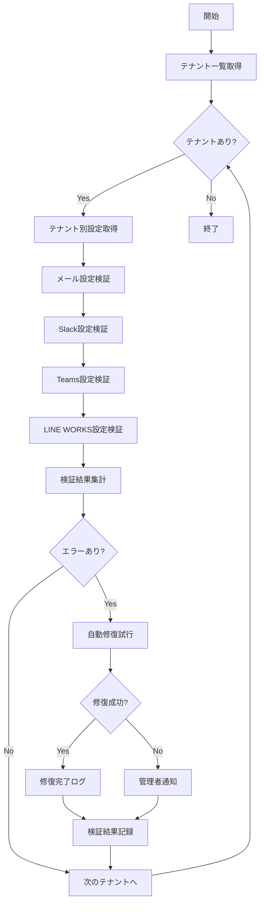

# バッチ定義書：通知設定検証バッチ

| 項目                | 内容                                                                                |
|---------------------|------------------------------------------------------------------------------------|
| **バッチID**        | BATCH-405                                                                          |
| **バッチ名称**      | 通知設定検証バッチ                                                                  |
| **機能カテゴリ**    | 通知・連携管理                                                                      |
| **概要・目的**      | 通知設定の有効性を定期的に確認し、設定不備による通知失敗を予防する                  |
| **バッチ種別**      | 定期バッチ                                                                          |
| **実行スケジュール**| 日次（05:45）                                                                       |
| **入出力対象**      | NotificationSettings, TenantConfig, ValidationResults                              |
| **優先度**          | 高                                                                                  |
| **備考**            | 通知システムの信頼性確保                                                            |

## 1. 処理概要

通知設定検証バッチは、各テナントの通知設定（メール、Slack、Teams、LINE WORKS等）の有効性を定期的に検証し、設定不備や接続エラーを事前に検出するバッチ処理です。問題が発見された場合は、管理者への通知と自動修復を試行します。

## 2. 処理フロー



## 3. 入力データ

### 3.1 NotificationSettingsテーブル

| フィールド名      | データ型 | 説明                                           |
|-------------------|----------|------------------------------------------------|
| setting_id        | String   | 設定ID（主キー）                               |
| tenant_id         | String   | テナントID（外部キー）                         |
| notification_type | String   | 通知種別（"EMAIL"/"SLACK"/"TEAMS"/"LINE"）     |
| is_enabled        | Boolean  | 有効フラグ                                     |
| config_data       | JSON     | 設定データ（暗号化済み）                       |
| last_validated    | DateTime | 最終検証日時                                   |
| validation_status | String   | 検証状態（"VALID"/"INVALID"/"PENDING"）        |

### 3.2 TenantConfigテーブル

| フィールド名      | データ型 | 説明                                           |
|-------------------|----------|------------------------------------------------|
| tenant_id         | String   | テナントID（主キー）                           |
| smtp_settings     | JSON     | SMTP設定                                       |
| slack_webhook_url | String   | Slack Webhook URL                              |
| teams_webhook_url | String   | Teams Webhook URL                              |
| line_works_config | JSON     | LINE WORKS設定                                 |
| validation_enabled| Boolean  | 検証有効フラグ                                 |

## 4. 出力データ

### 4.1 ValidationResultsテーブル（追加）

| フィールド名      | データ型 | 説明                                           |
|-------------------|----------|------------------------------------------------|
| validation_id     | String   | 検証ID（主キー）                               |
| tenant_id         | String   | テナントID（外部キー）                         |
| notification_type | String   | 通知種別                                       |
| validation_date   | DateTime | 検証実行日時                                   |
| status            | String   | 検証結果（"SUCCESS"/"FAILED"/"WARNING"）       |
| error_code        | String   | エラーコード                                   |
| error_message     | String   | エラーメッセージ                               |
| response_time_ms  | Integer  | 応答時間（ミリ秒）                             |
| auto_fixed        | Boolean  | 自動修復実行フラグ                             |
| fix_details       | JSON     | 修復詳細                                       |

### 4.2 ValidationSummaryテーブル（追加）

| フィールド名      | データ型 | 説明                                           |
|-------------------|----------|------------------------------------------------|
| summary_id        | String   | サマリーID（主キー）                           |
| execution_date    | DateTime | 実行日時                                       |
| total_tenants     | Integer  | 検証対象テナント数                             |
| total_settings    | Integer  | 検証対象設定数                                 |
| success_count     | Integer  | 成功件数                                       |
| failed_count      | Integer  | 失敗件数                                       |
| warning_count     | Integer  | 警告件数                                       |
| auto_fixed_count  | Integer  | 自動修復件数                                   |
| execution_time_sec| Integer  | 実行時間（秒）                                 |

## 5. 検証項目

### 5.1 メール設定検証

| 検証項目              | 検証方法                        | 判定基準                       |
|-----------------------|---------------------------------|--------------------------------|
| SMTP接続              | SMTP サーバーへの接続テスト     | 接続成功                       |
| 認証情報              | SMTP認証の実行                  | 認証成功                       |
| 送信テスト            | テストメール送信                | 送信成功                       |
| DNS設定               | MXレコードの確認                | レコード存在                   |
| SPF/DKIM設定          | SPF/DKIMレコードの確認          | 設定適切                       |

### 5.2 Slack設定検証

| 検証項目              | 検証方法                        | 判定基準                       |
|-----------------------|---------------------------------|--------------------------------|
| Webhook URL           | URLの形式チェック               | 正しい形式                     |
| 接続テスト            | Webhook URLへのPOSTリクエスト   | HTTP 200応答                   |
| チャンネル存在確認    | 指定チャンネルの存在確認        | チャンネル存在                 |
| 権限確認              | Bot権限の確認                   | 投稿権限あり                   |
| レート制限            | API制限の確認                   | 制限内                         |

### 5.3 Teams設定検証

| 検証項目              | 検証方法                        | 判定基準                       |
|-----------------------|---------------------------------|--------------------------------|
| Webhook URL           | URLの形式チェック               | 正しい形式                     |
| 接続テスト            | Webhook URLへのPOSTリクエスト   | HTTP 200応答                   |
| カード形式            | Adaptive Cardsの送信テスト      | 正常表示                       |
| チーム存在確認        | 指定チームの存在確認            | チーム存在                     |

### 5.4 LINE WORKS設定検証

| 検証項目              | 検証方法                        | 判定基準                       |
|-----------------------|---------------------------------|--------------------------------|
| API認証               | Bot APIの認証テスト             | 認証成功                       |
| Bot権限               | Bot権限の確認                   | 必要権限あり                   |
| トーク送信            | テストメッセージ送信            | 送信成功                       |
| グループ存在確認      | 指定グループの存在確認          | グループ存在                   |

## 6. 自動修復機能

### 6.1 修復可能な問題

| 問題種別              | 修復方法                        | 成功率                         |
|-----------------------|---------------------------------|--------------------------------|
| 期限切れトークン      | トークンの自動更新              | 90%                            |
| 無効なチャンネル      | デフォルトチャンネルに変更      | 95%                            |
| 設定フォーマット不正  | 標準フォーマットに修正          | 80%                            |
| 権限不足              | 管理者に権限要求通知            | 手動対応                       |

### 6.2 修復不可能な問題

- **認証情報の完全な無効化**: 手動での再設定が必要
- **外部サービスの停止**: サービス復旧待ち
- **アカウント削除**: 新規アカウント作成が必要
- **ネットワーク設定問題**: インフラ担当者による対応が必要

## 7. 実行パラメータ

| パラメータ名        | 必須 | デフォルト値 | 説明                                           |
|---------------------|------|--------------|------------------------------------------------|
| --tenant-id         | No   | 全テナント   | 特定テナントのみ検証                           |
| --notification-type | No   | 全種別       | 特定通知種別のみ検証                           |
| --auto-fix          | No   | true         | 自動修復の実行                                 |
| --test-send         | No   | false        | 実際のテスト通知送信                           |
| --timeout           | No   | 30           | 各検証のタイムアウト（秒）                     |

## 8. 実行例

```bash
# 通常実行
npm run batch:notification-validation

# 特定テナントのみ検証
npm run batch:notification-validation -- --tenant-id=tenant001

# メール設定のみ検証
npm run batch:notification-validation -- --notification-type=email

# 自動修復無効で検証のみ
npm run batch:notification-validation -- --auto-fix=false

# テスト通知送信あり
npm run batch:notification-validation -- --test-send=true

# TypeScript直接実行
npx tsx src/batch/notification-validation.ts
```

## 9. エラー処理

| エラーケース                      | 対応方法                                                                 |
|-----------------------------------|--------------------------------------------------------------------------|
| 外部サービス接続タイムアウト      | リトライ後、警告として記録                                               |
| 認証情報の暗号化解除失敗          | エラーログ記録、管理者通知                                               |
| 設定データの破損                  | バックアップからの復元試行                                               |
| API制限超過                       | 制限解除まで待機、次回実行時に再試行                                     |
| ネットワークエラー                | 一定時間後にリトライ、継続失敗時は管理者通知                             |

## 10. 監視・アラート

### 10.1 監視項目

| 監視項目              | 閾値           | アラート条件                    |
|-----------------------|----------------|---------------------------------|
| 検証失敗率            | 10%            | 超過時に警告アラート            |
| 応答時間              | 10秒           | 超過時に性能警告                |
| 自動修復失敗率        | 20%            | 超過時に管理者通知              |
| 連続失敗テナント数    | 5テナント      | 超過時に緊急アラート            |

### 10.2 通知条件

- **即座通知**: 重要テナントの通知設定失敗
- **日次サマリー**: 全体の検証結果サマリー
- **週次レポート**: 傾向分析と改善提案

## 11. 関連バッチ

- **BATCH-401**: 定期通知送信バッチ（検証済み設定を使用）
- **BATCH-402**: 通知失敗リトライバッチ（設定問題の検出）
- **BATCH-403**: 外部システム連携バッチ（連携設定の検証）

## 12. 改訂履歴

| 改訂日     | 改訂者 | 改訂内容                                         |
|------------|--------|--------------------------------------------------|
| 2025/05/30 | 初版   | 初版作成                                         |
